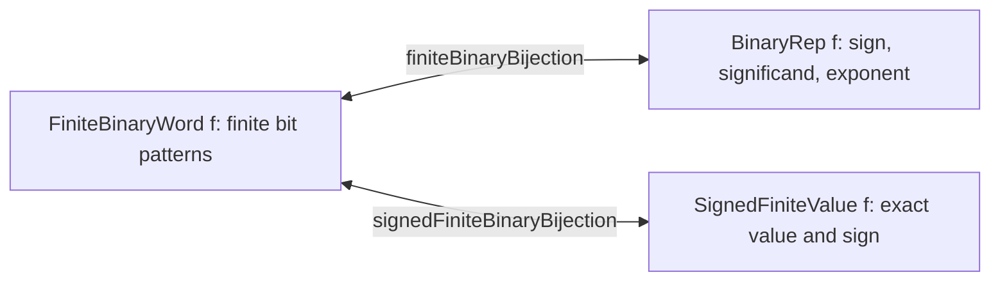
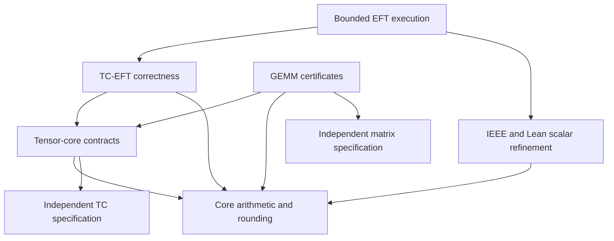
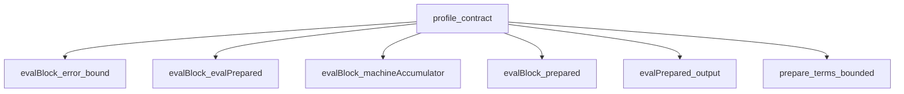
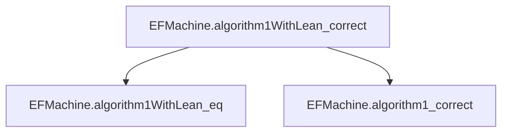
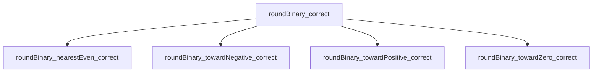
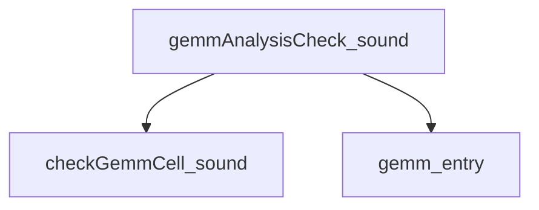

# Tensor Core Arithmetic

A Lean formalization of tensor-core arithmetic and TC-EFT: exact binary arithmetic,
encoded tensor-core operations, error extraction, and correctly rounded correction.
GEMM semantics and accuracy certificates form a separate extension.

The development uses **Lean 4.33.1 and its standard library**. Mathematical types
are written `ℕ`, `ℤ`, and `ℚ`; `ℚ` is Lean's executable exact rational type.

## Project structure

Definitions and their properties are organized by subject, following the layout of
[FLoPS](https://github.com/rutgers-apl/FLoPS). Each subject has a focused import.

| Directory / import | Contents |
| --- | --- |
| [`TensorCore.Core`](TensorCore/Core.lean) | Basic representations, exact arithmetic, encodings, algebraic models, bijections, rounding, and scalar sums. |
| [`TensorCore.TC`](TensorCore/TC.lean) | Tensor-core profiles and operations, error bounds, machine refinement, monotonicity, and ordered programs. |
| [`TensorCore.EFT`](TensorCore/EFT.lean) | TC-EFT extraction, scalar consolidation, Algorithm 1, and bounded machine execution. |
| [`TensorCore.Gemm`](TensorCore/Gemm.lean) | Matrix definitions, raw/scaled/native GEMM, bounds, certificates, selection, and independent matrix specifications. |
| [`TensorCore.IEEE`](TensorCore/IEEE.lean) | IEEE special values and flags, scalar operations, and equivalence to Lean's native floating-point operations. |
| [`TensorCore.All`](TensorCore/All.lean) | The complete development, including interfaces and regression witnesses. |
| [`Main/`](Main) | Executable entry points. |
| [`examples/`](examples), [`scripts/`](scripts) | Usage examples, validation, audits, and documentation generation. |
| [`data/`](data), [`hardware/`](hardware), [`kernels/`](kernels), [`vendor/`](vendor) | Input fixtures, recorded evidence, hardware harnesses, and pinned external sources. |

`import TensorCore` brings in Core, TC, and EFT. The foundational `Core` imports
no tensor-core or GEMM implementation; TC imports no EFT or GEMM development;
EFT imports no GEMM development. `lake build` still checks the complete library.
The [migration guide](docs/migration.md) maps the former paths to their new homes.

## Bit encodings, algebraic models, and isomorphisms

The finite model has three equivalent presentations:



[`Core/Defs.lean`](TensorCore/Core/Defs.lean) defines formats and the exact decoded
value `significand × 2^(rawScale - fractionalBits)`.
[`Core/Encoding.lean`](TensorCore/Core/Encoding.lean) classifies and decodes bit patterns.
[`Core/Binary/Defs.lean`](TensorCore/Core/Binary/Defs.lean) gives the canonical algebraic
representation and its finite domains. The [bijection](TensorCore/Core/Binary/Bijection.lean),
[round-trip](TensorCore/Core/Binary/RoundTrip.lean), and
[signed-value bijection](TensorCore/Core/Binary/SignedBijection.lean) prove both inverse
laws and preservation of values. Their Lean code is expandable below.

These bijections apply to every well-formed IEEE-style finite binary format, including
subnormals and both signed zeros. A bare rational identifies the two zeros, so the
numerical bijection retains a separate sign. NaNs and infinities have separate
classification and IEEE semantics; they are outside the finite bijection.
`Decoded` retains raw, potentially unnormalized metadata for tensor-core alignment;
`BinaryRep` is the canonical representation used for the encoding isomorphism.

## Arithmetic model and native execution

`Core` defines this project's floating-point semantics using Lean's standard
`Nat`, `Int`, `Rat`, and `BitVec` types. Exact values are rational numbers; formats,
encoding, truncation, and rounding are defined explicitly. Tensor-core operations
build on this foundation to specify shared alignment, intermediate precision,
grouped accumulation, and final rounding. Keeping these stages explicit supports
the TC-EFT proofs about residuals and error recovery.

Lean's `Float32` and `Float` also have
[logical models suitable for proofs](https://lean-lang.org/doc/reference/latest/Basic-Types/Floating-Point-Numbers/).
The reason for retaining our model is the semantics needed by this development:
ordinary scalar operations alone do not describe a tensor-core block's intermediate
behavior. The encoding bijections connect our exact model to concrete bit patterns;
separate refinement proofs connect selected scalar operations to Lean's FP model.

The IEEE scalar add/sub/mul wrappers use Lean's native operations on their proved
domains and retain reference paths for other cases. Executable EFT scalar
consolidation uses native FP32 addition with its original range and zero policies.
The adapters preserve complete reference results, including applicable flags,
branch tags, and errors. The [compatibility guide](docs/lean-ieee-compatibility.md)
states the domains, policies, and preservation theorems. Exact rationals provide
the specification; bounded and native implementations provide execution paths
where their refinement has been proved.

This architecture fits the TC/EFT proof goals, with a maintenance cost: overlapping
definitions and bridge proofs. A useful next simplification is to make generic
format definitions and theorems primary and derive FP32-specific results as
specializations wherever practical. For example,
[`roundBinary_fp32`](TensorCore/Core/Binary/RoundOp.lean) already proves
`roundBinary fp32 mode.toBinary x = round32 mode x`, while both definitions remain
in the library. Further consolidation can reduce duplication while preserving
the public contracts and the independent specification checks.

## Build and regression

Run from the repository root:

```sh
lake build
./tc doctor
./tc eft data/examples/eft.txt
./tc check
```

`./tc check` builds a fresh source snapshot and runs the full regression suite:
proof audits, independent specifications and negative controls, TC/EFT/GEMM/IEEE
checks, CLI and certificate checks, archived device-vector replay, every standalone
example, module boundaries, and generated proof documentation.
Its reports are written to [`data/regressions/`](data/regressions); the combined log
is `tmp/clean-build.log`. GPU replay uses archived evidence and does not claim a new
physical-device run.

For the interfaces and detailed assumptions, see the [reference manual](docs/reference.md),
[current evaluation](docs/evaluation.md), and [IEEE compatibility guide](docs/lean-ieee-compatibility.md).
The [style guide](docs/style.md) records notation, module ownership, and proof trust.

The [con-leche audit](docs/con-leche-audit-2026-09-14.md) records two successful
external checks of all 5,619 project theorem roots at the audited revision,
with exact coverage, logs, reproduction steps, and confidence limits.

<!-- BEGIN GENERATED PROOF GUIDE -->
## Proof guide

Expand a claim to read its Lean code. Within each declaration, expand the supporting proofs and follow their links to continue through the dependency graph. The code is copied from the checked source, including proof bodies.

The [complete proof index](docs/proofs/README.md) covers **1431 source theorems** and **966 definitions**. The [machine-readable graph](docs/proofs/dependencies.json) also retains generated proofs and standard-library edges. Regenerate with `python3 scripts/generate_proof_docs.py`; `--check` verifies that this guide is current.



### Entry points

<details>
<summary><code>TensorCore.Format</code></summary>

[Lean source](TensorCore/Core/Defs.lean#L7) · [Full dependency node](docs/proofs/Core/Defs.md#decl-db780180792c6817)

```lean
structure Format where
  fractionBits : ℕ
  exponentBits : ℕ
  bias : ℤ
  deriving Repr, DecidableEq
```

<details>
<summary>Supporting proofs</summary>

No supporting source theorem in this repository.

</details>

<details>
<summary>Definitions and types</summary>

None in this repository.

</details>

</details>

<details>
<summary><code>TensorCore.BinaryRep</code></summary>

[Lean source](TensorCore/Core/Binary/Defs.lean#L8) · [Full dependency node](docs/proofs/Core/Binary/Defs.md#decl-895d436fd0a35170)

```lean
/-- Canonical arithmetic data, including a sign for either zero. -/
structure BinaryRep (f : Format) where
  negative : Bool
  exponent : ℤ
  significand : ℕ
  exponent_min : f.emin ≤ exponent
  exponent_max : exponent ≤ f.emax
  significand_lt : significand < 2 ^ (f.fractionBits + 1)
  normalized : 2 ^ f.fractionBits ≤ significand ∨ exponent = f.emin
  deriving DecidableEq
```

<details>
<summary>Supporting proofs</summary>

No supporting source theorem in this repository.

</details>

<details>
<summary>Definitions and types</summary>

[TensorCore.Format](docs/proofs/Core/Defs.md#decl-db780180792c6817), [TensorCore.Format.emax](docs/proofs/Core/Defs.md#decl-dc4afe2b44cdf196), [TensorCore.Format.emin](docs/proofs/Core/Defs.md#decl-af48d9057baa67b0)

</details>

</details>

<details>
<summary><code>TensorCore.BinaryRep.value</code></summary>

[Lean source](TensorCore/Core/Binary/Defs.lean#L25) · [Full dependency node](docs/proofs/Core/Binary/Defs.md#decl-cc6dcf5c8ebfaa31)

```lean
def BinaryRep.value {f : Format} (r : BinaryRep f) : ℚ :=
  (if r.negative then -(r.significand : ℚ) else r.significand) *
    pow2 (r.exponent - f.fractionBits)
```

<details>
<summary>Supporting proofs</summary>

No supporting source theorem in this repository.

</details>

<details>
<summary>Definitions and types</summary>

[TensorCore.BinaryRep](docs/proofs/Core/Binary/Defs.md#decl-895d436fd0a35170), [TensorCore.Format](docs/proofs/Core/Defs.md#decl-db780180792c6817), [TensorCore.pow2](docs/proofs/Core/Exact.md#decl-b52a0281b35514e3)

</details>

</details>

<details>
<summary><code>TensorCore.finiteBinaryBijection</code></summary>

[Lean source](TensorCore/Core/Binary/Bijection.lean#L174) · [Full dependency node](docs/proofs/Core/Binary/Bijection.md#decl-b1a16403ef1ee57a)

```lean
def finiteBinaryBijection (f : Format) (hf : f.WellFormed) :
    BinaryBijection (BinaryRep f) (FiniteBinaryWord f) :=
  ⟨encodeBinaryRep f hf, decodeBinaryRep f hf,
    decode_encodeBinaryRep f hf, encode_decodeBinaryRep f hf⟩
```

<details>
<summary>Supporting proofs</summary>

<details>
<summary><code>TensorCore.decode_encodeBinaryRep</code></summary>

[Expand this proof and its dependencies](docs/proofs/Core/Binary/Bijection.md#decl-2b92b9b7bcfc34f3)

```lean
theorem decode_encodeBinaryRep (f : Format) (hf : f.WellFormed) (r : BinaryRep f) :
    decodeBinaryRep f hf (encodeBinaryRep f hf r) = r
```

</details>

<details>
<summary><code>TensorCore.encode_decodeBinaryRep</code></summary>

[Expand this proof and its dependencies](docs/proofs/Core/Binary/Bijection.md#decl-0ef3a70fffcc866c)

```lean
/-- Reassembling sign, exponent and fraction reproduces the original finite word. -/
theorem encode_decodeBinaryRep (f : Format) (hf : f.WellFormed) (b : FiniteBinaryWord f) :
    encodeBinaryRep f hf (decodeBinaryRep f hf b) = b
```

</details>

</details>

<details>
<summary>Definitions and types</summary>

[TensorCore.BinaryBijection](docs/proofs/Core/Defs.md#decl-85b8cc75be52e666), [TensorCore.BinaryRep](docs/proofs/Core/Binary/Defs.md#decl-895d436fd0a35170), [TensorCore.FiniteBinaryWord](docs/proofs/Core/Binary/Defs.md#decl-b1ebef5bf580ea01), [TensorCore.Format](docs/proofs/Core/Defs.md#decl-db780180792c6817), [TensorCore.Format.WellFormed](docs/proofs/Core/Defs.md#decl-2c4f4aa8dae0f1d6), [TensorCore.decodeBinaryRep](docs/proofs/Core/Binary/Bijection.md#decl-dd7db11ae1e1ea80), [TensorCore.encodeBinaryRep](docs/proofs/Core/Binary/Bijection.md#decl-abc077f61bbca602)

</details>

</details>

<details>
<summary><code>TensorCore.decode_encodeBinaryRep</code></summary>

[Lean source](TensorCore/Core/Binary/Bijection.lean#L110) · [Full dependency node](docs/proofs/Core/Binary/Bijection.md#decl-2b92b9b7bcfc34f3)

```lean
theorem decode_encodeBinaryRep (f : Format) (hf : f.WellFormed) (r : BinaryRep f) :
    decodeBinaryRep f hf (encodeBinaryRep f hf r) = r := by
  obtain ⟨hs, he, hk⟩ := encodeBinary_fields f hf r
  have hemin := r.exponent_min
  have hn := r.normalized
  have hP := Nat.two_pow_pos f.fractionBits
  have hE : (r.exponent + f.bias).toNat ≠ 0 := by unfold Format.emin at hemin; omega
  cases r with
  | mk s e k h1 h2 h3 h4 =>
    simp only [decodeBinaryRep, encodeBinaryRep, hs, he, hk]
    congr 1 <;> split <;> simp_all <;> omega
```

<details>
<summary>Supporting proofs</summary>

<details>
<summary><code>TensorCore.encodeBinary_fields</code></summary>

[Expand this proof and its dependencies](docs/proofs/Core/Binary/Bijection.md#decl-bcffec0f99ba4510)

```lean
/-- Field extraction for the existing generic encoder. -/
theorem encodeBinary_fields (f : Format) (hf : f.WellFormed) (r : BinaryRep f) :
    binarySign f r.encode = r.negative ∧
    binaryExponentField f r.encode =
      (if r.significand < 2 ^ f.fractionBits then 0 else (r.exponent + f.bias).toNat) ∧
    r.encode.toNat % 2 ^ f.fractionBits =
      (if r.significand < 2 ^ f.fractionBits then r.significand
       else r.significand - 2 ^ f.fractionBits)
```

</details>

</details>

<details>
<summary>Definitions and types</summary>

[TensorCore.BinaryRep](docs/proofs/Core/Binary/Defs.md#decl-895d436fd0a35170), [TensorCore.BinaryRep.encode](docs/proofs/Core/Binary/Bijection.md#decl-3a2559ae7dd8fec5), [TensorCore.Classification.finite](docs/proofs/Core/Encoding.md#decl-cfa2987aba5ba75a), [TensorCore.Decoded](docs/proofs/Core/Defs.md#decl-f4e0107ee6679350), [TensorCore.Format](docs/proofs/Core/Defs.md#decl-db780180792c6817), [TensorCore.Format.WellFormed](docs/proofs/Core/Defs.md#decl-2c4f4aa8dae0f1d6), [TensorCore.Format.emax](docs/proofs/Core/Defs.md#decl-dc4afe2b44cdf196), [TensorCore.Format.emin](docs/proofs/Core/Defs.md#decl-af48d9057baa67b0), [TensorCore.Format.width](docs/proofs/Core/Defs.md#decl-950f9d663ce32954), [TensorCore.binaryExponentField](docs/proofs/Core/Binary/Encoding.md#decl-c12aa273bd1bbbb3), [TensorCore.binarySign](docs/proofs/Core/Binary/Encoding.md#decl-a5de0a69a17e78c5), [TensorCore.classify](docs/proofs/Core/Encoding.md#decl-793c375a3325b7e3), [TensorCore.decodeBinaryRep](docs/proofs/Core/Binary/Bijection.md#decl-dd7db11ae1e1ea80), [TensorCore.encodeBinaryRep](docs/proofs/Core/Binary/Bijection.md#decl-abc077f61bbca602)

</details>

</details>

<details>
<summary><code>TensorCore.encode_decodeBinaryRep</code></summary>

[Lean source](TensorCore/Core/Binary/Bijection.lean#L123) · [Full dependency node](docs/proofs/Core/Binary/Bijection.md#decl-0ef3a70fffcc866c)

```lean
/-- Reassembling sign, exponent and fraction reproduces the original finite word. -/
theorem encode_decodeBinaryRep (f : Format) (hf : f.WellFormed) (b : FiniteBinaryWord f) :
    encodeBinaryRep f hf (decodeBinaryRep f hf b) = b := by
  apply Subtype.ext
  change (decodeBinaryRep f hf b).encode = b.val
  apply BitVec.eq_of_toNat_eq
  let hr := decodeBinaryRep f hf b
  rw [show (decodeBinaryRep f hf b).encode.toNat = _ from
    encodeBinary_toNat f hf hr.negative hr.exponent hr.significand
      (by omega) (by have := hr.significand_lt; omega) hr.exponent_min hr.exponent_max]
  simp only [hr, decodeBinaryRep, binarySign, binaryExponentField, Nat.pow_add]
  dsimp +instances only [hr, decodeBinaryRep, binarySign, binaryExponentField]
  have hn := b.val.isLt
  have hwidth : 2 ^ f.width = 2 ^ (f.fractionBits + f.exponentBits) * 2 := by
    rw [show f.width = f.fractionBits + f.exponentBits + 1 by unfold Format.width; omega,
      Nat.pow_succ]
  rw [hwidth, Nat.pow_add] at hn
  have hP := Nat.two_pow_pos f.fractionBits
  have hW := Nat.two_pow_pos f.exponentBits
  generalize hPv : 2 ^ f.fractionBits = P at *
  generalize hWv : 2 ^ f.exponentBits = W at *
  generalize hnv : b.val.toNat = n at *
  have hPW := Nat.mul_pos hP hW
  have hq : n / (P * W) < 2 := (Nat.div_lt_iff_lt_mul hPW).mpr (by omega)
  have hdecomp : n = (n / (P * W)) * (P * W) + (n / P % W) * P + n % P := by
    have h1 := Nat.div_add_mod n P
    have h2 := Nat.div_add_mod (n / P) W
    have h3 := congrArg (fun z => z * P) h2
    rw [Nat.div_div_eq_div_mul] at h3
    grind
  have hfrac := Nat.mod_lt n hP
  have hsign : (if (n / (P * W) != 0) then P * W else 0) = (n / (P * W) : ℕ) * (P * W) := by
    by_cases hz : n / (P * W) = 0
    · simp [hz]
    · have ho : n / (P * W) = 1 := by
        generalize n / (P * W) = q at *
        omega
      simp [ho]
  rw [hsign]
  by_cases he : n / P % W = 0
  · simp only [he, ↓reduceIte]
    rw [if_pos (show ((n % P : ℕ) : ℤ) < (P : ℕ) by omega)]
    simp only [Int.toNat_natCast]
    simp only [he, Nat.zero_mul, Nat.add_zero] at hdecomp
    omega
  · simp only [he, ↓reduceIte]
    rw [if_neg (show ¬ ((P + n % P : ℕ) : ℤ) < (P : ℕ) by omega)]
    have hE : (((n / P % W : ℕ) : ℤ) - f.bias + f.bias).toNat = n / P % W := by omega
    have hK : (((P + n % P : ℕ) : ℤ) - (P : ℕ)).toNat = n % P := by omega
    rw [hE, hK]
    omega
```

<details>
<summary>Supporting proofs</summary>

<details>
<summary><code>TensorCore.encodeBinary_toNat</code></summary>

[Expand this proof and its dependencies](docs/proofs/Core/Binary/Encoding.md#decl-0082d54957605cf4)

```lean
/-- The constructed encoding fits the word and has the stated fields. -/
theorem encodeBinary_toNat (f : Format) (hf : f.WellFormed) (negative : Bool) (e k : ℤ)
    (hk0 : 0 ≤ k) (hk1 : k < ((2 ^ (f.fractionBits + 1) : ℕ) : ℤ)) (_he1 : f.emin ≤ e)
    (he2 : e ≤ f.emax) :
    (encodeBinary f negative e k).toNat =
      (if negative then 2 ^ (f.fractionBits + f.exponentBits) else 0) +
        (if k < (2 ^ f.fractionBits : ℕ) then k.toNat
         else (e + f.bias).toNat * 2 ^ f.fractionBits + (k - (2 ^ f.fractionBits : ℕ)).toNat)
```

</details>

</details>

<details>
<summary>Definitions and types</summary>

[TensorCore.BinaryRep](docs/proofs/Core/Binary/Defs.md#decl-895d436fd0a35170), [TensorCore.BinaryRep.encode](docs/proofs/Core/Binary/Bijection.md#decl-3a2559ae7dd8fec5), [TensorCore.Classification.finite](docs/proofs/Core/Encoding.md#decl-cfa2987aba5ba75a), [TensorCore.Decoded](docs/proofs/Core/Defs.md#decl-f4e0107ee6679350), [TensorCore.FiniteBinaryWord](docs/proofs/Core/Binary/Defs.md#decl-b1ebef5bf580ea01), [TensorCore.Format](docs/proofs/Core/Defs.md#decl-db780180792c6817), [TensorCore.Format.WellFormed](docs/proofs/Core/Defs.md#decl-2c4f4aa8dae0f1d6), [TensorCore.Format.emax](docs/proofs/Core/Defs.md#decl-dc4afe2b44cdf196), [TensorCore.Format.emin](docs/proofs/Core/Defs.md#decl-af48d9057baa67b0), [TensorCore.Format.width](docs/proofs/Core/Defs.md#decl-950f9d663ce32954), [TensorCore.binaryExponentField](docs/proofs/Core/Binary/Encoding.md#decl-c12aa273bd1bbbb3), [TensorCore.binarySign](docs/proofs/Core/Binary/Encoding.md#decl-a5de0a69a17e78c5), [TensorCore.classify](docs/proofs/Core/Encoding.md#decl-793c375a3325b7e3), [TensorCore.decodeBinaryRep](docs/proofs/Core/Binary/Bijection.md#decl-dd7db11ae1e1ea80), [TensorCore.encodeBinaryRep](docs/proofs/Core/Binary/Bijection.md#decl-abc077f61bbca602)

</details>

</details>

<details>
<summary><code>TensorCore.SignedFiniteValue</code></summary>

[Lean source](TensorCore/Core/Binary/Defs.lean#L32) · [Full dependency node](docs/proofs/Core/Binary/Defs.md#decl-86fdea2e792bf344)

```lean
structure SignedFiniteValue (f : Format) where
  value : ℚ
  negative : Bool
  finite : f.FiniteValue value
  sign_nonzero : value ≠ 0 → negative = decide (value < 0)
```

<details>
<summary>Supporting proofs</summary>

No supporting source theorem in this repository.

</details>

<details>
<summary>Definitions and types</summary>

[TensorCore.Format](docs/proofs/Core/Defs.md#decl-db780180792c6817), [TensorCore.Format.FiniteValue](docs/proofs/Core/Defs.md#decl-e3dc9cecad983d99)

</details>

</details>

<details>
<summary><code>TensorCore.signedFiniteBinaryBijection</code></summary>

[Lean source](TensorCore/Core/Binary/SignedBijection.lean#L134) · [Full dependency node](docs/proofs/Core/Binary/SignedBijection.md#decl-52799c5e93137e77)

```lean
/-- Finite IEEE words correspond bijectively to representable rationals with two zeros.
For nonzero values the sign is determined, so there is exactly one representation. -/
def signedFiniteBinaryBijection (f : Format) (hf : f.WellFormed) :
    BinaryBijection (SignedFiniteValue f) (FiniteBinaryWord f) :=
  ⟨encodeSignedBinary f hf, decodeSignedBinary f hf,
    decode_encodeSignedBinary f hf, encode_decodeSignedBinary f hf⟩
```

<details>
<summary>Supporting proofs</summary>

<details>
<summary><code>TensorCore.decode_encodeSignedBinary</code></summary>

[Expand this proof and its dependencies](docs/proofs/Core/Binary/SignedBijection.md#decl-2c11097025d8ee97)

```lean
theorem decode_encodeSignedBinary (f : Format) (hf : f.WellFormed) (v : SignedFiniteValue f) :
    decodeSignedBinary f hf (encodeSignedBinary f hf v) = v
```

</details>

<details>
<summary><code>TensorCore.encode_decodeSignedBinary</code></summary>

[Expand this proof and its dependencies](docs/proofs/Core/Binary/SignedBijection.md#decl-c65020fe3f9595ba)

```lean
theorem encode_decodeSignedBinary (f : Format) (hf : f.WellFormed) (b : FiniteBinaryWord f) :
    encodeSignedBinary f hf (decodeSignedBinary f hf b) = b
```

</details>

</details>

<details>
<summary>Definitions and types</summary>

[TensorCore.BinaryBijection](docs/proofs/Core/Defs.md#decl-85b8cc75be52e666), [TensorCore.FiniteBinaryWord](docs/proofs/Core/Binary/Defs.md#decl-b1ebef5bf580ea01), [TensorCore.Format](docs/proofs/Core/Defs.md#decl-db780180792c6817), [TensorCore.Format.WellFormed](docs/proofs/Core/Defs.md#decl-2c4f4aa8dae0f1d6), [TensorCore.SignedFiniteValue](docs/proofs/Core/Binary/Defs.md#decl-86fdea2e792bf344), [TensorCore.decodeSignedBinary](docs/proofs/Core/Binary/SignedBijection.md#decl-cb2fcf99d19b6a37), [TensorCore.encodeSignedBinary](docs/proofs/Core/Binary/SignedBijection.md#decl-1ab7a3966bec465c)

</details>

</details>

<details>
<summary><code>TensorCore.Profile</code></summary>

[Lean source](TensorCore/TC/Defs.lean#L11) · [Full dependency node](docs/proofs/TC/Defs.md#decl-a2404f64f289a40a)

```lean
/-- Explicit parameters of one globally aligned FP32-output normalization group:
input format, products per group `K`, fractional alignment bits `F` below `2^eta`,
and an alignment-exponent floor applied after the nonzero maximum (Accurate Models
v4 Table 3). Fields without established semantics for a device are not added. -/
structure Profile where
  input : Format
  products : ℕ
  alignFraction : ℤ
  alignFloor : Option ℤ
  deriving Repr, DecidableEq
```

<details>
<summary>Supporting proofs</summary>

No supporting source theorem in this repository.

</details>

<details>
<summary>Definitions and types</summary>

[TensorCore.Format](docs/proofs/Core/Defs.md#decl-db780180792c6817)

</details>

</details>

<details>
<summary><code>TensorCore.BlockInput</code></summary>

[Lean source](TensorCore/TC/Block.lean#L10) · [Full dependency node](docs/proofs/TC/Block.md#decl-ad6b462d69117cc6)

```lean
/-- Encoded operands of one normalization group under a profile; `c` is always FP32. -/
structure BlockInput (p : Profile) where
  products : List (p.Word × p.Word)
  c : F32
  deriving Repr, DecidableEq
```

<details>
<summary>Supporting proofs</summary>

No supporting source theorem in this repository.

</details>

<details>
<summary>Definitions and types</summary>

[TensorCore.F32](docs/proofs/Core/Defs.md#decl-24fa1e63edeb271f), [TensorCore.Format.width](docs/proofs/Core/Defs.md#decl-950f9d663ce32954), [TensorCore.Profile](docs/proofs/TC/Defs.md#decl-a2404f64f289a40a), [TensorCore.Profile.Word](docs/proofs/TC/Defs.md#decl-3bca3de3cb04fb71)

</details>

</details>

<details>
<summary><code>TensorCore.evalBlock</code></summary>

[Lean source](TensorCore/TC/Block.lean#L97) · [Full dependency node](docs/proofs/TC/Block.md#decl-58fdfbbb09a9ba58)

```lean
/-- One normalization group of the profile, not a complete PTX tile or GEMM. -/
def evalBlock {p : Profile} (x : BlockInput p) : Except ModelError BlockTrace :=
  if x.products.length != p.products then .error .wrongProductCount
  else match prepare x with
    | none => .error .nonfiniteInput
    | some b => evalPrepared b
```

<details>
<summary>Supporting proofs</summary>

No supporting source theorem in this repository.

</details>

<details>
<summary>Definitions and types</summary>

[TensorCore.BlockInput](docs/proofs/TC/Block.md#decl-ad6b462d69117cc6), [TensorCore.BlockTrace](docs/proofs/TC/Block.md#decl-6e6aa9836448ab93), [TensorCore.ModelError](docs/proofs/TC/Block.md#decl-f7be0c438a4d4d1d), [TensorCore.PreparedBlock](docs/proofs/TC/Block.md#decl-703939eff806d883), [TensorCore.Profile](docs/proofs/TC/Defs.md#decl-a2404f64f289a40a), [TensorCore.Profile.Word](docs/proofs/TC/Defs.md#decl-3bca3de3cb04fb71), [TensorCore.evalPrepared](docs/proofs/TC/Block.md#decl-700b85398ddd8f12), [TensorCore.prepare](docs/proofs/TC/Block.md#decl-32c2d7273540d876)

</details>

</details>

<details>
<summary><code>TensorCore.algorithm1Encoded</code></summary>

[Lean source](TensorCore/EFT/Encoded.lean#L35) · [Full dependency node](docs/proofs/EFT/Encoded.md#decl-8017eca136315bcf)

```lean
/-- Algorithm 1: check the finite encoded interface, return +0 for all-zero terms,
otherwise reconstruct the grids and overlap components and execute the two-branch reference.
The range failure is retained as `.consolidated .outOfRange`. -/
def algorithm1Encoded {p : Profile} (x : BlockInput p) (D : F32) :
    Except ModelError EncodedEFTResult :=
  match prepareEncodedEFT x D with
  | .error e => .error e
  | .ok t => .ok (if t.block.allZeroTerms then .allZero else .consolidated t.algorithm1)
```

<details>
<summary>Supporting proofs</summary>

No supporting source theorem in this repository.

</details>

<details>
<summary>Definitions and types</summary>

[TensorCore.BlockInput](docs/proofs/TC/Block.md#decl-ad6b462d69117cc6), [TensorCore.BlockTrace](docs/proofs/TC/Block.md#decl-6e6aa9836448ab93), [TensorCore.BlockTrace.algorithm1](docs/proofs/EFT/Algorithm1.md#decl-01de1ae42b7279f3), [TensorCore.EncodedEFTResult](docs/proofs/EFT/Encoded.md#decl-43c5cf7090b5e17e), [TensorCore.F32](docs/proofs/Core/Defs.md#decl-24fa1e63edeb271f), [TensorCore.ModelError](docs/proofs/TC/Block.md#decl-f7be0c438a4d4d1d), [TensorCore.PreparedBlock.allZeroTerms](docs/proofs/EFT/Encoded.md#decl-12dcaf3961e33ea9), [TensorCore.Profile](docs/proofs/TC/Defs.md#decl-a2404f64f289a40a), [TensorCore.prepareEncodedEFT](docs/proofs/EFT/Encoded.md#decl-aaaf1649ccd95844)

</details>

</details>

<details>
<summary><code>TensorCore.EFMachine.algorithm1WithLean</code></summary>

[Lean source](TensorCore/EFT/Native.lean#L101) · [Full dependency node](docs/proofs/EFT/Native.md#decl-e854b34f0fadc9c3)

```lean
/-- Algorithm 1 with native scalar additions, retaining bounded exact consolidation
when the scalar guard or intermediate checks refuse the scalar branch. -/
def algorithm1WithLean (path : Path) (x : BlockInput path.profile) (D : F32) : Except Error Result := do
  let p ← prepare path x D
  if p.terms.all (fun t => t.word.magnitude == 0) then return .allZero
  let some c := extract p | throw .arithmeticOverflow
  match c.scalarWithLean with
  | some b => return .scalar b
  | none =>
    match c.recovered.round32 with
    | some b => return .boundedExact b
    | none => return .outOfRange
```

<details>
<summary>Supporting proofs</summary>

No supporting source theorem in this repository.

</details>

<details>
<summary>Definitions and types</summary>

[TensorCore.BlockInput](docs/proofs/TC/Block.md#decl-ad6b462d69117cc6), [TensorCore.EFMachine.Components](docs/proofs/EFT/Bounded.md#decl-cbab83ff033f2778), [TensorCore.EFMachine.Components.scalarWithLean](docs/proofs/EFT/Native.md#decl-f2a2e92b799d4090), [TensorCore.EFMachine.Error](docs/proofs/EFT/Bounded.md#decl-ae7458916e66d6a4), [TensorCore.EFMachine.Magnitude](docs/proofs/EFT/Machine/WordDefs.md#decl-666b5ba9cbd0ae62), [TensorCore.EFMachine.Path](docs/proofs/EFT/Machine/DecodeDefs.md#decl-2506d95eda2deaf1), [TensorCore.EFMachine.Path.profile](docs/proofs/EFT/Machine/DecodeDefs.md#decl-ccec848a9e7609d0), [TensorCore.EFMachine.Prepared](docs/proofs/EFT/Bounded.md#decl-60336b9775817f9a), [TensorCore.EFMachine.Result](docs/proofs/EFT/Bounded.md#decl-dbcfe8dff7f13123), [TensorCore.EFMachine.Term](docs/proofs/EFT/Machine/DecodeDefs.md#decl-fa1797d418dbd302), [TensorCore.EFMachine.Word](docs/proofs/EFT/Machine/WordDefs.md#decl-df353d912dc0da43), [TensorCore.EFMachine.Word.round32](docs/proofs/EFT/Machine/WordDefs.md#decl-ae96957dae22a7c5), [TensorCore.EFMachine.extract](docs/proofs/EFT/Bounded.md#decl-1edcf1bb479bb8a3), [TensorCore.EFMachine.prepare](docs/proofs/EFT/Bounded.md#decl-795b364db94203eb), [TensorCore.F32](docs/proofs/Core/Defs.md#decl-24fa1e63edeb271f)

</details>

</details>

### Tensor-core model

<details>
<summary>C03. FP64 fused arithmetic</summary>

One exact product plus accumulator, one final rounding in each direction; finite decoded inputs and an in-range exact fused result give success. No intermediate product range restriction.

<details>
<summary><code>TensorCore.binary64Fma_correct</code></summary>

[Lean source](TensorCore/TC/FusedRounding.lean#L10) · [Full dependency node](docs/proofs/TC/FusedRounding.md#decl-818649bb83af8ab6)

```lean
/-- Accepted FP64 DMMA arithmetic is correctly rounded in each of the four modes,
with the original-input ideal and the output sign made explicit. -/
theorem binary64Fma_correct {mode : BinaryRoundingMode}
    {x : InvocationInput (binary64Fma mode)} {t : InvocationTrace (binary64Fma mode)}
    (h : evalInvocation x = .ok t) :
    invocationIdeal x = some t.intermediate.value ∧
    BinaryRoundSpec fp64 mode t.intermediate.value t.output.bits ∧
    binarySign fp64 t.output.bits = decide (t.intermediate.value < 0) := by
  have hout := evalInvocation_output h
  obtain ⟨b, hb, hc⟩ := roundBinary_correct fp64 (by decide) mode t.intermediate.value hout.2
  have heq := Option.some.inj (hb.symm.trans hout.1)
  rw [heq] at hc
  exact ⟨binary64Fma_exact_input h, hc, roundBinary_sign fp64 mode _ _ hout.1⟩
```

<details>
<summary>Supporting proofs</summary>

<details>
<summary><code>TensorCore.binary64Fma_exact_input</code></summary>

[Expand this proof and its dependencies](docs/proofs/TC/Conversion.md#decl-e9ea2eb0949990ef)

```lean
/-- Fused FP64 rounds the independently decoded exact product plus accumulator;
there is no intermediate rounding. -/
theorem binary64Fma_exact_input {mode : BinaryRoundingMode}
    {x : InvocationInput (binary64Fma mode)} {t : InvocationTrace (binary64Fma mode)}
    (h : evalInvocation x = .ok t) : invocationIdeal x = some t.intermediate.value
```

</details>

<details>
<summary><code>TensorCore.evalInvocation_output</code></summary>

[Expand this proof and its dependencies](docs/proofs/TC/InvocationProperties.md#decl-c5356d6db12f1b4d)

```lean
/-- The final output obeys the specified executable conversion, with its own range guard. -/
theorem evalInvocation_output {p : InvocationSpec} {x : InvocationInput p} {t : InvocationTrace p}
    (h : evalInvocation x = .ok t) :
    roundBinary p.output.format p.output.mode t.intermediate.value = some t.output.bits ∧
    absQ t.intermediate.value ≤ p.output.format.maxFinite
```

</details>

<details>
<summary><code>TensorCore.roundBinary_correct</code></summary>

[Expand this proof and its dependencies](docs/proofs/Core/Binary/RoundingContract.md#decl-12a22af180d3ad5e)

```lean
theorem roundBinary_correct (f : Format) (hf : f.WellFormed) (mode : BinaryRoundingMode)
    (x : ℚ) (hr : absQ x ≤ f.maxFinite) :
    ∃ bits, roundBinary f mode x = some bits ∧ BinaryRoundSpec f mode x bits
```

</details>

<details>
<summary><code>TensorCore.roundBinary_sign</code></summary>

[Expand this proof and its dependencies](docs/proofs/Core/Binary/RoundingContract.md#decl-89538250b2c31eac)

```lean
/-- The output sign is the input's strict negativity, even when it underflows to zero.
Exact rational zero therefore has a positive sign in every mode. -/
theorem roundBinary_sign (f : Format) (mode : BinaryRoundingMode) (x : ℚ)
    (bits : BitVec f.width) (h : roundBinary f mode x = some bits) :
    binarySign f bits = decide (x < 0)
```

</details>

</details>

<details>
<summary>Definitions and types</summary>

[TensorCore.BinaryRoundSpec](docs/proofs/Core/Binary/RoundingContract.md#decl-88c3ff9da8e0df3a), [TensorCore.BinaryRoundingMode](docs/proofs/Core/Binary/RoundOp.md#decl-00a7255be9b19e5a), [TensorCore.ConversionRun](docs/proofs/Core/Conversion.md#decl-ed5a81cbcde403d2), [TensorCore.ConversionStage](docs/proofs/Core/Conversion.md#decl-19660b95e076faa1), [TensorCore.FiniteBinary](docs/proofs/Core/Conversion.md#decl-819c01227290b53b), [TensorCore.Format](docs/proofs/Core/Defs.md#decl-db780180792c6817), [TensorCore.Format.WellFormed](docs/proofs/Core/Defs.md#decl-2c4f4aa8dae0f1d6), [TensorCore.Format.maxFinite](docs/proofs/Core/Defs.md#decl-6cac0e89f6135a61), [TensorCore.Format.width](docs/proofs/Core/Defs.md#decl-950f9d663ce32954), [TensorCore.InvocationError](docs/proofs/TC/Invocation.md#decl-4afa1dfc6f87e57d), [TensorCore.InvocationInput](docs/proofs/TC/Invocation.md#decl-6320316242fc8f99), [TensorCore.InvocationSpec](docs/proofs/TC/Invocation.md#decl-686e1fb8fa675688), [TensorCore.InvocationTrace](docs/proofs/TC/Invocation.md#decl-b63a56d7a7c92388), [TensorCore.absQ](docs/proofs/Core/Exact.md#decl-8dd63ab202e070d3), [TensorCore.binary64Fma](docs/proofs/TC/Profiles.md#decl-8bfe46830da92086), [TensorCore.binarySign](docs/proofs/Core/Binary/Encoding.md#decl-a5de0a69a17e78c5), [TensorCore.evalInvocation](docs/proofs/TC/Invocation.md#decl-d69509a8df45ebe4), [TensorCore.fp64](docs/proofs/Core/Defs.md#decl-a9439171a8dcf9cb), [TensorCore.invocationIdeal](docs/proofs/TC/Invocation.md#decl-ce5a842b255050cf), [TensorCore.roundBinary](docs/proofs/Core/Binary/RoundOp.md#decl-8ffd5ccdcdd7afed)

</details>

</details>

<details>
<summary><code>TensorCore.binary64Fma_success</code></summary>

[Lean source](TensorCore/TC/FusedRounding.lean#L24) · [Full dependency node](docs/proofs/TC/FusedRounding.md#decl-b369329edfc5a2cd)

```lean
/-- Finite decoded inputs of the required one-product shape succeed whenever their
exact fused result is in range; no intermediate-product range bound is imposed. -/
theorem binary64Fma_success (mode : BinaryRoundingMode) (x : InvocationInput (binary64Fma mode))
    (b : PreparedInvocation (binary64Fma mode)) (hp : prepareInvocation x = some b)
    (hn : x.products.length = 1) (hr : absQ b.exactDot ≤ fp64.maxFinite) :
    ∃ t, evalInvocation x = .ok t := by
  unfold binary64Fma at *
  obtain ⟨bits, hb, hc⟩ := roundBinary_correct fp64 (by decide) mode b.exactDot hr
  obtain ⟨d, hd⟩ := hc.finite
  have hconv : (ConversionStage.mk fp64 mode).convert b.exactDot =
      some ⟨bits, d, hd⟩ := by
    simp only [ConversionStage.convert, hb]
    exact finiteBinary_some hd
  have hv : (binary64Fma mode).Valid := by cases mode <;> decide +kernel
  unfold evalInvocation
  rw [if_neg (fun h => h hv), if_neg (by simp [hn]), hp]
  simp only [evalInvocationPrepared, accumulateInvocation, runConversions]
  rw [hconv]
  exact ⟨_, rfl⟩
```

<details>
<summary>Supporting proofs</summary>

<details>
<summary><code>TensorCore.BinaryRoundSpec.finite</code></summary>

[Expand this proof and its dependencies](docs/proofs/Core/Binary/RoundingContract.md#decl-5fa4e1dc58d238c5)

```lean
theorem BinaryRoundSpec.finite {f : Format} {mode : BinaryRoundingMode} {x : ℚ}
    {bits : BitVec f.width} (h : BinaryRoundSpec f mode x bits) :
    ∃ d, (classify f bits).finite = some d
```

</details>

<details>
<summary><code>TensorCore.finiteBinary_some</code></summary>

[Expand this proof and its dependencies](docs/proofs/Core/Conversion.md#decl-66e4132ec74cac83)

```lean
theorem finiteBinary_some {f : Format} {bits : BitVec f.width} {d : Decoded}
    (hd : (classify f bits).finite = some d) : finiteBinary f bits = some ⟨bits, d, hd⟩
```

</details>

<details>
<summary><code>TensorCore.roundBinary_correct</code></summary>

[Expand this proof and its dependencies](docs/proofs/Core/Binary/RoundingContract.md#decl-12a22af180d3ad5e)

```lean
theorem roundBinary_correct (f : Format) (hf : f.WellFormed) (mode : BinaryRoundingMode)
    (x : ℚ) (hr : absQ x ≤ f.maxFinite) :
    ∃ bits, roundBinary f mode x = some bits ∧ BinaryRoundSpec f mode x bits
```

</details>

</details>

<details>
<summary>Definitions and types</summary>

[TensorCore.AccumulationKind](docs/proofs/TC/Invocation.md#decl-e676df9d836e3187), [TensorCore.BinaryRoundSpec](docs/proofs/Core/Binary/RoundingContract.md#decl-88c3ff9da8e0df3a), [TensorCore.BinaryRoundingMode](docs/proofs/Core/Binary/RoundOp.md#decl-00a7255be9b19e5a), [TensorCore.CPlacement](docs/proofs/TC/Invocation.md#decl-465383d437a4df50), [TensorCore.Classification.finite](docs/proofs/Core/Encoding.md#decl-cfa2987aba5ba75a), [TensorCore.ConversionEvent](docs/proofs/Core/Conversion.md#decl-4715b3224a6fd37c), [TensorCore.ConversionRun](docs/proofs/Core/Conversion.md#decl-ed5a81cbcde403d2), [TensorCore.ConversionStage](docs/proofs/Core/Conversion.md#decl-19660b95e076faa1), [TensorCore.ConversionStage.convert](docs/proofs/Core/Conversion.md#decl-5e2170b37d7e10f7), [TensorCore.Decoded](docs/proofs/Core/Defs.md#decl-f4e0107ee6679350), [TensorCore.FiniteBinary](docs/proofs/Core/Conversion.md#decl-819c01227290b53b), [TensorCore.Format](docs/proofs/Core/Defs.md#decl-db780180792c6817), [TensorCore.Format.WellFormed](docs/proofs/Core/Defs.md#decl-2c4f4aa8dae0f1d6), [TensorCore.Format.maxFinite](docs/proofs/Core/Defs.md#decl-6cac0e89f6135a61), [TensorCore.Format.width](docs/proofs/Core/Defs.md#decl-950f9d663ce32954), [TensorCore.InvocationError](docs/proofs/TC/Invocation.md#decl-4afa1dfc6f87e57d), [TensorCore.InvocationInput](docs/proofs/TC/Invocation.md#decl-6320316242fc8f99), [TensorCore.InvocationSpec](docs/proofs/TC/Invocation.md#decl-686e1fb8fa675688), [TensorCore.InvocationSpec.Valid](docs/proofs/TC/Invocation.md#decl-ba647c851a0365a5), [TensorCore.InvocationTrace](docs/proofs/TC/Invocation.md#decl-b63a56d7a7c92388), [TensorCore.LocalAccumulation](docs/proofs/TC/Invocation.md#decl-a84c087ad8e27576), [TensorCore.OperandEncoding](docs/proofs/Core/Format.md#decl-372baaa74f9e3836), [TensorCore.OperandEncoding.Word](docs/proofs/Core/Format.md#decl-3024ce1c6868fc17), [TensorCore.PreparedInvocation](docs/proofs/TC/Invocation.md#decl-f9bfc73e05dc3dce), [TensorCore.PreparedInvocation.exactDot](docs/proofs/TC/Invocation.md#decl-d708da3010825603), [TensorCore.ValueFormat](docs/proofs/Core/Format.md#decl-5fda6482ff1a70d2), [TensorCore.absQ](docs/proofs/Core/Exact.md#decl-8dd63ab202e070d3), [TensorCore.binary64Fma](docs/proofs/TC/Profiles.md#decl-8bfe46830da92086), [TensorCore.classify](docs/proofs/Core/Encoding.md#decl-793c375a3325b7e3), [TensorCore.evalInvocation](docs/proofs/TC/Invocation.md#decl-d69509a8df45ebe4), [TensorCore.evalInvocationPrepared](docs/proofs/TC/Invocation.md#decl-0d3709c08efd2102), [TensorCore.finiteBinary](docs/proofs/Core/Conversion.md#decl-4947fce7ecea0c20), [TensorCore.fp64](docs/proofs/Core/Defs.md#decl-a9439171a8dcf9cb), [TensorCore.packedIEEE](docs/proofs/Core/Format.md#decl-1c87313094e2d4c0), [TensorCore.prepareInvocation](docs/proofs/TC/Invocation.md#decl-4c327b22c0823d02), [TensorCore.roundBinary](docs/proofs/Core/Binary/RoundOp.md#decl-8ffd5ccdcdd7afed), [TensorCore.stagesValid](docs/proofs/TC/Invocation.md#decl-e34cdc92870df2ae)

</details>

</details>

</details>

<details>
<summary>C04. Tensor-core arithmetic</summary>

The selected FP16/BF16/TF32 profiles model raw subnormal scales, alignment, floors, signed truncation, and final conversion. Fixed-width refinement has explicit width/carry assumptions.

<details>
<summary><code>TensorCore.profile_contract</code></summary>

[Lean source](TensorCore/TC/CanonicalFormats.lean#L11) · [Full dependency node](docs/proofs/TC/CanonicalFormats.md#decl-ccfc8f82aa7974cb)

```lean
/-- Uncorrected output, error, and machine-width contract for any profile. -/
theorem profile_contract (p : Profile) (F carryBits : ℕ) (hF : p.alignFraction = F)
    (hc : p.products + 1 ≤ 2 ^ carryBits) (x : BlockInput p) (t : BlockTrace)
    (h : evalBlock x = .ok t) :
    exactDot x = some t.block.exactDot ∧
    round32 .towardZero t.block.accumulator = some t.output.bits ∧
    absQ (t.block.exactDot - t.output.value) <
      ((p.products + 1 : ℕ) : ℚ) * pow2 t.block.quantumExponent +
        pow2 (outputQuantumExponent t.output.bits) ∧
    t.block.machineAccumulator (F + 3 + carryBits) = t.block.accumulator := by
  have hp := evalBlock_prepared h
  have hlen := (prepare_terms_bounded hp).1
  have hshape : x.products.length = p.products := by
    unfold evalBlock at h
    split at h <;> simp_all
  have herr := evalBlock_error_bound h
  have hw := evalBlock_machineAccumulator h F carryBits hF hc
  refine ⟨by simp [exactDot, hp], evalPrepared_output (evalBlock_evalPrepared h), ?_, ?_⟩
  · simpa [hlen, hshape] using herr
  · have he : F + 2 + carryBits + 1 = F + 3 + carryBits := by omega
    simpa [he] using hw
```



<details>
<summary>Supporting proofs</summary>

<details>
<summary><code>TensorCore.evalBlock_error_bound</code></summary>

[Expand this proof and its dependencies](docs/proofs/TC/ErrorBounds.md#decl-cd49461242c6068b)

```lean
theorem evalBlock_error_bound {p : Profile} {x : BlockInput p} {t : BlockTrace}
    (h : evalBlock x = .ok t) :
    absQ (t.block.exactDot - t.output.value) <
      (t.block.terms.length : ℚ) * pow2 t.block.quantumExponent +
        pow2 (outputQuantumExponent t.output.bits)
```

</details>

<details>
<summary><code>TensorCore.evalBlock_evalPrepared</code></summary>

[Expand this proof and its dependencies](docs/proofs/TC/StageResiduals.md#decl-e818d9197d4da76d)

```lean
theorem evalBlock_evalPrepared {p : Profile} {x : BlockInput p} {t : BlockTrace}
    (h : evalBlock x = .ok t) : evalPrepared t.block = .ok t
```

</details>

<details>
<summary><code>TensorCore.evalBlock_machineAccumulator</code></summary>

[Expand this proof and its dependencies](docs/proofs/TC/AlignmentScale.md#decl-33be1c6d56f7d2cd)

```lean
theorem evalBlock_machineAccumulator {p : Profile} {x : BlockInput p} {t : BlockTrace}
    (h : evalBlock x = .ok t) (F carryBits : ℕ)
    (hF : p.alignFraction = F) (hcount : p.products + 1 ≤ 2 ^ carryBits) :
    t.block.machineAccumulator (F + 2 + carryBits + 1) = t.block.accumulator
```

</details>

<details>
<summary><code>TensorCore.evalBlock_prepared</code></summary>

[Expand this proof and its dependencies](docs/proofs/TC/StageResiduals.md#decl-7b1107ad8e7189d9)

```lean
theorem evalBlock_prepared {p : Profile} {x : BlockInput p} {t : BlockTrace}
    (h : evalBlock x = .ok t) : prepare x = some t.block
```

</details>

<details>
<summary><code>TensorCore.evalPrepared_output</code></summary>

[Expand this proof and its dependencies](docs/proofs/TC/ErrorBounds.md#decl-48e730a73a284cc0)

```lean
theorem evalPrepared_output {b : PreparedBlock} {t : BlockTrace}
    (h : evalPrepared b = .ok t) : round32 .towardZero b.accumulator = some t.output.bits
```

</details>

<details>
<summary><code>TensorCore.prepare_terms_bounded</code></summary>

[Expand this proof and its dependencies](docs/proofs/TC/AlignmentScale.md#decl-73a22edb6efb821c)

```lean
theorem prepare_terms_bounded {p : Profile} {x : BlockInput p} {b : PreparedBlock}
    (h : prepare x = some b) :
    b.terms.length = x.products.length + 1 ∧ ∀ t ∈ b.terms, t.Bounded
```

</details>

</details>

<details>
<summary>Definitions and types</summary>

[TensorCore.BlockInput](docs/proofs/TC/Block.md#decl-ad6b462d69117cc6), [TensorCore.BlockTrace](docs/proofs/TC/Block.md#decl-6e6aa9836448ab93), [TensorCore.F32](docs/proofs/Core/Defs.md#decl-24fa1e63edeb271f), [TensorCore.Finite32](docs/proofs/Core/Encoding.md#decl-f23991ff7c5b3c3b), [TensorCore.Finite32.value](docs/proofs/Core/Encoding.md#decl-453b2816528e5c77), [TensorCore.ModelError](docs/proofs/TC/Block.md#decl-f7be0c438a4d4d1d), [TensorCore.PreparedBlock](docs/proofs/TC/Block.md#decl-703939eff806d883), [TensorCore.PreparedBlock.accumulator](docs/proofs/TC/Block.md#decl-a7916980cd8ee13e), [TensorCore.PreparedBlock.exactDot](docs/proofs/TC/Block.md#decl-32d061749cae163e), [TensorCore.PreparedBlock.machineAccumulator](docs/proofs/TC/Accumulator.md#decl-9e58c7148c06ae54), [TensorCore.PreparedBlock.quantumExponent](docs/proofs/TC/Block.md#decl-43c39ff5fd4eef64), [TensorCore.PreparedBlock.terms](docs/proofs/TC/Block.md#decl-5c50cde42f4cd44c), [TensorCore.Profile](docs/proofs/TC/Defs.md#decl-a2404f64f289a40a), [TensorCore.Profile.Word](docs/proofs/TC/Defs.md#decl-3bca3de3cb04fb71), [TensorCore.RawProduct](docs/proofs/Core/RawProduct.md#decl-48ce8d4df2fad1f4), [TensorCore.RawProduct.Bounded](docs/proofs/Core/RawProduct.md#decl-3e529071d4e652db), [TensorCore.RoundingMode](docs/proofs/Core/RoundOp.md#decl-3d487bd4115d0af1), [TensorCore.absQ](docs/proofs/Core/Exact.md#decl-8dd63ab202e070d3), [TensorCore.evalBlock](docs/proofs/TC/Block.md#decl-58fdfbbb09a9ba58), [TensorCore.evalPrepared](docs/proofs/TC/Block.md#decl-700b85398ddd8f12), [TensorCore.exactDot](docs/proofs/TC/Block.md#decl-451fb68e7faa00f3), [TensorCore.outputQuantumExponent](docs/proofs/Core/RoundOp.md#decl-70bb2de461b51682), [TensorCore.pow2](docs/proofs/Core/Exact.md#decl-b52a0281b35514e3), [TensorCore.prepare](docs/proofs/TC/Block.md#decl-32c2d7273540d876), [TensorCore.round32](docs/proofs/Core/RoundOp.md#decl-11a6489236dbb65b)

</details>

</details>

<details>
<summary><code>TensorCore.PaperSpec.supported_eq_paper</code></summary>

[Lean source](TensorCore/TC/Specification/Supported.lean#L27) · [Full dependency node](docs/proofs/TC/Specification/Supported.md#decl-13a8bbc2350f91f1)

```lean
/-- Every supported paper path and every input, with failures observed as none. -/
theorem supported_eq_paper (path : Path) (x : BlockInput (implementationProfile path)) :
    (evalBlock x).toOption.map (fun t => t.output.bits) =
      bits (parameters path) (supportedInput path x) := by
  cases path <;> exact implementation_eq_paper x
```

<details>
<summary>Supporting proofs</summary>

<details>
<summary><code>TensorCore.PaperSpec.implementation_eq_paper</code></summary>

[Expand this proof and its dependencies](docs/proofs/TC/Specification/Equivalence.md#decl-944384931631e849)

```lean
/-- Every encoded input: successful output bits and all rejection cases agree.
The generic parameter theorem is stronger than its named paper-profile instances. -/
theorem implementation_eq_paper {p : Profile} (x : BlockInput p) :
    (evalBlock x).toOption.map (fun t => t.output.bits) =
      bits (parametersOf p) (inputOf x)
```

</details>

</details>

<details>
<summary>Definitions and types</summary>

[TensorCore.BlockInput](docs/proofs/TC/Block.md#decl-ad6b462d69117cc6), [TensorCore.BlockTrace](docs/proofs/TC/Block.md#decl-6e6aa9836448ab93), [TensorCore.F32](docs/proofs/Core/Defs.md#decl-24fa1e63edeb271f), [TensorCore.Finite32](docs/proofs/Core/Encoding.md#decl-f23991ff7c5b3c3b), [TensorCore.ModelError](docs/proofs/TC/Block.md#decl-f7be0c438a4d4d1d), [TensorCore.PaperSpec.Path](docs/proofs/TC/Specification/Profiles.md#decl-4e0e2e5d21f848a7), [TensorCore.PaperSpec.bits](docs/proofs/TC/Specification/Defs.md#decl-7903d07b8ab34f66), [TensorCore.PaperSpec.implementationProfile](docs/proofs/TC/Specification/Supported.md#decl-3c13ed61a6208d31), [TensorCore.PaperSpec.parameters](docs/proofs/TC/Specification/Profiles.md#decl-ee26be9404546300), [TensorCore.PaperSpec.supportedInput](docs/proofs/TC/Specification/Supported.md#decl-9a9de8a677d86544), [TensorCore.evalBlock](docs/proofs/TC/Block.md#decl-58fdfbbb09a9ba58)

</details>

</details>

</details>

<details>
<summary>C05. Error, recovery, and order</summary>

Local error includes final conversion; exact residual recovery composes across encoded accumulators. Nonmonotonicity is proved for the specified realizable input family. Accepted traces and the stated range/profile premises remain explicit.

<details>
<summary><code>TensorCore.evalBlock_error_bound</code></summary>

[Lean source](TensorCore/TC/ErrorBounds.lean#L80) · [Full dependency node](docs/proofs/TC/ErrorBounds.md#decl-cd49461242c6068b)

```lean
theorem evalBlock_error_bound {p : Profile} {x : BlockInput p} {t : BlockTrace}
    (h : evalBlock x = .ok t) :
    absQ (t.block.exactDot - t.output.value) <
      (t.block.terms.length : ℚ) * pow2 t.block.quantumExponent +
        pow2 (outputQuantumExponent t.output.bits) :=
  evalPrepared_error_bound (evalBlock_evalPrepared h)
```

<details>
<summary>Supporting proofs</summary>

<details>
<summary><code>TensorCore.evalBlock_evalPrepared</code></summary>

[Expand this proof and its dependencies](docs/proofs/TC/StageResiduals.md#decl-e818d9197d4da76d)

```lean
theorem evalBlock_evalPrepared {p : Profile} {x : BlockInput p} {t : BlockTrace}
    (h : evalBlock x = .ok t) : evalPrepared t.block = .ok t
```

</details>

<details>
<summary><code>TensorCore.evalPrepared_error_bound</code></summary>

[Expand this proof and its dependencies](docs/proofs/TC/ErrorBounds.md#decl-6a51cec1858cd298)

```lean
theorem evalPrepared_error_bound {b : PreparedBlock} {t : BlockTrace}
    (h : evalPrepared b = .ok t) :
    absQ (t.block.exactDot - t.output.value) <
      (t.block.terms.length : ℚ) * pow2 t.block.quantumExponent +
        pow2 (outputQuantumExponent t.output.bits)
```

</details>

</details>

<details>
<summary>Definitions and types</summary>

[TensorCore.BlockInput](docs/proofs/TC/Block.md#decl-ad6b462d69117cc6), [TensorCore.BlockTrace](docs/proofs/TC/Block.md#decl-6e6aa9836448ab93), [TensorCore.Finite32](docs/proofs/Core/Encoding.md#decl-f23991ff7c5b3c3b), [TensorCore.Finite32.value](docs/proofs/Core/Encoding.md#decl-453b2816528e5c77), [TensorCore.ModelError](docs/proofs/TC/Block.md#decl-f7be0c438a4d4d1d), [TensorCore.PreparedBlock.exactDot](docs/proofs/TC/Block.md#decl-32d061749cae163e), [TensorCore.PreparedBlock.quantumExponent](docs/proofs/TC/Block.md#decl-43c39ff5fd4eef64), [TensorCore.PreparedBlock.terms](docs/proofs/TC/Block.md#decl-5c50cde42f4cd44c), [TensorCore.Profile](docs/proofs/TC/Defs.md#decl-a2404f64f289a40a), [TensorCore.RawProduct](docs/proofs/Core/RawProduct.md#decl-48ce8d4df2fad1f4), [TensorCore.absQ](docs/proofs/Core/Exact.md#decl-8dd63ab202e070d3), [TensorCore.evalBlock](docs/proofs/TC/Block.md#decl-58fdfbbb09a9ba58), [TensorCore.outputQuantumExponent](docs/proofs/Core/RoundOp.md#decl-70bb2de461b51682), [TensorCore.pow2](docs/proofs/Core/Exact.md#decl-b52a0281b35514e3)

</details>

</details>

<details>
<summary><code>TensorCore.runBlocks_residual_ledger</code></summary>

[Lean source](TensorCore/TC/Program/Composition.lean#L96) · [Full dependency node](docs/proofs/TC/Program/Composition.md#decl-c73efd4921810886)

```lean
/-- Every successful executable schedule inherits the encoded-boundary ledger. -/
theorem runBlocks_residual_ledger (p : Profile) (initial : Finite32)
    (ps : List (List (p.Word × p.Word))) (ts : List BlockTrace)
    (h : runBlocks p initial.bits ps = .ok ts) :
    initial.value + sumQ (ts.map fun t => t.block.exactProducts) =
      (lastOutput initial ts).value + sumQ (ts.map BlockTrace.residual) :=
  encoded_trace_ledger initial ts (runBlocks_chain p initial ps ts h)
```

<details>
<summary>Supporting proofs</summary>

<details>
<summary><code>TensorCore.encoded_trace_ledger</code></summary>

[Expand this proof and its dependencies](docs/proofs/TC/Program/Composition.md#decl-775280e15ad44086)

```lean
/-- Block-trace specialization of the ledger, with a checked encoded-boundary premise. -/
theorem encoded_trace_ledger (initial : Finite32) (ts : List BlockTrace)
    (chain : EncodedChain initial ts) :
    initial.value + sumQ (ts.map fun t => t.block.exactProducts) =
      (lastOutput initial ts).value + sumQ (ts.map BlockTrace.residual)
```

</details>

<details>
<summary><code>TensorCore.runBlocks_chain</code></summary>

[Expand this proof and its dependencies](docs/proofs/TC/Program/Composition.md#decl-4a9736f9c5dc068b)

```lean
theorem runBlocks_chain (p : Profile) (initial : Finite32)
    (ps : List (List (p.Word × p.Word)))
    (ts : List BlockTrace) (h : runBlocks p initial.bits ps = .ok ts) :
    EncodedChain initial ts
```

</details>

</details>

<details>
<summary>Definitions and types</summary>

[TensorCore.BlockTrace](docs/proofs/TC/Block.md#decl-6e6aa9836448ab93), [TensorCore.BlockTrace.residual](docs/proofs/TC/Block.md#decl-29503c8290420b97), [TensorCore.Finite32](docs/proofs/Core/Encoding.md#decl-f23991ff7c5b3c3b), [TensorCore.Finite32.value](docs/proofs/Core/Encoding.md#decl-453b2816528e5c77), [TensorCore.ModelError](docs/proofs/TC/Block.md#decl-f7be0c438a4d4d1d), [TensorCore.PreparedBlock.exactProducts](docs/proofs/TC/Block.md#decl-1f40b290e956d863), [TensorCore.Profile](docs/proofs/TC/Defs.md#decl-a2404f64f289a40a), [TensorCore.Profile.Word](docs/proofs/TC/Defs.md#decl-3bca3de3cb04fb71), [TensorCore.lastOutput](docs/proofs/TC/Program/Composition.md#decl-59a9e0884980f32b), [TensorCore.runBlocks](docs/proofs/TC/Program/Composition.md#decl-d4b070b6697e01f0), [TensorCore.sumQ](docs/proofs/Core/Exact.md#decl-f20062bdc47118bd)

</details>

</details>

<details>
<summary><code>TensorCore.nonmonotone_range_encoded</code></summary>

[Lean source](TensorCore/TC/MonotonicityRange.lean#L278) · [Full dependency node](docs/proofs/TC/MonotonicityRange.md#decl-25e9827b84766b38)

```lean
/-- Theorem III.5 on encoded FP16 operands under any canonical profile: `K` copies of one
factor pair whose raw product is `2^-(24+p)` with raw scale at most `−1`, and the FP32
accumulator input `3f800000 − j`. The output exceeds `1` exactly for
`1 ≤ j ≤ min(2^23, ⌊K/2^p⌋ − 2)`, equals `1 + 2^-23·⌊(K − j·2^p)/2^(p+1)⌋` whenever
`j·2^p ≤ K`, and never exceeds the `j = 1` value `1 + 2^-23·⌊(K − 2^p)/2^(p+1)⌋`. -/
theorem nonmonotone_range_encoded (K p j : ℕ) (floor : Option ℤ)
    (hfl : ∀ f ∈ floor, f ≤ -1)
    (a b : (fp16Fp32Profile K p floor).Word) (da db : Decoded)
    (ha : (fp16Fp32Profile K p floor).decode a = some da)
    (hb : (fp16Fp32Profile K p floor).decode b = some db)
    (hval : (rawMul da db).value = pow2 (-(24 + p))) (hscale : (rawMul da db).rawScale ≤ -1)
    (hK : K < 2 ^ (24 + p)) (hj1 : 1 ≤ j) (hj2 : j ≤ 2 ^ 23) :
    ∃ t : BlockTrace,
      evalBlock (⟨List.replicate K (a, b), BitVec.ofNat 32 (0x3f800000 - j)⟩ :
        BlockInput (fp16Fp32Profile K p floor)) = .ok t ∧
      (1 < t.output.value ↔ j ≤ min (2 ^ 23) (K / 2 ^ p - 2)) ∧
      (j * 2 ^ p ≤ K →
        t.output.value = 1 + (((K - j * 2 ^ p) / 2 ^ (p + 1) : ℕ) : ℚ) * pow2 (-23)) ∧
      t.output.value ≤ 1 + (((K - 2 ^ p) / 2 ^ (p + 1) : ℕ) : ℚ) * pow2 (-23) := by
  have hF : (fp16Fp32Profile K p floor).alignFraction = 23 + p := by
    show ((23 + p : ℕ) : ℤ) = 23 + (p : ℤ)
    omega
  obtain ⟨t, h1, hiff, hform, hbound⟩ :=
    nonmonotone_range (fp16Fp32Profile K p floor) p K j da db hF hfl hval hscale hK hj1 hj2
  have hc := decode32_below j hj1 hj2
  have hps := prepareProducts_replicate _ a b da db K ha hb
  have hlen : ¬ ((List.replicate K (a, b)).length != (fp16Fp32Profile K p floor).products) = true := by
    simp [fp16Fp32Profile]
  refine ⟨t, ?_, ?_, hform, hbound⟩
  · unfold evalBlock
    rw [if_neg hlen]
    simp only [prepare, hc, hps]
    exact h1
  · rw [hiff, ← nonmonotone_range_iff p K j hj1]
    exact ⟨fun h => ⟨hj2, h⟩, fun h => h.2⟩
```

<details>
<summary>Supporting proofs</summary>

<details>
<summary><code>TensorCore.decode32_below</code></summary>

[Expand this proof and its dependencies](docs/proofs/TC/MonotonicityRange.md#decl-a811310312b96b08)

```lean
/-- The FP32 encoding `3f800000 − j` decodes to `c_j` for `1 ≤ j ≤ 2^23`. -/
theorem decode32_below (j : ℕ) (hj1 : 1 ≤ j) (hj2 : j ≤ 2 ^ 23) :
    decode32 (BitVec.ofNat 32 (0x3f800000 - j)) = some (belowDecoded j)
```

</details>

<details>
<summary><code>TensorCore.nonmonotone_range</code></summary>

[Expand this proof and its dependencies](docs/proofs/TC/MonotonicityRange.md#decl-d5c8fadfda678cb4)

```lean
/-- TC-EFT Theorem III.5 on prepared blocks. For any profile with `F = 23 + p`, a floor at
most `−1`, `K < 2^(24+p)` equal products of value `2^-(24+p)` with raw scale at most `−1`,
and `1 ≤ j ≤ 2^23`: the block with `c_j = 1 − j·2^-24` returns more than `1` exactly when
`(j + 2)·2^p ≤ K`; when `j·2^p ≤ K` its output is `1 + 2^-23·⌊(K − j·2^p)/2^(p+1)⌋`; and
its output never exceeds `1 + 2^-23·⌊(K − 2^p)/2^(p+1)⌋`, the value at `j = 1`. -/
theorem nonmonotone_range (prof : Profile) (p K j : ℕ) (da db : Decoded)
    (hF : prof.alignFraction = 23 + p) (hfl : ∀ f ∈ prof.alignFloor, f ≤ -1)
    (hval : (rawMul da db).value = pow2 (-(24 + p))) (hscale : (rawMul da db).rawScale ≤ -1)
    (hK : K < 2 ^ (24 + p)) (hj1 : 1 ≤ j) (hj2 : j ≤ 2 ^ 23) :
    ∃ t : BlockTrace,
      evalPrepared ⟨prof, List.replicate K (da, db), belowDecoded j⟩ = .ok t ∧
      (1 < t.output.value ↔ (j + 2) * 2 ^ p ≤ K) ∧
      (j * 2 ^ p ≤ K →
        t.output.value = 1 + (((K - j * 2 ^ p) / 2 ^ (p + 1) : ℕ) : ℚ) * pow2 (-23)) ∧
      t.output.value ≤ 1 + (((K - 2 ^ p) / 2 ^ (p + 1) : ℕ) : ℚ) * pow2 (-23)
```

</details>

<details>
<summary><code>TensorCore.nonmonotone_range_iff</code></summary>

[Expand this proof and its dependencies](docs/proofs/TC/MonotonicityRange.md#decl-a2d2d541bf27443e)

```lean
/-- Equation 9: with `1 ≤ j`, the witness condition `j ≤ 2^23 ∧ (j + 2)·2^p ≤ K` is
`j ≤ min(2^23, ⌊K/2^p⌋ − 2)`. -/
theorem nonmonotone_range_iff (p K j : ℕ) (hj1 : 1 ≤ j) :
    (j ≤ 2 ^ 23 ∧ (j + 2) * 2 ^ p ≤ K) ↔ j ≤ min (2 ^ 23) (K / 2 ^ p - 2)
```

</details>

<details>
<summary><code>TensorCore.prepareProducts_replicate</code></summary>

[Expand this proof and its dependencies](docs/proofs/TC/Block.md#decl-3ef93e2d1a862b59)

```lean
theorem prepareProducts_replicate (p : Profile) (a b : p.Word) (da db : Decoded) (K : ℕ)
    (ha : p.decode a = some da) (hb : p.decode b = some db) :
    prepareProducts p (List.replicate K (a, b)) = some (List.replicate K (da, db))
```

</details>

</details>

<details>
<summary>Definitions and types</summary>

[TensorCore.BlockInput](docs/proofs/TC/Block.md#decl-ad6b462d69117cc6), [TensorCore.BlockTrace](docs/proofs/TC/Block.md#decl-6e6aa9836448ab93), [TensorCore.Decoded](docs/proofs/Core/Defs.md#decl-f4e0107ee6679350), [TensorCore.Finite32.value](docs/proofs/Core/Encoding.md#decl-453b2816528e5c77), [TensorCore.ModelError](docs/proofs/TC/Block.md#decl-f7be0c438a4d4d1d), [TensorCore.PreparedBlock](docs/proofs/TC/Block.md#decl-703939eff806d883), [TensorCore.Profile](docs/proofs/TC/Defs.md#decl-a2404f64f289a40a), [TensorCore.Profile.Word](docs/proofs/TC/Defs.md#decl-3bca3de3cb04fb71), [TensorCore.Profile.decode](docs/proofs/TC/Defs.md#decl-178599198b2d538e), [TensorCore.RawProduct](docs/proofs/Core/RawProduct.md#decl-48ce8d4df2fad1f4), [TensorCore.RawProduct.value](docs/proofs/Core/RawProduct.md#decl-549312d8d1563679), [TensorCore.belowDecoded](docs/proofs/TC/MonotonicityRange.md#decl-690eb856a27a1d7c), [TensorCore.decode32](docs/proofs/Core/Encoding.md#decl-a4001029898e709f), [TensorCore.evalBlock](docs/proofs/TC/Block.md#decl-58fdfbbb09a9ba58), [TensorCore.evalPrepared](docs/proofs/TC/Block.md#decl-700b85398ddd8f12), [TensorCore.fp16](docs/proofs/Core/Defs.md#decl-2f0f377d9e2ae7dd), [TensorCore.fp16Fp32Profile](docs/proofs/TC/CanonicalDefs.md#decl-00203670fbae3212), [TensorCore.pow2](docs/proofs/Core/Exact.md#decl-b52a0281b35514e3), [TensorCore.prepare](docs/proofs/TC/Block.md#decl-32c2d7273540d876), [TensorCore.prepareProducts](docs/proofs/TC/Block.md#decl-90abac48864edcd2), [TensorCore.rawMul](docs/proofs/Core/RawProduct.md#decl-ebe5dd867373b275)

</details>

</details>

</details>

<details>
<summary>C08. Program composition</summary>

Typed invocations expose exact loss/recovery; ordered programs and bounded repetitions have sufficient scale and headroom contracts. Adaptive branching is outside this API.

<details>
<summary><code>TensorCore.evalInvocation_recovery</code></summary>

[Lean source](TensorCore/TC/InvocationProperties.lean#L91) · [Full dependency node](docs/proofs/TC/InvocationProperties.md#decl-137c91f57a77bdc9)

```lean
/-- Original-bit ideal equals the actual returned value plus all local stage losses. -/
theorem evalInvocation_recovery {p : InvocationSpec} {x : InvocationInput p} {t : InvocationTrace p}
    (h : evalInvocation x = .ok t) :
    invocationIdeal x = some (t.output.value + t.residual) := by
  obtain ⟨_, _, hp, ha, hr, _⟩ := evalInvocation_spec h
  have hl := accumulateInvocation_recovery t.prepared t.accumulation ha
  have hc := runConversions_recovery p.intermediate t.accumulation.value t.intermediate hr
  simp only [invocationIdeal, hp, Option.map_some]
  congr 1
  unfold InvocationTrace.residual
  grind
```

<details>
<summary>Supporting proofs</summary>

<details>
<summary><code>TensorCore.accumulateInvocation_recovery</code></summary>

[Expand this proof and its dependencies](docs/proofs/TC/InvocationProperties.md#decl-42509334ff62e502)

```lean
theorem accumulateInvocation_recovery {p : InvocationSpec} (b : PreparedInvocation p)
    (a : LocalAccumulation) (h : accumulateInvocation b = some a) :
    b.exactDot = a.value + a.loss
```

</details>

<details>
<summary><code>TensorCore.evalInvocation_spec</code></summary>

[Expand this proof and its dependencies](docs/proofs/TC/InvocationProperties.md#decl-cf70673e8284a3b5)

```lean
/-- Successful encoded evaluation certifies its parameters, shape, decoding, and stages. -/
theorem evalInvocation_spec {p : InvocationSpec} {x : InvocationInput p} {t : InvocationTrace p}
    (h : evalInvocation x = .ok t) :
    p.Valid ∧ x.products.length = p.products ∧ prepareInvocation x = some t.prepared ∧
    accumulateInvocation t.prepared = some t.accumulation ∧
    runConversions p.intermediate t.accumulation.value = some t.intermediate ∧
    p.output.convert t.intermediate.value = some t.output
```

</details>

<details>
<summary><code>TensorCore.runConversions_recovery</code></summary>

[Expand this proof and its dependencies](docs/proofs/Core/Conversion.md#decl-9a595a0bbdd2a7fc)

```lean
/-- Executed sequences telescope across actual encodings, with every loss retained. -/
theorem runConversions_recovery (ss : List ConversionStage) (x : ℚ) (r : ConversionRun)
    (h : runConversions ss x = some r) : x = r.value + r.loss
```

</details>

</details>

<details>
<summary>Definitions and types</summary>

[TensorCore.ConversionRun](docs/proofs/Core/Conversion.md#decl-ed5a81cbcde403d2), [TensorCore.ConversionRun.loss](docs/proofs/Core/Conversion.md#decl-29f602efd8dc0504), [TensorCore.ConversionStage](docs/proofs/Core/Conversion.md#decl-19660b95e076faa1), [TensorCore.ConversionStage.convert](docs/proofs/Core/Conversion.md#decl-5e2170b37d7e10f7), [TensorCore.FiniteBinary](docs/proofs/Core/Conversion.md#decl-819c01227290b53b), [TensorCore.FiniteBinary.value](docs/proofs/Core/Conversion.md#decl-91103d704c4a7c32), [TensorCore.InvocationError](docs/proofs/TC/Invocation.md#decl-4afa1dfc6f87e57d), [TensorCore.InvocationInput](docs/proofs/TC/Invocation.md#decl-6320316242fc8f99), [TensorCore.InvocationSpec](docs/proofs/TC/Invocation.md#decl-686e1fb8fa675688), [TensorCore.InvocationSpec.Valid](docs/proofs/TC/Invocation.md#decl-ba647c851a0365a5), [TensorCore.InvocationTrace](docs/proofs/TC/Invocation.md#decl-b63a56d7a7c92388), [TensorCore.InvocationTrace.residual](docs/proofs/TC/Invocation.md#decl-c97ce73fb104bc58), [TensorCore.LocalAccumulation](docs/proofs/TC/Invocation.md#decl-a84c087ad8e27576), [TensorCore.LocalAccumulation.loss](docs/proofs/TC/Invocation.md#decl-68d84640e3352f8b), [TensorCore.OperandEncoding.Word](docs/proofs/Core/Format.md#decl-3024ce1c6868fc17), [TensorCore.PreparedInvocation](docs/proofs/TC/Invocation.md#decl-f9bfc73e05dc3dce), [TensorCore.PreparedInvocation.exactDot](docs/proofs/TC/Invocation.md#decl-d708da3010825603), [TensorCore.accumulateInvocation](docs/proofs/TC/Invocation.md#decl-7e7acb74ce8e2620), [TensorCore.evalInvocation](docs/proofs/TC/Invocation.md#decl-d69509a8df45ebe4), [TensorCore.invocationIdeal](docs/proofs/TC/Invocation.md#decl-ce5a842b255050cf), [TensorCore.prepareInvocation](docs/proofs/TC/Invocation.md#decl-4c327b22c0823d02), [TensorCore.runConversions](docs/proofs/Core/Conversion.md#decl-3bc91db620898ff3)

</details>

</details>

<details>
<summary><code>TensorCore.Program.repeat_accurate_of_scales</code></summary>

[Lean source](TensorCore/TC/Program/Bounds/Loops.lean#L41) · [Full dependency node](docs/proofs/TC/Program/Bounds/Loops.md#decl-428a5fa42c1f272b)

```lean
/-- Repetition with a changing rounded accumulator and accumulated error. All iterations
are covered by induction from operand bounds; the body need not restore its initial state. -/
theorem Program.repeat_accurate_of_scales {p : Profile} (body : Program p) (n : ℕ)
    (E P : ℤ) (L : ℕ) (hE : -126 ≤ E) (hPE : P ≤ E)
    (hfl : ∀ f ∈ p.alignFloor, f ≤ E) (hL : p.products + 1 ≤ 2 ^ L)
    (hrange : E + 2 + L ≤ 127) (hscale : ∀ g ∈ body.inputs, GroupScaleBounded p g P)
    (initial : Finite32) (C tolerance : ℚ) (hC : absQ initial.value ≤ C)
    (hroom : C + ((n * body.inputs.length : ℕ) : ℚ) *
      ((p.products : ℚ) * (4 * pow2 P) + staticBudget (p.products + 1) p.alignFraction E L) <
      pow2 (E + 1))
    (htol : ((n * body.inputs.length : ℕ) : ℚ) *
      staticBudget (p.products + 1) p.alignFraction E L ≤ tolerance) :
    (Program.repeat n body).Accurate initial.bits tolerance := by
  apply Program.accurate_of_scales _ E P L hE hPE hfl hL hrange
  · intro g hg
    rw [Program.inputs_repeat] at hg
    exact hscale g (mem_of_mem_repeatList body.inputs n g hg)
  · exact hC
  · simpa only [Program.inputs_repeat, repeatList_length] using hroom
  · simpa only [Program.staticErrorBudget, Program.inputs_repeat, repeatList_length] using htol
```

<details>
<summary>Supporting proofs</summary>

<details>
<summary><code>TensorCore.Program.accurate_of_scales</code></summary>

[Expand this proof and its dependencies](docs/proofs/TC/Program/Bounds/Loops.md#decl-1a60f53bc1fc3642)

```lean
/-- An input-scale certificate for arbitrary programs, without concrete ideal prefixes. -/
theorem Program.accurate_of_scales {p : Profile} (pr : Program p) (E P : ℤ) (L : ℕ)
    (hE : -126 ≤ E) (hPE : P ≤ E) (hfl : ∀ f ∈ p.alignFloor, f ≤ E)
    (hL : p.products + 1 ≤ 2 ^ L) (hrange : E + 2 + L ≤ 127)
    (hscale : ∀ g ∈ pr.inputs, GroupScaleBounded p g P) (initial : Finite32) (C tolerance : ℚ)
    (hC : absQ initial.value ≤ C)
    (hroom : C + (pr.inputs.length : ℚ) *
      ((p.products : ℚ) * (4 * pow2 P) + staticBudget (p.products + 1) p.alignFraction E L) <
      pow2 (E + 1))
    (htol : pr.staticErrorBudget E L ≤ tolerance) : pr.Accurate initial.bits tolerance
```

</details>

<details>
<summary><code>TensorCore.Program.inputs_repeat</code></summary>

[Expand this proof and its dependencies](docs/proofs/TC/Program/Loops.md#decl-7697e13eef655896)

```lean
theorem Program.inputs_repeat {p : Profile} (body : Program p) (n : ℕ) :
    (Program.repeat n body).inputs = repeatList body.inputs n
```

</details>

<details>
<summary><code>TensorCore.mem_of_mem_repeatList</code></summary>

[Expand this proof and its dependencies](docs/proofs/TC/Program/Bounds/Loops.md#decl-65c47eca9cfd9bef)

```lean
theorem mem_of_mem_repeatList (xs : List α) (n : ℕ) (x : α)
    (h : x ∈ repeatList xs n) : x ∈ xs
```

</details>

<details>
<summary><code>TensorCore.repeatList_length</code></summary>

[Expand this proof and its dependencies](docs/proofs/TC/Program/Bounds/Loops.md#decl-24743b1b0c722725)

```lean
theorem repeatList_length (xs : List α) (n : ℕ) : (repeatList xs n).length = n * xs.length
```

</details>

</details>

<details>
<summary>Definitions and types</summary>

[TensorCore.Finite32](docs/proofs/Core/Encoding.md#decl-f23991ff7c5b3c3b), [TensorCore.Finite32.value](docs/proofs/Core/Encoding.md#decl-453b2816528e5c77), [TensorCore.GroupScaleBounded](docs/proofs/TC/StaticBudget.md#decl-cc059aaa303d9b13), [TensorCore.Profile](docs/proofs/TC/Defs.md#decl-a2404f64f289a40a), [TensorCore.Profile.Word](docs/proofs/TC/Defs.md#decl-3bca3de3cb04fb71), [TensorCore.Program](docs/proofs/TC/Program/Defs.md#decl-181bc2fc467c7372), [TensorCore.Program.Accurate](docs/proofs/TC/Program/CertifiedProgram.md#decl-5a5f6971912cfb9a), [TensorCore.Program.inputs](docs/proofs/TC/Program/Defs.md#decl-bd3749a183ce7223), [TensorCore.Program.staticErrorBudget](docs/proofs/TC/Program/CertifiedProgram.md#decl-488ed7ab54b8d5ab), [TensorCore.absQ](docs/proofs/Core/Exact.md#decl-8dd63ab202e070d3), [TensorCore.pow2](docs/proofs/Core/Exact.md#decl-b52a0281b35514e3), [TensorCore.repeatList](docs/proofs/TC/Program/Defs.md#decl-eb2acff2f837428b), [TensorCore.staticBudget](docs/proofs/TC/StaticBudget.md#decl-2759d010c1c6063d)

</details>

</details>

</details>

### TC-EFT

<details>
<summary>C06. Bounded EFT</summary>

All eight paths, shape-correct finite inputs and any finite supplied output D. A fixed 576-bit workspace computes the correctly rounded FP32 ideal when that ideal is in range; refinement preserves result bits.

<details>
<summary><code>TensorCore.EFMachine.algorithm1_success</code></summary>

[Lean source](TensorCore/EFT/Machine/Correctness.lean#L96) · [Full dependency node](docs/proofs/EFT/Machine/Correctness.md#decl-56c6ead02b649bea)

```lean
/-- Useful success family: every shape-correct finite block whose *independent*
ideal is within the finite FP32 interval. This includes arbitrary cancellation. -/
theorem algorithm1_success {path : Path} {x : BlockInput path.profile} {D : F32} {s d : ℚ}
    (hlen : x.products.length = path.profile.products)
    (hx : TensorCore.exactDot x = some s) (hD : TensorCore.value32 D = some d)
    (hrange : absQ s ≤ maxFinite32) :
    ∃ r b, algorithm1 path x D = .ok r ∧ r.bits = some b ∧ NearestEven32 s b := by
  obtain ⟨r, hr, hb⟩ := algorithm1_correct hlen hx hD
  obtain ⟨b, hround, hn⟩ := round32_nearestEven_correct s hrange
  exact ⟨r, b, hr, hb.trans hround, hn⟩
```

<details>
<summary>Supporting proofs</summary>

<details>
<summary><code>TensorCore.EFMachine.algorithm1_correct</code></summary>

[Expand this proof and its dependencies](docs/proofs/EFT/Machine/Correctness.md#decl-ec47f9869483c5f4)

```lean
/-- Universal finite-input theorem for all eight paths and any finite supplied D.
There is no premise asserting an extraction, overlap, or exact-sum identity. -/
theorem algorithm1_correct {path : Path} {x : BlockInput path.profile} {D : F32} {s d : ℚ}
    (hlen : x.products.length = path.profile.products)
    (hx : TensorCore.exactDot x = some s) (hD : TensorCore.value32 D = some d) :
    ∃ r, algorithm1 path x D = .ok r ∧ r.bits = TensorCore.round32 .nearestEven s
```

</details>

<details>
<summary><code>TensorCore.round32_nearestEven_correct</code></summary>

[Expand this proof and its dependencies](docs/proofs/Core/CorrectRounding.md#decl-213324c196c49312)

```lean
/-- Total correctness on the declared finite range, for all rational inputs. -/
theorem round32_nearestEven_correct (x : ℚ) (hr : absQ x ≤ maxFinite32) :
    ∃ b : F32, round32 .nearestEven x = some b ∧ NearestEven32 x b
```

</details>

</details>

<details>
<summary>Definitions and types</summary>

[TensorCore.BlockInput](docs/proofs/TC/Block.md#decl-ad6b462d69117cc6), [TensorCore.EFMachine.Error](docs/proofs/EFT/Bounded.md#decl-ae7458916e66d6a4), [TensorCore.EFMachine.Path](docs/proofs/EFT/Machine/DecodeDefs.md#decl-2506d95eda2deaf1), [TensorCore.EFMachine.Path.profile](docs/proofs/EFT/Machine/DecodeDefs.md#decl-ccec848a9e7609d0), [TensorCore.EFMachine.Result](docs/proofs/EFT/Bounded.md#decl-dbcfe8dff7f13123), [TensorCore.EFMachine.Result.bits](docs/proofs/EFT/Bounded.md#decl-5da5d1a0f8426a7b), [TensorCore.EFMachine.algorithm1](docs/proofs/EFT/Bounded.md#decl-67eeb0773e124575), [TensorCore.F32](docs/proofs/Core/Defs.md#decl-24fa1e63edeb271f), [TensorCore.NearestEven32](docs/proofs/Core/RoundOp.md#decl-e8aa71a6813779de), [TensorCore.Profile](docs/proofs/TC/Defs.md#decl-a2404f64f289a40a), [TensorCore.Profile.Word](docs/proofs/TC/Defs.md#decl-3bca3de3cb04fb71), [TensorCore.RoundingMode](docs/proofs/Core/RoundOp.md#decl-3d487bd4115d0af1), [TensorCore.absQ](docs/proofs/Core/Exact.md#decl-8dd63ab202e070d3), [TensorCore.exactDot](docs/proofs/TC/Block.md#decl-451fb68e7faa00f3), [TensorCore.maxFinite32](docs/proofs/Core/RoundOp.md#decl-49745d9860bef700), [TensorCore.round32](docs/proofs/Core/RoundOp.md#decl-11a6489236dbb65b), [TensorCore.value32](docs/proofs/Core/Encoding.md#decl-72aed83a98321df4)

</details>

</details>

<details>
<summary><code>TensorCore.EFMachine.algorithm1_range_iff</code></summary>

[Lean source](TensorCore/EFT/Machine/Correctness.lean#L106) · [Full dependency node](docs/proofs/EFT/Machine/Correctness.md#decl-c9a066d91dcbea2c)

```lean
/-- After valid decoding, range acceptance is both necessary and sufficient. -/
theorem algorithm1_range_iff {path : Path} {x : BlockInput path.profile} {D : F32} {s d : ℚ}
    (hlen : x.products.length = path.profile.products)
    (hx : TensorCore.exactDot x = some s) (hD : TensorCore.value32 D = some d) :
    (∃ r b, algorithm1 path x D = .ok r ∧ r.bits = some b) ↔ absQ s ≤ maxFinite32 := by
  constructor
  · rintro ⟨r, b, hr, hb⟩
    obtain ⟨r', hr', hb'⟩ := algorithm1_correct hlen hx hD
    have he : r' = r := Except.ok.inj (hr'.symm.trans hr)
    subst r'
    exact TensorCore.round32_range (hb'.symm.trans hb)
  · intro h
    obtain ⟨r, b, hr, hb, _⟩ := algorithm1_success hlen hx hD h
    exact ⟨r, b, hr, hb⟩
```

<details>
<summary>Supporting proofs</summary>

<details>
<summary><code>TensorCore.EFMachine.algorithm1_correct</code></summary>

[Expand this proof and its dependencies](docs/proofs/EFT/Machine/Correctness.md#decl-ec47f9869483c5f4)

```lean
/-- Universal finite-input theorem for all eight paths and any finite supplied D.
There is no premise asserting an extraction, overlap, or exact-sum identity. -/
theorem algorithm1_correct {path : Path} {x : BlockInput path.profile} {D : F32} {s d : ℚ}
    (hlen : x.products.length = path.profile.products)
    (hx : TensorCore.exactDot x = some s) (hD : TensorCore.value32 D = some d) :
    ∃ r, algorithm1 path x D = .ok r ∧ r.bits = TensorCore.round32 .nearestEven s
```

</details>

<details>
<summary><code>TensorCore.EFMachine.algorithm1_success</code></summary>

[Expand this proof and its dependencies](docs/proofs/EFT/Machine/Correctness.md#decl-56c6ead02b649bea)

```lean
/-- Useful success family: every shape-correct finite block whose *independent*
ideal is within the finite FP32 interval. This includes arbitrary cancellation. -/
theorem algorithm1_success {path : Path} {x : BlockInput path.profile} {D : F32} {s d : ℚ}
    (hlen : x.products.length = path.profile.products)
    (hx : TensorCore.exactDot x = some s) (hD : TensorCore.value32 D = some d)
    (hrange : absQ s ≤ maxFinite32) :
    ∃ r b, algorithm1 path x D = .ok r ∧ r.bits = some b ∧ NearestEven32 s b
```

</details>

<details>
<summary><code>TensorCore.round32_range</code></summary>

[Expand this proof and its dependencies](docs/proofs/Core/RoundOp.md#decl-cd74c43ff6d7803c)

```lean
/-- Success in the public conversion implies the *accumulator* range condition. -/
theorem round32_range {mode : RoundingMode} {x : ℚ} {b : F32}
    (h : round32 mode x = some b) : absQ x ≤ maxFinite32
```

</details>

</details>

<details>
<summary>Definitions and types</summary>

[TensorCore.BlockInput](docs/proofs/TC/Block.md#decl-ad6b462d69117cc6), [TensorCore.EFMachine.Error](docs/proofs/EFT/Bounded.md#decl-ae7458916e66d6a4), [TensorCore.EFMachine.Path](docs/proofs/EFT/Machine/DecodeDefs.md#decl-2506d95eda2deaf1), [TensorCore.EFMachine.Path.profile](docs/proofs/EFT/Machine/DecodeDefs.md#decl-ccec848a9e7609d0), [TensorCore.EFMachine.Result](docs/proofs/EFT/Bounded.md#decl-dbcfe8dff7f13123), [TensorCore.EFMachine.Result.bits](docs/proofs/EFT/Bounded.md#decl-5da5d1a0f8426a7b), [TensorCore.EFMachine.algorithm1](docs/proofs/EFT/Bounded.md#decl-67eeb0773e124575), [TensorCore.F32](docs/proofs/Core/Defs.md#decl-24fa1e63edeb271f), [TensorCore.NearestEven32](docs/proofs/Core/RoundOp.md#decl-e8aa71a6813779de), [TensorCore.Profile](docs/proofs/TC/Defs.md#decl-a2404f64f289a40a), [TensorCore.Profile.Word](docs/proofs/TC/Defs.md#decl-3bca3de3cb04fb71), [TensorCore.RoundingMode](docs/proofs/Core/RoundOp.md#decl-3d487bd4115d0af1), [TensorCore.absQ](docs/proofs/Core/Exact.md#decl-8dd63ab202e070d3), [TensorCore.exactDot](docs/proofs/TC/Block.md#decl-451fb68e7faa00f3), [TensorCore.maxFinite32](docs/proofs/Core/RoundOp.md#decl-49745d9860bef700), [TensorCore.round32](docs/proofs/Core/RoundOp.md#decl-11a6489236dbb65b), [TensorCore.value32](docs/proofs/Core/Encoding.md#decl-72aed83a98321df4)

</details>

</details>

<details>
<summary><code>TensorCore.EFMachine.algorithm1_agrees</code></summary>

[Lean source](TensorCore/EFT/Machine/Refinement.lean#L11) · [Full dependency node](docs/proofs/EFT/Machine/Refinement.md#decl-98c4f9688b4f1890)

```lean
/-- Bit refinement of the paper-interface reference on every accepted finite input.
Branch tags may differ because bounded scalar acceptance additionally checks the
executed intermediate encodings. Exact consolidation uses a fixed workspace. -/
theorem algorithm1_agrees {path : Path} {x : BlockInput path.profile} {D : F32} {t : BlockTrace}
    (ht : prepareEncodedEFT x D = .ok t) :
    (algorithm1 path x D).map Result.bits = .ok t.algorithm1.bits := by
  obtain ⟨hlen, hx, hD⟩ := prepareEncodedEFT_spec ht
  have hs : TensorCore.exactDot x = some t.block.exactDot := by simp [TensorCore.exactDot, hx]
  have hd : TensorCore.value32 D = some t.output.value := by
    unfold finite32 at hD
    split at hD
    · contradiction
    · rename_i d hd
      have hv := congrArg Finite32.value (Option.some.inj hD)
      simpa [TensorCore.value32, hd, Finite32.value] using congrArg some hv
  obtain ⟨r, hr, hb⟩ := algorithm1_correct hlen hs hd
  rw [hr, Except.map, hb, algorithm1_bits_eq_round]
```

<details>
<summary>Supporting proofs</summary>

<details>
<summary><code>TensorCore.EFMachine.algorithm1_correct</code></summary>

[Expand this proof and its dependencies](docs/proofs/EFT/Machine/Correctness.md#decl-ec47f9869483c5f4)

```lean
/-- Universal finite-input theorem for all eight paths and any finite supplied D.
There is no premise asserting an extraction, overlap, or exact-sum identity. -/
theorem algorithm1_correct {path : Path} {x : BlockInput path.profile} {D : F32} {s d : ℚ}
    (hlen : x.products.length = path.profile.products)
    (hx : TensorCore.exactDot x = some s) (hD : TensorCore.value32 D = some d) :
    ∃ r, algorithm1 path x D = .ok r ∧ r.bits = TensorCore.round32 .nearestEven s
```

</details>

<details>
<summary><code>TensorCore.algorithm1_bits_eq_round</code></summary>

[Expand this proof and its dependencies](docs/proofs/EFT/Encoded.md#decl-ff78455708a6f933)

```lean
/-- Bit equality for the trace algorithm, including rejection outside the finite ideal range. -/
theorem algorithm1_bits_eq_round (t : BlockTrace) :
    t.algorithm1.bits = round32 .nearestEven t.block.exactDot
```

</details>

<details>
<summary><code>TensorCore.prepareEncodedEFT_spec</code></summary>

[Expand this proof and its dependencies](docs/proofs/EFT/Encoded.md#decl-926dcc55d35ecae9)

```lean
theorem prepareEncodedEFT_spec {p : Profile} {x : BlockInput p} {D : F32} {t : BlockTrace}
    (h : prepareEncodedEFT x D = .ok t) :
    x.products.length = p.products ∧ prepare x = some t.block ∧ finite32 D = some t.output
```

</details>

</details>

<details>
<summary>Definitions and types</summary>

[TensorCore.Algorithm1Result.bits](docs/proofs/EFT/Algorithm1.md#decl-813f0f3b4334e3b7), [TensorCore.BlockInput](docs/proofs/TC/Block.md#decl-ad6b462d69117cc6), [TensorCore.BlockTrace](docs/proofs/TC/Block.md#decl-6e6aa9836448ab93), [TensorCore.BlockTrace.algorithm1](docs/proofs/EFT/Algorithm1.md#decl-01de1ae42b7279f3), [TensorCore.Decoded](docs/proofs/Core/Defs.md#decl-f4e0107ee6679350), [TensorCore.Decoded.value](docs/proofs/Core/Defs.md#decl-c988858af545448a), [TensorCore.EFMachine.Error](docs/proofs/EFT/Bounded.md#decl-ae7458916e66d6a4), [TensorCore.EFMachine.Path](docs/proofs/EFT/Machine/DecodeDefs.md#decl-2506d95eda2deaf1), [TensorCore.EFMachine.Path.profile](docs/proofs/EFT/Machine/DecodeDefs.md#decl-ccec848a9e7609d0), [TensorCore.EFMachine.Result](docs/proofs/EFT/Bounded.md#decl-dbcfe8dff7f13123), [TensorCore.EFMachine.Result.bits](docs/proofs/EFT/Bounded.md#decl-5da5d1a0f8426a7b), [TensorCore.EFMachine.algorithm1](docs/proofs/EFT/Bounded.md#decl-67eeb0773e124575), [TensorCore.F32](docs/proofs/Core/Defs.md#decl-24fa1e63edeb271f), [TensorCore.Finite32](docs/proofs/Core/Encoding.md#decl-f23991ff7c5b3c3b), [TensorCore.Finite32.value](docs/proofs/Core/Encoding.md#decl-453b2816528e5c77), [TensorCore.ModelError](docs/proofs/TC/Block.md#decl-f7be0c438a4d4d1d), [TensorCore.PreparedBlock](docs/proofs/TC/Block.md#decl-703939eff806d883), [TensorCore.PreparedBlock.exactDot](docs/proofs/TC/Block.md#decl-32d061749cae163e), [TensorCore.Profile](docs/proofs/TC/Defs.md#decl-a2404f64f289a40a), [TensorCore.Profile.Word](docs/proofs/TC/Defs.md#decl-3bca3de3cb04fb71), [TensorCore.RoundingMode](docs/proofs/Core/RoundOp.md#decl-3d487bd4115d0af1), [TensorCore.decode32](docs/proofs/Core/Encoding.md#decl-a4001029898e709f), [TensorCore.exactDot](docs/proofs/TC/Block.md#decl-451fb68e7faa00f3), [TensorCore.finite32](docs/proofs/Core/Encoding.md#decl-82d0e30146423be5), [TensorCore.prepare](docs/proofs/TC/Block.md#decl-32c2d7273540d876), [TensorCore.prepareEncodedEFT](docs/proofs/EFT/Encoded.md#decl-aaaf1649ccd95844), [TensorCore.round32](docs/proofs/Core/RoundOp.md#decl-11a6489236dbb65b), [TensorCore.value32](docs/proofs/Core/Encoding.md#decl-72aed83a98321df4)

</details>

</details>

</details>

<details>
<summary>C07. Eq.20 and extraction</summary>

Every permitted coarse extraction grid; Eq.20 supplies the coefficient budget for exact scalar summation. Minimum grid, finite magnitude, and guarded component representability remain hypotheses.

<details>
<summary><code>TensorCore.ExtractionGrid.eq20_exact_sum</code></summary>

[Lean source](TensorCore/EFT/ExtractionGrid.lean#L116) · [Full dependency node](docs/proofs/EFT/ExtractionGrid.md#decl-802e16aa4b0d2cbf)

```lean
theorem eq20_exact_sum (g : ExtractionGrid t) (f : Format) (hf : f.WellFormed)
    (ℓ : ℤ) (hmin : f.emin - f.fractionBits ≤ ℓ) (hℓ : ℓ ≤ g.exponent)
    (hinput : ∀ x ∈ t.block.terms, ∃ z : ℤ, x.value = (z : ℚ) * pow2 ℓ)
    (hbudget : t.block.terms.length * (2 ^ (g.exponent - ℓ).toNat - 1) < 2 ^ (f.fractionBits + 1))
    (hrange : (magnitudeSum (g.coefficients ℓ) : ℚ) * pow2 ℓ ≤ f.maxFinite) :
    naiveSumBinary f g.lowParts = some (sumQ g.lowParts) := by
  rw [g.lowParts_on_grid ℓ hℓ hinput,
    naiveSumBinary_exact f hf ℓ hmin _ (g.eq20_coefficients ℓ _ hℓ hinput hbudget) hrange,
    sum_coefficients]
```

<details>
<summary>Supporting proofs</summary>

<details>
<summary><code>TensorCore.ExtractionGrid.eq20_coefficients</code></summary>

[Expand this proof and its dependencies](docs/proofs/EFT/ExtractionGrid.md#decl-98cbe3951ade59c5)

```lean
/-- Equation 20 derives the actual coefficient budget from the original input
grid, component count (including C), and chosen extraction exponent. -/
theorem eq20_coefficients (g : ExtractionGrid t) (ℓ : ℤ) (P : ℕ) (hℓ : ℓ ≤ g.exponent)
    (hinput : ∀ x ∈ t.block.terms, ∃ z : ℤ, x.value = (z : ℚ) * pow2 ℓ)
    (hbudget : t.block.terms.length * (2 ^ (g.exponent - ℓ).toNat - 1) < 2 ^ P) :
    magnitudeSum (g.coefficients ℓ) < 2 ^ P
```

</details>

<details>
<summary><code>TensorCore.ExtractionGrid.lowParts_on_grid</code></summary>

[Expand this proof and its dependencies](docs/proofs/EFT/ExtractionGrid.md#decl-fb6adb3614a7013f)

```lean
/-- Original terms on a common grid yield exact residual coefficients on it.
The grid need not be the finest nonzero residual grid, and all-zero terms work. -/
theorem lowParts_on_grid (g : ExtractionGrid t) (ℓ : ℤ) (hℓ : ℓ ≤ g.exponent)
    (hinput : ∀ x ∈ t.block.terms, ∃ z : ℤ, x.value = (z : ℚ) * pow2 ℓ) :
    g.lowParts = (g.coefficients ℓ).map fun (z : ℤ) => (z : ℚ) * pow2 ℓ
```

</details>

<details>
<summary><code>TensorCore.naiveSumBinary_exact</code></summary>

[Expand this proof and its dependencies](docs/proofs/Core/Binary/ScalarSum.md#decl-415a2ea1e64c6184)

```lean
/-- Theorem IV.8 with exactly the paper's minimum-grid, coefficient, and absolute-range
conditions. Applied to any ordering of the coefficient list, this proves exact naive sum. -/
theorem naiveSumBinary_exact (f : Format) (hf : f.WellFormed) (ℓ : ℤ)
    (h1 : f.emin - f.fractionBits ≤ ℓ) (zs : List ℤ)
    (hbound : magnitudeSum zs < 2 ^ (f.fractionBits + 1))
    (hrange : (magnitudeSum zs : ℚ) * pow2 ℓ ≤ f.maxFinite) :
    naiveSumBinary f (zs.map fun (z : ℤ) => (z : ℚ) * pow2 ℓ) = some ((sumZ zs : ℚ) * pow2 ℓ)
```

</details>

<details>
<summary><code>TensorCore.sum_coefficients</code></summary>

[Expand this proof and its dependencies](docs/proofs/Core/Exact.md#decl-005e2ad99fe60fa3)

```lean
theorem sum_coefficients (zs : List ℤ) (q : ℚ) :
    sumQ (zs.map fun (z : ℤ) => (z : ℚ) * q) = (sumZ zs : ℚ) * q
```

</details>

</details>

<details>
<summary>Definitions and types</summary>

[TensorCore.BlockTrace](docs/proofs/TC/Block.md#decl-6e6aa9836448ab93), [TensorCore.ExtractionGrid](docs/proofs/EFT/ExtractionGrid.md#decl-d0237d242e3d9256), [TensorCore.ExtractionGrid.coefficients](docs/proofs/EFT/ExtractionGrid.md#decl-4e520e672b0502a5), [TensorCore.ExtractionGrid.lowParts](docs/proofs/EFT/ExtractionGrid.md#decl-9b1a30bc57169e40), [TensorCore.Format](docs/proofs/Core/Defs.md#decl-db780180792c6817), [TensorCore.Format.WellFormed](docs/proofs/Core/Defs.md#decl-2c4f4aa8dae0f1d6), [TensorCore.Format.emin](docs/proofs/Core/Defs.md#decl-af48d9057baa67b0), [TensorCore.Format.maxFinite](docs/proofs/Core/Defs.md#decl-6cac0e89f6135a61), [TensorCore.PreparedBlock.terms](docs/proofs/TC/Block.md#decl-5c50cde42f4cd44c), [TensorCore.RawProduct](docs/proofs/Core/RawProduct.md#decl-48ce8d4df2fad1f4), [TensorCore.RawProduct.value](docs/proofs/Core/RawProduct.md#decl-549312d8d1563679), [TensorCore.magnitudeSum](docs/proofs/Core/Sum.md#decl-87fa253b5e1d3c24), [TensorCore.naiveSumBinary](docs/proofs/Core/Binary/ScalarSum.md#decl-1f7bd75282742e86), [TensorCore.pow2](docs/proofs/Core/Exact.md#decl-b52a0281b35514e3), [TensorCore.sumQ](docs/proofs/Core/Exact.md#decl-f20062bdc47118bd), [TensorCore.sumZ](docs/proofs/Core/Exact.md#decl-eba77bb372c3b3ff)

</details>

</details>

<details>
<summary><code>TensorCore.ExtractionGrid.eq20_scalarPredicate</code></summary>

[Lean source](TensorCore/EFT/ExtractionGrid.lean#L179) · [Full dependency node](docs/proofs/EFT/ExtractionGrid.md#decl-d4904f8d22c84319)

```lean
/-- Eq.20 is a sufficient precision condition for the actual scalar correction.
The independent range and representability obligations remain explicit. -/
theorem eq20_scalarPredicate (g : ExtractionGrid t) (f : Format) (hf : f.WellFormed)
    (ℓ : ℤ) (hmin : f.emin - f.fractionBits ≤ ℓ) (hℓ : ℓ ≤ g.exponent)
    (hinput : ∀ x ∈ t.block.terms, ∃ z : ℤ, x.value = (z : ℚ) * pow2 ℓ)
    (hbudget : t.block.terms.length * (2 ^ (g.exponent - ℓ).toNat - 1) < 2 ^ (f.fractionBits + 1))
    (hrange : (magnitudeSum (g.coefficients ℓ) : ℚ) * pow2 ℓ ≤ f.maxFinite)
    (hD : representableBinary f t.output.value = true)
    (hO : representableBinary f g.overlap = true)
    (hH : representableBinary f g.retainedSum = true)
    (hfinal : absQ t.block.exactDot ≤ maxFinite32) :
    g.scalarPredicate f ℓ = true := by
  have hgrid := g.lowParts_on_grid ℓ hℓ hinput
  have hcoeff := g.eq20_coefficients ℓ _ hℓ hinput hbudget
  simp only [scalarPredicate, Bool.and_eq_true, decide_eq_true_eq, beq_iff_eq]
  exact ⟨⟨⟨⟨⟨⟨⟨⟨hf, hmin⟩, hgrid⟩, hcoeff⟩, hrange⟩, hD⟩, hO⟩, hH⟩,
    by simpa [g.retained_add_low] using hfinal⟩
```

<details>
<summary>Supporting proofs</summary>

<details>
<summary><code>TensorCore.ExtractionGrid.eq20_coefficients</code></summary>

[Expand this proof and its dependencies](docs/proofs/EFT/ExtractionGrid.md#decl-98cbe3951ade59c5)

```lean
/-- Equation 20 derives the actual coefficient budget from the original input
grid, component count (including C), and chosen extraction exponent. -/
theorem eq20_coefficients (g : ExtractionGrid t) (ℓ : ℤ) (P : ℕ) (hℓ : ℓ ≤ g.exponent)
    (hinput : ∀ x ∈ t.block.terms, ∃ z : ℤ, x.value = (z : ℚ) * pow2 ℓ)
    (hbudget : t.block.terms.length * (2 ^ (g.exponent - ℓ).toNat - 1) < 2 ^ P) :
    magnitudeSum (g.coefficients ℓ) < 2 ^ P
```

</details>

<details>
<summary><code>TensorCore.ExtractionGrid.lowParts_on_grid</code></summary>

[Expand this proof and its dependencies](docs/proofs/EFT/ExtractionGrid.md#decl-fb6adb3614a7013f)

```lean
/-- Original terms on a common grid yield exact residual coefficients on it.
The grid need not be the finest nonzero residual grid, and all-zero terms work. -/
theorem lowParts_on_grid (g : ExtractionGrid t) (ℓ : ℤ) (hℓ : ℓ ≤ g.exponent)
    (hinput : ∀ x ∈ t.block.terms, ∃ z : ℤ, x.value = (z : ℚ) * pow2 ℓ) :
    g.lowParts = (g.coefficients ℓ).map fun (z : ℤ) => (z : ℚ) * pow2 ℓ
```

</details>

<details>
<summary><code>TensorCore.ExtractionGrid.retained_add_low</code></summary>

[Expand this proof and its dependencies](docs/proofs/EFT/ExtractionGrid.md#decl-613cd2d8bf397127)

```lean
theorem retained_add_low (g : ExtractionGrid t) :
    g.retainedSum + sumQ g.lowParts = t.block.exactDot
```

</details>

</details>

<details>
<summary>Definitions and types</summary>

[TensorCore.BlockTrace](docs/proofs/TC/Block.md#decl-6e6aa9836448ab93), [TensorCore.ExtractionGrid](docs/proofs/EFT/ExtractionGrid.md#decl-d0237d242e3d9256), [TensorCore.ExtractionGrid.coefficients](docs/proofs/EFT/ExtractionGrid.md#decl-4e520e672b0502a5), [TensorCore.ExtractionGrid.lowParts](docs/proofs/EFT/ExtractionGrid.md#decl-9b1a30bc57169e40), [TensorCore.ExtractionGrid.overlap](docs/proofs/EFT/ExtractionGrid.md#decl-83babfaeb37f9950), [TensorCore.ExtractionGrid.retainedSum](docs/proofs/EFT/ExtractionGrid.md#decl-2e41827366b1c9d0), [TensorCore.ExtractionGrid.scalarPredicate](docs/proofs/EFT/ExtractionGrid.md#decl-555af608d3c6bc2a), [TensorCore.Finite32.value](docs/proofs/Core/Encoding.md#decl-453b2816528e5c77), [TensorCore.Format](docs/proofs/Core/Defs.md#decl-db780180792c6817), [TensorCore.Format.WellFormed](docs/proofs/Core/Defs.md#decl-2c4f4aa8dae0f1d6), [TensorCore.Format.emin](docs/proofs/Core/Defs.md#decl-af48d9057baa67b0), [TensorCore.Format.maxFinite](docs/proofs/Core/Defs.md#decl-6cac0e89f6135a61), [TensorCore.PreparedBlock.exactDot](docs/proofs/TC/Block.md#decl-32d061749cae163e), [TensorCore.PreparedBlock.terms](docs/proofs/TC/Block.md#decl-5c50cde42f4cd44c), [TensorCore.RawProduct](docs/proofs/Core/RawProduct.md#decl-48ce8d4df2fad1f4), [TensorCore.RawProduct.value](docs/proofs/Core/RawProduct.md#decl-549312d8d1563679), [TensorCore.absQ](docs/proofs/Core/Exact.md#decl-8dd63ab202e070d3), [TensorCore.magnitudeSum](docs/proofs/Core/Sum.md#decl-87fa253b5e1d3c24), [TensorCore.maxFinite32](docs/proofs/Core/RoundOp.md#decl-49745d9860bef700), [TensorCore.pow2](docs/proofs/Core/Exact.md#decl-b52a0281b35514e3), [TensorCore.representableBinary](docs/proofs/Core/Binary/ScalarSum.md#decl-983cd49dc90d1170), [TensorCore.sumQ](docs/proofs/Core/Exact.md#decl-f20062bdc47118bd)

</details>

</details>

<details>
<summary><code>TensorCore.ExtractionGrid.recovery</code></summary>

[Lean source](TensorCore/EFT/ExtractionGrid.lean#L49) · [Full dependency node](docs/proofs/EFT/ExtractionGrid.md#decl-7c36a09e78670e2b)

```lean
theorem recovery (g : ExtractionGrid t) :
    t.block.exactDot = t.output.value - g.overlap + sumQ g.lowParts := by
  have := g.retained_add_low
  unfold overlap
  grind
```

<details>
<summary>Supporting proofs</summary>

<details>
<summary><code>TensorCore.ExtractionGrid.retained_add_low</code></summary>

[Expand this proof and its dependencies](docs/proofs/EFT/ExtractionGrid.md#decl-613cd2d8bf397127)

```lean
theorem retained_add_low (g : ExtractionGrid t) :
    g.retainedSum + sumQ g.lowParts = t.block.exactDot
```

</details>

</details>

<details>
<summary>Definitions and types</summary>

[TensorCore.BlockTrace](docs/proofs/TC/Block.md#decl-6e6aa9836448ab93), [TensorCore.ExtractionGrid](docs/proofs/EFT/ExtractionGrid.md#decl-d0237d242e3d9256), [TensorCore.ExtractionGrid.lowParts](docs/proofs/EFT/ExtractionGrid.md#decl-9b1a30bc57169e40), [TensorCore.ExtractionGrid.overlap](docs/proofs/EFT/ExtractionGrid.md#decl-83babfaeb37f9950), [TensorCore.ExtractionGrid.retainedSum](docs/proofs/EFT/ExtractionGrid.md#decl-2e41827366b1c9d0), [TensorCore.Finite32.value](docs/proofs/Core/Encoding.md#decl-453b2816528e5c77), [TensorCore.PreparedBlock.exactDot](docs/proofs/TC/Block.md#decl-32d061749cae163e), [TensorCore.sumQ](docs/proofs/Core/Exact.md#decl-f20062bdc47118bd)

</details>

</details>

</details>

<details>
<summary>C21. Native EFT scalar execution</summary>

Native FP32 scalar additions preserve the complete bounded Algorithm 1 result for every input, including branch tags and errors. All eight supported finite, shape-correct paths retain correct rounding and the exact range/success contract.

<details>
<summary><code>TensorCore.EFMachine.naiveSum32WithLeanFrom_eq</code></summary>

[Lean source](TensorCore/EFT/Native.lean#L74) · [Full dependency node](docs/proofs/EFT/Native.md#decl-0301e5d588c478f8)

```lean
theorem naiveSum32WithLeanFrom_eq (acc : F32) (xs : List F32) :
    naiveSum32WithLeanFrom acc xs = xs.foldlM add32 acc := by
  simp only [naiveSum32WithLeanFrom, show add32WithLean = add32 from by funext a b; exact add32WithLean_eq a b]
```

<details>
<summary>Supporting proofs</summary>

<details>
<summary><code>TensorCore.EFMachine.add32WithLean_eq</code></summary>

[Expand this proof and its dependencies](docs/proofs/EFT/Native.md#decl-606ce6330a627312)

```lean
/-- Full scalar primitive preservation, including nonfinite rejection, exact
range rejection, signed underflow, and normalization of exact zero. -/
theorem add32WithLean_eq (a b : F32) : add32WithLean a b = add32 a b
```

</details>

</details>

<details>
<summary>Definitions and types</summary>

[TensorCore.EFMachine.add32](docs/proofs/EFT/Machine/DecodeDefs.md#decl-7ed3fa6d2b144ea7), [TensorCore.EFMachine.add32WithLean](docs/proofs/EFT/Native.md#decl-d54ee0a869d0df69), [TensorCore.EFMachine.naiveSum32WithLeanFrom](docs/proofs/EFT/Native.md#decl-8840f9876c0a9452), [TensorCore.F32](docs/proofs/Core/Defs.md#decl-24fa1e63edeb271f)

</details>

</details>

<details>
<summary><code>TensorCore.EFMachine.algorithm1WithLean_eq</code></summary>

[Lean source](TensorCore/EFT/Native.lean#L113) · [Full dependency node](docs/proofs/EFT/Native.md#decl-07076ef7735fa9b8)

```lean
/-- Every input preserves the entire result, including branch tags and errors. -/
theorem algorithm1WithLean_eq (path : Path) (x : BlockInput path.profile) (D : F32) :
    algorithm1WithLean path x D = algorithm1 path x D := by
  simp only [algorithm1WithLean, algorithm1, Components.scalarWithLean_eq]
  rfl
```

<details>
<summary>Supporting proofs</summary>

<details>
<summary><code>TensorCore.EFMachine.Components.scalarWithLean_eq</code></summary>

[Expand this proof and its dependencies](docs/proofs/EFT/Native.md#decl-cc00897e3b21cc23)

```lean
theorem Components.scalarWithLean_eq (c : Components) : c.scalarWithLean = c.scalar
```

</details>

</details>

<details>
<summary>Definitions and types</summary>

[TensorCore.BlockInput](docs/proofs/TC/Block.md#decl-ad6b462d69117cc6), [TensorCore.EFMachine.Components](docs/proofs/EFT/Bounded.md#decl-cbab83ff033f2778), [TensorCore.EFMachine.Components.scalar](docs/proofs/EFT/Bounded.md#decl-6c67918db14780c9), [TensorCore.EFMachine.Components.scalarWithLean](docs/proofs/EFT/Native.md#decl-f2a2e92b799d4090), [TensorCore.EFMachine.Error](docs/proofs/EFT/Bounded.md#decl-ae7458916e66d6a4), [TensorCore.EFMachine.Magnitude](docs/proofs/EFT/Machine/WordDefs.md#decl-666b5ba9cbd0ae62), [TensorCore.EFMachine.Path](docs/proofs/EFT/Machine/DecodeDefs.md#decl-2506d95eda2deaf1), [TensorCore.EFMachine.Path.profile](docs/proofs/EFT/Machine/DecodeDefs.md#decl-ccec848a9e7609d0), [TensorCore.EFMachine.Prepared](docs/proofs/EFT/Bounded.md#decl-60336b9775817f9a), [TensorCore.EFMachine.Result](docs/proofs/EFT/Bounded.md#decl-dbcfe8dff7f13123), [TensorCore.EFMachine.Term](docs/proofs/EFT/Machine/DecodeDefs.md#decl-fa1797d418dbd302), [TensorCore.EFMachine.Word](docs/proofs/EFT/Machine/WordDefs.md#decl-df353d912dc0da43), [TensorCore.EFMachine.Word.round32](docs/proofs/EFT/Machine/WordDefs.md#decl-ae96957dae22a7c5), [TensorCore.EFMachine.algorithm1](docs/proofs/EFT/Bounded.md#decl-67eeb0773e124575), [TensorCore.EFMachine.algorithm1WithLean](docs/proofs/EFT/Native.md#decl-e854b34f0fadc9c3), [TensorCore.EFMachine.extract](docs/proofs/EFT/Bounded.md#decl-1edcf1bb479bb8a3), [TensorCore.EFMachine.prepare](docs/proofs/EFT/Bounded.md#decl-795b364db94203eb), [TensorCore.F32](docs/proofs/Core/Defs.md#decl-24fa1e63edeb271f)

</details>

</details>

<details>
<summary><code>TensorCore.EFMachine.algorithm1WithLean_correct</code></summary>

[Lean source](TensorCore/EFT/Native.lean#L118) · [Full dependency node](docs/proofs/EFT/Native.md#decl-44b89c4eb1a452d1)

```lean
theorem algorithm1WithLean_correct {path : Path} {x : BlockInput path.profile}
    {D : F32} {s d : ℚ} (hlen : x.products.length = path.profile.products)
    (hx : TensorCore.exactDot x = some s) (hD : TensorCore.value32 D = some d) :
    ∃ r, algorithm1WithLean path x D = .ok r ∧ r.bits = TensorCore.round32 .nearestEven s := by
  rw [algorithm1WithLean_eq]
  exact algorithm1_correct hlen hx hD
```



<details>
<summary>Supporting proofs</summary>

<details>
<summary><code>TensorCore.EFMachine.algorithm1WithLean_eq</code></summary>

[Expand this proof and its dependencies](docs/proofs/EFT/Native.md#decl-07076ef7735fa9b8)

```lean
/-- Every input preserves the entire result, including branch tags and errors. -/
theorem algorithm1WithLean_eq (path : Path) (x : BlockInput path.profile) (D : F32) :
    algorithm1WithLean path x D = algorithm1 path x D
```

</details>

<details>
<summary><code>TensorCore.EFMachine.algorithm1_correct</code></summary>

[Expand this proof and its dependencies](docs/proofs/EFT/Machine/Correctness.md#decl-ec47f9869483c5f4)

```lean
/-- Universal finite-input theorem for all eight paths and any finite supplied D.
There is no premise asserting an extraction, overlap, or exact-sum identity. -/
theorem algorithm1_correct {path : Path} {x : BlockInput path.profile} {D : F32} {s d : ℚ}
    (hlen : x.products.length = path.profile.products)
    (hx : TensorCore.exactDot x = some s) (hD : TensorCore.value32 D = some d) :
    ∃ r, algorithm1 path x D = .ok r ∧ r.bits = TensorCore.round32 .nearestEven s
```

</details>

</details>

<details>
<summary>Definitions and types</summary>

[TensorCore.BlockInput](docs/proofs/TC/Block.md#decl-ad6b462d69117cc6), [TensorCore.EFMachine.Error](docs/proofs/EFT/Bounded.md#decl-ae7458916e66d6a4), [TensorCore.EFMachine.Path](docs/proofs/EFT/Machine/DecodeDefs.md#decl-2506d95eda2deaf1), [TensorCore.EFMachine.Path.profile](docs/proofs/EFT/Machine/DecodeDefs.md#decl-ccec848a9e7609d0), [TensorCore.EFMachine.Result](docs/proofs/EFT/Bounded.md#decl-dbcfe8dff7f13123), [TensorCore.EFMachine.Result.bits](docs/proofs/EFT/Bounded.md#decl-5da5d1a0f8426a7b), [TensorCore.EFMachine.algorithm1](docs/proofs/EFT/Bounded.md#decl-67eeb0773e124575), [TensorCore.EFMachine.algorithm1WithLean](docs/proofs/EFT/Native.md#decl-e854b34f0fadc9c3), [TensorCore.F32](docs/proofs/Core/Defs.md#decl-24fa1e63edeb271f), [TensorCore.Profile](docs/proofs/TC/Defs.md#decl-a2404f64f289a40a), [TensorCore.Profile.Word](docs/proofs/TC/Defs.md#decl-3bca3de3cb04fb71), [TensorCore.RoundingMode](docs/proofs/Core/RoundOp.md#decl-3d487bd4115d0af1), [TensorCore.exactDot](docs/proofs/TC/Block.md#decl-451fb68e7faa00f3), [TensorCore.round32](docs/proofs/Core/RoundOp.md#decl-11a6489236dbb65b), [TensorCore.value32](docs/proofs/Core/Encoding.md#decl-72aed83a98321df4)

</details>

</details>

<details>
<summary><code>TensorCore.EFMachine.algorithm1WithLean_range_iff</code></summary>

[Lean source](TensorCore/EFT/Native.lean#L133) · [Full dependency node](docs/proofs/EFT/Native.md#decl-8f27f77556b03c65)

```lean
theorem algorithm1WithLean_range_iff {path : Path} {x : BlockInput path.profile}
    {D : F32} {s d : ℚ} (hlen : x.products.length = path.profile.products)
    (hx : TensorCore.exactDot x = some s) (hD : TensorCore.value32 D = some d) :
    (∃ r b, algorithm1WithLean path x D = .ok r ∧ r.bits = some b) ↔ absQ s ≤ maxFinite32 := by
  rw [algorithm1WithLean_eq]
  exact algorithm1_range_iff hlen hx hD
```

<details>
<summary>Supporting proofs</summary>

<details>
<summary><code>TensorCore.EFMachine.algorithm1WithLean_eq</code></summary>

[Expand this proof and its dependencies](docs/proofs/EFT/Native.md#decl-07076ef7735fa9b8)

```lean
/-- Every input preserves the entire result, including branch tags and errors. -/
theorem algorithm1WithLean_eq (path : Path) (x : BlockInput path.profile) (D : F32) :
    algorithm1WithLean path x D = algorithm1 path x D
```

</details>

<details>
<summary><code>TensorCore.EFMachine.algorithm1_range_iff</code></summary>

[Expand this proof and its dependencies](docs/proofs/EFT/Machine/Correctness.md#decl-c9a066d91dcbea2c)

```lean
/-- After valid decoding, range acceptance is both necessary and sufficient. -/
theorem algorithm1_range_iff {path : Path} {x : BlockInput path.profile} {D : F32} {s d : ℚ}
    (hlen : x.products.length = path.profile.products)
    (hx : TensorCore.exactDot x = some s) (hD : TensorCore.value32 D = some d) :
    (∃ r b, algorithm1 path x D = .ok r ∧ r.bits = some b) ↔ absQ s ≤ maxFinite32
```

</details>

</details>

<details>
<summary>Definitions and types</summary>

[TensorCore.BlockInput](docs/proofs/TC/Block.md#decl-ad6b462d69117cc6), [TensorCore.EFMachine.Error](docs/proofs/EFT/Bounded.md#decl-ae7458916e66d6a4), [TensorCore.EFMachine.Path](docs/proofs/EFT/Machine/DecodeDefs.md#decl-2506d95eda2deaf1), [TensorCore.EFMachine.Path.profile](docs/proofs/EFT/Machine/DecodeDefs.md#decl-ccec848a9e7609d0), [TensorCore.EFMachine.Result](docs/proofs/EFT/Bounded.md#decl-dbcfe8dff7f13123), [TensorCore.EFMachine.Result.bits](docs/proofs/EFT/Bounded.md#decl-5da5d1a0f8426a7b), [TensorCore.EFMachine.algorithm1](docs/proofs/EFT/Bounded.md#decl-67eeb0773e124575), [TensorCore.EFMachine.algorithm1WithLean](docs/proofs/EFT/Native.md#decl-e854b34f0fadc9c3), [TensorCore.F32](docs/proofs/Core/Defs.md#decl-24fa1e63edeb271f), [TensorCore.Profile](docs/proofs/TC/Defs.md#decl-a2404f64f289a40a), [TensorCore.Profile.Word](docs/proofs/TC/Defs.md#decl-3bca3de3cb04fb71), [TensorCore.absQ](docs/proofs/Core/Exact.md#decl-8dd63ab202e070d3), [TensorCore.exactDot](docs/proofs/TC/Block.md#decl-451fb68e7faa00f3), [TensorCore.maxFinite32](docs/proofs/Core/RoundOp.md#decl-49745d9860bef700), [TensorCore.value32](docs/proofs/Core/Encoding.md#decl-72aed83a98321df4)

</details>

</details>

</details>

### Core arithmetic

<details>
<summary>C01. Finite rounding</summary>

Every well-formed IEEE-style binary format, all four modes, rational inputs within maximum finite magnitude. Out-of-range inputs are rejected even when a directed finite result could exist.

<details>
<summary><code>TensorCore.roundBinary_correct</code></summary>

[Lean source](TensorCore/Core/Binary/RoundingContract.lean#L17) · [Full dependency node](docs/proofs/Core/Binary/RoundingContract.md#decl-12a22af180d3ad5e)

```lean
theorem roundBinary_correct (f : Format) (hf : f.WellFormed) (mode : BinaryRoundingMode)
    (x : ℚ) (hr : absQ x ≤ f.maxFinite) :
    ∃ bits, roundBinary f mode x = some bits ∧ BinaryRoundSpec f mode x bits := by
  cases mode
  · exact roundBinary_towardZero_correct f hf x hr
  · exact roundBinary_nearestEven_correct f hf x hr
  · exact roundBinary_towardNegative_correct f hf x hr
  · exact roundBinary_towardPositive_correct f hf x hr
```



<details>
<summary>Supporting proofs</summary>

<details>
<summary><code>TensorCore.roundBinary_nearestEven_correct</code></summary>

[Expand this proof and its dependencies](docs/proofs/Core/Binary/CorrectRounding.md#decl-56aa49cf9819c893)

```lean
/-- Total correctness of nearest-even conversion on the finite range of any format. -/
theorem roundBinary_nearestEven_correct (f : Format) (hf : f.WellFormed) (x : ℚ)
    (hr : absQ x ≤ f.maxFinite) :
    ∃ bits : BitVec f.width, roundBinary f .nearestEven x = some bits ∧ NearestEven f x bits
```

</details>

<details>
<summary><code>TensorCore.roundBinary_towardNegative_correct</code></summary>

[Expand this proof and its dependencies](docs/proofs/Core/Binary/DirectedRounding.md#decl-3b3e5c3213c35d5f)

```lean
theorem roundBinary_towardNegative_correct (f : Format) (hf : f.WellFormed) (x : ℚ)
    (hr : absQ x ≤ f.maxFinite) :
    ∃ bits, roundBinary f .towardNegative x = some bits ∧ TowardNegative f x bits
```

</details>

<details>
<summary><code>TensorCore.roundBinary_towardPositive_correct</code></summary>

[Expand this proof and its dependencies](docs/proofs/Core/Binary/DirectedRounding.md#decl-a0d617c51646227e)

```lean
theorem roundBinary_towardPositive_correct (f : Format) (hf : f.WellFormed) (x : ℚ)
    (hr : absQ x ≤ f.maxFinite) :
    ∃ bits, roundBinary f .towardPositive x = some bits ∧ TowardPositive f x bits
```

</details>

<details>
<summary><code>TensorCore.roundBinary_towardZero_correct</code></summary>

[Expand this proof and its dependencies](docs/proofs/Core/Binary/CorrectRounding.md#decl-7cd93a19048f4025)

```lean
theorem roundBinary_towardZero_correct (f : Format) (hf : f.WellFormed) (x : ℚ)
    (hr : absQ x ≤ f.maxFinite) :
    ∃ bits : BitVec f.width, roundBinary f .towardZero x = some bits ∧ TowardZero f x bits
```

</details>

</details>

<details>
<summary>Definitions and types</summary>

[TensorCore.BinaryRoundSpec](docs/proofs/Core/Binary/RoundingContract.md#decl-88c3ff9da8e0df3a), [TensorCore.BinaryRoundingMode](docs/proofs/Core/Binary/RoundOp.md#decl-00a7255be9b19e5a), [TensorCore.Format](docs/proofs/Core/Defs.md#decl-db780180792c6817), [TensorCore.Format.WellFormed](docs/proofs/Core/Defs.md#decl-2c4f4aa8dae0f1d6), [TensorCore.Format.maxFinite](docs/proofs/Core/Defs.md#decl-6cac0e89f6135a61), [TensorCore.Format.width](docs/proofs/Core/Defs.md#decl-950f9d663ce32954), [TensorCore.absQ](docs/proofs/Core/Exact.md#decl-8dd63ab202e070d3), [TensorCore.roundBinary](docs/proofs/Core/Binary/RoundOp.md#decl-8ffd5ccdcdd7afed)

</details>

</details>

<details>
<summary><code>TensorCore.roundBinary_isSome_iff</code></summary>

[Lean source](TensorCore/Core/Binary/RoundingContract.lean#L37) · [Full dependency node](docs/proofs/Core/Binary/RoundingContract.md#decl-9083817d3e897973)

```lean
theorem roundBinary_isSome_iff (f : Format) (mode : BinaryRoundingMode) (x : ℚ) :
    (roundBinary f mode x).isSome = true ↔ f.WellFormed ∧ absQ x ≤ f.maxFinite := by
  constructor
  · intro h
    cases hb : roundBinary f mode x with
    | none => simp [hb] at h
    | some b => exact roundBinary_range hb
  · rintro ⟨hf, hr⟩
    obtain ⟨b, hb, _⟩ := roundBinary_correct f hf mode x hr
    simp [hb]
```

<details>
<summary>Supporting proofs</summary>

<details>
<summary><code>TensorCore.roundBinary_correct</code></summary>

[Expand this proof and its dependencies](docs/proofs/Core/Binary/RoundingContract.md#decl-12a22af180d3ad5e)

```lean
theorem roundBinary_correct (f : Format) (hf : f.WellFormed) (mode : BinaryRoundingMode)
    (x : ℚ) (hr : absQ x ≤ f.maxFinite) :
    ∃ bits, roundBinary f mode x = some bits ∧ BinaryRoundSpec f mode x bits
```

</details>

<details>
<summary><code>TensorCore.roundBinary_range</code></summary>

[Expand this proof and its dependencies](docs/proofs/Core/Binary/RoundOp.md#decl-0877ce0e6eb40a61)

```lean
theorem roundBinary_range {f : Format} {mode : BinaryRoundingMode} {x : ℚ}
    {bits : BitVec f.width} (h : roundBinary f mode x = some bits) :
    f.WellFormed ∧ absQ x ≤ f.maxFinite
```

</details>

</details>

<details>
<summary>Definitions and types</summary>

[TensorCore.BinaryRoundSpec](docs/proofs/Core/Binary/RoundingContract.md#decl-88c3ff9da8e0df3a), [TensorCore.BinaryRoundingMode](docs/proofs/Core/Binary/RoundOp.md#decl-00a7255be9b19e5a), [TensorCore.Format](docs/proofs/Core/Defs.md#decl-db780180792c6817), [TensorCore.Format.WellFormed](docs/proofs/Core/Defs.md#decl-2c4f4aa8dae0f1d6), [TensorCore.Format.maxFinite](docs/proofs/Core/Defs.md#decl-6cac0e89f6135a61), [TensorCore.Format.width](docs/proofs/Core/Defs.md#decl-950f9d663ce32954), [TensorCore.absQ](docs/proofs/Core/Exact.md#decl-8dd63ab202e070d3), [TensorCore.roundBinary](docs/proofs/Core/Binary/RoundOp.md#decl-8ffd5ccdcdd7afed)

</details>

</details>

</details>

<details>
<summary>C02. Encoding and signed zero</summary>

Bijection between finite encoded words and a representable rational value paired with a sign bit. Nonzero signs agree with the value; zero has two representations. Arithmetic exact zero remains +0.

<details>
<summary><code>TensorCore.signedFiniteBinaryBijection</code></summary>

[Lean source](TensorCore/Core/Binary/SignedBijection.lean#L134) · [Full dependency node](docs/proofs/Core/Binary/SignedBijection.md#decl-52799c5e93137e77)

```lean
/-- Finite IEEE words correspond bijectively to representable rationals with two zeros.
For nonzero values the sign is determined, so there is exactly one representation. -/
def signedFiniteBinaryBijection (f : Format) (hf : f.WellFormed) :
    BinaryBijection (SignedFiniteValue f) (FiniteBinaryWord f) :=
  ⟨encodeSignedBinary f hf, decodeSignedBinary f hf,
    decode_encodeSignedBinary f hf, encode_decodeSignedBinary f hf⟩
```

<details>
<summary>Supporting proofs</summary>

<details>
<summary><code>TensorCore.decode_encodeSignedBinary</code></summary>

[Expand this proof and its dependencies](docs/proofs/Core/Binary/SignedBijection.md#decl-2c11097025d8ee97)

```lean
theorem decode_encodeSignedBinary (f : Format) (hf : f.WellFormed) (v : SignedFiniteValue f) :
    decodeSignedBinary f hf (encodeSignedBinary f hf v) = v
```

</details>

<details>
<summary><code>TensorCore.encode_decodeSignedBinary</code></summary>

[Expand this proof and its dependencies](docs/proofs/Core/Binary/SignedBijection.md#decl-c65020fe3f9595ba)

```lean
theorem encode_decodeSignedBinary (f : Format) (hf : f.WellFormed) (b : FiniteBinaryWord f) :
    encodeSignedBinary f hf (decodeSignedBinary f hf b) = b
```

</details>

</details>

<details>
<summary>Definitions and types</summary>

[TensorCore.BinaryBijection](docs/proofs/Core/Defs.md#decl-85b8cc75be52e666), [TensorCore.FiniteBinaryWord](docs/proofs/Core/Binary/Defs.md#decl-b1ebef5bf580ea01), [TensorCore.Format](docs/proofs/Core/Defs.md#decl-db780180792c6817), [TensorCore.Format.WellFormed](docs/proofs/Core/Defs.md#decl-2c4f4aa8dae0f1d6), [TensorCore.SignedFiniteValue](docs/proofs/Core/Binary/Defs.md#decl-86fdea2e792bf344), [TensorCore.decodeSignedBinary](docs/proofs/Core/Binary/SignedBijection.md#decl-cb2fcf99d19b6a37), [TensorCore.encodeSignedBinary](docs/proofs/Core/Binary/SignedBijection.md#decl-1ab7a3966bec465c)

</details>

</details>

<details>
<summary><code>TensorCore.roundBinary_zero</code></summary>

[Lean source](TensorCore/Core/Binary/RoundingContract.lean#L48) · [Full dependency node](docs/proofs/Core/Binary/RoundingContract.md#decl-765cac64e8b78cf4)

```lean
theorem roundBinary_zero (f : Format) (hf : f.WellFormed) (mode : BinaryRoundingMode) :
    roundBinary f mode 0 = some 0 := by
  have hr : 0 ≤ f.maxFinite := Rat.mul_nonneg Rat.natCast_nonneg (Rat.le_of_lt (pow2_pos _))
  simp only [roundBinary, hf, not_true_eq_false, ↓reduceIte]
  rw [if_neg (by simpa [absQ] using Rat.not_lt.mpr hr)]
```

<details>
<summary>Supporting proofs</summary>

<details>
<summary><code>TensorCore.pow2_pos</code></summary>

[Expand this proof and its dependencies](docs/proofs/Core/Exact.md#decl-8f231b6648575120)

```lean
theorem pow2_pos (e : ℤ) : 0 < pow2 e
```

</details>

</details>

<details>
<summary>Definitions and types</summary>

[TensorCore.BinaryRoundingMode](docs/proofs/Core/Binary/RoundOp.md#decl-00a7255be9b19e5a), [TensorCore.Format](docs/proofs/Core/Defs.md#decl-db780180792c6817), [TensorCore.Format.WellFormed](docs/proofs/Core/Defs.md#decl-2c4f4aa8dae0f1d6), [TensorCore.Format.emax](docs/proofs/Core/Defs.md#decl-dc4afe2b44cdf196), [TensorCore.Format.maxFinite](docs/proofs/Core/Defs.md#decl-6cac0e89f6135a61), [TensorCore.Format.width](docs/proofs/Core/Defs.md#decl-950f9d663ce32954), [TensorCore.absQ](docs/proofs/Core/Exact.md#decl-8dd63ab202e070d3), [TensorCore.binaryCarry](docs/proofs/Core/Binary/RoundOp.md#decl-ae1aaac3088affc4), [TensorCore.binaryCoefficient](docs/proofs/Core/Binary/RoundOp.md#decl-f5dc97045520b8c7), [TensorCore.binaryConvExp](docs/proofs/Core/Binary/RoundOp.md#decl-627946dba132da21), [TensorCore.encodeBinary](docs/proofs/Core/Binary/RoundOp.md#decl-d8cef04fa85eeb47), [TensorCore.pow2](docs/proofs/Core/Exact.md#decl-b52a0281b35514e3), [TensorCore.roundBinary](docs/proofs/Core/Binary/RoundOp.md#decl-8ffd5ccdcdd7afed)

</details>

</details>

</details>

### GEMM

<details>
<summary>C09. Raw FP16 GEMM</summary>

Arbitrary dimensions, three logical WMMA schedules, padding/cropping, every encoded group boundary, and rejection agree with the separately defined matrix specification.

<details>
<summary><code>TensorCore.PaperSpec.gemm_eq_paper</code></summary>

[Lean source](TensorCore/Gemm/Specification/GemmEquivalence.lean#L121) · [Full dependency node](docs/proofs/Gemm/Specification/GemmEquivalence.md#decl-5c9e12476c94c50c)

```lean
/-- Universal matrix equality, including dimensions, output cropping, tail padding,
initial C, every encoded group/instruction boundary, and rejection as none. -/
theorem gemm_eq_paper (model : WmmaGemmModel) (A : DenseMatrix F16 m k)
    (B : DenseMatrix F16 k n) (C : DenseMatrix F32 m n) :
    (gemm model A B C).map (fun row => row.map fun cell =>
      cell.toOption.map gemmCellObservation) = wmmaGemm (wmmaModel model) A B C := by
  apply Vector.ext
  intro i hi
  apply Vector.ext
  intro j hj
  simp only [Vector.getElem_map, wmmaGemm, Vector.getElem_ofFn]
  rw [gemm_entry model A B C ⟨i, hi⟩ ⟨j, hj⟩]
  exact simulateGemmCell_eq_paper model (gemmPairs A B ⟨i, hi⟩ ⟨j, hj⟩) C[i][j]
```

<details>
<summary>Supporting proofs</summary>

<details>
<summary><code>TensorCore.PaperSpec.simulateGemmCell_eq_paper</code></summary>

[Expand this proof and its dependencies](docs/proofs/Gemm/Specification/GemmEquivalence.md#decl-62707c4cb8f2dc7c)

```lean
theorem simulateGemmCell_eq_paper (model : WmmaGemmModel) (pairs : List (F16 × F16)) (c : F32) :
    (simulateGemmCell model pairs c).toOption.map gemmCellObservation =
      matrixCell (wmmaModel model) pairs c
```

</details>

<details>
<summary><code>TensorCore.gemm_entry</code></summary>

[Expand this proof and its dependencies](docs/proofs/Gemm/Defs.md#decl-e24588ca0d6e9549)

```lean
@[simp] theorem gemm_entry (model : WmmaGemmModel) (A : DenseMatrix F16 m k)
    (B : DenseMatrix F16 k n) (C : DenseMatrix F32 m n) (i : Fin m) (j : Fin n) :
    (gemm model A B C)[i.val][j.val] =
      simulateGemmCell model (gemmPairs A B i j) C[i.val][j.val]
```

</details>

</details>

<details>
<summary>Definitions and types</summary>

[TensorCore.DenseMatrix](docs/proofs/Gemm/Matrix.md#decl-b089377bd907619f), [TensorCore.F16](docs/proofs/Core/Defs.md#decl-7a3b8058d443c561), [TensorCore.F32](docs/proofs/Core/Defs.md#decl-24fa1e63edeb271f), [TensorCore.GemmCell](docs/proofs/Gemm/Defs.md#decl-36e8239d9f1fd59e), [TensorCore.ModelError](docs/proofs/TC/Block.md#decl-f7be0c438a4d4d1d), [TensorCore.PaperSpec.Matrix](docs/proofs/Gemm/Specification/Matrix.md#decl-0b93e30a9665e8db), [TensorCore.PaperSpec.MatrixCell](docs/proofs/Gemm/Specification/Matrix.md#decl-78b1933617aed7a4), [TensorCore.PaperSpec.gemmCellObservation](docs/proofs/Gemm/Specification/GemmEquivalence.md#decl-c61a953641cc1967), [TensorCore.PaperSpec.matrixCell](docs/proofs/Gemm/Specification/Matrix.md#decl-0760d932c690b0cb), [TensorCore.PaperSpec.matrixPairs](docs/proofs/Gemm/Specification/Matrix.md#decl-a2b1744a02af852c), [TensorCore.PaperSpec.wmmaGemm](docs/proofs/Gemm/Specification/Matrix.md#decl-66a4e74e5f4e4b6c), [TensorCore.PaperSpec.wmmaModel](docs/proofs/Gemm/Specification/GemmEquivalence.md#decl-419ac65204c32de1), [TensorCore.WmmaGemmModel](docs/proofs/Gemm/Defs.md#decl-a44ab2c261ff842b), [TensorCore.gemm](docs/proofs/Gemm/Defs.md#decl-9b05da03dbb16cdd), [TensorCore.gemmPairs](docs/proofs/Gemm/Defs.md#decl-5a2664b8ab0c94ef), [TensorCore.simulateGemmCell](docs/proofs/Gemm/Defs.md#decl-f667f4469749d691)

</details>

</details>

<details>
<summary><code>TensorCore.PaperSpec.gemm_rejected_iff_paper</code></summary>

[Lean source](TensorCore/Gemm/Specification/GemmEquivalence.lean#L158) · [Full dependency node](docs/proofs/Gemm/Specification/GemmEquivalence.md#decl-41f4521a2591b00c)

```lean
theorem gemm_rejected_iff_paper (model : WmmaGemmModel) (A : DenseMatrix F16 m k)
    (B : DenseMatrix F16 k n) (C : DenseMatrix F32 m n) (i : Fin m) (j : Fin n) :
    (wmmaGemm (wmmaModel model) A B C)[i.val][j.val] = none ↔
      ∃ e, (gemm model A B C)[i.val][j.val] = .error e := by
  rw [← gemm_eq_paper]
  simp only [Vector.getElem_map]
  cases he : (gemm model A B C)[i.val][j.val] <;> simp [Except.toOption]
```

<details>
<summary>Supporting proofs</summary>

<details>
<summary><code>TensorCore.PaperSpec.gemm_entry_eq_paper_iff</code></summary>

[Expand this proof and its dependencies](docs/proofs/Gemm/Specification/GemmEquivalence.md#decl-c3ea9f4e462f6e60)

```lean
/-- Paper-side success yields an executable trace, and conversely. The nested
trace retains every encoded boundary, rather than just the final value. -/
theorem gemm_entry_eq_paper_iff (model : WmmaGemmModel) (A : DenseMatrix F16 m k)
    (B : DenseMatrix F16 k n) (C : DenseMatrix F32 m n) (i : Fin m) (j : Fin n) (d : MatrixCell) :
    (wmmaGemm (wmmaModel model) A B C)[i.val][j.val] = some d ↔
      ∃ cell, (gemm model A B C)[i.val][j.val] = .ok cell ∧ gemmCellObservation cell = d
```

</details>

<details>
<summary><code>TensorCore.PaperSpec.gemm_eq_paper</code></summary>

[Expand this proof and its dependencies](docs/proofs/Gemm/Specification/GemmEquivalence.md#decl-5c9e12476c94c50c)

```lean
/-- Universal matrix equality, including dimensions, output cropping, tail padding,
initial C, every encoded group/instruction boundary, and rejection as none. -/
theorem gemm_eq_paper (model : WmmaGemmModel) (A : DenseMatrix F16 m k)
    (B : DenseMatrix F16 k n) (C : DenseMatrix F32 m n) :
    (gemm model A B C).map (fun row => row.map fun cell =>
      cell.toOption.map gemmCellObservation) = wmmaGemm (wmmaModel model) A B C
```

</details>

</details>

<details>
<summary>Definitions and types</summary>

[TensorCore.DenseMatrix](docs/proofs/Gemm/Matrix.md#decl-b089377bd907619f), [TensorCore.F16](docs/proofs/Core/Defs.md#decl-7a3b8058d443c561), [TensorCore.F32](docs/proofs/Core/Defs.md#decl-24fa1e63edeb271f), [TensorCore.GemmCell](docs/proofs/Gemm/Defs.md#decl-36e8239d9f1fd59e), [TensorCore.ModelError](docs/proofs/TC/Block.md#decl-f7be0c438a4d4d1d), [TensorCore.PaperSpec.Matrix](docs/proofs/Gemm/Specification/Matrix.md#decl-0b93e30a9665e8db), [TensorCore.PaperSpec.MatrixCell](docs/proofs/Gemm/Specification/Matrix.md#decl-78b1933617aed7a4), [TensorCore.PaperSpec.gemmCellObservation](docs/proofs/Gemm/Specification/GemmEquivalence.md#decl-c61a953641cc1967), [TensorCore.PaperSpec.wmmaGemm](docs/proofs/Gemm/Specification/Matrix.md#decl-66a4e74e5f4e4b6c), [TensorCore.PaperSpec.wmmaModel](docs/proofs/Gemm/Specification/GemmEquivalence.md#decl-419ac65204c32de1), [TensorCore.WmmaGemmModel](docs/proofs/Gemm/Defs.md#decl-a44ab2c261ff842b), [TensorCore.gemm](docs/proofs/Gemm/Defs.md#decl-9b05da03dbb16cdd)

</details>

</details>

</details>

<details>
<summary>C10. Native BF16/TF32 GEMM</summary>

Raw `AB+C` and complete source-converted `alpha*AB+beta*C`, five schedules, FP32 C/output. All four conversion/scalar modes; independent equivalence includes every stage and rejection. Accepted input-only checks imply successful execution and error against original source values.

<details>
<summary><code>TensorCore.PaperSpec.nativeGemm_eq_paper</code></summary>

[Lean source](TensorCore/Gemm/Specification/NativeGemmEquivalence.lean#L44) · [Full dependency node](docs/proofs/Gemm/Specification/NativeGemmEquivalence.md#decl-0c528c944d5eb808)

```lean
theorem nativeGemm_eq_paper (model : NativeGemmModel p)
    (A : DenseMatrix (NativeWord p) m k) (B : DenseMatrix (NativeWord p) k n)
    (C : DenseMatrix F32 m n) :
    (nativeGemm model A B C).map (fun row => row.map fun cell =>
      cell.map fun t => t.blocks.map fun b => b.output.bits) =
      nativeMatrix (parametersOf model.profile) p.inner A B C := by
  apply Vector.ext
  intro i hi
  apply Vector.ext
  intro j hj
  simp only [nativeGemm, DenseMatrix.ofFn, nativeMatrix, Vector.getElem_map, Vector.getElem_ofFn]
  exact nativeGemmCell_eq_paper model (nativePairs A B ⟨i, hi⟩ ⟨j, hj⟩) C[i][j]
```

<details>
<summary>Supporting proofs</summary>

<details>
<summary><code>TensorCore.PaperSpec.nativeGemmCell_eq_paper</code></summary>

[Expand this proof and its dependencies](docs/proofs/Gemm/Specification/NativeGemmEquivalence.md#decl-ad9e45da7765a5c5)

```lean
theorem nativeGemmCell_eq_paper (model : NativeGemmModel p)
    (pairs : List (NativeWord p × NativeWord p)) (c : F32) :
    (nativeGemmCell model pairs c).map (fun cell => cell.blocks.map fun t => t.output.bits) =
      nativeMatrixCell (parametersOf model.profile) p.inner pairs c
```

</details>

</details>

<details>
<summary>Definitions and types</summary>

[TensorCore.BlockTrace](docs/proofs/TC/Block.md#decl-6e6aa9836448ab93), [TensorCore.DenseMatrix](docs/proofs/Gemm/Matrix.md#decl-b089377bd907619f), [TensorCore.F32](docs/proofs/Core/Defs.md#decl-24fa1e63edeb271f), [TensorCore.Finite32](docs/proofs/Core/Encoding.md#decl-f23991ff7c5b3c3b), [TensorCore.NativeGemmCell](docs/proofs/Gemm/NativeGemm.md#decl-7bd05491f02ceac8), [TensorCore.NativeGemmModel](docs/proofs/Gemm/NativeGemm.md#decl-a3abe0ff1ca91653), [TensorCore.NativeGemmModel.profile](docs/proofs/Gemm/NativeGemm.md#decl-55e737716812459e), [TensorCore.NativePrecision](docs/proofs/Gemm/NativeGemm.md#decl-1b7c099e42422b0b), [TensorCore.NativePrecision.inner](docs/proofs/Gemm/NativeGemm.md#decl-9b4f9f60884163ac), [TensorCore.NativeWord](docs/proofs/Gemm/NativeGemm.md#decl-adb4602de4a52395), [TensorCore.PaperSpec.Layout.width](docs/proofs/TC/Specification/Defs.md#decl-b7a731aa48165c61), [TensorCore.PaperSpec.Matrix](docs/proofs/Gemm/Specification/Matrix.md#decl-0b93e30a9665e8db), [TensorCore.PaperSpec.Parameters](docs/proofs/TC/Specification/Defs.md#decl-26a9e9dc96610178), [TensorCore.PaperSpec.nativeMatrix](docs/proofs/Gemm/Specification/NativeMatrix.md#decl-faec5dc99cdd0c6d), [TensorCore.PaperSpec.nativeMatrixCell](docs/proofs/Gemm/Specification/NativeMatrix.md#decl-a26286392090ff3e), [TensorCore.PaperSpec.parametersOf](docs/proofs/TC/Specification/Stages.md#decl-91b93bf798baf8df), [TensorCore.nativeGemm](docs/proofs/Gemm/NativeGemm.md#decl-0dc3f0675850245e), [TensorCore.nativeGemmCell](docs/proofs/Gemm/NativeGemm.md#decl-74e63a5f52eb41d5), [TensorCore.nativePairs](docs/proofs/Gemm/NativeGemm.md#decl-160e768b2358c84f)

</details>

</details>

<details>
<summary><code>TensorCore.nativeAnalysisCheck_sound</code></summary>

[Lean source](TensorCore/Gemm/NativeGemm.lean#L201) · [Full dependency node](docs/proofs/Gemm/NativeGemm.md#decl-f6bddcc98d97f99f)

```lean
theorem nativeAnalysisCheck_sound (model : NativeGemmModel p) (A : DenseMatrix (NativeWord p) m k)
    (B : DenseMatrix (NativeWord p) k n) (C : DenseMatrix F32 m n)
    (ws : DenseMatrix (List GroupWitness) m n) (tol : ℚ)
    (h : nativeAnalysisCheck model A B C ws tol = true) : NativeGemmAccurate model A B C tol := by
  simp only [nativeAnalysisCheck, Bool.and_eq_true, decide_eq_true_eq] at h
  intro i j
  have hc := h.2 i j
  cases hb : checkNativeCell model (nativePairs A B i j) C[i.val][j.val] ws[i.val][j.val] with
  | none => simp [hb] at hc
  | some b =>
    simp only [hb, Option.map_some, Option.getD_some, decide_eq_true_eq] at hc
    obtain ⟨cell, products, hr, hp, hv, _, he⟩ := checkNativeCell_sound model _ _ _ b hb
    exact ⟨cell, cell.initial.value + products, by simpa [nativeGemm, DenseMatrix.ofFn] using hr,
      by simp [nativeGemmIdeal, DenseMatrix.ofFn, hv, hp], Rat.le_trans he hc⟩
```

<details>
<summary>Supporting proofs</summary>

<details>
<summary><code>TensorCore.checkNativeCell_sound</code></summary>

[Expand this proof and its dependencies](docs/proofs/Gemm/NativeGemm.md#decl-3d33153bf5b5dc40)

```lean
theorem checkNativeCell_sound (model : NativeGemmModel p) (xs : List (NativeWord p × NativeWord p))
    (c : F32) (ws : List GroupWitness) (b : AnalysisBound) (h : checkNativeCell model xs c ws = some b) :
    ∃ cell products, nativeGemmCell model xs c = some cell ∧
      idealProducts model.profile xs = some products ∧ value32 c = some cell.initial.value ∧
      absQ cell.output.value ≤ b.magnitude ∧
      absQ (cell.initial.value + products - cell.output.value) ≤ b.error
```

</details>

</details>

<details>
<summary>Definitions and types</summary>

[TensorCore.AnalysisBound](docs/proofs/TC/Program/GroupAnalysis.md#decl-b8d00c6cb811c77e), [TensorCore.AnalysisBound.error](docs/proofs/TC/Program/GroupAnalysis.md#decl-51f6228293fd16fa), [TensorCore.DenseMatrix](docs/proofs/Gemm/Matrix.md#decl-b089377bd907619f), [TensorCore.F32](docs/proofs/Core/Defs.md#decl-24fa1e63edeb271f), [TensorCore.Finite32.value](docs/proofs/Core/Encoding.md#decl-453b2816528e5c77), [TensorCore.GroupWitness](docs/proofs/TC/Program/GroupAnalysis.md#decl-f08d46262601f09c), [TensorCore.NativeGemmAccurate](docs/proofs/Gemm/NativeGemm.md#decl-05565e34f54e5d74), [TensorCore.NativeGemmCell](docs/proofs/Gemm/NativeGemm.md#decl-7bd05491f02ceac8), [TensorCore.NativeGemmCell.output](docs/proofs/Gemm/NativeGemm.md#decl-270e5e5e51ac1063), [TensorCore.NativeGemmModel](docs/proofs/Gemm/NativeGemm.md#decl-a3abe0ff1ca91653), [TensorCore.NativeGemmModel.profile](docs/proofs/Gemm/NativeGemm.md#decl-55e737716812459e), [TensorCore.NativePrecision](docs/proofs/Gemm/NativeGemm.md#decl-1b7c099e42422b0b), [TensorCore.NativeWord](docs/proofs/Gemm/NativeGemm.md#decl-adb4602de4a52395), [TensorCore.absQ](docs/proofs/Core/Exact.md#decl-8dd63ab202e070d3), [TensorCore.checkNativeCell](docs/proofs/Gemm/NativeGemm.md#decl-9b50e2e7318616a8), [TensorCore.idealProducts](docs/proofs/TC/Program/Defs.md#decl-5d908ac035267580), [TensorCore.nativeAnalysisCheck](docs/proofs/Gemm/NativeGemm.md#decl-10bee9068a09e5e3), [TensorCore.nativeGemm](docs/proofs/Gemm/NativeGemm.md#decl-0dc3f0675850245e), [TensorCore.nativeGemmCell](docs/proofs/Gemm/NativeGemm.md#decl-74e63a5f52eb41d5), [TensorCore.nativeGemmIdeal](docs/proofs/Gemm/NativeGemm.md#decl-b9b24fce99a6a8c6), [TensorCore.nativePairs](docs/proofs/Gemm/NativeGemm.md#decl-160e768b2358c84f), [TensorCore.value32](docs/proofs/Core/Encoding.md#decl-72aed83a98321df4)

</details>

</details>

<details>
<summary><code>TensorCore.PaperSpec.nativeConvertedGemm_eq_independent</code></summary>

[Lean source](TensorCore/Gemm/Specification/NativeScaledGemmEquivalence.lean#L67) · [Full dependency node](docs/proofs/Gemm/Specification/NativeScaledGemmEquivalence.md#decl-2e75264013becf7a)

```lean
theorem nativeConvertedGemm_eq_independent (source : Format) (mode : BinaryRoundingMode)
    (model : NativeGemmModel p) (cfg : GemmEpilogue) (alpha beta : F32)
    (A : DenseMatrix (BitVec source.width) m k) (B : DenseMatrix (BitVec source.width) k n)
    (C : DenseMatrix F32 m n) :
    (nativeConvertedGemm source mode model cfg alpha beta A B C).map
      (fun D => D.map fun row => row.map fun cell => cell.map scaledCellObservation) =
      nativeConvertedMatrix (layoutOf source) (scalarModeOf mode) (parametersOf model.profile)
        p.inner (epilogueOf cfg) alpha beta A B C := by
  simp only [nativeConvertedGemm, nativeConvertedMatrix, parametersOf, NativeGemmModel.profile, convertMatrixToLayout_eq]
  cases ha : convertMatrixTo source p.format mode A <;> cases hb : convertMatrixTo source p.format mode B <;>
    simp [bind, pure, nativeScaledGemm_eq_independent] <;> rfl
```

<details>
<summary>Supporting proofs</summary>

<details>
<summary><code>TensorCore.PaperSpec.convertMatrixToLayout_eq</code></summary>

[Expand this proof and its dependencies](docs/proofs/Gemm/Specification/NativeScaledGemmEquivalence.md#decl-0c4aad986b36989b)

```lean
theorem convertMatrixToLayout_eq (source target : Format) (mode : BinaryRoundingMode)
    (A : DenseMatrix (BitVec source.width) m n) :
    convertMatrixToLayout (layoutOf source) (layoutOf target) (scalarModeOf mode) A =
      convertMatrixTo source target mode A
```

</details>

<details>
<summary><code>TensorCore.PaperSpec.nativeScaledGemm_eq_independent</code></summary>

[Expand this proof and its dependencies](docs/proofs/Gemm/Specification/NativeScaledGemmEquivalence.md#decl-3e0fc41a9ec7970f)

```lean
theorem nativeScaledGemm_eq_independent (model : NativeGemmModel p) (cfg : GemmEpilogue)
    (alpha beta : F32) (A : DenseMatrix (NativeWord p) m k) (B : DenseMatrix (NativeWord p) k n)
    (C : DenseMatrix F32 m n) :
    (nativeScaledGemm model cfg alpha beta A B C).map (fun row => row.map fun cell =>
      cell.map scaledCellObservation) =
      nativeScaledMatrix (parametersOf model.profile) p.inner (epilogueOf cfg) alpha beta A B C
```

</details>

</details>

<details>
<summary>Definitions and types</summary>

[TensorCore.BinaryRoundingMode](docs/proofs/Core/Binary/RoundOp.md#decl-00a7255be9b19e5a), [TensorCore.ConversionStage](docs/proofs/Core/Conversion.md#decl-19660b95e076faa1), [TensorCore.DenseMatrix](docs/proofs/Gemm/Matrix.md#decl-b089377bd907619f), [TensorCore.F32](docs/proofs/Core/Defs.md#decl-24fa1e63edeb271f), [TensorCore.Format](docs/proofs/Core/Defs.md#decl-db780180792c6817), [TensorCore.Format.width](docs/proofs/Core/Defs.md#decl-950f9d663ce32954), [TensorCore.GemmEpilogue](docs/proofs/Gemm/ScaledGemm.md#decl-88c6d32ebe9ea7bf), [TensorCore.NativeGemmModel](docs/proofs/Gemm/NativeGemm.md#decl-a3abe0ff1ca91653), [TensorCore.NativeGemmModel.products](docs/proofs/Gemm/NativeGemm.md#decl-ac6b62d5b4f2d47b), [TensorCore.NativeGemmModel.profile](docs/proofs/Gemm/NativeGemm.md#decl-55e737716812459e), [TensorCore.NativePrecision](docs/proofs/Gemm/NativeGemm.md#decl-1b7c099e42422b0b), [TensorCore.NativePrecision.format](docs/proofs/Gemm/NativeGemm.md#decl-837815a482deb8b3), [TensorCore.NativePrecision.inner](docs/proofs/Gemm/NativeGemm.md#decl-9b4f9f60884163ac), [TensorCore.PaperSpec.Layout.width](docs/proofs/TC/Specification/Defs.md#decl-b7a731aa48165c61), [TensorCore.PaperSpec.Matrix](docs/proofs/Gemm/Specification/Matrix.md#decl-0b93e30a9665e8db), [TensorCore.PaperSpec.Parameters](docs/proofs/TC/Specification/Defs.md#decl-26a9e9dc96610178), [TensorCore.PaperSpec.ScalarEpilogue](docs/proofs/Gemm/Specification/Scalar.md#decl-cf56fde55dfdad5a), [TensorCore.PaperSpec.ScalarStage](docs/proofs/Gemm/Specification/Scalar.md#decl-cd13f1ba691467e5), [TensorCore.PaperSpec.ScaledMatrixCell](docs/proofs/Gemm/Specification/Scalar.md#decl-1ccbb0740d01c0df), [TensorCore.PaperSpec.convertMatrixToLayout](docs/proofs/Gemm/Specification/NativeScaledMatrix.md#decl-ba133c7a4812ff93), [TensorCore.PaperSpec.epilogueOf](docs/proofs/Gemm/Specification/ScaledGemmEquivalence.md#decl-1e5f134635c2454c), [TensorCore.PaperSpec.layoutOf](docs/proofs/TC/Specification/Stages.md#decl-04255acd1d57f3f3), [TensorCore.PaperSpec.nativeConvertedMatrix](docs/proofs/Gemm/Specification/NativeScaledMatrix.md#decl-a193a5e500a7adca), [TensorCore.PaperSpec.nativeScaledMatrix](docs/proofs/Gemm/Specification/NativeScaledMatrix.md#decl-d8536b49742f0b76), [TensorCore.PaperSpec.parametersOf](docs/proofs/TC/Specification/Stages.md#decl-91b93bf798baf8df), [TensorCore.PaperSpec.scalarModeOf](docs/proofs/Gemm/Specification/ScalarRounding.md#decl-d2db74b0263bc16a), [TensorCore.PaperSpec.scaledCellObservation](docs/proofs/Gemm/Specification/ScaledGemmEquivalence.md#decl-a319b456fbf50ad5), [TensorCore.ScaledGemmCell](docs/proofs/Gemm/ScaledGemm.md#decl-37e2cfa554d68ad1), [TensorCore.convertMatrixTo](docs/proofs/Gemm/MatrixConversion.md#decl-ebb9bf1ec4c6ff34), [TensorCore.nativeConvertedGemm](docs/proofs/Gemm/NativeScaledGemm.md#decl-fffa475379689f33), [TensorCore.nativeScaledGemm](docs/proofs/Gemm/NativeScaledGemm.md#decl-727eddedc05f8257)

</details>

</details>

<details>
<summary><code>TensorCore.nativeConvertedAnalysisCheck_paper</code></summary>

[Lean source](TensorCore/Gemm/NativeConvertedAnalysis.lean#L164) · [Full dependency node](docs/proofs/Gemm/NativeConvertedAnalysis.md#decl-1f1d6e0e7d0c4faa)

```lean
theorem nativeConvertedAnalysisCheck_paper (source : Format) (mode : BinaryRoundingMode)
    (model : NativeGemmModel precision) (cfg : GemmEpilogue) (alpha beta : F32)
    (A : DenseMatrix (BitVec source.width) m k) (B : DenseMatrix (BitVec source.width) k n)
    (C : DenseMatrix F32 m n) (w : DenseMatrix ScaledWitness m n) (tol : ℚ)
    (h : nativeConvertedAnalysisCheck source mode model cfg alpha beta A B C w tol = true) :
    ∃ D, PaperSpec.nativeConvertedMatrix (PaperSpec.layoutOf source) (PaperSpec.scalarModeOf mode)
        (PaperSpec.parametersOf model.profile) precision.inner (PaperSpec.epilogueOf cfg) alpha beta A B C = some D ∧
      ∀ i : Fin m, ∀ j : Fin n, ∃ t d z, D[i.val][j.val] = some t ∧
        binaryValue cfg.output.format t.output = some d ∧
        (sourceGemmIdeal source alpha beta A B C)[i.val][j.val] = some z ∧ absQ (z - d) ≤ tol := by
  obtain ⟨out, hr, entries⟩ := nativeConvertedAnalysisCheck_sound source mode model cfg alpha beta A B C w tol h
  refine ⟨out.map (fun row => row.map fun t => t.map PaperSpec.scaledCellObservation), ?_, ?_⟩
  · rw [← PaperSpec.nativeConvertedGemm_eq_independent, hr]
    rfl
  · intro i j
    obtain ⟨t, z, ht, hz, he⟩ := entries i j
    refine ⟨PaperSpec.scaledCellObservation t, t.output.value, z, ?_, ?_, hz, he⟩
    · simp [ht]
    · simp [PaperSpec.scaledCellObservation, binaryValue, t.output.valid, FiniteBinary.value]
```

<details>
<summary>Supporting proofs</summary>

<details>
<summary><code>TensorCore.PaperSpec.nativeConvertedGemm_eq_independent</code></summary>

[Expand this proof and its dependencies](docs/proofs/Gemm/Specification/NativeScaledGemmEquivalence.md#decl-2e75264013becf7a)

```lean
theorem nativeConvertedGemm_eq_independent (source : Format) (mode : BinaryRoundingMode)
    (model : NativeGemmModel p) (cfg : GemmEpilogue) (alpha beta : F32)
    (A : DenseMatrix (BitVec source.width) m k) (B : DenseMatrix (BitVec source.width) k n)
    (C : DenseMatrix F32 m n) :
    (nativeConvertedGemm source mode model cfg alpha beta A B C).map
      (fun D => D.map fun row => row.map fun cell => cell.map scaledCellObservation) =
      nativeConvertedMatrix (layoutOf source) (scalarModeOf mode) (parametersOf model.profile)
        p.inner (epilogueOf cfg) alpha beta A B C
```

</details>

<details>
<summary><code>TensorCore.nativeConvertedAnalysisCheck_sound</code></summary>

[Expand this proof and its dependencies](docs/proofs/Gemm/NativeConvertedAnalysis.md#decl-bcd2971126fa98b6)

```lean
theorem nativeConvertedAnalysisCheck_sound (source : Format) (mode : BinaryRoundingMode)
    (model : NativeGemmModel precision) (cfg : GemmEpilogue) (alpha beta : F32)
    (A : DenseMatrix (BitVec source.width) m k) (B : DenseMatrix (BitVec source.width) k n)
    (C : DenseMatrix F32 m n) (w : DenseMatrix ScaledWitness m n) (tol : ℚ)
    (h : nativeConvertedAnalysisCheck source mode model cfg alpha beta A B C w tol = true) :
    NativeConvertedGemmAccurate source mode model cfg alpha beta A B C tol
```

</details>

</details>

<details>
<summary>Definitions and types</summary>

[TensorCore.BinaryRoundingMode](docs/proofs/Core/Binary/RoundOp.md#decl-00a7255be9b19e5a), [TensorCore.Classification.finite](docs/proofs/Core/Encoding.md#decl-cfa2987aba5ba75a), [TensorCore.ConversionStage](docs/proofs/Core/Conversion.md#decl-19660b95e076faa1), [TensorCore.Decoded](docs/proofs/Core/Defs.md#decl-f4e0107ee6679350), [TensorCore.Decoded.value](docs/proofs/Core/Defs.md#decl-c988858af545448a), [TensorCore.DenseMatrix](docs/proofs/Gemm/Matrix.md#decl-b089377bd907619f), [TensorCore.F32](docs/proofs/Core/Defs.md#decl-24fa1e63edeb271f), [TensorCore.FiniteBinary](docs/proofs/Core/Conversion.md#decl-819c01227290b53b), [TensorCore.FiniteBinary.value](docs/proofs/Core/Conversion.md#decl-91103d704c4a7c32), [TensorCore.Format](docs/proofs/Core/Defs.md#decl-db780180792c6817), [TensorCore.Format.width](docs/proofs/Core/Defs.md#decl-950f9d663ce32954), [TensorCore.GemmEpilogue](docs/proofs/Gemm/ScaledGemm.md#decl-88c6d32ebe9ea7bf), [TensorCore.NativeConvertedGemmAccurate](docs/proofs/Gemm/NativeConvertedAnalysis.md#decl-ea71efe82ee92d2a), [TensorCore.NativeGemmModel](docs/proofs/Gemm/NativeGemm.md#decl-a3abe0ff1ca91653), [TensorCore.NativeGemmModel.profile](docs/proofs/Gemm/NativeGemm.md#decl-55e737716812459e), [TensorCore.NativePrecision](docs/proofs/Gemm/NativeGemm.md#decl-1b7c099e42422b0b), [TensorCore.NativePrecision.inner](docs/proofs/Gemm/NativeGemm.md#decl-9b4f9f60884163ac), [TensorCore.PaperSpec.Matrix](docs/proofs/Gemm/Specification/Matrix.md#decl-0b93e30a9665e8db), [TensorCore.PaperSpec.ScalarEpilogue](docs/proofs/Gemm/Specification/Scalar.md#decl-cf56fde55dfdad5a), [TensorCore.PaperSpec.ScalarStage](docs/proofs/Gemm/Specification/Scalar.md#decl-cd13f1ba691467e5), [TensorCore.PaperSpec.ScaledMatrixCell](docs/proofs/Gemm/Specification/Scalar.md#decl-1ccbb0740d01c0df), [TensorCore.PaperSpec.epilogueOf](docs/proofs/Gemm/Specification/ScaledGemmEquivalence.md#decl-1e5f134635c2454c), [TensorCore.PaperSpec.layoutOf](docs/proofs/TC/Specification/Stages.md#decl-04255acd1d57f3f3), [TensorCore.PaperSpec.nativeConvertedMatrix](docs/proofs/Gemm/Specification/NativeScaledMatrix.md#decl-a193a5e500a7adca), [TensorCore.PaperSpec.parametersOf](docs/proofs/TC/Specification/Stages.md#decl-91b93bf798baf8df), [TensorCore.PaperSpec.scalarModeOf](docs/proofs/Gemm/Specification/ScalarRounding.md#decl-d2db74b0263bc16a), [TensorCore.PaperSpec.scaledCellObservation](docs/proofs/Gemm/Specification/ScaledGemmEquivalence.md#decl-a319b456fbf50ad5), [TensorCore.ScaledGemmCell](docs/proofs/Gemm/ScaledGemm.md#decl-37e2cfa554d68ad1), [TensorCore.ScaledWitness](docs/proofs/Gemm/ScaledGemmAnalysis.md#decl-689b6d14860c84bb), [TensorCore.absQ](docs/proofs/Core/Exact.md#decl-8dd63ab202e070d3), [TensorCore.analyzeNativeConvertedGemm](docs/proofs/Gemm/NativeConvertedAnalysis.md#decl-c0dcde0fbb1acc93), [TensorCore.binaryValue](docs/proofs/Core/Binary/RoundOp.md#decl-45dceb4f1deb9b75), [TensorCore.classify](docs/proofs/Core/Encoding.md#decl-793c375a3325b7e3), [TensorCore.nativeConvertedAnalysisCheck](docs/proofs/Gemm/NativeConvertedAnalysis.md#decl-5abbeacff71576c1), [TensorCore.nativeConvertedGemm](docs/proofs/Gemm/NativeScaledGemm.md#decl-fffa475379689f33), [TensorCore.sourceGemmIdeal](docs/proofs/Gemm/InputBounds.md#decl-f22289384470bd38)

</details>

</details>

<details>
<summary><code>TensorCore.analyzeNativeConvertedGemm_matrix_error</code></summary>

[Lean source](TensorCore/Gemm/NativeConvertedAnalysis.lean#L184) · [Full dependency node](docs/proofs/Gemm/NativeConvertedAnalysis.md#decl-9e1e0b7ef35671a4)

```lean
theorem analyzeNativeConvertedGemm_matrix_error (source : Format) (mode : BinaryRoundingMode)
    (model : NativeGemmModel precision) (cfg : GemmEpilogue) (alpha beta : F32)
    (A : DenseMatrix (BitVec source.width) m k) (B : DenseMatrix (BitVec source.width) k n)
    (C : DenseMatrix F32 m n) (cells : DenseMatrix (Option ScaledAnalysis) m n)
    (h : analyzeNativeConvertedGemm source mode model cfg alpha beta A B C = some cells)
    (hcells : ∀ i : Fin m, ∀ j : Fin n, ∃ cell, cells[i.val][j.val] = some cell)
    (D Z : DenseMatrix ℚ m n)
    (hd : ∀ out, nativeConvertedGemm source mode model cfg alpha beta A B C = some out →
      ∀ i : Fin m, ∀ j : Fin n, ∀ t, out[i.val][j.val] = some t → D[i.val][j.val] = t.output.value)
    (hz : ∀ i : Fin m, ∀ j : Fin n,
      (sourceGemmIdeal source alpha beta A B C)[i.val][j.val] = some Z[i.val][j.val]) :
    matrixAbsSum (DenseMatrix.ofFn fun (i : Fin m) (j : Fin n) => Z[i.val][j.val] - D[i.val][j.val]) ≤
      matrixAbsSum (pipelineEntryBounds cells) := by
  cases ha : convertMatrixTo source precision.format mode A with
  | none => simp [analyzeNativeConvertedGemm, ha] at h
  | some a =>
    cases hb : convertMatrixTo source precision.format mode B with
    | none => simp [analyzeNativeConvertedGemm, ha, hb] at h
    | some b =>
      have hr : nativeConvertedGemm source mode model cfg alpha beta A B C =
          some (nativeScaledGemm model cfg alpha beta a b C) := by simp [nativeConvertedGemm, ha, hb]
      apply matrixAbsSum_le_entry_bounds
      intro i j
      obtain ⟨cell, hcell⟩ := hcells i j
      have hchecked := analyzeNativeConvertedGemm_checked source mode model cfg alpha beta A B C cells h
        a b ha hb i j cell hcell
      obtain ⟨t, z, ht, hi, _, he⟩ := checkNativeConvertedCell_sound source mode model cfg alpha beta
        A B C a b ha hb i j cell.witness cell.bound hchecked
      rw [hz i j] at hi
      cases Option.some.inj hi
      simpa [DenseMatrix.ofFn, pipelineEntryBounds, hcell, hd _ hr i j t ht] using he
```

<details>
<summary>Supporting proofs</summary>

<details>
<summary><code>TensorCore.analyzeNativeConvertedGemm_checked</code></summary>

[Expand this proof and its dependencies](docs/proofs/Gemm/NativeConvertedAnalysis.md#decl-94b16087f568439c)

```lean
theorem analyzeNativeConvertedGemm_checked (source : Format) (mode : BinaryRoundingMode)
    (model : NativeGemmModel precision) (cfg : GemmEpilogue) (alpha beta : F32)
    (A : DenseMatrix (BitVec source.width) m k) (B : DenseMatrix (BitVec source.width) k n)
    (C : DenseMatrix F32 m n) (cells : DenseMatrix (Option ScaledAnalysis) m n)
    (h : analyzeNativeConvertedGemm source mode model cfg alpha beta A B C = some cells)
    (a : DenseMatrix (NativeWord precision) m k) (b : DenseMatrix (NativeWord precision) k n)
    (ha : convertMatrixTo source precision.format mode A = some a) (hb : convertMatrixTo source precision.format mode B = some b)
    (i : Fin m) (j : Fin n) (cell : ScaledAnalysis) (hc : cells[i.val][j.val] = some cell) :
    checkNativeConvertedCell source mode model cfg alpha beta C[i.val][j.val]
      (nativePairs a b i j) (sourceGemmPairs source A B i j) cell.witness = some cell.bound
```

</details>

<details>
<summary><code>TensorCore.checkNativeConvertedCell_sound</code></summary>

[Expand this proof and its dependencies](docs/proofs/Gemm/NativeConvertedAnalysis.md#decl-fe18412a5491e109)

```lean
theorem checkNativeConvertedCell_sound (source : Format) (mode : BinaryRoundingMode)
    (model : NativeGemmModel precision) (cfg : GemmEpilogue) (alpha beta : F32)
    (A : DenseMatrix (BitVec source.width) m k) (B : DenseMatrix (BitVec source.width) k n)
    (C : DenseMatrix F32 m n) (a : DenseMatrix (NativeWord precision) m k) (b : DenseMatrix (NativeWord precision) k n)
    (ha : convertMatrixTo source precision.format mode A = some a) (hb : convertMatrixTo source precision.format mode B = some b)
    (i : Fin m) (j : Fin n) (w : ScaledWitness) (bound : PipelineBound)
    (h : checkNativeConvertedCell source mode model cfg alpha beta C[i.val][j.val]
      (nativePairs a b i j) (sourceGemmPairs source A B i j) w = some bound) :
    ∃ t z, (nativeScaledGemm model cfg alpha beta a b C)[i.val][j.val] = some t ∧
      (sourceGemmIdeal source alpha beta A B C)[i.val][j.val] = some z ∧
      absQ t.output.value ≤ bound.magnitude ∧ absQ (z - t.output.value) ≤ bound.error
```

</details>

<details>
<summary><code>TensorCore.matrixAbsSum_le_entry_bounds</code></summary>

[Expand this proof and its dependencies](docs/proofs/Gemm/InputBounds.md#decl-46e7ff540915c07d)

```lean
/-- Sum varying entry budgets, rather than multiplying by a worst-case entry. -/
theorem matrixAbsSum_le_entry_bounds (X E : DenseMatrix ℚ m n)
    (h : ∀ i : Fin m, ∀ j : Fin n, absQ X[i.val][j.val] ≤ E[i.val][j.val]) :
    matrixAbsSum X ≤ matrixAbsSum E
```

</details>

</details>

<details>
<summary>Definitions and types</summary>

[TensorCore.BinaryRoundingMode](docs/proofs/Core/Binary/RoundOp.md#decl-00a7255be9b19e5a), [TensorCore.ConversionStage](docs/proofs/Core/Conversion.md#decl-19660b95e076faa1), [TensorCore.DenseMatrix](docs/proofs/Gemm/Matrix.md#decl-b089377bd907619f), [TensorCore.DenseMatrix.ofFn](docs/proofs/Gemm/Matrix.md#decl-5bd40ba4904179d3), [TensorCore.F32](docs/proofs/Core/Defs.md#decl-24fa1e63edeb271f), [TensorCore.FiniteBinary.value](docs/proofs/Core/Conversion.md#decl-91103d704c4a7c32), [TensorCore.Format](docs/proofs/Core/Defs.md#decl-db780180792c6817), [TensorCore.Format.width](docs/proofs/Core/Defs.md#decl-950f9d663ce32954), [TensorCore.GemmEpilogue](docs/proofs/Gemm/ScaledGemm.md#decl-88c6d32ebe9ea7bf), [TensorCore.NativeGemmModel](docs/proofs/Gemm/NativeGemm.md#decl-a3abe0ff1ca91653), [TensorCore.NativePrecision](docs/proofs/Gemm/NativeGemm.md#decl-1b7c099e42422b0b), [TensorCore.NativePrecision.format](docs/proofs/Gemm/NativeGemm.md#decl-837815a482deb8b3), [TensorCore.PipelineBound](docs/proofs/Gemm/ScaledGemmAnalysis.md#decl-6cb812882dfa62f2), [TensorCore.PipelineBound.error](docs/proofs/Gemm/ScaledGemmAnalysis.md#decl-7e75458ed410184c), [TensorCore.ScaledAnalysis](docs/proofs/Gemm/ScaledGemmAnalysis.md#decl-e3e466f30da2b9b7), [TensorCore.ScaledGemmCell](docs/proofs/Gemm/ScaledGemm.md#decl-37e2cfa554d68ad1), [TensorCore.absQ](docs/proofs/Core/Exact.md#decl-8dd63ab202e070d3), [TensorCore.analyzeNativeConvertedGemm](docs/proofs/Gemm/NativeConvertedAnalysis.md#decl-c0dcde0fbb1acc93), [TensorCore.analyzeNativeScaledCell](docs/proofs/Gemm/NativeScaledGemm.md#decl-00cd2688fa55eadc), [TensorCore.checkNativeConvertedCell](docs/proofs/Gemm/NativeConvertedAnalysis.md#decl-391b325129d3f272), [TensorCore.convertMatrixTo](docs/proofs/Gemm/MatrixConversion.md#decl-ebb9bf1ec4c6ff34), [TensorCore.matrixAbsSum](docs/proofs/Gemm/Bounds.md#decl-3500b8a4ffeefc9e), [TensorCore.nativeConvertedGemm](docs/proofs/Gemm/NativeScaledGemm.md#decl-fffa475379689f33), [TensorCore.nativePairs](docs/proofs/Gemm/NativeGemm.md#decl-160e768b2358c84f), [TensorCore.nativeScaledGemm](docs/proofs/Gemm/NativeScaledGemm.md#decl-727eddedc05f8257), [TensorCore.nativeSourceAnalysisCell](docs/proofs/Gemm/NativeConvertedAnalysis.md#decl-1fde80241417645a), [TensorCore.pipelineEntryBounds](docs/proofs/Gemm/ConvertedGemmAnalysis.md#decl-2800a71c520f2518), [TensorCore.sourceGemmIdeal](docs/proofs/Gemm/InputBounds.md#decl-f22289384470bd38), [TensorCore.sourceGemmPairs](docs/proofs/Gemm/InputBounds.md#decl-2fa90183da38c041)

</details>

</details>

</details>

<details>
<summary>C11. Complete scaled FP16 GEMM</summary>

Source conversion to FP16, tensor-core product, separately rounded FP32 alpha/beta products and addition, then output conversion. Independent equivalence includes every stage and rejection without assuming execution success.

<details>
<summary><code>TensorCore.PaperSpec.convertedGemm_eq_independent</code></summary>

[Lean source](TensorCore/Gemm/Specification/ScaledGemmEquivalence.lean#L131) · [Full dependency node](docs/proofs/Gemm/Specification/ScaledGemmEquivalence.md#decl-cf7e09c03287eb25)

```lean
/-- Complete source-format pipeline equality, including whole-input-conversion
failure and per-entry scalar/tensor-core failure. Empty dimensions remain explicit. -/
theorem convertedGemm_eq_independent (source : Format) (inputMode : BinaryRoundingMode)
    (model : WmmaGemmModel) (cfg : GemmEpilogue) (alpha beta : F32)
    (A : DenseMatrix (BitVec source.width) m k) (B : DenseMatrix (BitVec source.width) k n)
    (C : DenseMatrix F32 m n) :
    (convertedGemm source inputMode model cfg alpha beta A B C).map
      (fun D => D.map fun row => row.map fun cell => cell.map scaledCellObservation) =
      convertedMatrix (layoutOf source) (scalarModeOf inputMode) (wmmaModel model)
        (epilogueOf cfg) alpha beta A B C := by
  simp only [convertedGemm, convertedMatrix, convertMatrix_eq]
  cases ha : convertGemmInput source inputMode A <;> cases hb : convertGemmInput source inputMode B <;>
    simp [bind, pure, scaledGemm_eq_independent] <;> rfl
```

<details>
<summary>Supporting proofs</summary>

<details>
<summary><code>TensorCore.PaperSpec.convertMatrix_eq</code></summary>

[Expand this proof and its dependencies](docs/proofs/Gemm/Specification/ScaledGemmEquivalence.md#decl-6abc23999fbbbae3)

```lean
theorem convertMatrix_eq (source : Format) (mode : BinaryRoundingMode)
    (A : DenseMatrix (BitVec source.width) m n) :
    convertMatrix (layoutOf source) (scalarModeOf mode) A = convertGemmInput source mode A
```

</details>

<details>
<summary><code>TensorCore.PaperSpec.scaledGemm_eq_independent</code></summary>

[Expand this proof and its dependencies](docs/proofs/Gemm/Specification/ScaledGemmEquivalence.md#decl-fcea418441d43028)

```lean
/-- Every encoded product and scalar boundary agrees, for all input matrices.
No certificate, execution-success, range, or stage-correctness premise. -/
theorem scaledGemm_eq_independent (model : WmmaGemmModel) (cfg : GemmEpilogue)
    (alpha beta : F32) (A : DenseMatrix F16 m k) (B : DenseMatrix F16 k n)
    (C : DenseMatrix F32 m n) :
    (scaledGemm model cfg alpha beta A B C).map (fun row => row.map fun cell =>
      cell.map scaledCellObservation) = scaledMatrix (wmmaModel model) (epilogueOf cfg) alpha beta A B C
```

</details>

</details>

<details>
<summary>Definitions and types</summary>

[TensorCore.BinaryRoundingMode](docs/proofs/Core/Binary/RoundOp.md#decl-00a7255be9b19e5a), [TensorCore.ConversionStage](docs/proofs/Core/Conversion.md#decl-19660b95e076faa1), [TensorCore.DenseMatrix](docs/proofs/Gemm/Matrix.md#decl-b089377bd907619f), [TensorCore.F16](docs/proofs/Core/Defs.md#decl-7a3b8058d443c561), [TensorCore.F32](docs/proofs/Core/Defs.md#decl-24fa1e63edeb271f), [TensorCore.Format](docs/proofs/Core/Defs.md#decl-db780180792c6817), [TensorCore.Format.width](docs/proofs/Core/Defs.md#decl-950f9d663ce32954), [TensorCore.GemmEpilogue](docs/proofs/Gemm/ScaledGemm.md#decl-88c6d32ebe9ea7bf), [TensorCore.PaperSpec.Matrix](docs/proofs/Gemm/Specification/Matrix.md#decl-0b93e30a9665e8db), [TensorCore.PaperSpec.ScalarEpilogue](docs/proofs/Gemm/Specification/Scalar.md#decl-cf56fde55dfdad5a), [TensorCore.PaperSpec.ScalarStage](docs/proofs/Gemm/Specification/Scalar.md#decl-cd13f1ba691467e5), [TensorCore.PaperSpec.ScaledMatrixCell](docs/proofs/Gemm/Specification/Scalar.md#decl-1ccbb0740d01c0df), [TensorCore.PaperSpec.convertMatrix](docs/proofs/Gemm/Specification/Scalar.md#decl-c0712e73fc64ca5f), [TensorCore.PaperSpec.convertedMatrix](docs/proofs/Gemm/Specification/Scalar.md#decl-e146d465c52d904e), [TensorCore.PaperSpec.epilogueOf](docs/proofs/Gemm/Specification/ScaledGemmEquivalence.md#decl-1e5f134635c2454c), [TensorCore.PaperSpec.layoutOf](docs/proofs/TC/Specification/Stages.md#decl-04255acd1d57f3f3), [TensorCore.PaperSpec.scalarModeOf](docs/proofs/Gemm/Specification/ScalarRounding.md#decl-d2db74b0263bc16a), [TensorCore.PaperSpec.scaledCellObservation](docs/proofs/Gemm/Specification/ScaledGemmEquivalence.md#decl-a319b456fbf50ad5), [TensorCore.PaperSpec.scaledMatrix](docs/proofs/Gemm/Specification/Scalar.md#decl-eb73cbc06da59e62), [TensorCore.PaperSpec.wmmaModel](docs/proofs/Gemm/Specification/GemmEquivalence.md#decl-419ac65204c32de1), [TensorCore.ScaledGemmCell](docs/proofs/Gemm/ScaledGemm.md#decl-37e2cfa554d68ad1), [TensorCore.WmmaGemmModel](docs/proofs/Gemm/Defs.md#decl-a44ab2c261ff842b), [TensorCore.convertGemmInput](docs/proofs/Gemm/ScaledGemm.md#decl-02d35e3c713c1e24), [TensorCore.convertedGemm](docs/proofs/Gemm/ScaledGemm.md#decl-f354aa226c12ed99), [TensorCore.scaledGemm](docs/proofs/Gemm/ScaledGemm.md#decl-aee47dc0721f3c2d)

</details>

</details>

<details>
<summary><code>TensorCore.PaperSpec.scaledGemm_eq_independent</code></summary>

[Lean source](TensorCore/Gemm/Specification/ScaledGemmEquivalence.lean#L69) · [Full dependency node](docs/proofs/Gemm/Specification/ScaledGemmEquivalence.md#decl-fcea418441d43028)

```lean
/-- Every encoded product and scalar boundary agrees, for all input matrices.
No certificate, execution-success, range, or stage-correctness premise. -/
theorem scaledGemm_eq_independent (model : WmmaGemmModel) (cfg : GemmEpilogue)
    (alpha beta : F32) (A : DenseMatrix F16 m k) (B : DenseMatrix F16 k n)
    (C : DenseMatrix F32 m n) :
    (scaledGemm model cfg alpha beta A B C).map (fun row => row.map fun cell =>
      cell.map scaledCellObservation) = scaledMatrix (wmmaModel model) (epilogueOf cfg) alpha beta A B C := by
  apply Vector.ext
  intro i hi
  apply Vector.ext
  intro j hj
  simp only [Vector.getElem_map]
  have hm := congrArg (fun D => D[i][j]) (gemm_eq_paper model A B (DenseMatrix.ofFn fun _ _ => 0))
  simp only [Vector.getElem_map] at hm
  simp only [scaledGemm, scaledMatrix, DenseMatrix.ofFn, Vector.getElem_ofFn]
  change ((gemm model A B (DenseMatrix.ofFn fun _ _ => 0))[i][j].toOption.bind
    (gemmEpilogue cfg alpha beta C[i][j])).map scaledCellObservation =
    ((wmmaGemm (wmmaModel model) A B (DenseMatrix.ofFn fun _ _ => 0))[i][j].bind
      (scalarEpilogue (epilogueOf cfg) alpha beta C[i][j]))
  rw [← hm]
  cases hp : (gemm model A B (DenseMatrix.ofFn fun _ _ => 0))[i][j] with
  | error e => rfl
  | ok product => exact (scalarEpilogue_eq cfg alpha beta C[i][j] product).symm
```

<details>
<summary>Supporting proofs</summary>

<details>
<summary><code>TensorCore.PaperSpec.gemm_eq_paper</code></summary>

[Expand this proof and its dependencies](docs/proofs/Gemm/Specification/GemmEquivalence.md#decl-5c9e12476c94c50c)

```lean
/-- Universal matrix equality, including dimensions, output cropping, tail padding,
initial C, every encoded group/instruction boundary, and rejection as none. -/
theorem gemm_eq_paper (model : WmmaGemmModel) (A : DenseMatrix F16 m k)
    (B : DenseMatrix F16 k n) (C : DenseMatrix F32 m n) :
    (gemm model A B C).map (fun row => row.map fun cell =>
      cell.toOption.map gemmCellObservation) = wmmaGemm (wmmaModel model) A B C
```

</details>

<details>
<summary><code>TensorCore.PaperSpec.scalarEpilogue_eq</code></summary>

[Expand this proof and its dependencies](docs/proofs/Gemm/Specification/ScaledGemmEquivalence.md#decl-80f754dc80ca34eb)

```lean
theorem scalarEpilogue_eq (cfg : GemmEpilogue) (alpha beta c : F32) (product : GemmCell) :
    scalarEpilogue (epilogueOf cfg) alpha beta c (gemmCellObservation product) =
      (gemmEpilogue cfg alpha beta c product).map scaledCellObservation
```

</details>

</details>

<details>
<summary>Definitions and types</summary>

[TensorCore.ConversionStage](docs/proofs/Core/Conversion.md#decl-19660b95e076faa1), [TensorCore.DenseMatrix](docs/proofs/Gemm/Matrix.md#decl-b089377bd907619f), [TensorCore.DenseMatrix.ofFn](docs/proofs/Gemm/Matrix.md#decl-5bd40ba4904179d3), [TensorCore.F16](docs/proofs/Core/Defs.md#decl-7a3b8058d443c561), [TensorCore.F32](docs/proofs/Core/Defs.md#decl-24fa1e63edeb271f), [TensorCore.GemmCell](docs/proofs/Gemm/Defs.md#decl-36e8239d9f1fd59e), [TensorCore.GemmEpilogue](docs/proofs/Gemm/ScaledGemm.md#decl-88c6d32ebe9ea7bf), [TensorCore.ModelError](docs/proofs/TC/Block.md#decl-f7be0c438a4d4d1d), [TensorCore.PaperSpec.Matrix](docs/proofs/Gemm/Specification/Matrix.md#decl-0b93e30a9665e8db), [TensorCore.PaperSpec.MatrixCell](docs/proofs/Gemm/Specification/Matrix.md#decl-78b1933617aed7a4), [TensorCore.PaperSpec.ScalarEpilogue](docs/proofs/Gemm/Specification/Scalar.md#decl-cf56fde55dfdad5a), [TensorCore.PaperSpec.ScalarStage](docs/proofs/Gemm/Specification/Scalar.md#decl-cd13f1ba691467e5), [TensorCore.PaperSpec.ScaledMatrixCell](docs/proofs/Gemm/Specification/Scalar.md#decl-1ccbb0740d01c0df), [TensorCore.PaperSpec.epilogueOf](docs/proofs/Gemm/Specification/ScaledGemmEquivalence.md#decl-1e5f134635c2454c), [TensorCore.PaperSpec.gemmCellObservation](docs/proofs/Gemm/Specification/GemmEquivalence.md#decl-c61a953641cc1967), [TensorCore.PaperSpec.layoutOf](docs/proofs/TC/Specification/Stages.md#decl-04255acd1d57f3f3), [TensorCore.PaperSpec.scalarEpilogue](docs/proofs/Gemm/Specification/Scalar.md#decl-f83371a35c17d449), [TensorCore.PaperSpec.scaledCellObservation](docs/proofs/Gemm/Specification/ScaledGemmEquivalence.md#decl-a319b456fbf50ad5), [TensorCore.PaperSpec.scaledMatrix](docs/proofs/Gemm/Specification/Scalar.md#decl-eb73cbc06da59e62), [TensorCore.PaperSpec.wmmaGemm](docs/proofs/Gemm/Specification/Matrix.md#decl-66a4e74e5f4e4b6c), [TensorCore.PaperSpec.wmmaModel](docs/proofs/Gemm/Specification/GemmEquivalence.md#decl-419ac65204c32de1), [TensorCore.ScaledGemmCell](docs/proofs/Gemm/ScaledGemm.md#decl-37e2cfa554d68ad1), [TensorCore.WmmaGemmModel](docs/proofs/Gemm/Defs.md#decl-a44ab2c261ff842b), [TensorCore.gemm](docs/proofs/Gemm/Defs.md#decl-9b05da03dbb16cdd), [TensorCore.gemmEpilogue](docs/proofs/Gemm/ScaledGemm.md#decl-830c6be1cd273929), [TensorCore.scaledGemm](docs/proofs/Gemm/ScaledGemm.md#decl-aee47dc0721f3c2d)

</details>

</details>

</details>

<details>
<summary>C12. Input-derived error certificates</summary>

Acceptance proves successful execution and error relative to original decoded inputs, including conversion perturbations and scalar stages. Per-entry bounds sum to a matrix absolute-entry-sum bound. Inference is conservative.

<details>
<summary><code>TensorCore.gemmAnalysisCheck_sound</code></summary>

[Lean source](TensorCore/Gemm/Analysis.lean#L85) · [Full dependency node](docs/proofs/Gemm/Analysis.md#decl-9853d7ce970a5d1d)

```lean
theorem gemmAnalysisCheck_sound (model : WmmaGemmModel) (A : DenseMatrix F16 m k)
    (B : DenseMatrix F16 k n) (C : DenseMatrix F32 m n)
    (witness : DenseMatrix (List GroupWitness) m n) (tolerance : ℚ)
    (h : gemmAnalysisCheck model A B C witness tolerance = true) :
    GemmAccurate model A B C tolerance := by
  simp only [gemmAnalysisCheck, Bool.and_eq_true, decide_eq_true_eq] at h
  intro i j
  have hc := h.2 i j
  cases hb : checkGemmCell model (gemmPairs A B i j) C[i.val][j.val] witness[i.val][j.val] with
  | none => simp [hb] at hc
  | some b =>
    simp only [hb, Option.map_some, Option.getD_some, decide_eq_true_eq] at hc
    obtain ⟨cell, products, hr, hp, hv, _, he⟩ := checkGemmCell_sound model _ _ _ b hb
    refine ⟨cell, cell.initial.value + products, ?_, ?_, Rat.le_trans he hc⟩
    · rwa [gemm_entry]
    · simp [gemmIdeal, DenseMatrix.ofFn, hv, hp]
```



<details>
<summary>Supporting proofs</summary>

<details>
<summary><code>TensorCore.checkGemmCell_sound</code></summary>

[Expand this proof and its dependencies](docs/proofs/Gemm/Analysis.md#decl-623f3bbd7dca9d5a)

```lean
theorem checkGemmCell_sound (model : WmmaGemmModel) (pairs : List (F16 × F16)) (c : F32)
    (ws : List GroupWitness) (b : AnalysisBound) (h : checkGemmCell model pairs c ws = some b) :
    ∃ cell products, simulateGemmCell model pairs c = .ok cell ∧
      idealProducts v100F16F32 pairs = some products ∧ value32 c = some cell.initial.value ∧
      absQ cell.output.value ≤ b.magnitude ∧
      absQ (cell.initial.value + products - cell.output.value) ≤ b.error
```

</details>

<details>
<summary><code>TensorCore.gemm_entry</code></summary>

[Expand this proof and its dependencies](docs/proofs/Gemm/Defs.md#decl-e24588ca0d6e9549)

```lean
@[simp] theorem gemm_entry (model : WmmaGemmModel) (A : DenseMatrix F16 m k)
    (B : DenseMatrix F16 k n) (C : DenseMatrix F32 m n) (i : Fin m) (j : Fin n) :
    (gemm model A B C)[i.val][j.val] =
      simulateGemmCell model (gemmPairs A B i j) C[i.val][j.val]
```

</details>

</details>

<details>
<summary>Definitions and types</summary>

[TensorCore.AnalysisBound](docs/proofs/TC/Program/GroupAnalysis.md#decl-b8d00c6cb811c77e), [TensorCore.AnalysisBound.error](docs/proofs/TC/Program/GroupAnalysis.md#decl-51f6228293fd16fa), [TensorCore.DenseMatrix](docs/proofs/Gemm/Matrix.md#decl-b089377bd907619f), [TensorCore.F16](docs/proofs/Core/Defs.md#decl-7a3b8058d443c561), [TensorCore.F32](docs/proofs/Core/Defs.md#decl-24fa1e63edeb271f), [TensorCore.Finite32.value](docs/proofs/Core/Encoding.md#decl-453b2816528e5c77), [TensorCore.GemmAccurate](docs/proofs/Gemm/Analysis.md#decl-3560e57078a6df2b), [TensorCore.GemmCell](docs/proofs/Gemm/Defs.md#decl-36e8239d9f1fd59e), [TensorCore.GemmCell.output](docs/proofs/Gemm/Defs.md#decl-d8688321b8d2ae7f), [TensorCore.GroupWitness](docs/proofs/TC/Program/GroupAnalysis.md#decl-f08d46262601f09c), [TensorCore.ModelError](docs/proofs/TC/Block.md#decl-f7be0c438a4d4d1d), [TensorCore.WmmaGemmModel](docs/proofs/Gemm/Defs.md#decl-a44ab2c261ff842b), [TensorCore.absQ](docs/proofs/Core/Exact.md#decl-8dd63ab202e070d3), [TensorCore.analyzeGemm](docs/proofs/Gemm/Analysis.md#decl-8b640af4e4509e78), [TensorCore.checkGemmCell](docs/proofs/Gemm/Analysis.md#decl-b2d9a6ca1b8ee691), [TensorCore.gemm](docs/proofs/Gemm/Defs.md#decl-9b05da03dbb16cdd), [TensorCore.gemmAnalysisCheck](docs/proofs/Gemm/Analysis.md#decl-6640feb1a0c523f2), [TensorCore.gemmIdeal](docs/proofs/Gemm/Defs.md#decl-1f55842952d81ccc), [TensorCore.gemmPairs](docs/proofs/Gemm/Defs.md#decl-5a2664b8ab0c94ef), [TensorCore.idealProducts](docs/proofs/TC/Program/Defs.md#decl-5d908ac035267580), [TensorCore.simulateGemmCell](docs/proofs/Gemm/Defs.md#decl-f667f4469749d691), [TensorCore.v100F16F32](docs/proofs/TC/Defs.md#decl-71711e48d14142e0), [TensorCore.value32](docs/proofs/Core/Encoding.md#decl-72aed83a98321df4)

</details>

</details>

<details>
<summary><code>TensorCore.convertedAnalysisCheck_paper</code></summary>

[Lean source](TensorCore/Gemm/ConvertedGemmAnalysis.lean#L152) · [Full dependency node](docs/proofs/Gemm/ConvertedGemmAnalysis.md#decl-6a4213fedaaf8e39)

```lean
theorem convertedAnalysisCheck_paper (source : Format) (mode : BinaryRoundingMode)
    (model : WmmaGemmModel) (cfg : GemmEpilogue) (alpha beta : F32)
    (A : DenseMatrix (BitVec source.width) m k) (B : DenseMatrix (BitVec source.width) k n)
    (C : DenseMatrix F32 m n) (w : DenseMatrix ScaledWitness m n) (tol : ℚ)
    (h : convertedAnalysisCheck source mode model cfg alpha beta A B C w tol = true) :
    ∃ D, PaperSpec.convertedMatrix (PaperSpec.layoutOf source) (PaperSpec.scalarModeOf mode)
        (PaperSpec.wmmaModel model) (PaperSpec.epilogueOf cfg) alpha beta A B C = some D ∧
      ∀ i : Fin m, ∀ j : Fin n, ∃ t d z, D[i.val][j.val] = some t ∧
        binaryValue cfg.output.format t.output = some d ∧
        (sourceGemmIdeal source alpha beta A B C)[i.val][j.val] = some z ∧ absQ (z - d) ≤ tol := by
  obtain ⟨out, hr, entries⟩ := convertedAnalysisCheck_sound source mode model cfg alpha beta A B C w tol h
  refine ⟨out.map (fun row => row.map fun t => t.map PaperSpec.scaledCellObservation), ?_, ?_⟩
  · rw [← PaperSpec.convertedGemm_eq_independent, hr]
    rfl
  · intro i j
    obtain ⟨t, z, ht, hz, he⟩ := entries i j
    refine ⟨PaperSpec.scaledCellObservation t, t.output.value, z, ?_, ?_, hz, he⟩
    · simp [ht]
    · simp [PaperSpec.scaledCellObservation, binaryValue, t.output.valid, FiniteBinary.value]
```

<details>
<summary>Supporting proofs</summary>

<details>
<summary><code>TensorCore.PaperSpec.convertedGemm_eq_independent</code></summary>

[Expand this proof and its dependencies](docs/proofs/Gemm/Specification/ScaledGemmEquivalence.md#decl-cf7e09c03287eb25)

```lean
/-- Complete source-format pipeline equality, including whole-input-conversion
failure and per-entry scalar/tensor-core failure. Empty dimensions remain explicit. -/
theorem convertedGemm_eq_independent (source : Format) (inputMode : BinaryRoundingMode)
    (model : WmmaGemmModel) (cfg : GemmEpilogue) (alpha beta : F32)
    (A : DenseMatrix (BitVec source.width) m k) (B : DenseMatrix (BitVec source.width) k n)
    (C : DenseMatrix F32 m n) :
    (convertedGemm source inputMode model cfg alpha beta A B C).map
      (fun D => D.map fun row => row.map fun cell => cell.map scaledCellObservation) =
      convertedMatrix (layoutOf source) (scalarModeOf inputMode) (wmmaModel model)
        (epilogueOf cfg) alpha beta A B C
```

</details>

<details>
<summary><code>TensorCore.convertedAnalysisCheck_sound</code></summary>

[Expand this proof and its dependencies](docs/proofs/Gemm/ConvertedGemmAnalysis.md#decl-4fef0511ab9972bb)

```lean
theorem convertedAnalysisCheck_sound (source : Format) (mode : BinaryRoundingMode)
    (model : WmmaGemmModel) (cfg : GemmEpilogue) (alpha beta : F32)
    (A : DenseMatrix (BitVec source.width) m k) (B : DenseMatrix (BitVec source.width) k n)
    (C : DenseMatrix F32 m n) (w : DenseMatrix ScaledWitness m n) (tol : ℚ)
    (h : convertedAnalysisCheck source mode model cfg alpha beta A B C w tol = true) :
    ConvertedGemmAccurate source mode model cfg alpha beta A B C tol
```

</details>

</details>

<details>
<summary>Definitions and types</summary>

[TensorCore.BinaryRoundingMode](docs/proofs/Core/Binary/RoundOp.md#decl-00a7255be9b19e5a), [TensorCore.Classification.finite](docs/proofs/Core/Encoding.md#decl-cfa2987aba5ba75a), [TensorCore.ConversionStage](docs/proofs/Core/Conversion.md#decl-19660b95e076faa1), [TensorCore.ConvertedGemmAccurate](docs/proofs/Gemm/ConvertedGemmAnalysis.md#decl-63f5f66fca4e28d5), [TensorCore.Decoded](docs/proofs/Core/Defs.md#decl-f4e0107ee6679350), [TensorCore.Decoded.value](docs/proofs/Core/Defs.md#decl-c988858af545448a), [TensorCore.DenseMatrix](docs/proofs/Gemm/Matrix.md#decl-b089377bd907619f), [TensorCore.F32](docs/proofs/Core/Defs.md#decl-24fa1e63edeb271f), [TensorCore.FiniteBinary](docs/proofs/Core/Conversion.md#decl-819c01227290b53b), [TensorCore.FiniteBinary.value](docs/proofs/Core/Conversion.md#decl-91103d704c4a7c32), [TensorCore.Format](docs/proofs/Core/Defs.md#decl-db780180792c6817), [TensorCore.Format.width](docs/proofs/Core/Defs.md#decl-950f9d663ce32954), [TensorCore.GemmEpilogue](docs/proofs/Gemm/ScaledGemm.md#decl-88c6d32ebe9ea7bf), [TensorCore.PaperSpec.Matrix](docs/proofs/Gemm/Specification/Matrix.md#decl-0b93e30a9665e8db), [TensorCore.PaperSpec.ScalarEpilogue](docs/proofs/Gemm/Specification/Scalar.md#decl-cf56fde55dfdad5a), [TensorCore.PaperSpec.ScalarStage](docs/proofs/Gemm/Specification/Scalar.md#decl-cd13f1ba691467e5), [TensorCore.PaperSpec.ScaledMatrixCell](docs/proofs/Gemm/Specification/Scalar.md#decl-1ccbb0740d01c0df), [TensorCore.PaperSpec.convertedMatrix](docs/proofs/Gemm/Specification/Scalar.md#decl-e146d465c52d904e), [TensorCore.PaperSpec.epilogueOf](docs/proofs/Gemm/Specification/ScaledGemmEquivalence.md#decl-1e5f134635c2454c), [TensorCore.PaperSpec.layoutOf](docs/proofs/TC/Specification/Stages.md#decl-04255acd1d57f3f3), [TensorCore.PaperSpec.scalarModeOf](docs/proofs/Gemm/Specification/ScalarRounding.md#decl-d2db74b0263bc16a), [TensorCore.PaperSpec.scaledCellObservation](docs/proofs/Gemm/Specification/ScaledGemmEquivalence.md#decl-a319b456fbf50ad5), [TensorCore.PaperSpec.wmmaModel](docs/proofs/Gemm/Specification/GemmEquivalence.md#decl-419ac65204c32de1), [TensorCore.ScaledGemmCell](docs/proofs/Gemm/ScaledGemm.md#decl-37e2cfa554d68ad1), [TensorCore.ScaledWitness](docs/proofs/Gemm/ScaledGemmAnalysis.md#decl-689b6d14860c84bb), [TensorCore.WmmaGemmModel](docs/proofs/Gemm/Defs.md#decl-a44ab2c261ff842b), [TensorCore.absQ](docs/proofs/Core/Exact.md#decl-8dd63ab202e070d3), [TensorCore.analyzeConvertedGemm](docs/proofs/Gemm/ConvertedGemmAnalysis.md#decl-373563c7ab17b86a), [TensorCore.binaryValue](docs/proofs/Core/Binary/RoundOp.md#decl-45dceb4f1deb9b75), [TensorCore.classify](docs/proofs/Core/Encoding.md#decl-793c375a3325b7e3), [TensorCore.convertedAnalysisCheck](docs/proofs/Gemm/ConvertedGemmAnalysis.md#decl-bc39b43acd1fa4bf), [TensorCore.convertedGemm](docs/proofs/Gemm/ScaledGemm.md#decl-f354aa226c12ed99), [TensorCore.sourceGemmIdeal](docs/proofs/Gemm/InputBounds.md#decl-f22289384470bd38)

</details>

</details>

<details>
<summary><code>TensorCore.analyzeConvertedGemm_matrix_error</code></summary>

[Lean source](TensorCore/Gemm/ConvertedGemmAnalysis.lean#L175) · [Full dependency node](docs/proofs/Gemm/ConvertedGemmAnalysis.md#decl-ed9b066ca6295243)

```lean
theorem analyzeConvertedGemm_matrix_error (source : Format) (mode : BinaryRoundingMode)
    (model : WmmaGemmModel) (cfg : GemmEpilogue) (alpha beta : F32)
    (A : DenseMatrix (BitVec source.width) m k) (B : DenseMatrix (BitVec source.width) k n)
    (C : DenseMatrix F32 m n) (cells : DenseMatrix (Option ScaledAnalysis) m n)
    (h : analyzeConvertedGemm source mode model cfg alpha beta A B C = some cells)
    (hcells : ∀ i : Fin m, ∀ j : Fin n, ∃ cell, cells[i.val][j.val] = some cell)
    (D Z : DenseMatrix ℚ m n)
    (hd : ∀ out, convertedGemm source mode model cfg alpha beta A B C = some out →
      ∀ i : Fin m, ∀ j : Fin n, ∀ t, out[i.val][j.val] = some t → D[i.val][j.val] = t.output.value)
    (hz : ∀ i : Fin m, ∀ j : Fin n,
      (sourceGemmIdeal source alpha beta A B C)[i.val][j.val] = some Z[i.val][j.val]) :
    matrixAbsSum (DenseMatrix.ofFn fun (i : Fin m) (j : Fin n) => Z[i.val][j.val] - D[i.val][j.val]) ≤
      matrixAbsSum (pipelineEntryBounds cells) := by
  cases ha : convertGemmInput source mode A with
  | none => simp [analyzeConvertedGemm, ha] at h
  | some a =>
    cases hb : convertGemmInput source mode B with
    | none => simp [analyzeConvertedGemm, ha, hb] at h
    | some b =>
      have hr : convertedGemm source mode model cfg alpha beta A B C =
          some (scaledGemm model cfg alpha beta a b C) := by simp [convertedGemm, ha, hb]
      apply matrixAbsSum_le_entry_bounds
      intro i j
      obtain ⟨cell, hcell⟩ := hcells i j
      have hchecked := analyzeConvertedGemm_checked source mode model cfg alpha beta A B C cells h
        a b ha hb i j cell hcell
      obtain ⟨t, z, ht, hi, _, he⟩ := checkConvertedCell_sound source mode model cfg alpha beta
        A B C a b ha hb i j cell.witness cell.bound hchecked
      rw [hz i j] at hi
      cases Option.some.inj hi
      simpa [DenseMatrix.ofFn, pipelineEntryBounds, hcell, hd _ hr i j t ht] using he
```

<details>
<summary>Supporting proofs</summary>

<details>
<summary><code>TensorCore.analyzeConvertedGemm_checked</code></summary>

[Expand this proof and its dependencies](docs/proofs/Gemm/ConvertedGemmAnalysis.md#decl-3e25466cb1f5da5e)

```lean
theorem analyzeConvertedGemm_checked (source : Format) (mode : BinaryRoundingMode)
    (model : WmmaGemmModel) (cfg : GemmEpilogue) (alpha beta : F32)
    (A : DenseMatrix (BitVec source.width) m k) (B : DenseMatrix (BitVec source.width) k n)
    (C : DenseMatrix F32 m n) (cells : DenseMatrix (Option ScaledAnalysis) m n)
    (h : analyzeConvertedGemm source mode model cfg alpha beta A B C = some cells)
    (a : DenseMatrix F16 m k) (b : DenseMatrix F16 k n)
    (ha : convertGemmInput source mode A = some a) (hb : convertGemmInput source mode B = some b)
    (i : Fin m) (j : Fin n) (cell : ScaledAnalysis) (hc : cells[i.val][j.val] = some cell) :
    checkConvertedCell source mode model cfg alpha beta C[i.val][j.val]
      (gemmPairs a b i j) (sourceGemmPairs source A B i j) cell.witness = some cell.bound
```

</details>

<details>
<summary><code>TensorCore.checkConvertedCell_sound</code></summary>

[Expand this proof and its dependencies](docs/proofs/Gemm/ConvertedGemmAnalysis.md#decl-aacb76261a0f16bf)

```lean
theorem checkConvertedCell_sound (source : Format) (mode : BinaryRoundingMode)
    (model : WmmaGemmModel) (cfg : GemmEpilogue) (alpha beta : F32)
    (A : DenseMatrix (BitVec source.width) m k) (B : DenseMatrix (BitVec source.width) k n)
    (C : DenseMatrix F32 m n) (a : DenseMatrix F16 m k) (b : DenseMatrix F16 k n)
    (ha : convertGemmInput source mode A = some a) (hb : convertGemmInput source mode B = some b)
    (i : Fin m) (j : Fin n) (w : ScaledWitness) (bound : PipelineBound)
    (h : checkConvertedCell source mode model cfg alpha beta C[i.val][j.val]
      (gemmPairs a b i j) (sourceGemmPairs source A B i j) w = some bound) :
    ∃ t z, (scaledGemm model cfg alpha beta a b C)[i.val][j.val] = some t ∧
      (sourceGemmIdeal source alpha beta A B C)[i.val][j.val] = some z ∧
      absQ t.output.value ≤ bound.magnitude ∧ absQ (z - t.output.value) ≤ bound.error
```

</details>

<details>
<summary><code>TensorCore.matrixAbsSum_le_entry_bounds</code></summary>

[Expand this proof and its dependencies](docs/proofs/Gemm/InputBounds.md#decl-46e7ff540915c07d)

```lean
/-- Sum varying entry budgets, rather than multiplying by a worst-case entry. -/
theorem matrixAbsSum_le_entry_bounds (X E : DenseMatrix ℚ m n)
    (h : ∀ i : Fin m, ∀ j : Fin n, absQ X[i.val][j.val] ≤ E[i.val][j.val]) :
    matrixAbsSum X ≤ matrixAbsSum E
```

</details>

</details>

<details>
<summary>Definitions and types</summary>

[TensorCore.BinaryRoundingMode](docs/proofs/Core/Binary/RoundOp.md#decl-00a7255be9b19e5a), [TensorCore.ConversionStage](docs/proofs/Core/Conversion.md#decl-19660b95e076faa1), [TensorCore.DenseMatrix](docs/proofs/Gemm/Matrix.md#decl-b089377bd907619f), [TensorCore.DenseMatrix.ofFn](docs/proofs/Gemm/Matrix.md#decl-5bd40ba4904179d3), [TensorCore.F16](docs/proofs/Core/Defs.md#decl-7a3b8058d443c561), [TensorCore.F32](docs/proofs/Core/Defs.md#decl-24fa1e63edeb271f), [TensorCore.FiniteBinary.value](docs/proofs/Core/Conversion.md#decl-91103d704c4a7c32), [TensorCore.Format](docs/proofs/Core/Defs.md#decl-db780180792c6817), [TensorCore.Format.width](docs/proofs/Core/Defs.md#decl-950f9d663ce32954), [TensorCore.GemmEpilogue](docs/proofs/Gemm/ScaledGemm.md#decl-88c6d32ebe9ea7bf), [TensorCore.PipelineBound](docs/proofs/Gemm/ScaledGemmAnalysis.md#decl-6cb812882dfa62f2), [TensorCore.PipelineBound.error](docs/proofs/Gemm/ScaledGemmAnalysis.md#decl-7e75458ed410184c), [TensorCore.ScaledAnalysis](docs/proofs/Gemm/ScaledGemmAnalysis.md#decl-e3e466f30da2b9b7), [TensorCore.ScaledGemmCell](docs/proofs/Gemm/ScaledGemm.md#decl-37e2cfa554d68ad1), [TensorCore.WmmaGemmModel](docs/proofs/Gemm/Defs.md#decl-a44ab2c261ff842b), [TensorCore.absQ](docs/proofs/Core/Exact.md#decl-8dd63ab202e070d3), [TensorCore.analyzeConvertedGemm](docs/proofs/Gemm/ConvertedGemmAnalysis.md#decl-373563c7ab17b86a), [TensorCore.analyzeScaledCell](docs/proofs/Gemm/ScaledGemmAnalysis.md#decl-41a297c61c8a49d2), [TensorCore.checkConvertedCell](docs/proofs/Gemm/ConvertedGemmAnalysis.md#decl-f8060bc8fd76f1ba), [TensorCore.convertGemmInput](docs/proofs/Gemm/ScaledGemm.md#decl-02d35e3c713c1e24), [TensorCore.convertedGemm](docs/proofs/Gemm/ScaledGemm.md#decl-f354aa226c12ed99), [TensorCore.gemmPairs](docs/proofs/Gemm/Defs.md#decl-5a2664b8ab0c94ef), [TensorCore.matrixAbsSum](docs/proofs/Gemm/Bounds.md#decl-3500b8a4ffeefc9e), [TensorCore.pipelineEntryBounds](docs/proofs/Gemm/ConvertedGemmAnalysis.md#decl-2800a71c520f2518), [TensorCore.scaledGemm](docs/proofs/Gemm/ScaledGemm.md#decl-aee47dc0721f3c2d), [TensorCore.sourceAnalysisCell](docs/proofs/Gemm/ConvertedGemmAnalysis.md#decl-9df6da962c5020b7), [TensorCore.sourceGemmIdeal](docs/proofs/Gemm/InputBounds.md#decl-f22289384470bd38), [TensorCore.sourceGemmPairs](docs/proofs/Gemm/InputBounds.md#decl-2fa90183da38c041)

</details>

</details>

</details>

<details>
<summary>C13. Tighter bounds</summary>

Tighter scalar/input budgets are proved no larger than the earlier budgets. Finite multiplication by ±1 and addition with a zero-magnitude operand receive zero rounding error in every mode.

<details>
<summary><code>TensorCore.scaledGemmTightError_le</code></summary>

[Lean source](TensorCore/Gemm/TightBounds.lean#L147) · [Full dependency node](docs/proofs/Gemm/TightBounds.md#decl-75e41d5600ed7daf)

```lean
theorem scaledGemmTightError_le (model : WmmaGemmModel) (cfg : GemmEpilogue)
    (b : ScaledGemmBoundConfig) (alpha : F32) (k : ℕ) :
    scaledGemmTightError model cfg b alpha k ≤ scaledGemmStaticError model cfg b alpha k := by
  have := scaledGemmTightScalarBudget_le cfg b
  unfold scaledGemmTightError scaledGemmStaticError
  grind
```

<details>
<summary>Supporting proofs</summary>

<details>
<summary><code>TensorCore.scaledGemmTightScalarBudget_le</code></summary>

[Expand this proof and its dependencies](docs/proofs/Gemm/TightBounds.md#decl-e47a9cfbc68a88aa)

```lean
/-- The new scalar budget is never larger, for any mixture of rounding modes. -/
theorem scaledGemmTightScalarBudget_le (cfg : GemmEpilogue) (b : ScaledGemmBoundConfig) :
    scaledGemmTightScalarBudget cfg b ≤ scaledGemmScalarBudget cfg b
```

</details>

</details>

<details>
<summary>Definitions and types</summary>

[TensorCore.F32](docs/proofs/Core/Defs.md#decl-24fa1e63edeb271f), [TensorCore.GemmEpilogue](docs/proofs/Gemm/ScaledGemm.md#decl-88c6d32ebe9ea7bf), [TensorCore.ScaledGemmBoundConfig](docs/proofs/Gemm/ScaledGemmBounds.md#decl-ed7a52391e93046c), [TensorCore.WmmaGemmModel](docs/proofs/Gemm/Defs.md#decl-a44ab2c261ff842b), [TensorCore.absQ](docs/proofs/Core/Exact.md#decl-8dd63ab202e070d3), [TensorCore.gemmStaticError](docs/proofs/Gemm/Bounds.md#decl-f2b1a703f1fc6bcf), [TensorCore.scaledGemmScalarBudget](docs/proofs/Gemm/ScaledGemmBounds.md#decl-c3595866ddc74b7a), [TensorCore.scaledGemmStaticError](docs/proofs/Gemm/ScaledGemmBounds.md#decl-8510b7f8fc18dc85), [TensorCore.scaledGemmTightError](docs/proofs/Gemm/TightBounds.md#decl-4ac591737d634082), [TensorCore.scaledGemmTightScalarBudget](docs/proofs/Gemm/TightBounds.md#decl-0f32a9163e5eb52b), [TensorCore.value32](docs/proofs/Core/Encoding.md#decl-72aed83a98321df4)

</details>

</details>

<details>
<summary><code>TensorCore.gemmInputPairTightError_le</code></summary>

[Lean source](TensorCore/Gemm/TightInputBounds.lean#L58) · [Full dependency node](docs/proofs/Gemm/TightInputBounds.md#decl-8ffbd0992c010ee1)

```lean
/-- The tighter perturbation budget never exceeds the previous cross-term bound. -/
theorem gemmInputPairTightError_le (a b : GemmInputDatum) :
    gemmInputPairTightError a b ≤ gemmInputPairError a b := by
  have hb := absQ_add_le b.value (b.converted - b.value)
  have hid : b.value + (b.converted - b.value) = b.converted := by grind
  rw [hid, absQ_sub_comm] at hb
  have hm := Rat.mul_le_mul_of_nonneg_right hb (absQ_nonneg (a.value - a.converted))
  unfold gemmInputPairTightError gemmInputPairError GemmInputDatum.error
  rw [Rat.min_def]
  split <;> grind
```

<details>
<summary>Supporting proofs</summary>

<details>
<summary><code>TensorCore.absQ_add_le</code></summary>

[Expand this proof and its dependencies](docs/proofs/Core/Exact.md#decl-5c1117bc0bcece80)

```lean
theorem absQ_add_le (x y : ℚ) : absQ (x + y) ≤ absQ x + absQ y
```

</details>

<details>
<summary><code>TensorCore.absQ_nonneg</code></summary>

[Expand this proof and its dependencies](docs/proofs/Core/Exact.md#decl-137ea017d6c4d0cd)

```lean
theorem absQ_nonneg (x : ℚ) : 0 ≤ absQ x
```

</details>

<details>
<summary><code>TensorCore.absQ_sub_comm</code></summary>

[Expand this proof and its dependencies](docs/proofs/Core/Exact.md#decl-a632fad01d9c884a)

```lean
theorem absQ_sub_comm (x y : ℚ) : absQ (x - y) = absQ (y - x)
```

</details>

</details>

<details>
<summary>Definitions and types</summary>

[TensorCore.GemmInputDatum](docs/proofs/Gemm/InputBounds.md#decl-8b1ea358e6bcaa87), [TensorCore.GemmInputDatum.error](docs/proofs/Gemm/InputBounds.md#decl-8d5afe3c429da546), [TensorCore.absQ](docs/proofs/Core/Exact.md#decl-8dd63ab202e070d3), [TensorCore.gemmInputPairError](docs/proofs/Gemm/InputBounds.md#decl-85a247fb58310475), [TensorCore.gemmInputPairTightError](docs/proofs/Gemm/TightInputBounds.md#decl-1a5881f86db47f83)

</details>

</details>

<details>
<summary><code>TensorCore.checkFiniteMultiply_sound</code></summary>

[Lean source](TensorCore/Gemm/ExactScalarAnalysis.lean#L10) · [Full dependency node](docs/proofs/Gemm/ExactScalarAnalysis.md#decl-77bbe6e519422fdb)

```lean
theorem checkFiniteMultiply_sound (mode : BinaryRoundingMode) (a M : ℚ) (E : ℤ)
    (b : ScalarBound) (h : checkFiniteMultiply mode a M E = some b)
    (x : ℚ) (hf : fp32.FiniteValue x) (hx : absQ x ≤ M) :
    ∃ d, (ConversionStage.mk fp32 mode).convert (a * x) = some d ∧
      absQ d.value ≤ b.magnitude ∧ absQ (a * x - d.value) ≤ b.error := by
  unfold checkFiniteMultiply at h
  split at h
  next ha =>
    cases Option.some.inj h
    have hfinite : fp32.FiniteValue (a * x) := by
      rcases ha with rfl | rfl
      · simpa using hf
      · simpa [Rat.neg_mul] using fp32.finiteValue_neg hf
    obtain ⟨d, hd, hv⟩ := conversion_exact_value ⟨fp32, mode⟩ (by change fp32.WellFormed; decide) (a * x) hfinite
    refine ⟨d, hd, ?_, by simp [hv, Rat.sub_self, absQ]⟩
    rw [hv]
    rcases ha with rfl | rfl <;> simpa [Rat.neg_mul, absQ_neg] using hx
  next _ =>
    exact checkScalar_sound _ _ _ b h (a * x) (by
      rw [gemmAbs_mul]
      exact Rat.mul_le_mul_of_nonneg_left hx (absQ_nonneg a))
```

<details>
<summary>Supporting proofs</summary>

<details>
<summary><code>TensorCore.Format.finiteValue_neg</code></summary>

[Expand this proof and its dependencies](docs/proofs/Core/Binary/CorrectRounding.md#decl-31d0c738bfc17cd1)

```lean
theorem Format.finiteValue_neg (f : Format) {y : ℚ} (h : f.FiniteValue y) :
    f.FiniteValue (-y)
```

</details>

<details>
<summary><code>TensorCore.absQ_neg</code></summary>

[Expand this proof and its dependencies](docs/proofs/Core/Exact.md#decl-5fcbb1ea121d8a53)

```lean
theorem absQ_neg (x : ℚ) : absQ (-x) = absQ x
```

</details>

<details>
<summary><code>TensorCore.absQ_nonneg</code></summary>

[Expand this proof and its dependencies](docs/proofs/Core/Exact.md#decl-137ea017d6c4d0cd)

```lean
theorem absQ_nonneg (x : ℚ) : 0 ≤ absQ x
```

</details>

<details>
<summary><code>TensorCore.checkScalar_sound</code></summary>

[Expand this proof and its dependencies](docs/proofs/Gemm/ScalarAnalysis.md#decl-fde6315e382f7314)

```lean
theorem checkScalar_sound (s : ConversionStage) (M : ℚ) (E : ℤ) (b : ScalarBound)
    (h : checkScalar s M E = some b) (x : ℚ) (hx : absQ x ≤ M) :
    ∃ d, s.convert x = some d ∧ absQ d.value ≤ b.magnitude ∧ absQ (x - d.value) ≤ b.error
```

</details>

<details>
<summary><code>TensorCore.conversion_exact_value</code></summary>

[Expand this proof and its dependencies](docs/proofs/Gemm/ScalarAnalysis.md#decl-4af01d3e1e19ed79)

```lean
theorem conversion_exact_value (s : ConversionStage) (hf : s.format.WellFormed)
    (x : ℚ) (hx : s.format.FiniteValue x) :
    ∃ d, s.convert x = some d ∧ d.value = x
```

</details>

<details>
<summary><code>TensorCore.gemmAbs_mul</code></summary>

[Expand this proof and its dependencies](docs/proofs/Gemm/ScaledGemm.md#decl-be05cc60206155ae)

```lean
theorem gemmAbs_mul (x y : ℚ) : absQ (x * y) = absQ x * absQ y
```

</details>

</details>

<details>
<summary>Definitions and types</summary>

[TensorCore.BinaryRoundingMode](docs/proofs/Core/Binary/RoundOp.md#decl-00a7255be9b19e5a), [TensorCore.ConversionStage](docs/proofs/Core/Conversion.md#decl-19660b95e076faa1), [TensorCore.ConversionStage.convert](docs/proofs/Core/Conversion.md#decl-5e2170b37d7e10f7), [TensorCore.FiniteBinary](docs/proofs/Core/Conversion.md#decl-819c01227290b53b), [TensorCore.FiniteBinary.value](docs/proofs/Core/Conversion.md#decl-91103d704c4a7c32), [TensorCore.Format](docs/proofs/Core/Defs.md#decl-db780180792c6817), [TensorCore.Format.FiniteValue](docs/proofs/Core/Defs.md#decl-e3dc9cecad983d99), [TensorCore.Format.WellFormed](docs/proofs/Core/Defs.md#decl-2c4f4aa8dae0f1d6), [TensorCore.ScalarBound](docs/proofs/Gemm/ScalarAnalysis.md#decl-4226e8a52e034c11), [TensorCore.absQ](docs/proofs/Core/Exact.md#decl-8dd63ab202e070d3), [TensorCore.checkFiniteMultiply](docs/proofs/Gemm/ExactScalarAnalysis.md#decl-9da785799450b67e), [TensorCore.checkScalar](docs/proofs/Gemm/ScalarAnalysis.md#decl-96e8393f74f6c382), [TensorCore.fp32](docs/proofs/Core/Defs.md#decl-1a6343dd8d7b7ab4)

</details>

</details>

<details>
<summary><code>TensorCore.checkFiniteAdd_sound</code></summary>

[Lean source](TensorCore/Gemm/ExactScalarAnalysis.lean#L35) · [Full dependency node](docs/proofs/Gemm/ExactScalarAnalysis.md#decl-21c48024d8e4f9e0)

```lean
theorem checkFiniteAdd_sound (mode : BinaryRoundingMode) (A B : ℚ) (E : ℤ)
    (b : ScalarBound) (h : checkFiniteAdd mode A B E = some b)
    (x y : FiniteBinary fp32) (hx : absQ x.value ≤ A) (hy : absQ y.value ≤ B) :
    ∃ d, (ConversionStage.mk fp32 mode).convert (x.value + y.value) = some d ∧
      absQ d.value ≤ b.magnitude ∧ absQ (x.value + y.value - d.value) ≤ b.error := by
  have hm : absQ (x.value + y.value) ≤ A + B := by
    have := absQ_add_le x.value y.value
    grind
  unfold checkFiniteAdd at h
  split at h
  next hz =>
    cases Option.some.inj h
    have hf : fp32.FiniteValue (x.value + y.value) := by
      rcases hz with hz | hz
      · have hx0 : x.value = 0 := by have := (absQ_le_iff _ _).mp hx; grind
        rw [hx0, Rat.zero_add]
        exact classifyNat_finiteValue fp32 (by decide) y.bits.toNat y.decoded y.valid
      · have hy0 : y.value = 0 := by have := (absQ_le_iff _ _).mp hy; grind
        rw [hy0, Rat.add_zero]
        exact classifyNat_finiteValue fp32 (by decide) x.bits.toNat x.decoded x.valid
    obtain ⟨d, hd, hv⟩ := conversion_exact_value ⟨fp32, mode⟩ (by change fp32.WellFormed; decide) _ hf
    exact ⟨d, hd, by simpa [hv] using hm, by simp [hv, Rat.sub_self, absQ]⟩
  next _ => exact checkScalar_sound _ _ _ b h _ hm
```

<details>
<summary>Supporting proofs</summary>

<details>
<summary><code>TensorCore.absQ_add_le</code></summary>

[Expand this proof and its dependencies](docs/proofs/Core/Exact.md#decl-5c1117bc0bcece80)

```lean
theorem absQ_add_le (x y : ℚ) : absQ (x + y) ≤ absQ x + absQ y
```

</details>

<details>
<summary><code>TensorCore.absQ_le_iff</code></summary>

[Expand this proof and its dependencies](docs/proofs/Core/Exact.md#decl-3513a75c8e3035b2)

```lean
theorem absQ_le_iff (x c : ℚ) : absQ x ≤ c ↔ -c ≤ x ∧ x ≤ c
```

</details>

<details>
<summary><code>TensorCore.checkScalar_sound</code></summary>

[Expand this proof and its dependencies](docs/proofs/Gemm/ScalarAnalysis.md#decl-fde6315e382f7314)

```lean
theorem checkScalar_sound (s : ConversionStage) (M : ℚ) (E : ℤ) (b : ScalarBound)
    (h : checkScalar s M E = some b) (x : ℚ) (hx : absQ x ≤ M) :
    ∃ d, s.convert x = some d ∧ absQ d.value ≤ b.magnitude ∧ absQ (x - d.value) ≤ b.error
```

</details>

<details>
<summary><code>TensorCore.classifyNat_finiteValue</code></summary>

[Expand this proof and its dependencies](docs/proofs/Core/Binary/Encoding.md#decl-1caf128b0fdea826)

```lean
/-- Every finite decoded value of a well-formed format has the arithmetic form. -/
theorem classifyNat_finiteValue (f : Format) (hf : f.WellFormed) (n : ℕ) (d : Decoded)
    (h : (classifyNat f n).finite = some d) : f.FiniteValue d.value
```

</details>

<details>
<summary><code>TensorCore.conversion_exact_value</code></summary>

[Expand this proof and its dependencies](docs/proofs/Gemm/ScalarAnalysis.md#decl-4af01d3e1e19ed79)

```lean
theorem conversion_exact_value (s : ConversionStage) (hf : s.format.WellFormed)
    (x : ℚ) (hx : s.format.FiniteValue x) :
    ∃ d, s.convert x = some d ∧ d.value = x
```

</details>

</details>

<details>
<summary>Definitions and types</summary>

[TensorCore.BinaryRoundingMode](docs/proofs/Core/Binary/RoundOp.md#decl-00a7255be9b19e5a), [TensorCore.ConversionStage](docs/proofs/Core/Conversion.md#decl-19660b95e076faa1), [TensorCore.ConversionStage.convert](docs/proofs/Core/Conversion.md#decl-5e2170b37d7e10f7), [TensorCore.FiniteBinary](docs/proofs/Core/Conversion.md#decl-819c01227290b53b), [TensorCore.FiniteBinary.value](docs/proofs/Core/Conversion.md#decl-91103d704c4a7c32), [TensorCore.Format](docs/proofs/Core/Defs.md#decl-db780180792c6817), [TensorCore.Format.FiniteValue](docs/proofs/Core/Defs.md#decl-e3dc9cecad983d99), [TensorCore.Format.WellFormed](docs/proofs/Core/Defs.md#decl-2c4f4aa8dae0f1d6), [TensorCore.Format.width](docs/proofs/Core/Defs.md#decl-950f9d663ce32954), [TensorCore.ScalarBound](docs/proofs/Gemm/ScalarAnalysis.md#decl-4226e8a52e034c11), [TensorCore.absQ](docs/proofs/Core/Exact.md#decl-8dd63ab202e070d3), [TensorCore.checkFiniteAdd](docs/proofs/Gemm/ExactScalarAnalysis.md#decl-6c901d609e08abd9), [TensorCore.checkScalar](docs/proofs/Gemm/ScalarAnalysis.md#decl-96e8393f74f6c382), [TensorCore.fp32](docs/proofs/Core/Defs.md#decl-1a6343dd8d7b7ab4)

</details>

</details>

</details>

<details>
<summary>C14. Quantified families</summary>

One accepted witness covers every finite FP16 A/B and FP32 C matrix satisfying uniform or per-entry magnitude caps. Per-entry analysis uses row/column maxima; zero caps permit both zero encodings.

<details>
<summary><code>TensorCore.familyCheck_sound</code></summary>

[Lean source](TensorCore/Gemm/Family.lean#L138) · [Full dependency node](docs/proofs/Gemm/Family.md#decl-f329ec5471dc4d5e)

```lean
theorem familyCheck_sound (model : WmmaGemmModel) (f : GemmFamily) (cfg : GemmBoundConfig)
    (m n k : ℕ) (tol : ℚ) (h : familyCheck model k f cfg tol = true) :
    GemmFamilyAccurate model f m n k tol := by
  simp only [familyCheck, Bool.and_eq_true, Bool.or_eq_true, beq_iff_eq, decide_eq_true_eq] at h
  intro A B C hmem i j
  by_cases hk : k = 0
  · subst k
    obtain ⟨dc, hdc, _⟩ := hmem.2.2 i j
    change decode32 C[i.val][j.val] = some dc at hdc
    have hcv : value32 C[i.val][j.val] = some dc.value := by simp only [value32, hdc, Option.map_some]
    obtain ⟨initial, hf, _, hv⟩ := finite32_of_value32 C[i.val][j.val] dc.value hcv
    have hp : gemmPairs A B i j = [] := by simp [gemmPairs]
    refine ⟨⟨initial, []⟩, initial.value, ?_, ?_, ?_⟩
    · rw [gemm_entry, hp]
      simp [simulateGemmCell, hf, gemmInstructions, canonicalPartition, partitionExact,
        OrderedPartition.inputs, padFp16Pairs, groupCount, tailPadding, runGemmInstructions]
    · simp only [gemmIdeal, DenseMatrix.ofFn, Vector.getElem_ofFn, hp, hcv, bind, pure, Option.bind_some]
      change some (dc.value + 0) = some initial.value
      rw [hv, Rat.add_zero]
    · change absQ (initial.value - initial.value) ≤ tol
      simpa [Rat.sub_self, absQ] using h.1.1.2.2.2
  · have hc := h.1.2.resolve_left hk
    obtain ⟨cell, z, hr, hi, he⟩ := gemmCheck_sound model cfg A B C
      (familyConditions_gemmCheck model f cfg A B C hc hmem) i j
    refine ⟨cell, z, hr, hi, Rat.le_trans he ?_⟩
    simpa [familyError, hk] using h.2
```

<details>
<summary>Supporting proofs</summary>

<details>
<summary><code>TensorCore.familyConditions_gemmCheck</code></summary>

[Expand this proof and its dependencies](docs/proofs/Gemm/Family.md#decl-56c849a6d64aa7bf)

```lean
theorem familyConditions_gemmCheck (model : WmmaGemmModel) (f : GemmFamily)
    (cfg : GemmBoundConfig) (A : DenseMatrix F16 m k) (B : DenseMatrix F16 k n)
    (C : DenseMatrix F32 m n) (hf : familyConditions model k f cfg = true)
    (h : f.Contains A B C) : gemmCheck model cfg A B C = true
```

</details>

<details>
<summary><code>TensorCore.finite32_of_value32</code></summary>

[Expand this proof and its dependencies](docs/proofs/Core/Encoding.md#decl-e85cafbe6e246ed5)

```lean
theorem finite32_of_value32 (b : F32) (v : ℚ) (h : value32 b = some v) :
    ∃ f : Finite32, finite32 b = some f ∧ f.bits = b ∧ f.value = v
```

</details>

<details>
<summary><code>TensorCore.gemmCheck_sound</code></summary>

[Expand this proof and its dependencies](docs/proofs/Gemm/Bounds.md#decl-3d79dbcc8fc2e521)

```lean
/-- A successful certificate guarantees every logical output exists and meets a
uniform error bound. Neither model acceptance nor a trace is a premise. -/
theorem gemmCheck_sound (model : WmmaGemmModel) (cfg : GemmBoundConfig)
    (A : DenseMatrix F16 m k) (B : DenseMatrix F16 k n) (C : DenseMatrix F32 m n)
    (h : gemmCheck model cfg A B C = true) (i : Fin m) (j : Fin n) :
    ∃ cell z, (gemm model A B C)[i.val][j.val] = .ok cell ∧
      (gemmIdeal A B C)[i.val][j.val] = some z ∧
      absQ (z - cell.output.value) ≤ gemmStaticError model cfg k
```

</details>

<details>
<summary><code>TensorCore.gemm_entry</code></summary>

[Expand this proof and its dependencies](docs/proofs/Gemm/Defs.md#decl-e24588ca0d6e9549)

```lean
@[simp] theorem gemm_entry (model : WmmaGemmModel) (A : DenseMatrix F16 m k)
    (B : DenseMatrix F16 k n) (C : DenseMatrix F32 m n) (i : Fin m) (j : Fin n) :
    (gemm model A B C)[i.val][j.val] =
      simulateGemmCell model (gemmPairs A B i j) C[i.val][j.val]
```

</details>

</details>

<details>
<summary>Definitions and types</summary>

[TensorCore.BlockOperands](docs/proofs/TC/Program/Defs.md#decl-f76df1e9b7515342), [TensorCore.BlockTrace](docs/proofs/TC/Block.md#decl-6e6aa9836448ab93), [TensorCore.Classification.finite](docs/proofs/Core/Encoding.md#decl-cfa2987aba5ba75a), [TensorCore.Decoded](docs/proofs/Core/Defs.md#decl-f4e0107ee6679350), [TensorCore.Decoded.value](docs/proofs/Core/Defs.md#decl-c988858af545448a), [TensorCore.DenseMatrix](docs/proofs/Gemm/Matrix.md#decl-b089377bd907619f), [TensorCore.F16](docs/proofs/Core/Defs.md#decl-7a3b8058d443c561), [TensorCore.F32](docs/proofs/Core/Defs.md#decl-24fa1e63edeb271f), [TensorCore.Finite32](docs/proofs/Core/Encoding.md#decl-f23991ff7c5b3c3b), [TensorCore.Finite32.value](docs/proofs/Core/Encoding.md#decl-453b2816528e5c77), [TensorCore.Format.width](docs/proofs/Core/Defs.md#decl-950f9d663ce32954), [TensorCore.GemmBoundConfig](docs/proofs/Gemm/Bounds.md#decl-67b679b61e10d595), [TensorCore.GemmCell](docs/proofs/Gemm/Defs.md#decl-36e8239d9f1fd59e), [TensorCore.GemmCell.output](docs/proofs/Gemm/Defs.md#decl-d8688321b8d2ae7f), [TensorCore.GemmFamily](docs/proofs/Gemm/Family.md#decl-af56fb1d41ab54f1), [TensorCore.GemmFamily.Contains](docs/proofs/Gemm/Family.md#decl-eaee8494d54b2afc), [TensorCore.GemmFamilyAccurate](docs/proofs/Gemm/Family.md#decl-6a51b2e27db67ff4), [TensorCore.MatrixWithin](docs/proofs/Gemm/Family.md#decl-71221945e17a1cdc), [TensorCore.ModelError](docs/proofs/TC/Block.md#decl-f7be0c438a4d4d1d), [TensorCore.OrderedPartition](docs/proofs/TC/Program/DotProduct.md#decl-282172656fc8b089), [TensorCore.Profile](docs/proofs/TC/Defs.md#decl-a2404f64f289a40a), [TensorCore.Profile.Word](docs/proofs/TC/Defs.md#decl-3bca3de3cb04fb71), [TensorCore.WmmaGemmModel](docs/proofs/Gemm/Defs.md#decl-a44ab2c261ff842b), [TensorCore.WmmaGemmModel.path](docs/proofs/Gemm/Defs.md#decl-860954743cbdf9bb), [TensorCore.absQ](docs/proofs/Core/Exact.md#decl-8dd63ab202e070d3), [TensorCore.analyzeGemm](docs/proofs/Gemm/Analysis.md#decl-8b640af4e4509e78), [TensorCore.canonicalPartition](docs/proofs/TC/Program/Partition.md#decl-7e49132d90b040d5), [TensorCore.classify](docs/proofs/Core/Encoding.md#decl-793c375a3325b7e3), [TensorCore.decode32](docs/proofs/Core/Encoding.md#decl-a4001029898e709f), [TensorCore.familyCheck](docs/proofs/Gemm/Family.md#decl-43a043749bf35c52), [TensorCore.familyConditions](docs/proofs/Gemm/Family.md#decl-b456e480e468a315), [TensorCore.familyError](docs/proofs/Gemm/Family.md#decl-966b1b857128f203), [TensorCore.finite32](docs/proofs/Core/Encoding.md#decl-82d0e30146423be5), [TensorCore.fp16](docs/proofs/Core/Defs.md#decl-2f0f377d9e2ae7dd), [TensorCore.fp16Fp32Profile](docs/proofs/TC/CanonicalDefs.md#decl-00203670fbae3212), [TensorCore.fp32](docs/proofs/Core/Defs.md#decl-1a6343dd8d7b7ab4), [TensorCore.gemm](docs/proofs/Gemm/Defs.md#decl-9b05da03dbb16cdd), [TensorCore.gemmCheck](docs/proofs/Gemm/Bounds.md#decl-6dd15d2054647056), [TensorCore.gemmIdeal](docs/proofs/Gemm/Defs.md#decl-1f55842952d81ccc), [TensorCore.gemmInstructions](docs/proofs/Gemm/Defs.md#decl-20dedfe15b3a55c3), [TensorCore.gemmPairs](docs/proofs/Gemm/Defs.md#decl-5a2664b8ab0c94ef), [TensorCore.gemmStaticError](docs/proofs/Gemm/Bounds.md#decl-f2b1a703f1fc6bcf), [TensorCore.groupCount](docs/proofs/TC/Program/Partition.md#decl-b7760ff5c737d355), [TensorCore.idealProducts](docs/proofs/TC/Program/Defs.md#decl-5d908ac035267580), [TensorCore.padFp16Pairs](docs/proofs/TC/Program/Partition.md#decl-69dc55e3030be48b), [TensorCore.partitionExact](docs/proofs/TC/Program/Partition.md#decl-4082e3bf596a58d7), [TensorCore.runGemmInstructions](docs/proofs/Gemm/Defs.md#decl-fa58899497fedd29), [TensorCore.simulateGemmCell](docs/proofs/Gemm/Defs.md#decl-f667f4469749d691), [TensorCore.v100F16F32](docs/proofs/TC/Defs.md#decl-71711e48d14142e0), [TensorCore.value32](docs/proofs/Core/Encoding.md#decl-72aed83a98321df4)

</details>

</details>

<details>
<summary><code>TensorCore.entryFamilyCheck_sound</code></summary>

[Lean source](TensorCore/Gemm/EntryFamily.lean#L86) · [Full dependency node](docs/proofs/Gemm/EntryFamily.md#decl-5ccddaa83f68c97e)

```lean
theorem entryFamilyCheck_sound (model : WmmaGemmModel) (f : EntryFamily m n k)
    (ws : DenseMatrix GemmBoundConfig m n) (tol : ℚ)
    (h : entryFamilyCheck model f ws tol = true) : EntryFamilyAccurate model f tol := by
  simp only [entryFamilyCheck, Bool.and_eq_true, decide_eq_true_eq] at h
  intro A B C hm i j
  exact entryFamily_cell_sound model f A B C hm i j ws[i.val][j.val] tol (h.2 i j)
```

<details>
<summary>Supporting proofs</summary>

<details>
<summary><code>TensorCore.entryFamily_cell_sound</code></summary>

[Expand this proof and its dependencies](docs/proofs/Gemm/EntryFamily.md#decl-b68ab7db018b70c1)

```lean
theorem entryFamily_cell_sound (model : WmmaGemmModel) (f : EntryFamily m n k)
    (A : DenseMatrix F16 m k) (B : DenseMatrix F16 k n) (C : DenseMatrix F32 m n)
    (hm : f.Contains A B C) (i : Fin m) (j : Fin n) (cfg : GemmBoundConfig) (tol : ℚ)
    (h : familyCheck model k (f.cell i j) cfg tol = true) :
    ∃ cell z, (gemm model A B C)[i.val][j.val] = .ok cell ∧
      (gemmIdeal A B C)[i.val][j.val] = some z ∧ absQ (z - cell.output.value) ≤ tol
```

</details>

</details>

<details>
<summary>Definitions and types</summary>

[TensorCore.DenseMatrix](docs/proofs/Gemm/Matrix.md#decl-b089377bd907619f), [TensorCore.EntryFamily](docs/proofs/Gemm/EntryFamily.md#decl-36d7465bd66a40c1), [TensorCore.EntryFamily.Contains](docs/proofs/Gemm/EntryFamily.md#decl-28a8fff314d8cbd1), [TensorCore.EntryFamily.cell](docs/proofs/Gemm/EntryFamily.md#decl-33fd8cf1e08ae145), [TensorCore.EntryFamilyAccurate](docs/proofs/Gemm/EntryFamily.md#decl-22c40ef3de1a8d0f), [TensorCore.F16](docs/proofs/Core/Defs.md#decl-7a3b8058d443c561), [TensorCore.F32](docs/proofs/Core/Defs.md#decl-24fa1e63edeb271f), [TensorCore.GemmBoundConfig](docs/proofs/Gemm/Bounds.md#decl-67b679b61e10d595), [TensorCore.WmmaGemmModel](docs/proofs/Gemm/Defs.md#decl-a44ab2c261ff842b), [TensorCore.entryFamilyCheck](docs/proofs/Gemm/EntryFamily.md#decl-83587c4b60dbe91d), [TensorCore.familyCheck](docs/proofs/Gemm/Family.md#decl-43a043749bf35c52)

</details>

</details>

<details>
<summary><code>TensorCore.entryFamilyCheck_matrix_error</code></summary>

[Lean source](TensorCore/Gemm/EntryFamily.lean#L93) · [Full dependency node](docs/proofs/Gemm/EntryFamily.md#decl-989115036d6b8544)

```lean
theorem entryFamilyCheck_matrix_error (model : WmmaGemmModel) (f : EntryFamily m n k)
    (ws : DenseMatrix GemmBoundConfig m n) (tol : ℚ)
    (h : entryFamilyCheck model f ws tol = true)
    (A : DenseMatrix F16 m k) (B : DenseMatrix F16 k n) (C : DenseMatrix F32 m n)
    (hm : f.Contains A B C) (D Z : DenseMatrix ℚ m n)
    (hd : ∀ i : Fin m, ∀ j : Fin n, ∀ cell,
      (gemm model A B C)[i.val][j.val] = .ok cell → D[i.val][j.val] = cell.output.value)
    (hz : ∀ i : Fin m, ∀ j : Fin n, (gemmIdeal A B C)[i.val][j.val] = some Z[i.val][j.val]) :
    matrixAbsSum (DenseMatrix.ofFn fun (i : Fin m) (j : Fin n) => Z[i.val][j.val] - D[i.val][j.val]) ≤
      matrixAbsSum (ws.map fun row => row.map (familyError model k)) := by
  simp only [entryFamilyCheck, Bool.and_eq_true, decide_eq_true_eq] at h
  apply matrixAbsSum_le_entry_bounds
  intro i j
  have hc := familyCheck_at_bound model k (f.cell i j) ws[i.val][j.val] tol (h.2 i j)
  obtain ⟨cell, z, hr, hi, he⟩ := entryFamily_cell_sound model f A B C hm i j ws[i.val][j.val] _ hc
  rw [hz i j] at hi
  cases Option.some.inj hi
  simpa [DenseMatrix.ofFn, hd i j cell hr] using he
```

<details>
<summary>Supporting proofs</summary>

<details>
<summary><code>TensorCore.entryFamily_cell_sound</code></summary>

[Expand this proof and its dependencies](docs/proofs/Gemm/EntryFamily.md#decl-b68ab7db018b70c1)

```lean
theorem entryFamily_cell_sound (model : WmmaGemmModel) (f : EntryFamily m n k)
    (A : DenseMatrix F16 m k) (B : DenseMatrix F16 k n) (C : DenseMatrix F32 m n)
    (hm : f.Contains A B C) (i : Fin m) (j : Fin n) (cfg : GemmBoundConfig) (tol : ℚ)
    (h : familyCheck model k (f.cell i j) cfg tol = true) :
    ∃ cell z, (gemm model A B C)[i.val][j.val] = .ok cell ∧
      (gemmIdeal A B C)[i.val][j.val] = some z ∧ absQ (z - cell.output.value) ≤ tol
```

</details>

<details>
<summary><code>TensorCore.familyCheck_at_bound</code></summary>

[Expand this proof and its dependencies](docs/proofs/Gemm/Family.md#decl-d941bddfda43e9d1)

```lean
theorem familyCheck_at_bound (model : WmmaGemmModel) (k : ℕ) (f : GemmFamily)
    (cfg : GemmBoundConfig) (tol : ℚ) (h : familyCheck model k f cfg tol = true) :
    familyCheck model k f cfg (familyError model k cfg) = true
```

</details>

<details>
<summary><code>TensorCore.matrixAbsSum_le_entry_bounds</code></summary>

[Expand this proof and its dependencies](docs/proofs/Gemm/InputBounds.md#decl-46e7ff540915c07d)

```lean
/-- Sum varying entry budgets, rather than multiplying by a worst-case entry. -/
theorem matrixAbsSum_le_entry_bounds (X E : DenseMatrix ℚ m n)
    (h : ∀ i : Fin m, ∀ j : Fin n, absQ X[i.val][j.val] ≤ E[i.val][j.val]) :
    matrixAbsSum X ≤ matrixAbsSum E
```

</details>

</details>

<details>
<summary>Definitions and types</summary>

[TensorCore.DenseMatrix](docs/proofs/Gemm/Matrix.md#decl-b089377bd907619f), [TensorCore.DenseMatrix.ofFn](docs/proofs/Gemm/Matrix.md#decl-5bd40ba4904179d3), [TensorCore.EntryFamily](docs/proofs/Gemm/EntryFamily.md#decl-36d7465bd66a40c1), [TensorCore.EntryFamily.Contains](docs/proofs/Gemm/EntryFamily.md#decl-28a8fff314d8cbd1), [TensorCore.EntryFamily.cell](docs/proofs/Gemm/EntryFamily.md#decl-33fd8cf1e08ae145), [TensorCore.F16](docs/proofs/Core/Defs.md#decl-7a3b8058d443c561), [TensorCore.F32](docs/proofs/Core/Defs.md#decl-24fa1e63edeb271f), [TensorCore.Finite32.value](docs/proofs/Core/Encoding.md#decl-453b2816528e5c77), [TensorCore.GemmBoundConfig](docs/proofs/Gemm/Bounds.md#decl-67b679b61e10d595), [TensorCore.GemmCell](docs/proofs/Gemm/Defs.md#decl-36e8239d9f1fd59e), [TensorCore.GemmCell.output](docs/proofs/Gemm/Defs.md#decl-d8688321b8d2ae7f), [TensorCore.ModelError](docs/proofs/TC/Block.md#decl-f7be0c438a4d4d1d), [TensorCore.WmmaGemmModel](docs/proofs/Gemm/Defs.md#decl-a44ab2c261ff842b), [TensorCore.absQ](docs/proofs/Core/Exact.md#decl-8dd63ab202e070d3), [TensorCore.entryFamilyCheck](docs/proofs/Gemm/EntryFamily.md#decl-83587c4b60dbe91d), [TensorCore.familyCheck](docs/proofs/Gemm/Family.md#decl-43a043749bf35c52), [TensorCore.familyError](docs/proofs/Gemm/Family.md#decl-966b1b857128f203), [TensorCore.gemm](docs/proofs/Gemm/Defs.md#decl-9b05da03dbb16cdd), [TensorCore.gemmIdeal](docs/proofs/Gemm/Defs.md#decl-1f55842952d81ccc), [TensorCore.matrixAbsSum](docs/proofs/Gemm/Bounds.md#decl-3500b8a4ffeefc9e), [TensorCore.sourceGemmPairs](docs/proofs/Gemm/InputBounds.md#decl-2fa90183da38c041)

</details>

</details>

</details>

<details>
<summary>C15. Certified decisions</summary>

Selection proves accuracy and either earliest certified preference or minimum supplied rational cost among certified candidates. Refusal means no candidate was certified. Native precision is fixed per workload.

<details>
<summary><code>TensorCore.selectGemm_sound</code></summary>

[Lean source](TensorCore/Gemm/Selection.lean#L133) · [Full dependency node](docs/proofs/Gemm/Selection.md#decl-5e96e7835b692828)

```lean
theorem selectGemm_sound (p : GemmProblem m n k) (candidates : List GemmCandidate) (tol : ℚ)
    (i : ℕ) (h : selectGemm p candidates tol = some i) :
    ∃ hi : i < candidates.length, p.Accurate candidates[i] tol ∧
      ∀ j (hj : j < i), candidateCertified p tol candidates[j] = false := by
  obtain ⟨hi, hc, hp⟩ := List.findIdx?_eq_some_iff_getElem.mp h
  exact ⟨hi, candidateCertified_sound p tol candidates[i] hc, fun j hj => by simpa using hp j hj⟩
```

<details>
<summary>Supporting proofs</summary>

<details>
<summary><code>TensorCore.candidateCertified_sound</code></summary>

[Expand this proof and its dependencies](docs/proofs/Gemm/Selection.md#decl-a02dc0d0ac1bf80b)

```lean
theorem candidateCertified_sound (p : GemmProblem m n k) (tol : ℚ) (c : GemmCandidate)
    (h : candidateCertified p tol c = true) : p.Accurate c tol
```

</details>

</details>

<details>
<summary>Definitions and types</summary>

[TensorCore.GemmCandidate](docs/proofs/Gemm/Selection.md#decl-633698ca3b748695), [TensorCore.GemmProblem](docs/proofs/Gemm/Selection.md#decl-cbf3e8441a848a8f), [TensorCore.GemmProblem.Accurate](docs/proofs/Gemm/Selection.md#decl-8c9d3458097dac77), [TensorCore.candidateCertified](docs/proofs/Gemm/Selection.md#decl-658719161ad7081e), [TensorCore.selectGemm](docs/proofs/Gemm/Selection.md#decl-ac87128da56c0502)

</details>

</details>

<details>
<summary><code>TensorCore.selectGemm_none</code></summary>

[Lean source](TensorCore/Gemm/Selection.lean#L147) · [Full dependency node](docs/proofs/Gemm/Selection.md#decl-c680323aca69a763)

```lean
theorem selectGemm_none (p : GemmProblem m n k) (candidates : List GemmCandidate) (tol : ℚ) :
    selectGemm p candidates tol = none ↔ ∀ c ∈ candidates, candidateCertified p tol c = false := by
  exact List.findIdx?_eq_none_iff
```

<details>
<summary>Supporting proofs</summary>

No supporting source theorem in this repository.

</details>

<details>
<summary>Definitions and types</summary>

[TensorCore.GemmCandidate](docs/proofs/Gemm/Selection.md#decl-633698ca3b748695), [TensorCore.GemmProblem](docs/proofs/Gemm/Selection.md#decl-cbf3e8441a848a8f), [TensorCore.candidateCertified](docs/proofs/Gemm/Selection.md#decl-658719161ad7081e), [TensorCore.selectGemm](docs/proofs/Gemm/Selection.md#decl-ac87128da56c0502)

</details>

</details>

<details>
<summary><code>TensorCore.selectGemmCost_sound</code></summary>

[Lean source](TensorCore/Gemm/CostSelection.lean#L33) · [Full dependency node](docs/proofs/Gemm/CostSelection.md#decl-aa59b068120a3e6e)

```lean
theorem selectGemmCost_sound (p : GemmProblem m n k) (candidates : List CostedCandidate)
    (tol : ℚ) (chosen : CostedCandidate) (h : selectGemmCost p candidates tol = some chosen) :
    chosen ∈ candidates ∧ p.Accurate chosen.configuration tol ∧
      ∀ c ∈ candidates, candidateCertified p tol c.configuration = true → chosen.cost ≤ c.cost := by
  obtain ⟨hm, hc, hmin⟩ := selectMinimumCost_sound _ _ candidates chosen h
  exact ⟨hm, candidateCertified_sound p tol chosen.configuration hc, hmin⟩
```

<details>
<summary>Supporting proofs</summary>

<details>
<summary><code>TensorCore.candidateCertified_sound</code></summary>

[Expand this proof and its dependencies](docs/proofs/Gemm/Selection.md#decl-a02dc0d0ac1bf80b)

```lean
theorem candidateCertified_sound (p : GemmProblem m n k) (tol : ℚ) (c : GemmCandidate)
    (h : candidateCertified p tol c = true) : p.Accurate c tol
```

</details>

<details>
<summary><code>TensorCore.selectMinimumCost_sound</code></summary>

[Expand this proof and its dependencies](docs/proofs/Gemm/CostSelection.md#decl-99ecb013d7634ef8)

```lean
theorem selectMinimumCost_sound (check : α → Bool) (cost : α → ℚ) (candidates : List α)
    (chosen : α) (h : selectMinimumCost check cost candidates = some chosen) :
    chosen ∈ candidates ∧ check chosen = true ∧
      ∀ c ∈ candidates, check c = true → cost chosen ≤ cost c
```

</details>

</details>

<details>
<summary>Definitions and types</summary>

[TensorCore.CostedCandidate](docs/proofs/Gemm/CostSelection.md#decl-9ac085fec2b9defd), [TensorCore.GemmProblem](docs/proofs/Gemm/Selection.md#decl-cbf3e8441a848a8f), [TensorCore.GemmProblem.Accurate](docs/proofs/Gemm/Selection.md#decl-8c9d3458097dac77), [TensorCore.candidateCertified](docs/proofs/Gemm/Selection.md#decl-658719161ad7081e), [TensorCore.selectGemmCost](docs/proofs/Gemm/CostSelection.md#decl-11498eca158bf117)

</details>

</details>

</details>

<details>
<summary>C16. Pinned CUTLASS connection</summary>

The reviewed arithmetic projection agrees with FP16 GEMM and inherits its accuracy checker. The selected K is divisible by 16; C++ execution, memory, compilation, and GPU correspondence are separate obligations.

<details>
<summary><code>TensorCore.CutlassWmma.project_eq_gemm</code></summary>

[Lean source](TensorCore/Gemm/Kernels/CutlassWmma.lean#L118) · [Full dependency node](docs/proofs/Gemm/Kernels/CutlassWmma.md#decl-605b9db02c373842)

```lean
/-- Unconditional finite-model equality for the audited arithmetic projection.
This supplies the arithmetic schedule bridge; physical WMMA conformance and
source-transcription correctness are the explicitly documented external boundary. -/
theorem project_eq_gemm (A : DenseMatrix F16 m (16 * tiles))
    (B : DenseMatrix F16 (16 * tiles) n) :
    project A B = (gemm .v100 A B (DenseMatrix.ofFn fun _ _ => 0)).map
      (fun row => row.map fun cell => cell.toOption.map PaperSpec.gemmCellObservation) := by
  rw [PaperSpec.gemm_eq_paper]
  apply Vector.ext
  intro i hi
  apply Vector.ext
  intro j hj
  simp only [project, PaperSpec.wmmaGemm, DenseMatrix.ofFn, Vector.getElem_ofFn]
  rw [instructions_eq_paper A B ⟨i, hi⟩ ⟨j, hj⟩]
  rfl
```

<details>
<summary>Supporting proofs</summary>

<details>
<summary><code>TensorCore.CutlassWmma.instructions_eq_paper</code></summary>

[Expand this proof and its dependencies](docs/proofs/Gemm/Kernels/CutlassWmma.md#decl-310bb61e7c6578a2)

```lean
theorem instructions_eq_paper (A : DenseMatrix F16 m (16 * tiles))
    (B : DenseMatrix F16 (16 * tiles) n) (i : Fin m) (j : Fin n) :
    instructions (loads A B i.val j.val) 0 tiles =
      PaperSpec.matrixInstructions (PaperSpec.matrixPairs A B i j)
```

</details>

<details>
<summary><code>TensorCore.PaperSpec.gemm_eq_paper</code></summary>

[Expand this proof and its dependencies](docs/proofs/Gemm/Specification/GemmEquivalence.md#decl-5c9e12476c94c50c)

```lean
/-- Universal matrix equality, including dimensions, output cropping, tail padding,
initial C, every encoded group/instruction boundary, and rejection as none. -/
theorem gemm_eq_paper (model : WmmaGemmModel) (A : DenseMatrix F16 m k)
    (B : DenseMatrix F16 k n) (C : DenseMatrix F32 m n) :
    (gemm model A B C).map (fun row => row.map fun cell =>
      cell.toOption.map gemmCellObservation) = wmmaGemm (wmmaModel model) A B C
```

</details>

</details>

<details>
<summary>Definitions and types</summary>

[TensorCore.CutlassWmma.instructions](docs/proofs/Gemm/Kernels/CutlassWmma.md#decl-04ead765ade3cda7), [TensorCore.CutlassWmma.loads](docs/proofs/Gemm/Kernels/CutlassWmma.md#decl-b59b466e5737993b), [TensorCore.CutlassWmma.project](docs/proofs/Gemm/Kernels/CutlassWmma.md#decl-19db5ceb24fc59f4), [TensorCore.DenseMatrix](docs/proofs/Gemm/Matrix.md#decl-b089377bd907619f), [TensorCore.DenseMatrix.ofFn](docs/proofs/Gemm/Matrix.md#decl-5bd40ba4904179d3), [TensorCore.F16](docs/proofs/Core/Defs.md#decl-7a3b8058d443c561), [TensorCore.F32](docs/proofs/Core/Defs.md#decl-24fa1e63edeb271f), [TensorCore.GemmCell](docs/proofs/Gemm/Defs.md#decl-36e8239d9f1fd59e), [TensorCore.ModelError](docs/proofs/TC/Block.md#decl-f7be0c438a4d4d1d), [TensorCore.PaperSpec.Matrix](docs/proofs/Gemm/Specification/Matrix.md#decl-0b93e30a9665e8db), [TensorCore.PaperSpec.MatrixCell](docs/proofs/Gemm/Specification/Matrix.md#decl-78b1933617aed7a4), [TensorCore.PaperSpec.WmmaModel](docs/proofs/Gemm/Specification/Matrix.md#decl-9f438a42365ca5b2), [TensorCore.PaperSpec.gemmCellObservation](docs/proofs/Gemm/Specification/GemmEquivalence.md#decl-c61a953641cc1967), [TensorCore.PaperSpec.matrixCell](docs/proofs/Gemm/Specification/Matrix.md#decl-0760d932c690b0cb), [TensorCore.PaperSpec.matrixInstructions](docs/proofs/Gemm/Specification/Matrix.md#decl-41c588bee8af8a91), [TensorCore.PaperSpec.matrixPairs](docs/proofs/Gemm/Specification/Matrix.md#decl-a2b1744a02af852c), [TensorCore.PaperSpec.runMatrixInstructions](docs/proofs/Gemm/Specification/Matrix.md#decl-70ab1b5e8c6e625e), [TensorCore.PaperSpec.wmmaGemm](docs/proofs/Gemm/Specification/Matrix.md#decl-66a4e74e5f4e4b6c), [TensorCore.PaperSpec.wmmaModel](docs/proofs/Gemm/Specification/GemmEquivalence.md#decl-419ac65204c32de1), [TensorCore.WmmaGemmModel](docs/proofs/Gemm/Defs.md#decl-a44ab2c261ff842b), [TensorCore.gemm](docs/proofs/Gemm/Defs.md#decl-9b05da03dbb16cdd)

</details>

</details>

<details>
<summary><code>TensorCore.CutlassWmma.project_check_sound</code></summary>

[Lean source](TensorCore/Gemm/Kernels/CutlassWmma.lean#L133) · [Full dependency node](docs/proofs/Gemm/Kernels/CutlassWmma.md#decl-2566ff4a51e98b33)

```lean
/-- The existing input-only certificate supplies a complete accuracy guarantee
for this projection, without requiring a successful run or output-error premise. -/
theorem project_check_sound (A : DenseMatrix F16 m (16 * tiles))
    (B : DenseMatrix F16 (16 * tiles) n) (cfg : GemmBoundConfig)
    (h : gemmCheck .v100 cfg A B (DenseMatrix.ofFn fun _ _ => 0) = true)
    (i : Fin m) (j : Fin n) :
    ∃ cell z, (project A B)[i.val][j.val] = some (PaperSpec.gemmCellObservation cell) ∧
      (gemmIdeal A B (DenseMatrix.ofFn fun _ _ => 0))[i.val][j.val] = some z ∧
      absQ (z - cell.output.value) ≤ gemmStaticError .v100 cfg (16 * tiles) := by
  obtain ⟨cell, z, hr, hi, he⟩ := gemmCheck_sound .v100 cfg A B _ h i j
  refine ⟨cell, z, ?_, hi, he⟩
  rw [project_eq_gemm]
  simp only [Vector.getElem_map, hr]
  rfl
```

<details>
<summary>Supporting proofs</summary>

<details>
<summary><code>TensorCore.CutlassWmma.project_eq_gemm</code></summary>

[Expand this proof and its dependencies](docs/proofs/Gemm/Kernels/CutlassWmma.md#decl-605b9db02c373842)

```lean
/-- Unconditional finite-model equality for the audited arithmetic projection.
This supplies the arithmetic schedule bridge; physical WMMA conformance and
source-transcription correctness are the explicitly documented external boundary. -/
theorem project_eq_gemm (A : DenseMatrix F16 m (16 * tiles))
    (B : DenseMatrix F16 (16 * tiles) n) :
    project A B = (gemm .v100 A B (DenseMatrix.ofFn fun _ _ => 0)).map
      (fun row => row.map fun cell => cell.toOption.map PaperSpec.gemmCellObservation)
```

</details>

<details>
<summary><code>TensorCore.gemmCheck_sound</code></summary>

[Expand this proof and its dependencies](docs/proofs/Gemm/Bounds.md#decl-3d79dbcc8fc2e521)

```lean
/-- A successful certificate guarantees every logical output exists and meets a
uniform error bound. Neither model acceptance nor a trace is a premise. -/
theorem gemmCheck_sound (model : WmmaGemmModel) (cfg : GemmBoundConfig)
    (A : DenseMatrix F16 m k) (B : DenseMatrix F16 k n) (C : DenseMatrix F32 m n)
    (h : gemmCheck model cfg A B C = true) (i : Fin m) (j : Fin n) :
    ∃ cell z, (gemm model A B C)[i.val][j.val] = .ok cell ∧
      (gemmIdeal A B C)[i.val][j.val] = some z ∧
      absQ (z - cell.output.value) ≤ gemmStaticError model cfg k
```

</details>

</details>

<details>
<summary>Definitions and types</summary>

[TensorCore.CutlassWmma.project](docs/proofs/Gemm/Kernels/CutlassWmma.md#decl-19db5ceb24fc59f4), [TensorCore.DenseMatrix](docs/proofs/Gemm/Matrix.md#decl-b089377bd907619f), [TensorCore.DenseMatrix.ofFn](docs/proofs/Gemm/Matrix.md#decl-5bd40ba4904179d3), [TensorCore.F16](docs/proofs/Core/Defs.md#decl-7a3b8058d443c561), [TensorCore.F32](docs/proofs/Core/Defs.md#decl-24fa1e63edeb271f), [TensorCore.Finite32.value](docs/proofs/Core/Encoding.md#decl-453b2816528e5c77), [TensorCore.GemmBoundConfig](docs/proofs/Gemm/Bounds.md#decl-67b679b61e10d595), [TensorCore.GemmCell](docs/proofs/Gemm/Defs.md#decl-36e8239d9f1fd59e), [TensorCore.GemmCell.output](docs/proofs/Gemm/Defs.md#decl-d8688321b8d2ae7f), [TensorCore.ModelError](docs/proofs/TC/Block.md#decl-f7be0c438a4d4d1d), [TensorCore.PaperSpec.MatrixCell](docs/proofs/Gemm/Specification/Matrix.md#decl-78b1933617aed7a4), [TensorCore.PaperSpec.gemmCellObservation](docs/proofs/Gemm/Specification/GemmEquivalence.md#decl-c61a953641cc1967), [TensorCore.WmmaGemmModel](docs/proofs/Gemm/Defs.md#decl-a44ab2c261ff842b), [TensorCore.absQ](docs/proofs/Core/Exact.md#decl-8dd63ab202e070d3), [TensorCore.gemm](docs/proofs/Gemm/Defs.md#decl-9b05da03dbb16cdd), [TensorCore.gemmCheck](docs/proofs/Gemm/Bounds.md#decl-6dd15d2054647056), [TensorCore.gemmIdeal](docs/proofs/Gemm/Defs.md#decl-1f55842952d81ccc), [TensorCore.gemmStaticError](docs/proofs/Gemm/Bounds.md#decl-f2b1a703f1fc6bcf)

</details>

</details>

</details>

### IEEE scalar refinement

<details>
<summary>C17. IEEE scalar results</summary>

Every FP16/FP32/FP64 encoding, conversions/add/subtract/multiply/FMA, four modes, both tininess policies, exact zero signs, infinity and NaN cases, and default flags. One exact product plus addend is rounded only once.

<details>
<summary><code>TensorCore.IEEE.convert_correct</code></summary>

[Lean source](TensorCore/IEEE/Specification.lean#L125) · [Full dependency node](docs/proofs/IEEE/Specification.md#decl-b4246bf9e7d785bb)

```lean
theorem convert_correct (source target : BinaryFormat) (cfg : Context) (a : Word source) :
    ConvertSpec source target cfg (decode source a) (convert source target cfg a) :=
  convertDatum_correct _ _ _ _
```

<details>
<summary>Supporting proofs</summary>

<details>
<summary><code>TensorCore.IEEE.convertDatum_correct</code></summary>

[Expand this proof and its dependencies](docs/proofs/IEEE/Specification.md#decl-fe25c16c8855e864)

```lean
theorem convertDatum_correct (source target : BinaryFormat) (cfg : Context) (a : Datum) :
    ConvertSpec source target cfg a (convertDatum source target cfg a)
```

</details>

</details>

<details>
<summary>Definitions and types</summary>

[TensorCore.IEEE.BinaryFormat](docs/proofs/IEEE/Basic.md#decl-d560501f21a28c67), [TensorCore.IEEE.Context](docs/proofs/IEEE/Basic.md#decl-72d4c54af38e23b8), [TensorCore.IEEE.ConvertSpec](docs/proofs/IEEE/Specification.md#decl-e9f80536d82b3d98), [TensorCore.IEEE.Word](docs/proofs/IEEE/Basic.md#decl-b814ad4fc9e848f5), [TensorCore.IEEE.convert](docs/proofs/IEEE/Operations.md#decl-4f62188c5500d3b7), [TensorCore.IEEE.decode](docs/proofs/IEEE/Basic.md#decl-2beaccf900e5635c)

</details>

</details>

<details>
<summary><code>TensorCore.IEEE.add_correct</code></summary>

[Lean source](TensorCore/IEEE/Specification.lean#L111) · [Full dependency node](docs/proofs/IEEE/Specification.md#decl-919fdc4a27c1c36c)

```lean
/-- Every pair of encoded inputs satisfies the complete addition contract. -/
theorem add_correct (f : BinaryFormat) (cfg : Context) (a b : Word f) :
    AddSpec f cfg (decode f a) (decode f b) (add f cfg a b) := addDatum_correct _ _ _ _
```

<details>
<summary>Supporting proofs</summary>

<details>
<summary><code>TensorCore.IEEE.addDatum_correct</code></summary>

[Expand this proof and its dependencies](docs/proofs/IEEE/Specification.md#decl-e6d467aa78f03a70)

```lean
theorem addDatum_correct (f : BinaryFormat) (cfg : Context) (a b : Datum) :
    AddSpec f cfg a b (addDatum f cfg a b)
```

</details>

</details>

<details>
<summary>Definitions and types</summary>

[TensorCore.IEEE.AddSpec](docs/proofs/IEEE/Specification.md#decl-03d998fb20725223), [TensorCore.IEEE.BinaryFormat](docs/proofs/IEEE/Basic.md#decl-d560501f21a28c67), [TensorCore.IEEE.Context](docs/proofs/IEEE/Basic.md#decl-72d4c54af38e23b8), [TensorCore.IEEE.Word](docs/proofs/IEEE/Basic.md#decl-b814ad4fc9e848f5), [TensorCore.IEEE.add](docs/proofs/IEEE/Operations.md#decl-7e1f336bdb43c1b4), [TensorCore.IEEE.decode](docs/proofs/IEEE/Basic.md#decl-2beaccf900e5635c)

</details>

</details>

<details>
<summary><code>TensorCore.IEEE.sub_correct</code></summary>

[Lean source](TensorCore/IEEE/Specification.lean#L114) · [Full dependency node](docs/proofs/IEEE/Specification.md#decl-442d19c4ff74e229)

```lean
theorem sub_correct (f : BinaryFormat) (cfg : Context) (a b : Word f) :
    AddSpec f cfg (decode f a) (decode f b).negate (sub f cfg a b) := addDatum_correct _ _ _ _
```

<details>
<summary>Supporting proofs</summary>

<details>
<summary><code>TensorCore.IEEE.addDatum_correct</code></summary>

[Expand this proof and its dependencies](docs/proofs/IEEE/Specification.md#decl-e6d467aa78f03a70)

```lean
theorem addDatum_correct (f : BinaryFormat) (cfg : Context) (a b : Datum) :
    AddSpec f cfg a b (addDatum f cfg a b)
```

</details>

</details>

<details>
<summary>Definitions and types</summary>

[TensorCore.IEEE.AddSpec](docs/proofs/IEEE/Specification.md#decl-03d998fb20725223), [TensorCore.IEEE.BinaryFormat](docs/proofs/IEEE/Basic.md#decl-d560501f21a28c67), [TensorCore.IEEE.Context](docs/proofs/IEEE/Basic.md#decl-72d4c54af38e23b8), [TensorCore.IEEE.Datum.negate](docs/proofs/IEEE/Basic.md#decl-3b85b36e89bf5a7b), [TensorCore.IEEE.Word](docs/proofs/IEEE/Basic.md#decl-b814ad4fc9e848f5), [TensorCore.IEEE.decode](docs/proofs/IEEE/Basic.md#decl-2beaccf900e5635c), [TensorCore.IEEE.sub](docs/proofs/IEEE/Operations.md#decl-c0ce25b051e73b2b)

</details>

</details>

<details>
<summary><code>TensorCore.IEEE.mul_correct</code></summary>

[Lean source](TensorCore/IEEE/Specification.lean#L117) · [Full dependency node](docs/proofs/IEEE/Specification.md#decl-e6f4b1f0809e4557)

```lean
theorem mul_correct (f : BinaryFormat) (cfg : Context) (a b : Word f) :
    MulSpec f cfg (decode f a) (decode f b) (mul f cfg a b) := mulDatum_correct _ _ _ _
```

<details>
<summary>Supporting proofs</summary>

<details>
<summary><code>TensorCore.IEEE.mulDatum_correct</code></summary>

[Expand this proof and its dependencies](docs/proofs/IEEE/Specification.md#decl-360e50b0170b46a2)

```lean
theorem mulDatum_correct (f : BinaryFormat) (cfg : Context) (a b : Datum) :
    MulSpec f cfg a b (mulDatum f cfg a b)
```

</details>

</details>

<details>
<summary>Definitions and types</summary>

[TensorCore.IEEE.BinaryFormat](docs/proofs/IEEE/Basic.md#decl-d560501f21a28c67), [TensorCore.IEEE.Context](docs/proofs/IEEE/Basic.md#decl-72d4c54af38e23b8), [TensorCore.IEEE.MulSpec](docs/proofs/IEEE/Specification.md#decl-19709ea904a2d2db), [TensorCore.IEEE.Word](docs/proofs/IEEE/Basic.md#decl-b814ad4fc9e848f5), [TensorCore.IEEE.decode](docs/proofs/IEEE/Basic.md#decl-2beaccf900e5635c), [TensorCore.IEEE.mul](docs/proofs/IEEE/Operations.md#decl-c121f20d96d6a64e)

</details>

</details>

<details>
<summary><code>TensorCore.IEEE.fma_correct</code></summary>

[Lean source](TensorCore/IEEE/Specification.lean#L121) · [Full dependency node](docs/proofs/IEEE/Specification.md#decl-dda77d4975712ce3)

```lean
/-- Exactly one rounding of the original decoded product plus addend. -/
theorem fma_correct (f : BinaryFormat) (cfg : Context) (a b c : Word f) :
    FmaSpec f cfg (decode f a) (decode f b) (decode f c) (fma f cfg a b c) :=
  fmaDatum_correct _ _ _ _ _
```

<details>
<summary>Supporting proofs</summary>

<details>
<summary><code>TensorCore.IEEE.fmaDatum_correct</code></summary>

[Expand this proof and its dependencies](docs/proofs/IEEE/Specification.md#decl-541a331629cf005e)

```lean
theorem fmaDatum_correct (f : BinaryFormat) (cfg : Context) (a b c : Datum) :
    FmaSpec f cfg a b c (fmaDatum f cfg a b c)
```

</details>

</details>

<details>
<summary>Definitions and types</summary>

[TensorCore.IEEE.BinaryFormat](docs/proofs/IEEE/Basic.md#decl-d560501f21a28c67), [TensorCore.IEEE.Context](docs/proofs/IEEE/Basic.md#decl-72d4c54af38e23b8), [TensorCore.IEEE.FmaSpec](docs/proofs/IEEE/Specification.md#decl-25cf556b40ff39bc), [TensorCore.IEEE.Word](docs/proofs/IEEE/Basic.md#decl-b814ad4fc9e848f5), [TensorCore.IEEE.decode](docs/proofs/IEEE/Basic.md#decl-2beaccf900e5635c), [TensorCore.IEEE.fma](docs/proofs/IEEE/Operations.md#decl-5173f8a4ff82ac61)

</details>

</details>

</details>

<details>
<summary>C18. IEEE precision and flags</summary>

Unbounded-exponent precision rounding satisfies independently specified integer optimality, is unique, and determines overflow. Nearest and directed magnitude results compare against all bounded-significand dyadic competitors.

<details>
<summary><code>TensorCore.IEEE.precisionMagnitude_correct</code></summary>

[Lean source](TensorCore/IEEE/Precision.lean#L85) · [Full dependency node](docs/proofs/IEEE/Precision.md#decl-248cb65f71cd879e)

```lean
theorem precisionMagnitude_correct (f : Format) (mode : BinaryRoundingMode)
    (negative : Bool) (m : ℚ) (hm : 0 ≤ m) :
    PrecisionRound f mode negative m (precisionMagnitude f mode negative m) := by
  by_cases hz : m = 0
  · exact Or.inl ⟨hz, by simp [precisionMagnitude, hz]⟩
  · have hs := magnitudeExponent_spec m (show 0 < m by grind)
    exact Or.inr ⟨magnitudeExponent m, _, hs.1, hs.2, coefficient_correct _ _ _,
      by simp [precisionMagnitude, hz]⟩
```

<details>
<summary>Supporting proofs</summary>

<details>
<summary><code>TensorCore.IEEE.coefficient_correct</code></summary>

[Expand this proof and its dependencies](docs/proofs/IEEE/Precision.md#decl-9de0c69639190f6d)

```lean
theorem coefficient_correct (mode : BinaryRoundingMode) (negative : Bool) (t : ℚ) :
    IntegerRound mode negative t (binaryCoefficient mode negative t)
```

</details>

<details>
<summary><code>TensorCore.magnitudeExponent_spec</code></summary>

[Expand this proof and its dependencies](docs/proofs/Core/Rounding.md#decl-22960168891fe5d1)

```lean
/-- For positive x, `magnitudeExponent x` is the binary exponent: `2^e ≤ x < 2^(e+1)`. -/
theorem magnitudeExponent_spec (x : ℚ) (hx : 0 < x) :
    pow2 (magnitudeExponent x) ≤ x ∧ x < pow2 (magnitudeExponent x + 1)
```

</details>

</details>

<details>
<summary>Definitions and types</summary>

[TensorCore.BinaryRoundingMode](docs/proofs/Core/Binary/RoundOp.md#decl-00a7255be9b19e5a), [TensorCore.Format](docs/proofs/Core/Defs.md#decl-db780180792c6817), [TensorCore.IEEE.IntegerRound](docs/proofs/IEEE/Precision.md#decl-c1146843cf5e28a6), [TensorCore.IEEE.PrecisionRound](docs/proofs/IEEE/Precision.md#decl-ac46ea0f0a5d7f56), [TensorCore.IEEE.precisionMagnitude](docs/proofs/IEEE/Precision.md#decl-273af52c676de10a), [TensorCore.binaryCoefficient](docs/proofs/Core/Binary/RoundOp.md#decl-f5dc97045520b8c7), [TensorCore.magnitudeExponent](docs/proofs/Core/RoundOp.md#decl-d0b00fe98f5e4d15), [TensorCore.pow2](docs/proofs/Core/Exact.md#decl-b52a0281b35514e3)

</details>

</details>

<details>
<summary><code>TensorCore.IEEE.precisionRound_unique</code></summary>

[Lean source](TensorCore/IEEE/Precision.lean#L95) · [Full dependency node](docs/proofs/IEEE/Precision.md#decl-a293a5d8f23d9070)

```lean
/-- The relational precision specification has exactly the computed magnitude. -/
theorem precisionRound_unique (f : Format) (mode : BinaryRoundingMode) (negative : Bool)
    (m u : ℚ) (h : PrecisionRound f mode negative m u) :
    u = precisionMagnitude f mode negative m := by
  rcases h with ⟨hm, hu⟩ | ⟨e, k, hl, hh, hk, hu⟩
  · simp [precisionMagnitude, hm, hu]
  · have hm : 0 < m := by have := pow2_pos e; grind
    have he := magnitudeExponent_eq_of_bounds m e hl hh
    have hc := integerRound_unique mode negative _ k hk
    simp [precisionMagnitude, Rat.ne_of_gt hm, he, ← hc, hu]
```

<details>
<summary>Supporting proofs</summary>

<details>
<summary><code>TensorCore.IEEE.integerRound_unique</code></summary>

[Expand this proof and its dependencies](docs/proofs/IEEE/Precision.md#decl-5643af5ce25bcc8c)

```lean
/-- Optimality plus even tie breaking determines one integer, not a set of
convenient witnesses that could alter exception behavior. -/
theorem integerRound_unique (mode : BinaryRoundingMode) (negative : Bool) (t : ℚ)
    (k : ℤ) (h : IntegerRound mode negative t k) :
    k = binaryCoefficient mode negative t
```

</details>

<details>
<summary><code>TensorCore.magnitudeExponent_eq_of_bounds</code></summary>

[Expand this proof and its dependencies](docs/proofs/Core/Rounding.md#decl-bf009f29f695c88d)

```lean
/-- Every finite value with exponent at least `e` is an integer multiple of `2^(e-23)`. -/
theorem magnitudeExponent_eq_of_bounds (x : ℚ) (e : ℤ) (h1 : pow2 e ≤ x)
    (h2 : x < pow2 (e + 1)) : magnitudeExponent x = e
```

</details>

<details>
<summary><code>TensorCore.pow2_pos</code></summary>

[Expand this proof and its dependencies](docs/proofs/Core/Exact.md#decl-8f231b6648575120)

```lean
theorem pow2_pos (e : ℤ) : 0 < pow2 e
```

</details>

</details>

<details>
<summary>Definitions and types</summary>

[TensorCore.BinaryRoundingMode](docs/proofs/Core/Binary/RoundOp.md#decl-00a7255be9b19e5a), [TensorCore.Format](docs/proofs/Core/Defs.md#decl-db780180792c6817), [TensorCore.IEEE.IntegerRound](docs/proofs/IEEE/Precision.md#decl-c1146843cf5e28a6), [TensorCore.IEEE.PrecisionRound](docs/proofs/IEEE/Precision.md#decl-ac46ea0f0a5d7f56), [TensorCore.IEEE.precisionMagnitude](docs/proofs/IEEE/Precision.md#decl-273af52c676de10a), [TensorCore.binaryCoefficient](docs/proofs/Core/Binary/RoundOp.md#decl-f5dc97045520b8c7), [TensorCore.magnitudeExponent](docs/proofs/Core/RoundOp.md#decl-d0b00fe98f5e4d15), [TensorCore.pow2](docs/proofs/Core/Exact.md#decl-b52a0281b35514e3)

</details>

</details>

<details>
<summary><code>TensorCore.IEEE.round_correct</code></summary>

[Lean source](TensorCore/IEEE/Rounding.lean#L76) · [Full dependency node](docs/proofs/IEEE/Rounding.md#decl-c507d7376a5b55ac)

```lean
/-- All finite rational inputs have a specified result, including zero,
overflow, gradual underflow, and precision loss; no success premise is assumed. -/
theorem round_correct (f : BinaryFormat) (cfg : Context) (zeroSign : Bool) (x : ℚ) :
    RoundSpec f cfg zeroSign x (round f cfg zeroSign x) := by
  by_cases hz : x = 0
  · simp [RoundSpec, round, hz]
  · simp only [RoundSpec, round, hz, ↓reduceIte]
    refine ⟨precisionMagnitude f.layout cfg.mode (decide (x < 0)) (absQ x),
      precisionMagnitude_correct _ _ _ _ (absQ_nonneg x), ?_⟩
    split
    · rename_i hr
      dsimp only
      have hs := roundBinary_sign f.layout cfg.mode x (finiteBits f cfg.mode x hr)
        (finiteBits_eq f cfg.mode x hr)
      exact ⟨finiteBits_correct f cfg.mode x hr, hs, rfl, rfl, rfl,
        by simp, by simp⟩
    · dsimp only
      simp
```

<details>
<summary>Supporting proofs</summary>

<details>
<summary><code>TensorCore.IEEE.finiteBits_correct</code></summary>

[Expand this proof and its dependencies](docs/proofs/IEEE/Rounding.md#decl-95af8d895fd749ac)

```lean
theorem finiteBits_correct (f : BinaryFormat) (mode : BinaryRoundingMode) (x : ℚ)
    (hr : absQ x ≤ f.layout.maxFinite) :
    BinaryRoundSpec f.layout mode x (finiteBits f mode x hr)
```

</details>

<details>
<summary><code>TensorCore.IEEE.finiteBits_eq</code></summary>

[Expand this proof and its dependencies](docs/proofs/IEEE/Rounding.md#decl-00e71abfcdfd8abb)

```lean
theorem finiteBits_eq (f : BinaryFormat) (mode : BinaryRoundingMode) (x : ℚ)
    (hr : absQ x ≤ f.layout.maxFinite) :
    roundBinary f.layout mode x = some (finiteBits f mode x hr)
```

</details>

<details>
<summary><code>TensorCore.IEEE.precisionMagnitude_correct</code></summary>

[Expand this proof and its dependencies](docs/proofs/IEEE/Precision.md#decl-248cb65f71cd879e)

```lean
theorem precisionMagnitude_correct (f : Format) (mode : BinaryRoundingMode)
    (negative : Bool) (m : ℚ) (hm : 0 ≤ m) :
    PrecisionRound f mode negative m (precisionMagnitude f mode negative m)
```

</details>

<details>
<summary><code>TensorCore.absQ_nonneg</code></summary>

[Expand this proof and its dependencies](docs/proofs/Core/Exact.md#decl-137ea017d6c4d0cd)

```lean
theorem absQ_nonneg (x : ℚ) : 0 ≤ absQ x
```

</details>

<details>
<summary><code>TensorCore.roundBinary_sign</code></summary>

[Expand this proof and its dependencies](docs/proofs/Core/Binary/RoundingContract.md#decl-89538250b2c31eac)

```lean
/-- The output sign is the input's strict negativity, even when it underflows to zero.
Exact rational zero therefore has a positive sign in every mode. -/
theorem roundBinary_sign (f : Format) (mode : BinaryRoundingMode) (x : ℚ)
    (bits : BitVec f.width) (h : roundBinary f mode x = some bits) :
    binarySign f bits = decide (x < 0)
```

</details>

</details>

<details>
<summary>Definitions and types</summary>

[TensorCore.BinaryRoundSpec](docs/proofs/Core/Binary/RoundingContract.md#decl-88c3ff9da8e0df3a), [TensorCore.Format.maxFinite](docs/proofs/Core/Defs.md#decl-6cac0e89f6135a61), [TensorCore.IEEE.BinaryFormat](docs/proofs/IEEE/Basic.md#decl-d560501f21a28c67), [TensorCore.IEEE.BinaryFormat.layout](docs/proofs/IEEE/Basic.md#decl-a8e62c5be0ff5328), [TensorCore.IEEE.Context](docs/proofs/IEEE/Basic.md#decl-72d4c54af38e23b8), [TensorCore.IEEE.Flags](docs/proofs/IEEE/Basic.md#decl-7fb0da58f8de59d1), [TensorCore.IEEE.PrecisionRound](docs/proofs/IEEE/Precision.md#decl-ac46ea0f0a5d7f56), [TensorCore.IEEE.Result](docs/proofs/IEEE/Basic.md#decl-24fb6631bfd8efcf), [TensorCore.IEEE.RoundSpec](docs/proofs/IEEE/Rounding.md#decl-b049ff2d5079187f), [TensorCore.IEEE.Word](docs/proofs/IEEE/Basic.md#decl-b814ad4fc9e848f5), [TensorCore.IEEE.finiteBits](docs/proofs/IEEE/Rounding.md#decl-1cdd013ea2ce0dce), [TensorCore.IEEE.infinity](docs/proofs/IEEE/Basic.md#decl-6135d610bb0efb93), [TensorCore.IEEE.maxFiniteWord](docs/proofs/IEEE/Basic.md#decl-6ddaa725b7fd2551), [TensorCore.IEEE.overflowToInfinity](docs/proofs/IEEE/Rounding.md#decl-060b290d21f2ceee), [TensorCore.IEEE.precisionMagnitude](docs/proofs/IEEE/Precision.md#decl-273af52c676de10a), [TensorCore.IEEE.round](docs/proofs/IEEE/Rounding.md#decl-e686eb7fa2b669b5), [TensorCore.IEEE.sign](docs/proofs/IEEE/Basic.md#decl-f3f376a13829bc9f), [TensorCore.IEEE.tiny](docs/proofs/IEEE/Rounding.md#decl-33fe2598430cb212), [TensorCore.IEEE.zero](docs/proofs/IEEE/Basic.md#decl-8e1c4a10ad1ad419), [TensorCore.absQ](docs/proofs/Core/Exact.md#decl-8dd63ab202e070d3), [TensorCore.binarySign](docs/proofs/Core/Binary/Encoding.md#decl-a5de0a69a17e78c5), [TensorCore.binaryValue](docs/proofs/Core/Binary/RoundOp.md#decl-45dceb4f1deb9b75)

</details>

</details>

<details>
<summary><code>TensorCore.IEEE.round_overflow_iff</code></summary>

[Lean source](TensorCore/IEEE/Rounding.lean#L118) · [Full dependency node](docs/proofs/IEEE/Rounding.md#decl-fd83276c6eaa7219)

```lean
/-- The overflow flag exactly matches unbounded-exponent precision rounding,
including inputs just above the largest finite value that do not overflow. -/
theorem round_overflow_iff (f : BinaryFormat) (cfg : Context) (s : Bool) (x : ℚ) :
    (round f cfg s x).flags.overflow = true ↔
      f.layout.maxFinite < precisionMagnitude f.layout cfg.mode (decide (x < 0)) (absQ x) := by
  by_cases hz : x = 0
  · have hp := maxFinite_positive f
    simp [round, hz, precisionMagnitude, absQ, Rat.not_lt.mpr (Rat.le_of_lt hp)]
  · by_cases hr : absQ x ≤ f.layout.maxFinite
    · have hu := precisionMagnitude_le_max f.layout f.valid cfg.mode (decide (x < 0))
        (absQ x) (absQ_nonneg x) hr
      simp [round, hz, hr, Rat.not_lt.mpr hu]
    · simp [round, hz, hr]
```

<details>
<summary>Supporting proofs</summary>

<details>
<summary><code>TensorCore.IEEE.BinaryFormat.valid</code></summary>

[Expand this proof and its dependencies](docs/proofs/IEEE/Basic.md#decl-bb1825a12b957cb8)

```lean
theorem BinaryFormat.valid (f : BinaryFormat) : f.layout.WellFormed
```

</details>

<details>
<summary><code>TensorCore.IEEE.maxFinite_positive</code></summary>

[Expand this proof and its dependencies](docs/proofs/IEEE/Basic.md#decl-33b32196fb355d13)

```lean
theorem maxFinite_positive (f : BinaryFormat) : 0 < f.layout.maxFinite
```

</details>

<details>
<summary><code>TensorCore.IEEE.precisionMagnitude_le_max</code></summary>

[Expand this proof and its dependencies](docs/proofs/IEEE/Precision.md#decl-c4d94067e704664f)

```lean
/-- Rounding a magnitude already inside the finite range cannot signal overflow. -/
theorem precisionMagnitude_le_max (f : Format) (hf : f.WellFormed)
    (mode : BinaryRoundingMode) (negative : Bool) (m : ℚ)
    (hm : 0 ≤ m) (hr : m ≤ f.maxFinite) :
    precisionMagnitude f mode negative m ≤ f.maxFinite
```

</details>

<details>
<summary><code>TensorCore.absQ_nonneg</code></summary>

[Expand this proof and its dependencies](docs/proofs/Core/Exact.md#decl-137ea017d6c4d0cd)

```lean
theorem absQ_nonneg (x : ℚ) : 0 ≤ absQ x
```

</details>

</details>

<details>
<summary>Definitions and types</summary>

[TensorCore.Format](docs/proofs/Core/Defs.md#decl-db780180792c6817), [TensorCore.Format.maxFinite](docs/proofs/Core/Defs.md#decl-6cac0e89f6135a61), [TensorCore.IEEE.BinaryFormat](docs/proofs/IEEE/Basic.md#decl-d560501f21a28c67), [TensorCore.IEEE.BinaryFormat.layout](docs/proofs/IEEE/Basic.md#decl-a8e62c5be0ff5328), [TensorCore.IEEE.Context](docs/proofs/IEEE/Basic.md#decl-72d4c54af38e23b8), [TensorCore.IEEE.Flags](docs/proofs/IEEE/Basic.md#decl-7fb0da58f8de59d1), [TensorCore.IEEE.Result](docs/proofs/IEEE/Basic.md#decl-24fb6631bfd8efcf), [TensorCore.IEEE.Word](docs/proofs/IEEE/Basic.md#decl-b814ad4fc9e848f5), [TensorCore.IEEE.finiteBits](docs/proofs/IEEE/Rounding.md#decl-1cdd013ea2ce0dce), [TensorCore.IEEE.infinity](docs/proofs/IEEE/Basic.md#decl-6135d610bb0efb93), [TensorCore.IEEE.maxFiniteWord](docs/proofs/IEEE/Basic.md#decl-6ddaa725b7fd2551), [TensorCore.IEEE.overflowToInfinity](docs/proofs/IEEE/Rounding.md#decl-060b290d21f2ceee), [TensorCore.IEEE.precisionMagnitude](docs/proofs/IEEE/Precision.md#decl-273af52c676de10a), [TensorCore.IEEE.round](docs/proofs/IEEE/Rounding.md#decl-e686eb7fa2b669b5), [TensorCore.IEEE.tiny](docs/proofs/IEEE/Rounding.md#decl-33fe2598430cb212), [TensorCore.IEEE.zero](docs/proofs/IEEE/Basic.md#decl-8e1c4a10ad1ad419), [TensorCore.absQ](docs/proofs/Core/Exact.md#decl-8dd63ab202e070d3), [TensorCore.binaryCoefficient](docs/proofs/Core/Binary/RoundOp.md#decl-f5dc97045520b8c7), [TensorCore.binaryValue](docs/proofs/Core/Binary/RoundOp.md#decl-45dceb4f1deb9b75), [TensorCore.magnitudeExponent](docs/proofs/Core/RoundOp.md#decl-d0b00fe98f5e4d15), [TensorCore.pow2](docs/proofs/Core/Exact.md#decl-b52a0281b35514e3)

</details>

</details>

</details>

<details>
<summary>C19. IEEE compatibility</summary>

Same-format finite conversion preserves every encoding and raises no flags; quiet NaN payloads survive widening/narrowing. Nonzero in-range rounding agrees with the existing finite converter.

<details>
<summary><code>TensorCore.IEEE.convert_self_finite</code></summary>

[Lean source](TensorCore/IEEE/Compatibility.lean#L9) · [Full dependency node](docs/proofs/IEEE/Compatibility.md#decl-78bff244af6cfb2c)

```lean
/-- Same-format IEEE conversion fixes every finite encoding, including both
zero encodings, and raises no exception in any rounding direction. -/
theorem convert_self_finite (f : BinaryFormat) (cfg : Context) (a : Word f)
    (s : Bool) (x : ℚ) (hd : decode f a = .finite s x) :
    convert f f cfg a = ⟨a, {}⟩ := by
  obtain ⟨hv, hs⟩ := (decode_finite_iff f a s x).mp hd
  by_cases hx : x = 0
  · have ha : ∃ d, (classify f.layout a).finite = some d := by
      unfold binaryValue at hv
      cases hc : (classify f.layout a).finite with
      | none => simp [hc] at hv
      | some d => exact ⟨d, rfl⟩
    let za := encodeBinaryRep f.layout f.valid (BinaryRep.zero f.layout f.valid s)
    have he := binaryValue_sign_injective f.layout f.valid za ⟨a, ha⟩ 0
      (zero_value f s) (by simpa [hx] using hv) (by
        change sign f (zero f s) = sign f a
        rw [zero_sign]; exact hs.symm)
    have heq : zero f s = a := congrArg Subtype.val he
    simp [convert, convertDatum, hd, round, hx, heq]
  · have hrb := binaryValue_roundBinary f.layout f.valid cfg.mode a x hv hx
    have hr := (roundBinary_range hrb).2
    have he : finiteBits f cfg.mode x hr = a :=
      Option.some.inj ((finiteBits_eq f cfg.mode x hr).symm.trans hrb)
    simp [convert, convertDatum, hd, round, hx, hr, he, hv]
```

<details>
<summary>Supporting proofs</summary>

<details>
<summary><code>TensorCore.IEEE.BinaryFormat.valid</code></summary>

[Expand this proof and its dependencies](docs/proofs/IEEE/Basic.md#decl-bb1825a12b957cb8)

```lean
theorem BinaryFormat.valid (f : BinaryFormat) : f.layout.WellFormed
```

</details>

<details>
<summary><code>TensorCore.IEEE.decode_finite_iff</code></summary>

[Expand this proof and its dependencies](docs/proofs/IEEE/Basic.md#decl-e921ec9072a7db34)

```lean
/-- The IEEE finite projection preserves the old numerical value and adds its sign bit. -/
theorem decode_finite_iff (f : BinaryFormat) (b : Word f) (s : Bool) (v : ℚ) :
    decode f b = .finite s v ↔ binaryValue f.layout b = some v ∧ sign f b = s
```

</details>

<details>
<summary><code>TensorCore.IEEE.finiteBits_eq</code></summary>

[Expand this proof and its dependencies](docs/proofs/IEEE/Rounding.md#decl-00e71abfcdfd8abb)

```lean
theorem finiteBits_eq (f : BinaryFormat) (mode : BinaryRoundingMode) (x : ℚ)
    (hr : absQ x ≤ f.layout.maxFinite) :
    roundBinary f.layout mode x = some (finiteBits f mode x hr)
```

</details>

<details>
<summary><code>TensorCore.IEEE.zero_sign</code></summary>

[Expand this proof and its dependencies](docs/proofs/IEEE/Basic.md#decl-a55f8f28a95986bc)

```lean
theorem zero_sign (f : BinaryFormat) (s : Bool) : sign f (zero f s) = s
```

</details>

<details>
<summary><code>TensorCore.IEEE.zero_value</code></summary>

[Expand this proof and its dependencies](docs/proofs/IEEE/Basic.md#decl-42575e26b6696b19)

```lean
theorem zero_value (f : BinaryFormat) (s : Bool) :
    binaryValue f.layout (zero f s) = some 0
```

</details>

<details>
<summary><code>TensorCore.binaryValue_roundBinary</code></summary>

[Expand this proof and its dependencies](docs/proofs/Core/Binary/RoundTrip.md#decl-9a5b73ab13b18c71)

```lean
theorem binaryValue_roundBinary (f : Format) (hf : f.WellFormed) (mode : BinaryRoundingMode)
    (b : BitVec f.width) (v : ℚ) (hv : binaryValue f b = some v) (hnz : v ≠ 0) :
    roundBinary f mode v = some b
```

</details>

<details>
<summary><code>TensorCore.binaryValue_sign_injective</code></summary>

[Expand this proof and its dependencies](docs/proofs/Core/Binary/SignedBijection.md#decl-9cff42a1aec63f03)

```lean
/-- Equal rational values and equal sign bits identify finite words, including zero. -/
theorem binaryValue_sign_injective (f : Format) (hf : f.WellFormed)
    (b₁ b₂ : FiniteBinaryWord f) (v : ℚ) (h₁ : binaryValue f b₁.val = some v)
    (h₂ : binaryValue f b₂.val = some v) (hs : binarySign f b₁.val = binarySign f b₂.val) :
    b₁ = b₂
```

</details>

<details>
<summary><code>TensorCore.roundBinary_range</code></summary>

[Expand this proof and its dependencies](docs/proofs/Core/Binary/RoundOp.md#decl-0877ce0e6eb40a61)

```lean
theorem roundBinary_range {f : Format} {mode : BinaryRoundingMode} {x : ℚ}
    {bits : BitVec f.width} (h : roundBinary f mode x = some bits) :
    f.WellFormed ∧ absQ x ≤ f.maxFinite
```

</details>

</details>

<details>
<summary>Definitions and types</summary>

[TensorCore.BinaryRep.zero](docs/proofs/Core/Binary/SignedBijection.md#decl-88b6b09937a229a9), [TensorCore.Classification.finite](docs/proofs/Core/Encoding.md#decl-cfa2987aba5ba75a), [TensorCore.Decoded](docs/proofs/Core/Defs.md#decl-f4e0107ee6679350), [TensorCore.Decoded.value](docs/proofs/Core/Defs.md#decl-c988858af545448a), [TensorCore.FiniteBinaryWord](docs/proofs/Core/Binary/Defs.md#decl-b1ebef5bf580ea01), [TensorCore.Format.WellFormed](docs/proofs/Core/Defs.md#decl-2c4f4aa8dae0f1d6), [TensorCore.Format.maxFinite](docs/proofs/Core/Defs.md#decl-6cac0e89f6135a61), [TensorCore.Format.width](docs/proofs/Core/Defs.md#decl-950f9d663ce32954), [TensorCore.IEEE.BinaryFormat](docs/proofs/IEEE/Basic.md#decl-d560501f21a28c67), [TensorCore.IEEE.BinaryFormat.layout](docs/proofs/IEEE/Basic.md#decl-a8e62c5be0ff5328), [TensorCore.IEEE.Context](docs/proofs/IEEE/Basic.md#decl-72d4c54af38e23b8), [TensorCore.IEEE.Datum](docs/proofs/IEEE/Basic.md#decl-85a736cf96780149), [TensorCore.IEEE.Flags](docs/proofs/IEEE/Basic.md#decl-7fb0da58f8de59d1), [TensorCore.IEEE.Result](docs/proofs/IEEE/Basic.md#decl-24fb6631bfd8efcf), [TensorCore.IEEE.Word](docs/proofs/IEEE/Basic.md#decl-b814ad4fc9e848f5), [TensorCore.IEEE.convert](docs/proofs/IEEE/Operations.md#decl-4f62188c5500d3b7), [TensorCore.IEEE.convertDatum](docs/proofs/IEEE/Operations.md#decl-ead5be4619d6f294), [TensorCore.IEEE.convertPayload](docs/proofs/IEEE/Operations.md#decl-e35efe8a503f3ae3), [TensorCore.IEEE.decode](docs/proofs/IEEE/Basic.md#decl-2beaccf900e5635c), [TensorCore.IEEE.finiteBits](docs/proofs/IEEE/Rounding.md#decl-1cdd013ea2ce0dce), [TensorCore.IEEE.infinity](docs/proofs/IEEE/Basic.md#decl-6135d610bb0efb93), [TensorCore.IEEE.infinityResult](docs/proofs/IEEE/Operations.md#decl-14941c0c62b980d6), [TensorCore.IEEE.maxFiniteWord](docs/proofs/IEEE/Basic.md#decl-6ddaa725b7fd2551), [TensorCore.IEEE.nan](docs/proofs/IEEE/Basic.md#decl-3fa748041e6ba03e), [TensorCore.IEEE.overflowToInfinity](docs/proofs/IEEE/Rounding.md#decl-060b290d21f2ceee), [TensorCore.IEEE.precisionMagnitude](docs/proofs/IEEE/Precision.md#decl-273af52c676de10a), [TensorCore.IEEE.round](docs/proofs/IEEE/Rounding.md#decl-e686eb7fa2b669b5), [TensorCore.IEEE.sign](docs/proofs/IEEE/Basic.md#decl-f3f376a13829bc9f), [TensorCore.IEEE.tiny](docs/proofs/IEEE/Rounding.md#decl-33fe2598430cb212), [TensorCore.IEEE.zero](docs/proofs/IEEE/Basic.md#decl-8e1c4a10ad1ad419), [TensorCore.absQ](docs/proofs/Core/Exact.md#decl-8dd63ab202e070d3), [TensorCore.binarySign](docs/proofs/Core/Binary/Encoding.md#decl-a5de0a69a17e78c5), [TensorCore.binaryValue](docs/proofs/Core/Binary/RoundOp.md#decl-45dceb4f1deb9b75), [TensorCore.classify](docs/proofs/Core/Encoding.md#decl-793c375a3325b7e3), [TensorCore.encodeBinaryRep](docs/proofs/Core/Binary/Bijection.md#decl-abc077f61bbca602), [TensorCore.roundBinary](docs/proofs/Core/Binary/RoundOp.md#decl-8ffd5ccdcdd7afed)

</details>

</details>

<details>
<summary><code>TensorCore.IEEE.convert_quietNaN_roundtrip</code></summary>

[Lean source](TensorCore/IEEE/Compatibility.lean#L44) · [Full dependency node](docs/proofs/IEEE/Compatibility.md#decl-11ef56fd93e042f2)

```lean
/-- Widening then narrowing a quiet NaN preserves sign and payload. -/
theorem convert_quietNaN_roundtrip (source target : BinaryFormat) (cfg : Context)
    (s : Bool) (p : ℕ) (hp : p < quietBit source)
    (hw : source.layout.fractionBits ≤ target.layout.fractionBits) :
    convert target source cfg (convert source target cfg (nan source s p)).bits =
      ⟨nan source s p, {}⟩ := by
  have hpt := convertPayload_bounded source target p hp
  simp [convert, convertDatum, decode_nan, Nat.mod_eq_of_lt hp, Nat.mod_eq_of_lt hpt,
    convertPayload_roundtrip source target p hw]
```

<details>
<summary>Supporting proofs</summary>

<details>
<summary><code>TensorCore.IEEE.convertPayload_bounded</code></summary>

[Expand this proof and its dependencies](docs/proofs/IEEE/Compatibility.md#decl-78bff6c53f7ce3d2)

```lean
theorem convertPayload_bounded (source target : BinaryFormat) (p : ℕ)
    (hp : p < quietBit source) : convertPayload source target p < quietBit target
```

</details>

<details>
<summary><code>TensorCore.IEEE.convertPayload_roundtrip</code></summary>

[Expand this proof and its dependencies](docs/proofs/IEEE/Compatibility.md#decl-9386b7dd0de650fe)

```lean
theorem convertPayload_roundtrip (source target : BinaryFormat) (p : ℕ)
    (hw : source.layout.fractionBits ≤ target.layout.fractionBits) :
    convertPayload target source (convertPayload source target p) = p
```

</details>

<details>
<summary><code>TensorCore.IEEE.decode_nan</code></summary>

[Expand this proof and its dependencies](docs/proofs/IEEE/Basic.md#decl-4f5c3082603585a7)

```lean
theorem decode_nan (f : BinaryFormat) (s : Bool) (p : ℕ) :
    decode f (nan f s p) = .nan s false (p % quietBit f)
```

</details>

</details>

<details>
<summary>Definitions and types</summary>

[TensorCore.Format](docs/proofs/Core/Defs.md#decl-db780180792c6817), [TensorCore.IEEE.BinaryFormat](docs/proofs/IEEE/Basic.md#decl-d560501f21a28c67), [TensorCore.IEEE.BinaryFormat.layout](docs/proofs/IEEE/Basic.md#decl-a8e62c5be0ff5328), [TensorCore.IEEE.Context](docs/proofs/IEEE/Basic.md#decl-72d4c54af38e23b8), [TensorCore.IEEE.Datum](docs/proofs/IEEE/Basic.md#decl-85a736cf96780149), [TensorCore.IEEE.Flags](docs/proofs/IEEE/Basic.md#decl-7fb0da58f8de59d1), [TensorCore.IEEE.Result](docs/proofs/IEEE/Basic.md#decl-24fb6631bfd8efcf), [TensorCore.IEEE.Word](docs/proofs/IEEE/Basic.md#decl-b814ad4fc9e848f5), [TensorCore.IEEE.convert](docs/proofs/IEEE/Operations.md#decl-4f62188c5500d3b7), [TensorCore.IEEE.convertDatum](docs/proofs/IEEE/Operations.md#decl-ead5be4619d6f294), [TensorCore.IEEE.convertPayload](docs/proofs/IEEE/Operations.md#decl-e35efe8a503f3ae3), [TensorCore.IEEE.decode](docs/proofs/IEEE/Basic.md#decl-2beaccf900e5635c), [TensorCore.IEEE.infinityResult](docs/proofs/IEEE/Operations.md#decl-14941c0c62b980d6), [TensorCore.IEEE.nan](docs/proofs/IEEE/Basic.md#decl-3fa748041e6ba03e), [TensorCore.IEEE.quietBit](docs/proofs/IEEE/Basic.md#decl-7fc4ab022f9af5d1), [TensorCore.IEEE.round](docs/proofs/IEEE/Rounding.md#decl-e686eb7fa2b669b5)

</details>

</details>

<details>
<summary><code>TensorCore.IEEE.round_agrees_finite</code></summary>

[Lean source](TensorCore/IEEE/Rounding.lean#L95) · [Full dependency node](docs/proofs/IEEE/Rounding.md#decl-8c10d9eec6663da4)

```lean
/-- On the original domain the new and old numeric encodings coincide whenever
the exact result is nonzero. IEEE zero signs are governed by the operation. -/
theorem round_agrees_finite (f : BinaryFormat) (cfg : Context) (s : Bool) (x : ℚ)
    (hx : x ≠ 0) (hr : absQ x ≤ f.layout.maxFinite) :
    roundBinary f.layout cfg.mode x = some (round f cfg s x).bits := by
  simpa [round, hx, hr] using finiteBits_eq f cfg.mode x hr
```

<details>
<summary>Supporting proofs</summary>

<details>
<summary><code>TensorCore.IEEE.finiteBits_eq</code></summary>

[Expand this proof and its dependencies](docs/proofs/IEEE/Rounding.md#decl-00e71abfcdfd8abb)

```lean
theorem finiteBits_eq (f : BinaryFormat) (mode : BinaryRoundingMode) (x : ℚ)
    (hr : absQ x ≤ f.layout.maxFinite) :
    roundBinary f.layout mode x = some (finiteBits f mode x hr)
```

</details>

</details>

<details>
<summary>Definitions and types</summary>

[TensorCore.Format.maxFinite](docs/proofs/Core/Defs.md#decl-6cac0e89f6135a61), [TensorCore.Format.width](docs/proofs/Core/Defs.md#decl-950f9d663ce32954), [TensorCore.IEEE.BinaryFormat](docs/proofs/IEEE/Basic.md#decl-d560501f21a28c67), [TensorCore.IEEE.BinaryFormat.layout](docs/proofs/IEEE/Basic.md#decl-a8e62c5be0ff5328), [TensorCore.IEEE.Context](docs/proofs/IEEE/Basic.md#decl-72d4c54af38e23b8), [TensorCore.IEEE.Flags](docs/proofs/IEEE/Basic.md#decl-7fb0da58f8de59d1), [TensorCore.IEEE.Result](docs/proofs/IEEE/Basic.md#decl-24fb6631bfd8efcf), [TensorCore.IEEE.Word](docs/proofs/IEEE/Basic.md#decl-b814ad4fc9e848f5), [TensorCore.IEEE.finiteBits](docs/proofs/IEEE/Rounding.md#decl-1cdd013ea2ce0dce), [TensorCore.IEEE.infinity](docs/proofs/IEEE/Basic.md#decl-6135d610bb0efb93), [TensorCore.IEEE.maxFiniteWord](docs/proofs/IEEE/Basic.md#decl-6ddaa725b7fd2551), [TensorCore.IEEE.overflowToInfinity](docs/proofs/IEEE/Rounding.md#decl-060b290d21f2ceee), [TensorCore.IEEE.precisionMagnitude](docs/proofs/IEEE/Precision.md#decl-273af52c676de10a), [TensorCore.IEEE.round](docs/proofs/IEEE/Rounding.md#decl-e686eb7fa2b669b5), [TensorCore.IEEE.tiny](docs/proofs/IEEE/Rounding.md#decl-33fe2598430cb212), [TensorCore.IEEE.zero](docs/proofs/IEEE/Basic.md#decl-8e1c4a10ad1ad419), [TensorCore.absQ](docs/proofs/Core/Exact.md#decl-8dd63ab202e070d3), [TensorCore.binaryValue](docs/proofs/Core/Binary/RoundOp.md#decl-45dceb4f1deb9b75), [TensorCore.roundBinary](docs/proofs/Core/Binary/RoundOp.md#decl-8ffd5ccdcdd7afed)

</details>

</details>

</details>

<details>
<summary>C20. Lean native migration</summary>

FP32/FP64 nearest-even add/sub/mul agree with Lean's logical operations for nonzero finite operands with an in-range exact result. Wrappers preserve the original bits and every flag for all formats, inputs, rounding modes, and tininess policies by retaining reference fallbacks.

<details>
<summary><code>TensorCore.IEEE.addWithLean_eq</code></summary>

[Lean source](TensorCore/IEEE/NativeOperations.lean#L168) · [Full dependency node](docs/proofs/IEEE/NativeOperations.md#decl-2635635840e5f106)

```lean
/-- Total public-contract preservation, including every fallback case. -/
theorem addWithLean_eq (f : BinaryFormat) (cfg : Context) (a b : Word f) :
    addWithLean f cfg a b = add f cfg a b := by
  cases f with
  | binary16 => rfl
  | binary32 =>
    simp only [addWithLean]
    split <;> (try rfl)
    split <;> (try rfl)
    split <;> (try rfl)
    split <;> (try rfl)
    exact nativeAddResult32_eq _ _ _ ‹_› ‹_› ‹_› ‹_›
  | binary64 =>
    simp only [addWithLean]
    split <;> (try rfl)
    split <;> (try rfl)
    split <;> (try rfl)
    split <;> (try rfl)
    exact nativeAddResult64_eq _ _ _ ‹_› ‹_› ‹_› ‹_›
```

<details>
<summary>Supporting proofs</summary>

<details>
<summary><code>TensorCore.IEEE.nativeAddResult32_eq</code></summary>

[Expand this proof and its dependencies](docs/proofs/IEEE/NativeOperations.md#decl-b351d9aefeea34de)

```lean
/-- The native path preserves every observable bit and exception flag. -/
theorem nativeAddResult32_eq (cfg : Context) (a b : F32)
    (hm : cfg.mode = .nearestEven) (ha : NonzeroFinite32 a) (hb : NonzeroFinite32 b)
    (hr : absQ (finiteValue32 a + finiteValue32 b) ≤ fp32.maxFinite) :
    nativeAddResult32 cfg a b ha hb = add .binary32 cfg a b
```

</details>

<details>
<summary><code>TensorCore.IEEE.nativeAddResult64_eq</code></summary>

[Expand this proof and its dependencies](docs/proofs/IEEE/NativeOperations.md#decl-5c0f5f79d45b4858)

```lean
theorem nativeAddResult64_eq (cfg : Context) (a b : F64)
    (hm : cfg.mode = .nearestEven) (ha : NonzeroFinite64 a) (hb : NonzeroFinite64 b)
    (hr : absQ (finiteValue64 a + finiteValue64 b) ≤ fp64.maxFinite) :
    nativeAddResult64 cfg a b ha hb = add .binary64 cfg a b
```

</details>

</details>

<details>
<summary>Definitions and types</summary>

[TensorCore.BinaryRoundingMode](docs/proofs/Core/Binary/RoundOp.md#decl-00a7255be9b19e5a), [TensorCore.F32](docs/proofs/Core/Defs.md#decl-24fa1e63edeb271f), [TensorCore.Format.maxFinite](docs/proofs/Core/Defs.md#decl-6cac0e89f6135a61), [TensorCore.IEEE.BinaryFormat](docs/proofs/IEEE/Basic.md#decl-d560501f21a28c67), [TensorCore.IEEE.Context](docs/proofs/IEEE/Basic.md#decl-72d4c54af38e23b8), [TensorCore.IEEE.LeanBridge.F64](docs/proofs/IEEE/LeanBridge64.md#decl-5e4c6b31b1817a74), [TensorCore.IEEE.LeanBridge.NonzeroFinite32](docs/proofs/IEEE/LeanBridge.md#decl-934581d157f94b85), [TensorCore.IEEE.LeanBridge.NonzeroFinite64](docs/proofs/IEEE/LeanBridge64.md#decl-ba104ae2a8389734), [TensorCore.IEEE.LeanBridge.finiteValue32](docs/proofs/IEEE/LeanBridge.md#decl-ec545ce67195b15f), [TensorCore.IEEE.LeanBridge.finiteValue64](docs/proofs/IEEE/LeanBridge64.md#decl-719acb811d540de8), [TensorCore.IEEE.LeanBridge.mantissa32](docs/proofs/IEEE/LeanBridge.md#decl-386e42fa55e98031), [TensorCore.IEEE.LeanBridge.mantissa64](docs/proofs/IEEE/LeanBridge64.md#decl-aae21efd45125e0b), [TensorCore.IEEE.Result](docs/proofs/IEEE/Basic.md#decl-24fb6631bfd8efcf), [TensorCore.IEEE.Word](docs/proofs/IEEE/Basic.md#decl-b814ad4fc9e848f5), [TensorCore.IEEE.add](docs/proofs/IEEE/Operations.md#decl-7e1f336bdb43c1b4), [TensorCore.IEEE.addWithLean](docs/proofs/IEEE/NativeOperations.md#decl-69353adf32ad8f12), [TensorCore.IEEE.nativeAddResult32](docs/proofs/IEEE/NativeOperations.md#decl-ec1af70180857547), [TensorCore.IEEE.nativeAddResult64](docs/proofs/IEEE/NativeOperations.md#decl-f03febed232c86ff), [TensorCore.absQ](docs/proofs/Core/Exact.md#decl-8dd63ab202e070d3), [TensorCore.fp32](docs/proofs/Core/Defs.md#decl-1a6343dd8d7b7ab4), [TensorCore.fp64](docs/proofs/Core/Defs.md#decl-a9439171a8dcf9cb)

</details>

</details>

<details>
<summary><code>TensorCore.IEEE.subWithLean_eq</code></summary>

[Lean source](TensorCore/IEEE/NativeOperations.lean#L254) · [Full dependency node](docs/proofs/IEEE/NativeOperations.md#decl-fe6bb7e80b5ded0b)

```lean
/-- Total public-contract preservation, including every fallback case. -/
theorem subWithLean_eq (f : BinaryFormat) (cfg : Context) (a b : Word f) :
    subWithLean f cfg a b = sub f cfg a b := by
  cases f with
  | binary16 => rfl
  | binary32 =>
    simp only [subWithLean]
    split <;> (try rfl)
    split <;> (try rfl)
    split <;> (try rfl)
    split <;> (try rfl)
    exact nativeSubResult32_eq _ _ _ ‹_› ‹_› ‹_› ‹_›
  | binary64 =>
    simp only [subWithLean]
    split <;> (try rfl)
    split <;> (try rfl)
    split <;> (try rfl)
    split <;> (try rfl)
    exact nativeSubResult64_eq _ _ _ ‹_› ‹_› ‹_› ‹_›
```

<details>
<summary>Supporting proofs</summary>

<details>
<summary><code>TensorCore.IEEE.nativeSubResult32_eq</code></summary>

[Expand this proof and its dependencies](docs/proofs/IEEE/NativeOperations.md#decl-67c867c299bfa458)

```lean
/-- The native path preserves every observable bit and exception flag. -/
theorem nativeSubResult32_eq (cfg : Context) (a b : F32)
    (hm : cfg.mode = .nearestEven) (ha : NonzeroFinite32 a) (hb : NonzeroFinite32 b)
    (hr : absQ (finiteValue32 a - finiteValue32 b) ≤ fp32.maxFinite) :
    nativeSubResult32 cfg a b ha hb = sub .binary32 cfg a b
```

</details>

<details>
<summary><code>TensorCore.IEEE.nativeSubResult64_eq</code></summary>

[Expand this proof and its dependencies](docs/proofs/IEEE/NativeOperations.md#decl-6eabc2e456b7b9e2)

```lean
theorem nativeSubResult64_eq (cfg : Context) (a b : F64)
    (hm : cfg.mode = .nearestEven) (ha : NonzeroFinite64 a) (hb : NonzeroFinite64 b)
    (hr : absQ (finiteValue64 a - finiteValue64 b) ≤ fp64.maxFinite) :
    nativeSubResult64 cfg a b ha hb = sub .binary64 cfg a b
```

</details>

</details>

<details>
<summary>Definitions and types</summary>

[TensorCore.BinaryRoundingMode](docs/proofs/Core/Binary/RoundOp.md#decl-00a7255be9b19e5a), [TensorCore.F32](docs/proofs/Core/Defs.md#decl-24fa1e63edeb271f), [TensorCore.Format.maxFinite](docs/proofs/Core/Defs.md#decl-6cac0e89f6135a61), [TensorCore.IEEE.BinaryFormat](docs/proofs/IEEE/Basic.md#decl-d560501f21a28c67), [TensorCore.IEEE.Context](docs/proofs/IEEE/Basic.md#decl-72d4c54af38e23b8), [TensorCore.IEEE.LeanBridge.F64](docs/proofs/IEEE/LeanBridge64.md#decl-5e4c6b31b1817a74), [TensorCore.IEEE.LeanBridge.NonzeroFinite32](docs/proofs/IEEE/LeanBridge.md#decl-934581d157f94b85), [TensorCore.IEEE.LeanBridge.NonzeroFinite64](docs/proofs/IEEE/LeanBridge64.md#decl-ba104ae2a8389734), [TensorCore.IEEE.LeanBridge.finiteValue32](docs/proofs/IEEE/LeanBridge.md#decl-ec545ce67195b15f), [TensorCore.IEEE.LeanBridge.finiteValue64](docs/proofs/IEEE/LeanBridge64.md#decl-719acb811d540de8), [TensorCore.IEEE.LeanBridge.mantissa32](docs/proofs/IEEE/LeanBridge.md#decl-386e42fa55e98031), [TensorCore.IEEE.LeanBridge.mantissa64](docs/proofs/IEEE/LeanBridge64.md#decl-aae21efd45125e0b), [TensorCore.IEEE.Result](docs/proofs/IEEE/Basic.md#decl-24fb6631bfd8efcf), [TensorCore.IEEE.Word](docs/proofs/IEEE/Basic.md#decl-b814ad4fc9e848f5), [TensorCore.IEEE.nativeSubResult32](docs/proofs/IEEE/NativeOperations.md#decl-32af219c859af336), [TensorCore.IEEE.nativeSubResult64](docs/proofs/IEEE/NativeOperations.md#decl-230fd7d0364069c2), [TensorCore.IEEE.sub](docs/proofs/IEEE/Operations.md#decl-c0ce25b051e73b2b), [TensorCore.IEEE.subWithLean](docs/proofs/IEEE/NativeOperations.md#decl-9d4b383e5cf47f67), [TensorCore.absQ](docs/proofs/Core/Exact.md#decl-8dd63ab202e070d3), [TensorCore.fp32](docs/proofs/Core/Defs.md#decl-1a6343dd8d7b7ab4), [TensorCore.fp64](docs/proofs/Core/Defs.md#decl-a9439171a8dcf9cb)

</details>

</details>

<details>
<summary><code>TensorCore.IEEE.mulWithLean_eq</code></summary>

[Lean source](TensorCore/IEEE/NativeOperations.lean#L338) · [Full dependency node](docs/proofs/IEEE/NativeOperations.md#decl-5d277c7bbd841070)

```lean
/-- Total public-contract preservation, including every fallback case. -/
theorem mulWithLean_eq (f : BinaryFormat) (cfg : Context) (a b : Word f) :
    mulWithLean f cfg a b = mul f cfg a b := by
  cases f with
  | binary16 => rfl
  | binary32 =>
    simp only [mulWithLean]
    split <;> (try rfl)
    split <;> (try rfl)
    split <;> (try rfl)
    split <;> (try rfl)
    exact nativeMulResult32_eq _ _ _ ‹_› ‹_› ‹_› ‹_›
  | binary64 =>
    simp only [mulWithLean]
    split <;> (try rfl)
    split <;> (try rfl)
    split <;> (try rfl)
    split <;> (try rfl)
    exact nativeMulResult64_eq _ _ _ ‹_› ‹_› ‹_› ‹_›
```

<details>
<summary>Supporting proofs</summary>

<details>
<summary><code>TensorCore.IEEE.nativeMulResult32_eq</code></summary>

[Expand this proof and its dependencies](docs/proofs/IEEE/NativeOperations.md#decl-b72459f5eb7df15f)

```lean
/-- The native path preserves every observable bit and exception flag. -/
theorem nativeMulResult32_eq (cfg : Context) (a b : F32)
    (hm : cfg.mode = .nearestEven) (ha : NonzeroFinite32 a) (hb : NonzeroFinite32 b)
    (hr : absQ (finiteValue32 a * finiteValue32 b) ≤ fp32.maxFinite) :
    nativeMulResult32 cfg a b ha hb = mul .binary32 cfg a b
```

</details>

<details>
<summary><code>TensorCore.IEEE.nativeMulResult64_eq</code></summary>

[Expand this proof and its dependencies](docs/proofs/IEEE/NativeOperations.md#decl-a3394de6c86087f5)

```lean
theorem nativeMulResult64_eq (cfg : Context) (a b : F64)
    (hm : cfg.mode = .nearestEven) (ha : NonzeroFinite64 a) (hb : NonzeroFinite64 b)
    (hr : absQ (finiteValue64 a * finiteValue64 b) ≤ fp64.maxFinite) :
    nativeMulResult64 cfg a b ha hb = mul .binary64 cfg a b
```

</details>

</details>

<details>
<summary>Definitions and types</summary>

[TensorCore.BinaryRoundingMode](docs/proofs/Core/Binary/RoundOp.md#decl-00a7255be9b19e5a), [TensorCore.F32](docs/proofs/Core/Defs.md#decl-24fa1e63edeb271f), [TensorCore.Format.maxFinite](docs/proofs/Core/Defs.md#decl-6cac0e89f6135a61), [TensorCore.IEEE.BinaryFormat](docs/proofs/IEEE/Basic.md#decl-d560501f21a28c67), [TensorCore.IEEE.Context](docs/proofs/IEEE/Basic.md#decl-72d4c54af38e23b8), [TensorCore.IEEE.LeanBridge.F64](docs/proofs/IEEE/LeanBridge64.md#decl-5e4c6b31b1817a74), [TensorCore.IEEE.LeanBridge.NonzeroFinite32](docs/proofs/IEEE/LeanBridge.md#decl-934581d157f94b85), [TensorCore.IEEE.LeanBridge.NonzeroFinite64](docs/proofs/IEEE/LeanBridge64.md#decl-ba104ae2a8389734), [TensorCore.IEEE.LeanBridge.finiteValue32](docs/proofs/IEEE/LeanBridge.md#decl-ec545ce67195b15f), [TensorCore.IEEE.LeanBridge.finiteValue64](docs/proofs/IEEE/LeanBridge64.md#decl-719acb811d540de8), [TensorCore.IEEE.LeanBridge.mantissa32](docs/proofs/IEEE/LeanBridge.md#decl-386e42fa55e98031), [TensorCore.IEEE.LeanBridge.mantissa64](docs/proofs/IEEE/LeanBridge64.md#decl-aae21efd45125e0b), [TensorCore.IEEE.Result](docs/proofs/IEEE/Basic.md#decl-24fb6631bfd8efcf), [TensorCore.IEEE.Word](docs/proofs/IEEE/Basic.md#decl-b814ad4fc9e848f5), [TensorCore.IEEE.mul](docs/proofs/IEEE/Operations.md#decl-c121f20d96d6a64e), [TensorCore.IEEE.mulWithLean](docs/proofs/IEEE/NativeOperations.md#decl-13fcf73d5e1341d3), [TensorCore.IEEE.nativeMulResult32](docs/proofs/IEEE/NativeOperations.md#decl-8a60d5b139a47392), [TensorCore.IEEE.nativeMulResult64](docs/proofs/IEEE/NativeOperations.md#decl-da7d8d0f36814d8f), [TensorCore.absQ](docs/proofs/Core/Exact.md#decl-8dd63ab202e070d3), [TensorCore.fp32](docs/proofs/Core/Defs.md#decl-1a6343dd8d7b7ab4), [TensorCore.fp64](docs/proofs/Core/Defs.md#decl-a9439171a8dcf9cb)

</details>

</details>

</details>

<!-- END GENERATED PROOF GUIDE -->
