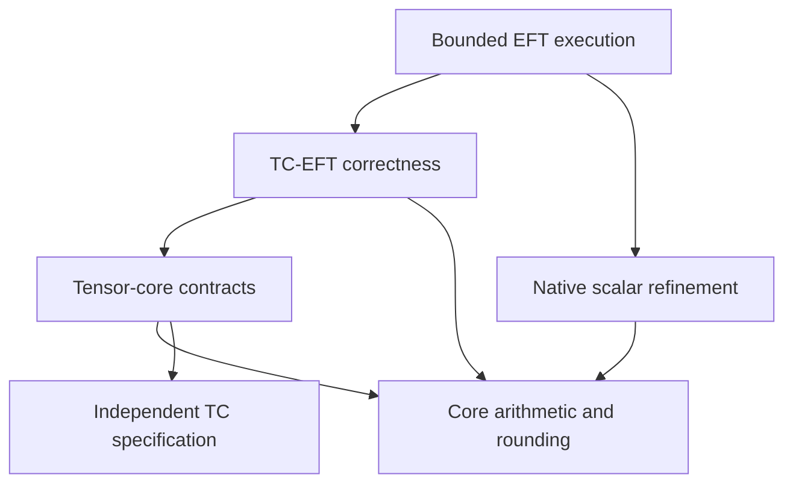
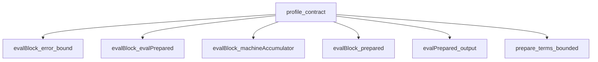
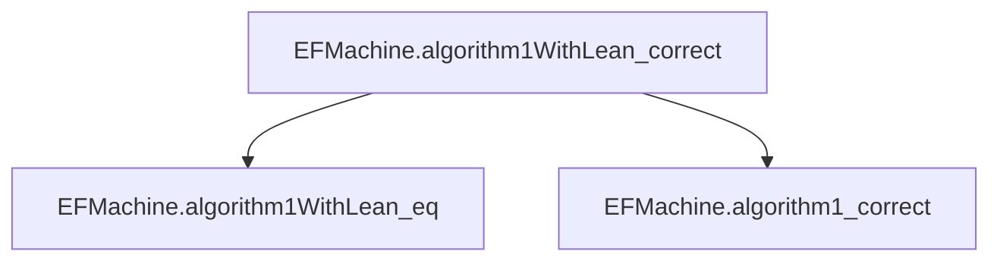
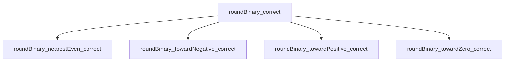

# Detailed proof guide

<!-- BEGIN GENERATED PROOF GUIDE -->
## Proof guide

Expand a claim to read its Lean code. Within each declaration, expand the supporting proofs and follow their links to continue through the dependency graph. The code is copied from the checked source, including proof bodies.

The [complete proof index](proofs/README.md) covers **848 source theorems** and **489 definitions**. The [machine-readable graph](proofs/dependencies.json) also retains generated proofs and standard-library edges. Regenerate with `python3 scripts/generate_proof_docs.py`; `--check` verifies that this guide is current.



### Entry points

<details>
<summary><code>TensorCore.Format</code></summary>

[Lean source](../TensorCore/Numerics/Defs.lean#L7) · [Full dependency node](proofs/Numerics/Defs.md#decl-db780180792c6817)

```lean
structure Format where
  fractionBits : ℕ
  exponentBits : ℕ
  bias : ℤ
  deriving Repr, DecidableEq
```

<details>
<summary>Supporting proofs</summary>

No supporting source theorem in this repository.

</details>

<details>
<summary>Definitions and types</summary>

None in this repository.

</details>

</details>

<details>
<summary><code>TensorCore.BinaryRep</code></summary>

[Lean source](../TensorCore/Numerics/Binary/Defs.lean#L8) · [Full dependency node](proofs/Numerics/Binary/Defs.md#decl-895d436fd0a35170)

```lean
/-- Canonical arithmetic data, including a sign for either zero. -/
structure BinaryRep (f : Format) where
  negative : Bool
  exponent : ℤ
  significand : ℕ
  exponent_min : f.emin ≤ exponent
  exponent_max : exponent ≤ f.emax
  significand_lt : significand < 2 ^ (f.fractionBits + 1)
  normalized : 2 ^ f.fractionBits ≤ significand ∨ exponent = f.emin
  deriving DecidableEq
```

<details>
<summary>Supporting proofs</summary>

No supporting source theorem in this repository.

</details>

<details>
<summary>Definitions and types</summary>

[TensorCore.Format](proofs/Numerics/Defs.md#decl-db780180792c6817), [TensorCore.Format.emax](proofs/Numerics/Defs.md#decl-dc4afe2b44cdf196), [TensorCore.Format.emin](proofs/Numerics/Defs.md#decl-af48d9057baa67b0)

</details>

</details>

<details>
<summary><code>TensorCore.BinaryRep.value</code></summary>

[Lean source](../TensorCore/Numerics/Binary/Defs.lean#L25) · [Full dependency node](proofs/Numerics/Binary/Defs.md#decl-cc6dcf5c8ebfaa31)

```lean
def BinaryRep.value {f : Format} (r : BinaryRep f) : ℚ :=
  (if r.negative then -(r.significand : ℚ) else r.significand) *
    pow2 (r.exponent - f.fractionBits)
```

<details>
<summary>Supporting proofs</summary>

No supporting source theorem in this repository.

</details>

<details>
<summary>Definitions and types</summary>

[TensorCore.BinaryRep](proofs/Numerics/Binary/Defs.md#decl-895d436fd0a35170), [TensorCore.Format](proofs/Numerics/Defs.md#decl-db780180792c6817), [TensorCore.pow2](proofs/Numerics/Exact.md#decl-b52a0281b35514e3)

</details>

</details>

<details>
<summary><code>TensorCore.finiteBinaryBijection</code></summary>

[Lean source](../TensorCore/Numerics/Binary/Bijection.lean#L174) · [Full dependency node](proofs/Numerics/Binary/Bijection.md#decl-b1a16403ef1ee57a)

```lean
def finiteBinaryBijection (f : Format) (hf : f.WellFormed) :
    BinaryBijection (BinaryRep f) (FiniteBinaryWord f) :=
  ⟨encodeBinaryRep f hf, decodeBinaryRep f hf,
    decode_encodeBinaryRep f hf, encode_decodeBinaryRep f hf⟩
```

<details>
<summary>Supporting proofs</summary>

<details>
<summary><code>TensorCore.decode_encodeBinaryRep</code></summary>

[Expand this proof and its dependencies](proofs/Numerics/Binary/Bijection.md#decl-2b92b9b7bcfc34f3)

```lean
theorem decode_encodeBinaryRep (f : Format) (hf : f.WellFormed) (r : BinaryRep f) :
    decodeBinaryRep f hf (encodeBinaryRep f hf r) = r
```

</details>

<details>
<summary><code>TensorCore.encode_decodeBinaryRep</code></summary>

[Expand this proof and its dependencies](proofs/Numerics/Binary/Bijection.md#decl-0ef3a70fffcc866c)

```lean
/-- Reassembling sign, exponent and fraction reproduces the original finite word. -/
theorem encode_decodeBinaryRep (f : Format) (hf : f.WellFormed) (b : FiniteBinaryWord f) :
    encodeBinaryRep f hf (decodeBinaryRep f hf b) = b
```

</details>

</details>

<details>
<summary>Definitions and types</summary>

[TensorCore.BinaryBijection](proofs/Numerics/Defs.md#decl-85b8cc75be52e666), [TensorCore.BinaryRep](proofs/Numerics/Binary/Defs.md#decl-895d436fd0a35170), [TensorCore.FiniteBinaryWord](proofs/Numerics/Binary/Defs.md#decl-b1ebef5bf580ea01), [TensorCore.Format](proofs/Numerics/Defs.md#decl-db780180792c6817), [TensorCore.Format.WellFormed](proofs/Numerics/Defs.md#decl-2c4f4aa8dae0f1d6), [TensorCore.decodeBinaryRep](proofs/Numerics/Binary/Bijection.md#decl-dd7db11ae1e1ea80), [TensorCore.encodeBinaryRep](proofs/Numerics/Binary/Bijection.md#decl-abc077f61bbca602)

</details>

</details>

<details>
<summary><code>TensorCore.decode_encodeBinaryRep</code></summary>

[Lean source](../TensorCore/Numerics/Binary/Bijection.lean#L110) · [Full dependency node](proofs/Numerics/Binary/Bijection.md#decl-2b92b9b7bcfc34f3)

```lean
theorem decode_encodeBinaryRep (f : Format) (hf : f.WellFormed) (r : BinaryRep f) :
    decodeBinaryRep f hf (encodeBinaryRep f hf r) = r := by
  obtain ⟨hs, he, hk⟩ := encodeBinary_fields f hf r
  have hemin := r.exponent_min
  have hn := r.normalized
  have hP := Nat.two_pow_pos f.fractionBits
  have hE : (r.exponent + f.bias).toNat ≠ 0 := by unfold Format.emin at hemin; omega
  cases r with
  | mk s e k h1 h2 h3 h4 =>
    simp only [decodeBinaryRep, encodeBinaryRep, hs, he, hk]
    congr 1 <;> split <;> simp_all <;> omega
```

<details>
<summary>Supporting proofs</summary>

<details>
<summary><code>TensorCore.encodeBinary_fields</code></summary>

[Expand this proof and its dependencies](proofs/Numerics/Binary/Bijection.md#decl-bcffec0f99ba4510)

```lean
/-- Field extraction for the existing generic encoder. -/
theorem encodeBinary_fields (f : Format) (hf : f.WellFormed) (r : BinaryRep f) :
    binarySign f r.encode = r.negative ∧
    binaryExponentField f r.encode =
      (if r.significand < 2 ^ f.fractionBits then 0 else (r.exponent + f.bias).toNat) ∧
    r.encode.toNat % 2 ^ f.fractionBits =
      (if r.significand < 2 ^ f.fractionBits then r.significand
       else r.significand - 2 ^ f.fractionBits)
```

</details>

</details>

<details>
<summary>Definitions and types</summary>

[TensorCore.BinaryRep](proofs/Numerics/Binary/Defs.md#decl-895d436fd0a35170), [TensorCore.BinaryRep.encode](proofs/Numerics/Binary/Bijection.md#decl-3a2559ae7dd8fec5), [TensorCore.Classification.finite](proofs/Numerics/Encoding.md#decl-cfa2987aba5ba75a), [TensorCore.Decoded](proofs/Numerics/Defs.md#decl-f4e0107ee6679350), [TensorCore.Format](proofs/Numerics/Defs.md#decl-db780180792c6817), [TensorCore.Format.WellFormed](proofs/Numerics/Defs.md#decl-2c4f4aa8dae0f1d6), [TensorCore.Format.emax](proofs/Numerics/Defs.md#decl-dc4afe2b44cdf196), [TensorCore.Format.emin](proofs/Numerics/Defs.md#decl-af48d9057baa67b0), [TensorCore.Format.width](proofs/Numerics/Defs.md#decl-950f9d663ce32954), [TensorCore.binaryExponentField](proofs/Numerics/Binary/Encoding.md#decl-c12aa273bd1bbbb3), [TensorCore.binarySign](proofs/Numerics/Binary/Encoding.md#decl-a5de0a69a17e78c5), [TensorCore.classify](proofs/Numerics/Encoding.md#decl-793c375a3325b7e3), [TensorCore.decodeBinaryRep](proofs/Numerics/Binary/Bijection.md#decl-dd7db11ae1e1ea80), [TensorCore.encodeBinaryRep](proofs/Numerics/Binary/Bijection.md#decl-abc077f61bbca602)

</details>

</details>

<details>
<summary><code>TensorCore.encode_decodeBinaryRep</code></summary>

[Lean source](../TensorCore/Numerics/Binary/Bijection.lean#L123) · [Full dependency node](proofs/Numerics/Binary/Bijection.md#decl-0ef3a70fffcc866c)

```lean
/-- Reassembling sign, exponent and fraction reproduces the original finite word. -/
theorem encode_decodeBinaryRep (f : Format) (hf : f.WellFormed) (b : FiniteBinaryWord f) :
    encodeBinaryRep f hf (decodeBinaryRep f hf b) = b := by
  apply Subtype.ext
  change (decodeBinaryRep f hf b).encode = b.val
  apply BitVec.eq_of_toNat_eq
  let hr := decodeBinaryRep f hf b
  rw [show (decodeBinaryRep f hf b).encode.toNat = _ from
    encodeBinary_toNat f hf hr.negative hr.exponent hr.significand
      (by omega) (by have := hr.significand_lt; omega) hr.exponent_min hr.exponent_max]
  simp only [hr, decodeBinaryRep, binarySign, binaryExponentField, Nat.pow_add]
  dsimp +instances only [hr, decodeBinaryRep, binarySign, binaryExponentField]
  have hn := b.val.isLt
  have hwidth : 2 ^ f.width = 2 ^ (f.fractionBits + f.exponentBits) * 2 := by
    rw [show f.width = f.fractionBits + f.exponentBits + 1 by unfold Format.width; omega,
      Nat.pow_succ]
  rw [hwidth, Nat.pow_add] at hn
  have hP := Nat.two_pow_pos f.fractionBits
  have hW := Nat.two_pow_pos f.exponentBits
  generalize hPv : 2 ^ f.fractionBits = P at *
  generalize hWv : 2 ^ f.exponentBits = W at *
  generalize hnv : b.val.toNat = n at *
  have hPW := Nat.mul_pos hP hW
  have hq : n / (P * W) < 2 := (Nat.div_lt_iff_lt_mul hPW).mpr (by omega)
  have hdecomp : n = (n / (P * W)) * (P * W) + (n / P % W) * P + n % P := by
    have h1 := Nat.div_add_mod n P
    have h2 := Nat.div_add_mod (n / P) W
    have h3 := congrArg (fun z => z * P) h2
    rw [Nat.div_div_eq_div_mul] at h3
    grind
  have hfrac := Nat.mod_lt n hP
  have hsign : (if (n / (P * W) != 0) then P * W else 0) = (n / (P * W) : ℕ) * (P * W) := by
    by_cases hz : n / (P * W) = 0
    · simp [hz]
    · have ho : n / (P * W) = 1 := by
        generalize n / (P * W) = q at *
        omega
      simp [ho]
  rw [hsign]
  by_cases he : n / P % W = 0
  · simp only [he, ↓reduceIte]
    rw [if_pos (show ((n % P : ℕ) : ℤ) < (P : ℕ) by omega)]
    simp only [Int.toNat_natCast]
    simp only [he, Nat.zero_mul, Nat.add_zero] at hdecomp
    omega
  · simp only [he, ↓reduceIte]
    rw [if_neg (show ¬ ((P + n % P : ℕ) : ℤ) < (P : ℕ) by omega)]
    have hE : (((n / P % W : ℕ) : ℤ) - f.bias + f.bias).toNat = n / P % W := by omega
    have hK : (((P + n % P : ℕ) : ℤ) - (P : ℕ)).toNat = n % P := by omega
    rw [hE, hK]
    omega
```

<details>
<summary>Supporting proofs</summary>

<details>
<summary><code>TensorCore.encodeBinary_toNat</code></summary>

[Expand this proof and its dependencies](proofs/Numerics/Binary/Encoding.md#decl-0082d54957605cf4)

```lean
/-- The constructed encoding fits the word and has the stated fields. -/
theorem encodeBinary_toNat (f : Format) (hf : f.WellFormed) (negative : Bool) (e k : ℤ)
    (hk0 : 0 ≤ k) (hk1 : k < ((2 ^ (f.fractionBits + 1) : ℕ) : ℤ)) (_he1 : f.emin ≤ e)
    (he2 : e ≤ f.emax) :
    (encodeBinary f negative e k).toNat =
      (if negative then 2 ^ (f.fractionBits + f.exponentBits) else 0) +
        (if k < (2 ^ f.fractionBits : ℕ) then k.toNat
         else (e + f.bias).toNat * 2 ^ f.fractionBits + (k - (2 ^ f.fractionBits : ℕ)).toNat)
```

</details>

</details>

<details>
<summary>Definitions and types</summary>

[TensorCore.BinaryRep](proofs/Numerics/Binary/Defs.md#decl-895d436fd0a35170), [TensorCore.BinaryRep.encode](proofs/Numerics/Binary/Bijection.md#decl-3a2559ae7dd8fec5), [TensorCore.Classification.finite](proofs/Numerics/Encoding.md#decl-cfa2987aba5ba75a), [TensorCore.Decoded](proofs/Numerics/Defs.md#decl-f4e0107ee6679350), [TensorCore.FiniteBinaryWord](proofs/Numerics/Binary/Defs.md#decl-b1ebef5bf580ea01), [TensorCore.Format](proofs/Numerics/Defs.md#decl-db780180792c6817), [TensorCore.Format.WellFormed](proofs/Numerics/Defs.md#decl-2c4f4aa8dae0f1d6), [TensorCore.Format.emax](proofs/Numerics/Defs.md#decl-dc4afe2b44cdf196), [TensorCore.Format.emin](proofs/Numerics/Defs.md#decl-af48d9057baa67b0), [TensorCore.Format.width](proofs/Numerics/Defs.md#decl-950f9d663ce32954), [TensorCore.binaryExponentField](proofs/Numerics/Binary/Encoding.md#decl-c12aa273bd1bbbb3), [TensorCore.binarySign](proofs/Numerics/Binary/Encoding.md#decl-a5de0a69a17e78c5), [TensorCore.classify](proofs/Numerics/Encoding.md#decl-793c375a3325b7e3), [TensorCore.decodeBinaryRep](proofs/Numerics/Binary/Bijection.md#decl-dd7db11ae1e1ea80), [TensorCore.encodeBinaryRep](proofs/Numerics/Binary/Bijection.md#decl-abc077f61bbca602)

</details>

</details>

<details>
<summary><code>TensorCore.SignedFiniteValue</code></summary>

[Lean source](../TensorCore/Numerics/Binary/Defs.lean#L32) · [Full dependency node](proofs/Numerics/Binary/Defs.md#decl-86fdea2e792bf344)

```lean
structure SignedFiniteValue (f : Format) where
  value : ℚ
  negative : Bool
  finite : f.FiniteValue value
  sign_nonzero : value ≠ 0 → negative = decide (value < 0)
```

<details>
<summary>Supporting proofs</summary>

No supporting source theorem in this repository.

</details>

<details>
<summary>Definitions and types</summary>

[TensorCore.Format](proofs/Numerics/Defs.md#decl-db780180792c6817), [TensorCore.Format.FiniteValue](proofs/Numerics/Defs.md#decl-e3dc9cecad983d99)

</details>

</details>

<details>
<summary><code>TensorCore.signedFiniteBinaryBijection</code></summary>

[Lean source](../TensorCore/Numerics/Binary/SignedBijection.lean#L134) · [Full dependency node](proofs/Numerics/Binary/SignedBijection.md#decl-52799c5e93137e77)

```lean
/-- Finite IEEE words correspond bijectively to representable rationals with two zeros.
For nonzero values the sign is determined, so there is exactly one representation. -/
def signedFiniteBinaryBijection (f : Format) (hf : f.WellFormed) :
    BinaryBijection (SignedFiniteValue f) (FiniteBinaryWord f) :=
  ⟨encodeSignedBinary f hf, decodeSignedBinary f hf,
    decode_encodeSignedBinary f hf, encode_decodeSignedBinary f hf⟩
```

<details>
<summary>Supporting proofs</summary>

<details>
<summary><code>TensorCore.decode_encodeSignedBinary</code></summary>

[Expand this proof and its dependencies](proofs/Numerics/Binary/SignedBijection.md#decl-2c11097025d8ee97)

```lean
theorem decode_encodeSignedBinary (f : Format) (hf : f.WellFormed) (v : SignedFiniteValue f) :
    decodeSignedBinary f hf (encodeSignedBinary f hf v) = v
```

</details>

<details>
<summary><code>TensorCore.encode_decodeSignedBinary</code></summary>

[Expand this proof and its dependencies](proofs/Numerics/Binary/SignedBijection.md#decl-c65020fe3f9595ba)

```lean
theorem encode_decodeSignedBinary (f : Format) (hf : f.WellFormed) (b : FiniteBinaryWord f) :
    encodeSignedBinary f hf (decodeSignedBinary f hf b) = b
```

</details>

</details>

<details>
<summary>Definitions and types</summary>

[TensorCore.BinaryBijection](proofs/Numerics/Defs.md#decl-85b8cc75be52e666), [TensorCore.FiniteBinaryWord](proofs/Numerics/Binary/Defs.md#decl-b1ebef5bf580ea01), [TensorCore.Format](proofs/Numerics/Defs.md#decl-db780180792c6817), [TensorCore.Format.WellFormed](proofs/Numerics/Defs.md#decl-2c4f4aa8dae0f1d6), [TensorCore.SignedFiniteValue](proofs/Numerics/Binary/Defs.md#decl-86fdea2e792bf344), [TensorCore.decodeSignedBinary](proofs/Numerics/Binary/SignedBijection.md#decl-cb2fcf99d19b6a37), [TensorCore.encodeSignedBinary](proofs/Numerics/Binary/SignedBijection.md#decl-1ab7a3966bec465c)

</details>

</details>

<details>
<summary><code>TensorCore.Profile</code></summary>

[Lean source](../TensorCore/TC/Defs.lean#L11) · [Full dependency node](proofs/TC/Defs.md#decl-a2404f64f289a40a)

```lean
/-- Explicit parameters of one globally aligned FP32-output normalization group:
input format, products per group `K`, fractional alignment bits `F` below `2^eta`,
and an alignment-exponent floor applied after the nonzero maximum (Accurate Models
v4 Table 3). Fields without established semantics for a device are not added. -/
structure Profile where
  input : Format
  products : ℕ
  alignFraction : ℤ
  alignFloor : Option ℤ
  deriving Repr, DecidableEq
```

<details>
<summary>Supporting proofs</summary>

No supporting source theorem in this repository.

</details>

<details>
<summary>Definitions and types</summary>

[TensorCore.Format](proofs/Numerics/Defs.md#decl-db780180792c6817)

</details>

</details>

<details>
<summary><code>TensorCore.BlockInput</code></summary>

[Lean source](../TensorCore/TC/Block.lean#L10) · [Full dependency node](proofs/TC/Block.md#decl-ad6b462d69117cc6)

```lean
/-- Encoded operands of one normalization group under a profile; `c` is always FP32. -/
structure BlockInput (p : Profile) where
  products : List (p.Word × p.Word)
  c : F32
  deriving Repr, DecidableEq
```

<details>
<summary>Supporting proofs</summary>

No supporting source theorem in this repository.

</details>

<details>
<summary>Definitions and types</summary>

[TensorCore.F32](proofs/Numerics/Defs.md#decl-24fa1e63edeb271f), [TensorCore.Format.width](proofs/Numerics/Defs.md#decl-950f9d663ce32954), [TensorCore.Profile](proofs/TC/Defs.md#decl-a2404f64f289a40a), [TensorCore.Profile.Word](proofs/TC/Defs.md#decl-3bca3de3cb04fb71)

</details>

</details>

<details>
<summary><code>TensorCore.evalBlock</code></summary>

[Lean source](../TensorCore/TC/Block.lean#L97) · [Full dependency node](proofs/TC/Block.md#decl-58fdfbbb09a9ba58)

```lean
/-- One normalization group of the profile, not a complete PTX tile or GEMM. -/
def evalBlock {p : Profile} (x : BlockInput p) : Except ModelError BlockTrace :=
  if x.products.length != p.products then .error .wrongProductCount
  else match prepare x with
    | none => .error .nonfiniteInput
    | some b => evalPrepared b
```

<details>
<summary>Supporting proofs</summary>

No supporting source theorem in this repository.

</details>

<details>
<summary>Definitions and types</summary>

[TensorCore.BlockInput](proofs/TC/Block.md#decl-ad6b462d69117cc6), [TensorCore.BlockTrace](proofs/TC/Block.md#decl-6e6aa9836448ab93), [TensorCore.ModelError](proofs/TC/Block.md#decl-f7be0c438a4d4d1d), [TensorCore.PreparedBlock](proofs/TC/Block.md#decl-703939eff806d883), [TensorCore.Profile](proofs/TC/Defs.md#decl-a2404f64f289a40a), [TensorCore.Profile.Word](proofs/TC/Defs.md#decl-3bca3de3cb04fb71), [TensorCore.evalPrepared](proofs/TC/Block.md#decl-700b85398ddd8f12), [TensorCore.prepare](proofs/TC/Block.md#decl-32c2d7273540d876)

</details>

</details>

<details>
<summary><code>TensorCore.algorithm1Encoded</code></summary>

[Lean source](../TensorCore/EFT/Encoded.lean#L35) · [Full dependency node](proofs/EFT/Encoded.md#decl-8017eca136315bcf)

```lean
/-- Algorithm 1: check the finite encoded interface, return +0 for all-zero terms,
otherwise reconstruct the grids and overlap components and execute the two-branch reference.
The range failure is retained as `.consolidated .outOfRange`. -/
def algorithm1Encoded {p : Profile} (x : BlockInput p) (D : F32) :
    Except ModelError EncodedEFTResult :=
  match prepareEncodedEFT x D with
  | .error e => .error e
  | .ok t => .ok (if t.block.allZeroTerms then .allZero else .consolidated t.algorithm1)
```

<details>
<summary>Supporting proofs</summary>

No supporting source theorem in this repository.

</details>

<details>
<summary>Definitions and types</summary>

[TensorCore.BlockInput](proofs/TC/Block.md#decl-ad6b462d69117cc6), [TensorCore.BlockTrace](proofs/TC/Block.md#decl-6e6aa9836448ab93), [TensorCore.BlockTrace.algorithm1](proofs/EFT/Algorithm1.md#decl-01de1ae42b7279f3), [TensorCore.EncodedEFTResult](proofs/EFT/Encoded.md#decl-43c5cf7090b5e17e), [TensorCore.F32](proofs/Numerics/Defs.md#decl-24fa1e63edeb271f), [TensorCore.ModelError](proofs/TC/Block.md#decl-f7be0c438a4d4d1d), [TensorCore.PreparedBlock.allZeroTerms](proofs/EFT/Encoded.md#decl-12dcaf3961e33ea9), [TensorCore.Profile](proofs/TC/Defs.md#decl-a2404f64f289a40a), [TensorCore.prepareEncodedEFT](proofs/EFT/Encoded.md#decl-aaaf1649ccd95844)

</details>

</details>

<details>
<summary><code>TensorCore.EFMachine.algorithm1WithLean</code></summary>

[Lean source](../TensorCore/Kernels/EFT/Native.lean#L101) · [Full dependency node](proofs/Kernels/EFT/Native.md#decl-e854b34f0fadc9c3)

```lean
/-- Algorithm 1 with native scalar additions, retaining bounded exact consolidation
when the scalar guard or intermediate checks refuse the scalar branch. -/
def algorithm1WithLean (path : Path) (x : BlockInput path.profile) (D : F32) : Except Error Result := do
  let p ← prepare path x D
  if p.terms.all (fun t => t.word.magnitude == 0) then return .allZero
  let some c := extract p | throw .arithmeticOverflow
  match c.scalarWithLean with
  | some b => return .scalar b
  | none =>
    match c.recovered.round32 with
    | some b => return .boundedExact b
    | none => return .outOfRange
```

<details>
<summary>Supporting proofs</summary>

No supporting source theorem in this repository.

</details>

<details>
<summary>Definitions and types</summary>

[TensorCore.BlockInput](proofs/TC/Block.md#decl-ad6b462d69117cc6), [TensorCore.EFMachine.Components](proofs/Kernels/EFT/Defs.md#decl-cbab83ff033f2778), [TensorCore.EFMachine.Components.scalarWithLean](proofs/Kernels/EFT/Native.md#decl-f2a2e92b799d4090), [TensorCore.EFMachine.Error](proofs/Kernels/EFT/Defs.md#decl-ae7458916e66d6a4), [TensorCore.EFMachine.Magnitude](proofs/Kernels/EFT/WordDefs.md#decl-666b5ba9cbd0ae62), [TensorCore.EFMachine.Path](proofs/Kernels/EFT/DecodeDefs.md#decl-2506d95eda2deaf1), [TensorCore.EFMachine.Path.profile](proofs/Kernels/EFT/DecodeDefs.md#decl-ccec848a9e7609d0), [TensorCore.EFMachine.Prepared](proofs/Kernels/EFT/Defs.md#decl-60336b9775817f9a), [TensorCore.EFMachine.Result](proofs/Kernels/EFT/Defs.md#decl-dbcfe8dff7f13123), [TensorCore.EFMachine.Term](proofs/Kernels/EFT/DecodeDefs.md#decl-fa1797d418dbd302), [TensorCore.EFMachine.Word](proofs/Kernels/EFT/WordDefs.md#decl-df353d912dc0da43), [TensorCore.EFMachine.Word.round32](proofs/Kernels/EFT/WordDefs.md#decl-ae96957dae22a7c5), [TensorCore.EFMachine.extract](proofs/Kernels/EFT/Defs.md#decl-1edcf1bb479bb8a3), [TensorCore.EFMachine.prepare](proofs/Kernels/EFT/Defs.md#decl-795b364db94203eb), [TensorCore.F32](proofs/Numerics/Defs.md#decl-24fa1e63edeb271f)

</details>

</details>

### Tensor-core model and non-monotonicity

<details>
<summary>C03. FP64 fused arithmetic</summary>

One exact product plus accumulator, one final rounding in each direction; finite decoded inputs and an in-range exact fused result give success. No intermediate product range restriction.

<details>
<summary><code>TensorCore.binary64Fma_correct</code></summary>

[Lean source](../TensorCore/TC/FusedRounding.lean#L10) · [Full dependency node](proofs/TC/FusedRounding.md#decl-818649bb83af8ab6)

```lean
/-- Accepted FP64 DMMA arithmetic is correctly rounded in each of the four modes,
with the original-input ideal and the output sign made explicit. -/
theorem binary64Fma_correct {mode : BinaryRoundingMode}
    {x : InvocationInput (binary64Fma mode)} {t : InvocationTrace (binary64Fma mode)}
    (h : evalInvocation x = .ok t) :
    invocationIdeal x = some t.intermediate.value ∧
    BinaryRoundSpec fp64 mode t.intermediate.value t.output.bits ∧
    binarySign fp64 t.output.bits = decide (t.intermediate.value < 0) := by
  have hout := evalInvocation_output h
  obtain ⟨b, hb, hc⟩ := roundBinary_correct fp64 (by decide) mode t.intermediate.value hout.2
  have heq := Option.some.inj (hb.symm.trans hout.1)
  rw [heq] at hc
  exact ⟨binary64Fma_exact_input h, hc, roundBinary_sign fp64 mode _ _ hout.1⟩
```

<details>
<summary>Supporting proofs</summary>

<details>
<summary><code>TensorCore.binary64Fma_exact_input</code></summary>

[Expand this proof and its dependencies](proofs/TC/Conversion.md#decl-e9ea2eb0949990ef)

```lean
/-- Fused FP64 rounds the independently decoded exact product plus accumulator;
there is no intermediate rounding. -/
theorem binary64Fma_exact_input {mode : BinaryRoundingMode}
    {x : InvocationInput (binary64Fma mode)} {t : InvocationTrace (binary64Fma mode)}
    (h : evalInvocation x = .ok t) : invocationIdeal x = some t.intermediate.value
```

</details>

<details>
<summary><code>TensorCore.evalInvocation_output</code></summary>

[Expand this proof and its dependencies](proofs/TC/InvocationProperties.md#decl-c5356d6db12f1b4d)

```lean
/-- The final output obeys the specified executable conversion, with its own range guard. -/
theorem evalInvocation_output {p : InvocationSpec} {x : InvocationInput p} {t : InvocationTrace p}
    (h : evalInvocation x = .ok t) :
    roundBinary p.output.format p.output.mode t.intermediate.value = some t.output.bits ∧
    absQ t.intermediate.value ≤ p.output.format.maxFinite
```

</details>

<details>
<summary><code>TensorCore.roundBinary_correct</code></summary>

[Expand this proof and its dependencies](proofs/Numerics/Binary/RoundingContract.md#decl-12a22af180d3ad5e)

```lean
theorem roundBinary_correct (f : Format) (hf : f.WellFormed) (mode : BinaryRoundingMode)
    (x : ℚ) (hr : absQ x ≤ f.maxFinite) :
    ∃ bits, roundBinary f mode x = some bits ∧ BinaryRoundSpec f mode x bits
```

</details>

<details>
<summary><code>TensorCore.roundBinary_sign</code></summary>

[Expand this proof and its dependencies](proofs/Numerics/Binary/RoundingContract.md#decl-89538250b2c31eac)

```lean
/-- The output sign is the input's strict negativity, even when it underflows to zero.
Exact rational zero therefore has a positive sign in every mode. -/
theorem roundBinary_sign (f : Format) (mode : BinaryRoundingMode) (x : ℚ)
    (bits : BitVec f.width) (h : roundBinary f mode x = some bits) :
    binarySign f bits = decide (x < 0)
```

</details>

</details>

<details>
<summary>Definitions and types</summary>

[TensorCore.BinaryRoundSpec](proofs/Numerics/Binary/RoundingContract.md#decl-88c3ff9da8e0df3a), [TensorCore.BinaryRoundingMode](proofs/Numerics/Binary/RoundOp.md#decl-00a7255be9b19e5a), [TensorCore.ConversionRun](proofs/Numerics/Conversion.md#decl-ed5a81cbcde403d2), [TensorCore.ConversionStage](proofs/Numerics/Conversion.md#decl-19660b95e076faa1), [TensorCore.FiniteBinary](proofs/Numerics/Conversion.md#decl-819c01227290b53b), [TensorCore.Format](proofs/Numerics/Defs.md#decl-db780180792c6817), [TensorCore.Format.WellFormed](proofs/Numerics/Defs.md#decl-2c4f4aa8dae0f1d6), [TensorCore.Format.maxFinite](proofs/Numerics/Defs.md#decl-6cac0e89f6135a61), [TensorCore.Format.width](proofs/Numerics/Defs.md#decl-950f9d663ce32954), [TensorCore.InvocationError](proofs/TC/Invocation.md#decl-4afa1dfc6f87e57d), [TensorCore.InvocationInput](proofs/TC/Invocation.md#decl-6320316242fc8f99), [TensorCore.InvocationSpec](proofs/TC/Invocation.md#decl-686e1fb8fa675688), [TensorCore.InvocationTrace](proofs/TC/Invocation.md#decl-b63a56d7a7c92388), [TensorCore.absQ](proofs/Numerics/Exact.md#decl-8dd63ab202e070d3), [TensorCore.binary64Fma](proofs/TC/Profiles.md#decl-8bfe46830da92086), [TensorCore.binarySign](proofs/Numerics/Binary/Encoding.md#decl-a5de0a69a17e78c5), [TensorCore.evalInvocation](proofs/TC/Invocation.md#decl-d69509a8df45ebe4), [TensorCore.fp64](proofs/Numerics/Defs.md#decl-a9439171a8dcf9cb), [TensorCore.invocationIdeal](proofs/TC/Invocation.md#decl-ce5a842b255050cf), [TensorCore.roundBinary](proofs/Numerics/Binary/RoundOp.md#decl-8ffd5ccdcdd7afed)

</details>

</details>

<details>
<summary><code>TensorCore.binary64Fma_success</code></summary>

[Lean source](../TensorCore/TC/FusedRounding.lean#L24) · [Full dependency node](proofs/TC/FusedRounding.md#decl-b369329edfc5a2cd)

```lean
/-- Finite decoded inputs of the required one-product shape succeed whenever their
exact fused result is in range; no intermediate-product range bound is imposed. -/
theorem binary64Fma_success (mode : BinaryRoundingMode) (x : InvocationInput (binary64Fma mode))
    (b : PreparedInvocation (binary64Fma mode)) (hp : prepareInvocation x = some b)
    (hn : x.products.length = 1) (hr : absQ b.exactDot ≤ fp64.maxFinite) :
    ∃ t, evalInvocation x = .ok t := by
  unfold binary64Fma at *
  obtain ⟨bits, hb, hc⟩ := roundBinary_correct fp64 (by decide) mode b.exactDot hr
  obtain ⟨d, hd⟩ := hc.finite
  have hconv : (ConversionStage.mk fp64 mode).convert b.exactDot =
      some ⟨bits, d, hd⟩ := by
    simp only [ConversionStage.convert, hb]
    exact finiteBinary_some hd
  have hv : (binary64Fma mode).Valid := by cases mode <;> decide +kernel
  unfold evalInvocation
  rw [if_neg (fun h => h hv), if_neg (by simp [hn]), hp]
  simp only [evalInvocationPrepared, accumulateInvocation, runConversions]
  rw [hconv]
  exact ⟨_, rfl⟩
```

<details>
<summary>Supporting proofs</summary>

<details>
<summary><code>TensorCore.BinaryRoundSpec.finite</code></summary>

[Expand this proof and its dependencies](proofs/Numerics/Binary/RoundingContract.md#decl-5fa4e1dc58d238c5)

```lean
theorem BinaryRoundSpec.finite {f : Format} {mode : BinaryRoundingMode} {x : ℚ}
    {bits : BitVec f.width} (h : BinaryRoundSpec f mode x bits) :
    ∃ d, (classify f bits).finite = some d
```

</details>

<details>
<summary><code>TensorCore.finiteBinary_some</code></summary>

[Expand this proof and its dependencies](proofs/Numerics/Conversion.md#decl-66e4132ec74cac83)

```lean
theorem finiteBinary_some {f : Format} {bits : BitVec f.width} {d : Decoded}
    (hd : (classify f bits).finite = some d) : finiteBinary f bits = some ⟨bits, d, hd⟩
```

</details>

<details>
<summary><code>TensorCore.roundBinary_correct</code></summary>

[Expand this proof and its dependencies](proofs/Numerics/Binary/RoundingContract.md#decl-12a22af180d3ad5e)

```lean
theorem roundBinary_correct (f : Format) (hf : f.WellFormed) (mode : BinaryRoundingMode)
    (x : ℚ) (hr : absQ x ≤ f.maxFinite) :
    ∃ bits, roundBinary f mode x = some bits ∧ BinaryRoundSpec f mode x bits
```

</details>

</details>

<details>
<summary>Definitions and types</summary>

[TensorCore.AccumulationKind](proofs/TC/Invocation.md#decl-e676df9d836e3187), [TensorCore.BinaryRoundSpec](proofs/Numerics/Binary/RoundingContract.md#decl-88c3ff9da8e0df3a), [TensorCore.BinaryRoundingMode](proofs/Numerics/Binary/RoundOp.md#decl-00a7255be9b19e5a), [TensorCore.CPlacement](proofs/TC/Invocation.md#decl-465383d437a4df50), [TensorCore.Classification.finite](proofs/Numerics/Encoding.md#decl-cfa2987aba5ba75a), [TensorCore.ConversionEvent](proofs/Numerics/Conversion.md#decl-4715b3224a6fd37c), [TensorCore.ConversionRun](proofs/Numerics/Conversion.md#decl-ed5a81cbcde403d2), [TensorCore.ConversionStage](proofs/Numerics/Conversion.md#decl-19660b95e076faa1), [TensorCore.ConversionStage.convert](proofs/Numerics/Conversion.md#decl-5e2170b37d7e10f7), [TensorCore.Decoded](proofs/Numerics/Defs.md#decl-f4e0107ee6679350), [TensorCore.FiniteBinary](proofs/Numerics/Conversion.md#decl-819c01227290b53b), [TensorCore.Format](proofs/Numerics/Defs.md#decl-db780180792c6817), [TensorCore.Format.WellFormed](proofs/Numerics/Defs.md#decl-2c4f4aa8dae0f1d6), [TensorCore.Format.maxFinite](proofs/Numerics/Defs.md#decl-6cac0e89f6135a61), [TensorCore.Format.width](proofs/Numerics/Defs.md#decl-950f9d663ce32954), [TensorCore.InvocationError](proofs/TC/Invocation.md#decl-4afa1dfc6f87e57d), [TensorCore.InvocationInput](proofs/TC/Invocation.md#decl-6320316242fc8f99), [TensorCore.InvocationSpec](proofs/TC/Invocation.md#decl-686e1fb8fa675688), [TensorCore.InvocationSpec.Valid](proofs/TC/Invocation.md#decl-ba647c851a0365a5), [TensorCore.InvocationTrace](proofs/TC/Invocation.md#decl-b63a56d7a7c92388), [TensorCore.LocalAccumulation](proofs/TC/Invocation.md#decl-a84c087ad8e27576), [TensorCore.OperandEncoding](proofs/Numerics/Format.md#decl-372baaa74f9e3836), [TensorCore.OperandEncoding.Word](proofs/Numerics/Format.md#decl-3024ce1c6868fc17), [TensorCore.PreparedInvocation](proofs/TC/Invocation.md#decl-f9bfc73e05dc3dce), [TensorCore.PreparedInvocation.exactDot](proofs/TC/Invocation.md#decl-d708da3010825603), [TensorCore.ValueFormat](proofs/Numerics/Format.md#decl-5fda6482ff1a70d2), [TensorCore.absQ](proofs/Numerics/Exact.md#decl-8dd63ab202e070d3), [TensorCore.binary64Fma](proofs/TC/Profiles.md#decl-8bfe46830da92086), [TensorCore.classify](proofs/Numerics/Encoding.md#decl-793c375a3325b7e3), [TensorCore.evalInvocation](proofs/TC/Invocation.md#decl-d69509a8df45ebe4), [TensorCore.evalInvocationPrepared](proofs/TC/Invocation.md#decl-0d3709c08efd2102), [TensorCore.finiteBinary](proofs/Numerics/Conversion.md#decl-4947fce7ecea0c20), [TensorCore.fp64](proofs/Numerics/Defs.md#decl-a9439171a8dcf9cb), [TensorCore.packedIEEE](proofs/Numerics/Format.md#decl-1c87313094e2d4c0), [TensorCore.prepareInvocation](proofs/TC/Invocation.md#decl-4c327b22c0823d02), [TensorCore.roundBinary](proofs/Numerics/Binary/RoundOp.md#decl-8ffd5ccdcdd7afed), [TensorCore.stagesValid](proofs/TC/Invocation.md#decl-e34cdc92870df2ae)

</details>

</details>

</details>

<details>
<summary>C04. Tensor-core arithmetic</summary>

The selected FP16/BF16/TF32 profiles model raw subnormal scales, alignment, floors, signed truncation, and final conversion. Fixed-width refinement has explicit width/carry assumptions.

<details>
<summary><code>TensorCore.profile_contract</code></summary>

[Lean source](../TensorCore/TC/CanonicalFormats.lean#L11) · [Full dependency node](proofs/TC/CanonicalFormats.md#decl-ccfc8f82aa7974cb)

```lean
/-- Uncorrected output, error, and machine-width contract for any profile. -/
theorem profile_contract (p : Profile) (F carryBits : ℕ) (hF : p.alignFraction = F)
    (hc : p.products + 1 ≤ 2 ^ carryBits) (x : BlockInput p) (t : BlockTrace)
    (h : evalBlock x = .ok t) :
    exactDot x = some t.block.exactDot ∧
    round32 .towardZero t.block.accumulator = some t.output.bits ∧
    absQ (t.block.exactDot - t.output.value) <
      ((p.products + 1 : ℕ) : ℚ) * pow2 t.block.quantumExponent +
        pow2 (outputQuantumExponent t.output.bits) ∧
    t.block.machineAccumulator (F + 3 + carryBits) = t.block.accumulator := by
  have hp := evalBlock_prepared h
  have hlen := (prepare_terms_bounded hp).1
  have hshape : x.products.length = p.products := by
    unfold evalBlock at h
    split at h <;> simp_all
  have herr := evalBlock_error_bound h
  have hw := evalBlock_machineAccumulator h F carryBits hF hc
  refine ⟨by simp [exactDot, hp], evalPrepared_output (evalBlock_evalPrepared h), ?_, ?_⟩
  · simpa [hlen, hshape] using herr
  · have he : F + 2 + carryBits + 1 = F + 3 + carryBits := by omega
    simpa [he] using hw
```



<details>
<summary>Supporting proofs</summary>

<details>
<summary><code>TensorCore.evalBlock_error_bound</code></summary>

[Expand this proof and its dependencies](proofs/TC/ErrorBounds.md#decl-cd49461242c6068b)

```lean
theorem evalBlock_error_bound {p : Profile} {x : BlockInput p} {t : BlockTrace}
    (h : evalBlock x = .ok t) :
    absQ (t.block.exactDot - t.output.value) <
      (t.block.terms.length : ℚ) * pow2 t.block.quantumExponent +
        pow2 (outputQuantumExponent t.output.bits)
```

</details>

<details>
<summary><code>TensorCore.evalBlock_evalPrepared</code></summary>

[Expand this proof and its dependencies](proofs/TC/StageResiduals.md#decl-e818d9197d4da76d)

```lean
theorem evalBlock_evalPrepared {p : Profile} {x : BlockInput p} {t : BlockTrace}
    (h : evalBlock x = .ok t) : evalPrepared t.block = .ok t
```

</details>

<details>
<summary><code>TensorCore.evalBlock_machineAccumulator</code></summary>

[Expand this proof and its dependencies](proofs/TC/AlignmentScale.md#decl-33be1c6d56f7d2cd)

```lean
theorem evalBlock_machineAccumulator {p : Profile} {x : BlockInput p} {t : BlockTrace}
    (h : evalBlock x = .ok t) (F carryBits : ℕ)
    (hF : p.alignFraction = F) (hcount : p.products + 1 ≤ 2 ^ carryBits) :
    t.block.machineAccumulator (F + 2 + carryBits + 1) = t.block.accumulator
```

</details>

<details>
<summary><code>TensorCore.evalBlock_prepared</code></summary>

[Expand this proof and its dependencies](proofs/TC/StageResiduals.md#decl-7b1107ad8e7189d9)

```lean
theorem evalBlock_prepared {p : Profile} {x : BlockInput p} {t : BlockTrace}
    (h : evalBlock x = .ok t) : prepare x = some t.block
```

</details>

<details>
<summary><code>TensorCore.evalPrepared_output</code></summary>

[Expand this proof and its dependencies](proofs/TC/ErrorBounds.md#decl-48e730a73a284cc0)

```lean
theorem evalPrepared_output {b : PreparedBlock} {t : BlockTrace}
    (h : evalPrepared b = .ok t) : round32 .towardZero b.accumulator = some t.output.bits
```

</details>

<details>
<summary><code>TensorCore.prepare_terms_bounded</code></summary>

[Expand this proof and its dependencies](proofs/TC/AlignmentScale.md#decl-73a22edb6efb821c)

```lean
theorem prepare_terms_bounded {p : Profile} {x : BlockInput p} {b : PreparedBlock}
    (h : prepare x = some b) :
    b.terms.length = x.products.length + 1 ∧ ∀ t ∈ b.terms, t.Bounded
```

</details>

</details>

<details>
<summary>Definitions and types</summary>

[TensorCore.BlockInput](proofs/TC/Block.md#decl-ad6b462d69117cc6), [TensorCore.BlockTrace](proofs/TC/Block.md#decl-6e6aa9836448ab93), [TensorCore.F32](proofs/Numerics/Defs.md#decl-24fa1e63edeb271f), [TensorCore.Finite32](proofs/Numerics/Encoding.md#decl-f23991ff7c5b3c3b), [TensorCore.Finite32.value](proofs/Numerics/Encoding.md#decl-453b2816528e5c77), [TensorCore.ModelError](proofs/TC/Block.md#decl-f7be0c438a4d4d1d), [TensorCore.PreparedBlock](proofs/TC/Block.md#decl-703939eff806d883), [TensorCore.PreparedBlock.accumulator](proofs/TC/Block.md#decl-a7916980cd8ee13e), [TensorCore.PreparedBlock.exactDot](proofs/TC/Block.md#decl-32d061749cae163e), [TensorCore.PreparedBlock.machineAccumulator](proofs/TC/Accumulator.md#decl-9e58c7148c06ae54), [TensorCore.PreparedBlock.quantumExponent](proofs/TC/Block.md#decl-43c39ff5fd4eef64), [TensorCore.PreparedBlock.terms](proofs/TC/Block.md#decl-5c50cde42f4cd44c), [TensorCore.Profile](proofs/TC/Defs.md#decl-a2404f64f289a40a), [TensorCore.Profile.Word](proofs/TC/Defs.md#decl-3bca3de3cb04fb71), [TensorCore.RawProduct](proofs/Numerics/RawProduct.md#decl-48ce8d4df2fad1f4), [TensorCore.RawProduct.Bounded](proofs/Numerics/RawProduct.md#decl-3e529071d4e652db), [TensorCore.RoundingMode](proofs/Numerics/RoundOp.md#decl-3d487bd4115d0af1), [TensorCore.absQ](proofs/Numerics/Exact.md#decl-8dd63ab202e070d3), [TensorCore.evalBlock](proofs/TC/Block.md#decl-58fdfbbb09a9ba58), [TensorCore.evalPrepared](proofs/TC/Block.md#decl-700b85398ddd8f12), [TensorCore.exactDot](proofs/TC/Block.md#decl-451fb68e7faa00f3), [TensorCore.outputQuantumExponent](proofs/Numerics/RoundOp.md#decl-70bb2de461b51682), [TensorCore.pow2](proofs/Numerics/Exact.md#decl-b52a0281b35514e3), [TensorCore.prepare](proofs/TC/Block.md#decl-32c2d7273540d876), [TensorCore.round32](proofs/Numerics/RoundOp.md#decl-11a6489236dbb65b)

</details>

</details>

<details>
<summary><code>TensorCore.PaperSpec.supported_eq_paper</code></summary>

[Lean source](../TensorCore/TC/Specification/Supported.lean#L27) · [Full dependency node](proofs/TC/Specification/Supported.md#decl-13a8bbc2350f91f1)

```lean
/-- Every supported paper path and every input, with failures observed as none. -/
theorem supported_eq_paper (path : Path) (x : BlockInput (implementationProfile path)) :
    (evalBlock x).toOption.map (fun t => t.output.bits) =
      bits (parameters path) (supportedInput path x) := by
  cases path <;> exact implementation_eq_paper x
```

<details>
<summary>Supporting proofs</summary>

<details>
<summary><code>TensorCore.PaperSpec.implementation_eq_paper</code></summary>

[Expand this proof and its dependencies](proofs/TC/Specification/Equivalence.md#decl-944384931631e849)

```lean
/-- Every encoded input: successful output bits and all rejection cases agree.
The generic parameter theorem is stronger than its named paper-profile instances. -/
theorem implementation_eq_paper {p : Profile} (x : BlockInput p) :
    (evalBlock x).toOption.map (fun t => t.output.bits) =
      bits (parametersOf p) (inputOf x)
```

</details>

</details>

<details>
<summary>Definitions and types</summary>

[TensorCore.BlockInput](proofs/TC/Block.md#decl-ad6b462d69117cc6), [TensorCore.BlockTrace](proofs/TC/Block.md#decl-6e6aa9836448ab93), [TensorCore.F32](proofs/Numerics/Defs.md#decl-24fa1e63edeb271f), [TensorCore.Finite32](proofs/Numerics/Encoding.md#decl-f23991ff7c5b3c3b), [TensorCore.ModelError](proofs/TC/Block.md#decl-f7be0c438a4d4d1d), [TensorCore.PaperSpec.Path](proofs/TC/Specification/Profiles.md#decl-4e0e2e5d21f848a7), [TensorCore.PaperSpec.bits](proofs/TC/Specification/Defs.md#decl-7903d07b8ab34f66), [TensorCore.PaperSpec.implementationProfile](proofs/TC/Specification/Supported.md#decl-3c13ed61a6208d31), [TensorCore.PaperSpec.parameters](proofs/TC/Specification/Profiles.md#decl-ee26be9404546300), [TensorCore.PaperSpec.supportedInput](proofs/TC/Specification/Supported.md#decl-9a9de8a677d86544), [TensorCore.evalBlock](proofs/TC/Block.md#decl-58fdfbbb09a9ba58)

</details>

</details>

</details>

<details>
<summary>C05. Error, recovery, and order</summary>

Local error includes final conversion; exact residual recovery composes across encoded accumulators. Nonmonotonicity is proved for the specified realizable input family. Accepted traces and the stated range/profile premises remain explicit.

<details>
<summary><code>TensorCore.evalBlock_error_bound</code></summary>

[Lean source](../TensorCore/TC/ErrorBounds.lean#L80) · [Full dependency node](proofs/TC/ErrorBounds.md#decl-cd49461242c6068b)

```lean
theorem evalBlock_error_bound {p : Profile} {x : BlockInput p} {t : BlockTrace}
    (h : evalBlock x = .ok t) :
    absQ (t.block.exactDot - t.output.value) <
      (t.block.terms.length : ℚ) * pow2 t.block.quantumExponent +
        pow2 (outputQuantumExponent t.output.bits) :=
  evalPrepared_error_bound (evalBlock_evalPrepared h)
```

<details>
<summary>Supporting proofs</summary>

<details>
<summary><code>TensorCore.evalBlock_evalPrepared</code></summary>

[Expand this proof and its dependencies](proofs/TC/StageResiduals.md#decl-e818d9197d4da76d)

```lean
theorem evalBlock_evalPrepared {p : Profile} {x : BlockInput p} {t : BlockTrace}
    (h : evalBlock x = .ok t) : evalPrepared t.block = .ok t
```

</details>

<details>
<summary><code>TensorCore.evalPrepared_error_bound</code></summary>

[Expand this proof and its dependencies](proofs/TC/ErrorBounds.md#decl-6a51cec1858cd298)

```lean
theorem evalPrepared_error_bound {b : PreparedBlock} {t : BlockTrace}
    (h : evalPrepared b = .ok t) :
    absQ (t.block.exactDot - t.output.value) <
      (t.block.terms.length : ℚ) * pow2 t.block.quantumExponent +
        pow2 (outputQuantumExponent t.output.bits)
```

</details>

</details>

<details>
<summary>Definitions and types</summary>

[TensorCore.BlockInput](proofs/TC/Block.md#decl-ad6b462d69117cc6), [TensorCore.BlockTrace](proofs/TC/Block.md#decl-6e6aa9836448ab93), [TensorCore.Finite32](proofs/Numerics/Encoding.md#decl-f23991ff7c5b3c3b), [TensorCore.Finite32.value](proofs/Numerics/Encoding.md#decl-453b2816528e5c77), [TensorCore.ModelError](proofs/TC/Block.md#decl-f7be0c438a4d4d1d), [TensorCore.PreparedBlock.exactDot](proofs/TC/Block.md#decl-32d061749cae163e), [TensorCore.PreparedBlock.quantumExponent](proofs/TC/Block.md#decl-43c39ff5fd4eef64), [TensorCore.PreparedBlock.terms](proofs/TC/Block.md#decl-5c50cde42f4cd44c), [TensorCore.Profile](proofs/TC/Defs.md#decl-a2404f64f289a40a), [TensorCore.RawProduct](proofs/Numerics/RawProduct.md#decl-48ce8d4df2fad1f4), [TensorCore.absQ](proofs/Numerics/Exact.md#decl-8dd63ab202e070d3), [TensorCore.evalBlock](proofs/TC/Block.md#decl-58fdfbbb09a9ba58), [TensorCore.outputQuantumExponent](proofs/Numerics/RoundOp.md#decl-70bb2de461b51682), [TensorCore.pow2](proofs/Numerics/Exact.md#decl-b52a0281b35514e3)

</details>

</details>

<details>
<summary><code>TensorCore.runBlocks_residual_ledger</code></summary>

[Lean source](../TensorCore/TC/Composition.lean#L96) · [Full dependency node](proofs/TC/Composition.md#decl-c73efd4921810886)

```lean
/-- Every successful executable schedule inherits the encoded-boundary ledger. -/
theorem runBlocks_residual_ledger (p : Profile) (initial : Finite32)
    (ps : List (List (p.Word × p.Word))) (ts : List BlockTrace)
    (h : runBlocks p initial.bits ps = .ok ts) :
    initial.value + sumQ (ts.map fun t => t.block.exactProducts) =
      (lastOutput initial ts).value + sumQ (ts.map BlockTrace.residual) :=
  encoded_trace_ledger initial ts (runBlocks_chain p initial ps ts h)
```

<details>
<summary>Supporting proofs</summary>

<details>
<summary><code>TensorCore.encoded_trace_ledger</code></summary>

[Expand this proof and its dependencies](proofs/TC/Composition.md#decl-775280e15ad44086)

```lean
/-- Block-trace specialization of the ledger, with a checked encoded-boundary premise. -/
theorem encoded_trace_ledger (initial : Finite32) (ts : List BlockTrace)
    (chain : EncodedChain initial ts) :
    initial.value + sumQ (ts.map fun t => t.block.exactProducts) =
      (lastOutput initial ts).value + sumQ (ts.map BlockTrace.residual)
```

</details>

<details>
<summary><code>TensorCore.runBlocks_chain</code></summary>

[Expand this proof and its dependencies](proofs/TC/Composition.md#decl-4a9736f9c5dc068b)

```lean
theorem runBlocks_chain (p : Profile) (initial : Finite32)
    (ps : List (List (p.Word × p.Word)))
    (ts : List BlockTrace) (h : runBlocks p initial.bits ps = .ok ts) :
    EncodedChain initial ts
```

</details>

</details>

<details>
<summary>Definitions and types</summary>

[TensorCore.BlockTrace](proofs/TC/Block.md#decl-6e6aa9836448ab93), [TensorCore.BlockTrace.residual](proofs/TC/Block.md#decl-29503c8290420b97), [TensorCore.Finite32](proofs/Numerics/Encoding.md#decl-f23991ff7c5b3c3b), [TensorCore.Finite32.value](proofs/Numerics/Encoding.md#decl-453b2816528e5c77), [TensorCore.ModelError](proofs/TC/Block.md#decl-f7be0c438a4d4d1d), [TensorCore.PreparedBlock.exactProducts](proofs/TC/Block.md#decl-1f40b290e956d863), [TensorCore.Profile](proofs/TC/Defs.md#decl-a2404f64f289a40a), [TensorCore.Profile.Word](proofs/TC/Defs.md#decl-3bca3de3cb04fb71), [TensorCore.lastOutput](proofs/TC/Composition.md#decl-59a9e0884980f32b), [TensorCore.runBlocks](proofs/TC/Composition.md#decl-d4b070b6697e01f0), [TensorCore.sumQ](proofs/Numerics/Exact.md#decl-f20062bdc47118bd)

</details>

</details>

<details>
<summary><code>TensorCore.nonmonotone_range_encoded</code></summary>

[Lean source](../TensorCore/TC/MonotonicityRange.lean#L278) · [Full dependency node](proofs/TC/MonotonicityRange.md#decl-25e9827b84766b38)

```lean
/-- Theorem III.5 on encoded FP16 operands under any canonical profile: `K` copies of one
factor pair whose raw product is `2^-(24+p)` with raw scale at most `−1`, and the FP32
accumulator input `3f800000 − j`. The output exceeds `1` exactly for
`1 ≤ j ≤ min(2^23, ⌊K/2^p⌋ − 2)`, equals `1 + 2^-23·⌊(K − j·2^p)/2^(p+1)⌋` whenever
`j·2^p ≤ K`, and never exceeds the `j = 1` value `1 + 2^-23·⌊(K − 2^p)/2^(p+1)⌋`. -/
theorem nonmonotone_range_encoded (K p j : ℕ) (floor : Option ℤ)
    (hfl : ∀ f ∈ floor, f ≤ -1)
    (a b : (fp16Fp32Profile K p floor).Word) (da db : Decoded)
    (ha : (fp16Fp32Profile K p floor).decode a = some da)
    (hb : (fp16Fp32Profile K p floor).decode b = some db)
    (hval : (rawMul da db).value = pow2 (-(24 + p))) (hscale : (rawMul da db).rawScale ≤ -1)
    (hK : K < 2 ^ (24 + p)) (hj1 : 1 ≤ j) (hj2 : j ≤ 2 ^ 23) :
    ∃ t : BlockTrace,
      evalBlock (⟨List.replicate K (a, b), BitVec.ofNat 32 (0x3f800000 - j)⟩ :
        BlockInput (fp16Fp32Profile K p floor)) = .ok t ∧
      (1 < t.output.value ↔ j ≤ min (2 ^ 23) (K / 2 ^ p - 2)) ∧
      (j * 2 ^ p ≤ K →
        t.output.value = 1 + (((K - j * 2 ^ p) / 2 ^ (p + 1) : ℕ) : ℚ) * pow2 (-23)) ∧
      t.output.value ≤ 1 + (((K - 2 ^ p) / 2 ^ (p + 1) : ℕ) : ℚ) * pow2 (-23) := by
  have hF : (fp16Fp32Profile K p floor).alignFraction = 23 + p := by
    show ((23 + p : ℕ) : ℤ) = 23 + (p : ℤ)
    omega
  obtain ⟨t, h1, hiff, hform, hbound⟩ :=
    nonmonotone_range (fp16Fp32Profile K p floor) p K j da db hF hfl hval hscale hK hj1 hj2
  have hc := decode32_below j hj1 hj2
  have hps := prepareProducts_replicate _ a b da db K ha hb
  have hlen : ¬ ((List.replicate K (a, b)).length != (fp16Fp32Profile K p floor).products) = true := by
    simp [fp16Fp32Profile]
  refine ⟨t, ?_, ?_, hform, hbound⟩
  · unfold evalBlock
    rw [if_neg hlen]
    simp only [prepare, hc, hps]
    exact h1
  · rw [hiff, ← nonmonotone_range_iff p K j hj1]
    exact ⟨fun h => ⟨hj2, h⟩, fun h => h.2⟩
```

<details>
<summary>Supporting proofs</summary>

<details>
<summary><code>TensorCore.decode32_below</code></summary>

[Expand this proof and its dependencies](proofs/TC/MonotonicityRange.md#decl-a811310312b96b08)

```lean
/-- The FP32 encoding `3f800000 − j` decodes to `c_j` for `1 ≤ j ≤ 2^23`. -/
theorem decode32_below (j : ℕ) (hj1 : 1 ≤ j) (hj2 : j ≤ 2 ^ 23) :
    decode32 (BitVec.ofNat 32 (0x3f800000 - j)) = some (belowDecoded j)
```

</details>

<details>
<summary><code>TensorCore.nonmonotone_range</code></summary>

[Expand this proof and its dependencies](proofs/TC/MonotonicityRange.md#decl-d5c8fadfda678cb4)

```lean
/-- TC-EFT Theorem III.5 on prepared blocks. For any profile with `F = 23 + p`, a floor at
most `−1`, `K < 2^(24+p)` equal products of value `2^-(24+p)` with raw scale at most `−1`,
and `1 ≤ j ≤ 2^23`: the block with `c_j = 1 − j·2^-24` returns more than `1` exactly when
`(j + 2)·2^p ≤ K`; when `j·2^p ≤ K` its output is `1 + 2^-23·⌊(K − j·2^p)/2^(p+1)⌋`; and
its output never exceeds `1 + 2^-23·⌊(K − 2^p)/2^(p+1)⌋`, the value at `j = 1`. -/
theorem nonmonotone_range (prof : Profile) (p K j : ℕ) (da db : Decoded)
    (hF : prof.alignFraction = 23 + p) (hfl : ∀ f ∈ prof.alignFloor, f ≤ -1)
    (hval : (rawMul da db).value = pow2 (-(24 + p))) (hscale : (rawMul da db).rawScale ≤ -1)
    (hK : K < 2 ^ (24 + p)) (hj1 : 1 ≤ j) (hj2 : j ≤ 2 ^ 23) :
    ∃ t : BlockTrace,
      evalPrepared ⟨prof, List.replicate K (da, db), belowDecoded j⟩ = .ok t ∧
      (1 < t.output.value ↔ (j + 2) * 2 ^ p ≤ K) ∧
      (j * 2 ^ p ≤ K →
        t.output.value = 1 + (((K - j * 2 ^ p) / 2 ^ (p + 1) : ℕ) : ℚ) * pow2 (-23)) ∧
      t.output.value ≤ 1 + (((K - 2 ^ p) / 2 ^ (p + 1) : ℕ) : ℚ) * pow2 (-23)
```

</details>

<details>
<summary><code>TensorCore.nonmonotone_range_iff</code></summary>

[Expand this proof and its dependencies](proofs/TC/MonotonicityRange.md#decl-a2d2d541bf27443e)

```lean
/-- Equation 9: with `1 ≤ j`, the witness condition `j ≤ 2^23 ∧ (j + 2)·2^p ≤ K` is
`j ≤ min(2^23, ⌊K/2^p⌋ − 2)`. -/
theorem nonmonotone_range_iff (p K j : ℕ) (hj1 : 1 ≤ j) :
    (j ≤ 2 ^ 23 ∧ (j + 2) * 2 ^ p ≤ K) ↔ j ≤ min (2 ^ 23) (K / 2 ^ p - 2)
```

</details>

<details>
<summary><code>TensorCore.prepareProducts_replicate</code></summary>

[Expand this proof and its dependencies](proofs/TC/Block.md#decl-3ef93e2d1a862b59)

```lean
theorem prepareProducts_replicate (p : Profile) (a b : p.Word) (da db : Decoded) (K : ℕ)
    (ha : p.decode a = some da) (hb : p.decode b = some db) :
    prepareProducts p (List.replicate K (a, b)) = some (List.replicate K (da, db))
```

</details>

</details>

<details>
<summary>Definitions and types</summary>

[TensorCore.BlockInput](proofs/TC/Block.md#decl-ad6b462d69117cc6), [TensorCore.BlockTrace](proofs/TC/Block.md#decl-6e6aa9836448ab93), [TensorCore.Decoded](proofs/Numerics/Defs.md#decl-f4e0107ee6679350), [TensorCore.Finite32.value](proofs/Numerics/Encoding.md#decl-453b2816528e5c77), [TensorCore.ModelError](proofs/TC/Block.md#decl-f7be0c438a4d4d1d), [TensorCore.PreparedBlock](proofs/TC/Block.md#decl-703939eff806d883), [TensorCore.Profile](proofs/TC/Defs.md#decl-a2404f64f289a40a), [TensorCore.Profile.Word](proofs/TC/Defs.md#decl-3bca3de3cb04fb71), [TensorCore.Profile.decode](proofs/TC/Defs.md#decl-178599198b2d538e), [TensorCore.RawProduct](proofs/Numerics/RawProduct.md#decl-48ce8d4df2fad1f4), [TensorCore.RawProduct.value](proofs/Numerics/RawProduct.md#decl-549312d8d1563679), [TensorCore.belowDecoded](proofs/TC/MonotonicityRange.md#decl-690eb856a27a1d7c), [TensorCore.decode32](proofs/Numerics/Encoding.md#decl-a4001029898e709f), [TensorCore.evalBlock](proofs/TC/Block.md#decl-58fdfbbb09a9ba58), [TensorCore.evalPrepared](proofs/TC/Block.md#decl-700b85398ddd8f12), [TensorCore.fp16](proofs/Numerics/Defs.md#decl-2f0f377d9e2ae7dd), [TensorCore.fp16Fp32Profile](proofs/TC/CanonicalDefs.md#decl-00203670fbae3212), [TensorCore.pow2](proofs/Numerics/Exact.md#decl-b52a0281b35514e3), [TensorCore.prepare](proofs/TC/Block.md#decl-32c2d7273540d876), [TensorCore.prepareProducts](proofs/TC/Block.md#decl-90abac48864edcd2), [TensorCore.rawMul](proofs/Numerics/RawProduct.md#decl-ebe5dd867373b275)

</details>

</details>

</details>

### TC-EFT

<details>
<summary>C06. Bounded EFT</summary>

All eight paths, shape-correct finite inputs and any finite supplied output D. A fixed 576-bit workspace computes the correctly rounded FP32 ideal when that ideal is in range; refinement preserves result bits.

<details>
<summary><code>TensorCore.EFMachine.algorithm1_success</code></summary>

[Lean source](../TensorCore/Kernels/EFT/Correctness.lean#L96) · [Full dependency node](proofs/Kernels/EFT/Correctness.md#decl-56c6ead02b649bea)

```lean
/-- Useful success family: every shape-correct finite block whose *independent*
ideal is within the finite FP32 interval. This includes arbitrary cancellation. -/
theorem algorithm1_success {path : Path} {x : BlockInput path.profile} {D : F32} {s d : ℚ}
    (hlen : x.products.length = path.profile.products)
    (hx : TensorCore.exactDot x = some s) (hD : TensorCore.value32 D = some d)
    (hrange : absQ s ≤ maxFinite32) :
    ∃ r b, algorithm1 path x D = .ok r ∧ r.bits = some b ∧ NearestEven32 s b := by
  obtain ⟨r, hr, hb⟩ := algorithm1_correct hlen hx hD
  obtain ⟨b, hround, hn⟩ := round32_nearestEven_correct s hrange
  exact ⟨r, b, hr, hb.trans hround, hn⟩
```

<details>
<summary>Supporting proofs</summary>

<details>
<summary><code>TensorCore.EFMachine.algorithm1_correct</code></summary>

[Expand this proof and its dependencies](proofs/Kernels/EFT/Correctness.md#decl-ec47f9869483c5f4)

```lean
/-- Universal finite-input theorem for all eight paths and any finite supplied D.
There is no premise asserting an extraction, overlap, or exact-sum identity. -/
theorem algorithm1_correct {path : Path} {x : BlockInput path.profile} {D : F32} {s d : ℚ}
    (hlen : x.products.length = path.profile.products)
    (hx : TensorCore.exactDot x = some s) (hD : TensorCore.value32 D = some d) :
    ∃ r, algorithm1 path x D = .ok r ∧ r.bits = TensorCore.round32 .nearestEven s
```

</details>

<details>
<summary><code>TensorCore.round32_nearestEven_correct</code></summary>

[Expand this proof and its dependencies](proofs/Numerics/CorrectRounding.md#decl-213324c196c49312)

```lean
/-- Total correctness on the declared finite range, for all rational inputs. -/
theorem round32_nearestEven_correct (x : ℚ) (hr : absQ x ≤ maxFinite32) :
    ∃ b : F32, round32 .nearestEven x = some b ∧ NearestEven32 x b
```

</details>

</details>

<details>
<summary>Definitions and types</summary>

[TensorCore.BlockInput](proofs/TC/Block.md#decl-ad6b462d69117cc6), [TensorCore.EFMachine.Error](proofs/Kernels/EFT/Defs.md#decl-ae7458916e66d6a4), [TensorCore.EFMachine.Path](proofs/Kernels/EFT/DecodeDefs.md#decl-2506d95eda2deaf1), [TensorCore.EFMachine.Path.profile](proofs/Kernels/EFT/DecodeDefs.md#decl-ccec848a9e7609d0), [TensorCore.EFMachine.Result](proofs/Kernels/EFT/Defs.md#decl-dbcfe8dff7f13123), [TensorCore.EFMachine.Result.bits](proofs/Kernels/EFT/Defs.md#decl-5da5d1a0f8426a7b), [TensorCore.EFMachine.algorithm1](proofs/Kernels/EFT/Defs.md#decl-67eeb0773e124575), [TensorCore.F32](proofs/Numerics/Defs.md#decl-24fa1e63edeb271f), [TensorCore.NearestEven32](proofs/Numerics/RoundOp.md#decl-e8aa71a6813779de), [TensorCore.Profile](proofs/TC/Defs.md#decl-a2404f64f289a40a), [TensorCore.Profile.Word](proofs/TC/Defs.md#decl-3bca3de3cb04fb71), [TensorCore.RoundingMode](proofs/Numerics/RoundOp.md#decl-3d487bd4115d0af1), [TensorCore.absQ](proofs/Numerics/Exact.md#decl-8dd63ab202e070d3), [TensorCore.exactDot](proofs/TC/Block.md#decl-451fb68e7faa00f3), [TensorCore.maxFinite32](proofs/Numerics/RoundOp.md#decl-49745d9860bef700), [TensorCore.round32](proofs/Numerics/RoundOp.md#decl-11a6489236dbb65b), [TensorCore.value32](proofs/Numerics/Encoding.md#decl-72aed83a98321df4)

</details>

</details>

<details>
<summary><code>TensorCore.EFMachine.algorithm1_range_iff</code></summary>

[Lean source](../TensorCore/Kernels/EFT/Correctness.lean#L106) · [Full dependency node](proofs/Kernels/EFT/Correctness.md#decl-c9a066d91dcbea2c)

```lean
/-- After valid decoding, range acceptance is both necessary and sufficient. -/
theorem algorithm1_range_iff {path : Path} {x : BlockInput path.profile} {D : F32} {s d : ℚ}
    (hlen : x.products.length = path.profile.products)
    (hx : TensorCore.exactDot x = some s) (hD : TensorCore.value32 D = some d) :
    (∃ r b, algorithm1 path x D = .ok r ∧ r.bits = some b) ↔ absQ s ≤ maxFinite32 := by
  constructor
  · rintro ⟨r, b, hr, hb⟩
    obtain ⟨r', hr', hb'⟩ := algorithm1_correct hlen hx hD
    have he : r' = r := Except.ok.inj (hr'.symm.trans hr)
    subst r'
    exact TensorCore.round32_range (hb'.symm.trans hb)
  · intro h
    obtain ⟨r, b, hr, hb, _⟩ := algorithm1_success hlen hx hD h
    exact ⟨r, b, hr, hb⟩
```

<details>
<summary>Supporting proofs</summary>

<details>
<summary><code>TensorCore.EFMachine.algorithm1_correct</code></summary>

[Expand this proof and its dependencies](proofs/Kernels/EFT/Correctness.md#decl-ec47f9869483c5f4)

```lean
/-- Universal finite-input theorem for all eight paths and any finite supplied D.
There is no premise asserting an extraction, overlap, or exact-sum identity. -/
theorem algorithm1_correct {path : Path} {x : BlockInput path.profile} {D : F32} {s d : ℚ}
    (hlen : x.products.length = path.profile.products)
    (hx : TensorCore.exactDot x = some s) (hD : TensorCore.value32 D = some d) :
    ∃ r, algorithm1 path x D = .ok r ∧ r.bits = TensorCore.round32 .nearestEven s
```

</details>

<details>
<summary><code>TensorCore.EFMachine.algorithm1_success</code></summary>

[Expand this proof and its dependencies](proofs/Kernels/EFT/Correctness.md#decl-56c6ead02b649bea)

```lean
/-- Useful success family: every shape-correct finite block whose *independent*
ideal is within the finite FP32 interval. This includes arbitrary cancellation. -/
theorem algorithm1_success {path : Path} {x : BlockInput path.profile} {D : F32} {s d : ℚ}
    (hlen : x.products.length = path.profile.products)
    (hx : TensorCore.exactDot x = some s) (hD : TensorCore.value32 D = some d)
    (hrange : absQ s ≤ maxFinite32) :
    ∃ r b, algorithm1 path x D = .ok r ∧ r.bits = some b ∧ NearestEven32 s b
```

</details>

<details>
<summary><code>TensorCore.round32_range</code></summary>

[Expand this proof and its dependencies](proofs/Numerics/RoundOp.md#decl-cd74c43ff6d7803c)

```lean
/-- Success in the public conversion implies the *accumulator* range condition. -/
theorem round32_range {mode : RoundingMode} {x : ℚ} {b : F32}
    (h : round32 mode x = some b) : absQ x ≤ maxFinite32
```

</details>

</details>

<details>
<summary>Definitions and types</summary>

[TensorCore.BlockInput](proofs/TC/Block.md#decl-ad6b462d69117cc6), [TensorCore.EFMachine.Error](proofs/Kernels/EFT/Defs.md#decl-ae7458916e66d6a4), [TensorCore.EFMachine.Path](proofs/Kernels/EFT/DecodeDefs.md#decl-2506d95eda2deaf1), [TensorCore.EFMachine.Path.profile](proofs/Kernels/EFT/DecodeDefs.md#decl-ccec848a9e7609d0), [TensorCore.EFMachine.Result](proofs/Kernels/EFT/Defs.md#decl-dbcfe8dff7f13123), [TensorCore.EFMachine.Result.bits](proofs/Kernels/EFT/Defs.md#decl-5da5d1a0f8426a7b), [TensorCore.EFMachine.algorithm1](proofs/Kernels/EFT/Defs.md#decl-67eeb0773e124575), [TensorCore.F32](proofs/Numerics/Defs.md#decl-24fa1e63edeb271f), [TensorCore.NearestEven32](proofs/Numerics/RoundOp.md#decl-e8aa71a6813779de), [TensorCore.Profile](proofs/TC/Defs.md#decl-a2404f64f289a40a), [TensorCore.Profile.Word](proofs/TC/Defs.md#decl-3bca3de3cb04fb71), [TensorCore.RoundingMode](proofs/Numerics/RoundOp.md#decl-3d487bd4115d0af1), [TensorCore.absQ](proofs/Numerics/Exact.md#decl-8dd63ab202e070d3), [TensorCore.exactDot](proofs/TC/Block.md#decl-451fb68e7faa00f3), [TensorCore.maxFinite32](proofs/Numerics/RoundOp.md#decl-49745d9860bef700), [TensorCore.round32](proofs/Numerics/RoundOp.md#decl-11a6489236dbb65b), [TensorCore.value32](proofs/Numerics/Encoding.md#decl-72aed83a98321df4)

</details>

</details>

<details>
<summary><code>TensorCore.EFMachine.algorithm1_agrees</code></summary>

[Lean source](../TensorCore/Kernels/EFT/Refinement.lean#L11) · [Full dependency node](proofs/Kernels/EFT/Refinement.md#decl-98c4f9688b4f1890)

```lean
/-- Bit refinement of the paper-interface reference on every accepted finite input.
Branch tags may differ because bounded scalar acceptance additionally checks the
executed intermediate encodings. Exact consolidation uses a fixed workspace. -/
theorem algorithm1_agrees {path : Path} {x : BlockInput path.profile} {D : F32} {t : BlockTrace}
    (ht : prepareEncodedEFT x D = .ok t) :
    (algorithm1 path x D).map Result.bits = .ok t.algorithm1.bits := by
  obtain ⟨hlen, hx, hD⟩ := prepareEncodedEFT_spec ht
  have hs : TensorCore.exactDot x = some t.block.exactDot := by simp [TensorCore.exactDot, hx]
  have hd : TensorCore.value32 D = some t.output.value := by
    unfold finite32 at hD
    split at hD
    · contradiction
    · rename_i d hd
      have hv := congrArg Finite32.value (Option.some.inj hD)
      simpa [TensorCore.value32, hd, Finite32.value] using congrArg some hv
  obtain ⟨r, hr, hb⟩ := algorithm1_correct hlen hs hd
  rw [hr, Except.map, hb, algorithm1_bits_eq_round]
```

<details>
<summary>Supporting proofs</summary>

<details>
<summary><code>TensorCore.EFMachine.algorithm1_correct</code></summary>

[Expand this proof and its dependencies](proofs/Kernels/EFT/Correctness.md#decl-ec47f9869483c5f4)

```lean
/-- Universal finite-input theorem for all eight paths and any finite supplied D.
There is no premise asserting an extraction, overlap, or exact-sum identity. -/
theorem algorithm1_correct {path : Path} {x : BlockInput path.profile} {D : F32} {s d : ℚ}
    (hlen : x.products.length = path.profile.products)
    (hx : TensorCore.exactDot x = some s) (hD : TensorCore.value32 D = some d) :
    ∃ r, algorithm1 path x D = .ok r ∧ r.bits = TensorCore.round32 .nearestEven s
```

</details>

<details>
<summary><code>TensorCore.algorithm1_bits_eq_round</code></summary>

[Expand this proof and its dependencies](proofs/EFT/Encoded.md#decl-ff78455708a6f933)

```lean
/-- Bit equality for the trace algorithm, including rejection outside the finite ideal range. -/
theorem algorithm1_bits_eq_round (t : BlockTrace) :
    t.algorithm1.bits = round32 .nearestEven t.block.exactDot
```

</details>

<details>
<summary><code>TensorCore.prepareEncodedEFT_spec</code></summary>

[Expand this proof and its dependencies](proofs/EFT/Encoded.md#decl-926dcc55d35ecae9)

```lean
theorem prepareEncodedEFT_spec {p : Profile} {x : BlockInput p} {D : F32} {t : BlockTrace}
    (h : prepareEncodedEFT x D = .ok t) :
    x.products.length = p.products ∧ prepare x = some t.block ∧ finite32 D = some t.output
```

</details>

</details>

<details>
<summary>Definitions and types</summary>

[TensorCore.Algorithm1Result.bits](proofs/EFT/Algorithm1.md#decl-813f0f3b4334e3b7), [TensorCore.BlockInput](proofs/TC/Block.md#decl-ad6b462d69117cc6), [TensorCore.BlockTrace](proofs/TC/Block.md#decl-6e6aa9836448ab93), [TensorCore.BlockTrace.algorithm1](proofs/EFT/Algorithm1.md#decl-01de1ae42b7279f3), [TensorCore.Decoded](proofs/Numerics/Defs.md#decl-f4e0107ee6679350), [TensorCore.Decoded.value](proofs/Numerics/Defs.md#decl-c988858af545448a), [TensorCore.EFMachine.Error](proofs/Kernels/EFT/Defs.md#decl-ae7458916e66d6a4), [TensorCore.EFMachine.Path](proofs/Kernels/EFT/DecodeDefs.md#decl-2506d95eda2deaf1), [TensorCore.EFMachine.Path.profile](proofs/Kernels/EFT/DecodeDefs.md#decl-ccec848a9e7609d0), [TensorCore.EFMachine.Result](proofs/Kernels/EFT/Defs.md#decl-dbcfe8dff7f13123), [TensorCore.EFMachine.Result.bits](proofs/Kernels/EFT/Defs.md#decl-5da5d1a0f8426a7b), [TensorCore.EFMachine.algorithm1](proofs/Kernels/EFT/Defs.md#decl-67eeb0773e124575), [TensorCore.F32](proofs/Numerics/Defs.md#decl-24fa1e63edeb271f), [TensorCore.Finite32](proofs/Numerics/Encoding.md#decl-f23991ff7c5b3c3b), [TensorCore.Finite32.value](proofs/Numerics/Encoding.md#decl-453b2816528e5c77), [TensorCore.ModelError](proofs/TC/Block.md#decl-f7be0c438a4d4d1d), [TensorCore.PreparedBlock](proofs/TC/Block.md#decl-703939eff806d883), [TensorCore.PreparedBlock.exactDot](proofs/TC/Block.md#decl-32d061749cae163e), [TensorCore.Profile](proofs/TC/Defs.md#decl-a2404f64f289a40a), [TensorCore.Profile.Word](proofs/TC/Defs.md#decl-3bca3de3cb04fb71), [TensorCore.RoundingMode](proofs/Numerics/RoundOp.md#decl-3d487bd4115d0af1), [TensorCore.decode32](proofs/Numerics/Encoding.md#decl-a4001029898e709f), [TensorCore.exactDot](proofs/TC/Block.md#decl-451fb68e7faa00f3), [TensorCore.finite32](proofs/Numerics/Encoding.md#decl-82d0e30146423be5), [TensorCore.prepare](proofs/TC/Block.md#decl-32c2d7273540d876), [TensorCore.prepareEncodedEFT](proofs/EFT/Encoded.md#decl-aaaf1649ccd95844), [TensorCore.round32](proofs/Numerics/RoundOp.md#decl-11a6489236dbb65b), [TensorCore.value32](proofs/Numerics/Encoding.md#decl-72aed83a98321df4)

</details>

</details>

</details>

<details>
<summary>C07. Eq.20 and extraction</summary>

Every permitted coarse extraction grid; Eq.20 supplies the coefficient budget for exact scalar summation. Minimum grid, finite magnitude, and guarded component representability remain hypotheses.

<details>
<summary><code>TensorCore.ExtractionGrid.eq20_exact_sum</code></summary>

[Lean source](../TensorCore/EFT/ExtractionGrid.lean#L116) · [Full dependency node](proofs/EFT/ExtractionGrid.md#decl-802e16aa4b0d2cbf)

```lean
theorem eq20_exact_sum (g : ExtractionGrid t) (f : Format) (hf : f.WellFormed)
    (ℓ : ℤ) (hmin : f.emin - f.fractionBits ≤ ℓ) (hℓ : ℓ ≤ g.exponent)
    (hinput : ∀ x ∈ t.block.terms, ∃ z : ℤ, x.value = (z : ℚ) * pow2 ℓ)
    (hbudget : t.block.terms.length * (2 ^ (g.exponent - ℓ).toNat - 1) < 2 ^ (f.fractionBits + 1))
    (hrange : (magnitudeSum (g.coefficients ℓ) : ℚ) * pow2 ℓ ≤ f.maxFinite) :
    naiveSumBinary f g.lowParts = some (sumQ g.lowParts) := by
  rw [g.lowParts_on_grid ℓ hℓ hinput,
    naiveSumBinary_exact f hf ℓ hmin _ (g.eq20_coefficients ℓ _ hℓ hinput hbudget) hrange,
    sum_coefficients]
```

<details>
<summary>Supporting proofs</summary>

<details>
<summary><code>TensorCore.ExtractionGrid.eq20_coefficients</code></summary>

[Expand this proof and its dependencies](proofs/EFT/ExtractionGrid.md#decl-98cbe3951ade59c5)

```lean
/-- Equation 20 derives the actual coefficient budget from the original input
grid, component count (including C), and chosen extraction exponent. -/
theorem eq20_coefficients (g : ExtractionGrid t) (ℓ : ℤ) (P : ℕ) (hℓ : ℓ ≤ g.exponent)
    (hinput : ∀ x ∈ t.block.terms, ∃ z : ℤ, x.value = (z : ℚ) * pow2 ℓ)
    (hbudget : t.block.terms.length * (2 ^ (g.exponent - ℓ).toNat - 1) < 2 ^ P) :
    magnitudeSum (g.coefficients ℓ) < 2 ^ P
```

</details>

<details>
<summary><code>TensorCore.ExtractionGrid.lowParts_on_grid</code></summary>

[Expand this proof and its dependencies](proofs/EFT/ExtractionGrid.md#decl-fb6adb3614a7013f)

```lean
/-- Original terms on a common grid yield exact residual coefficients on it.
The grid need not be the finest nonzero residual grid, and all-zero terms work. -/
theorem lowParts_on_grid (g : ExtractionGrid t) (ℓ : ℤ) (hℓ : ℓ ≤ g.exponent)
    (hinput : ∀ x ∈ t.block.terms, ∃ z : ℤ, x.value = (z : ℚ) * pow2 ℓ) :
    g.lowParts = (g.coefficients ℓ).map fun (z : ℤ) => (z : ℚ) * pow2 ℓ
```

</details>

<details>
<summary><code>TensorCore.naiveSumBinary_exact</code></summary>

[Expand this proof and its dependencies](proofs/Numerics/Binary/ScalarSum.md#decl-415a2ea1e64c6184)

```lean
/-- Theorem IV.8 with exactly the paper's minimum-grid, coefficient, and absolute-range
conditions. Applied to any ordering of the coefficient list, this proves exact naive sum. -/
theorem naiveSumBinary_exact (f : Format) (hf : f.WellFormed) (ℓ : ℤ)
    (h1 : f.emin - f.fractionBits ≤ ℓ) (zs : List ℤ)
    (hbound : magnitudeSum zs < 2 ^ (f.fractionBits + 1))
    (hrange : (magnitudeSum zs : ℚ) * pow2 ℓ ≤ f.maxFinite) :
    naiveSumBinary f (zs.map fun (z : ℤ) => (z : ℚ) * pow2 ℓ) = some ((sumZ zs : ℚ) * pow2 ℓ)
```

</details>

<details>
<summary><code>TensorCore.sum_coefficients</code></summary>

[Expand this proof and its dependencies](proofs/Numerics/Exact.md#decl-005e2ad99fe60fa3)

```lean
theorem sum_coefficients (zs : List ℤ) (q : ℚ) :
    sumQ (zs.map fun (z : ℤ) => (z : ℚ) * q) = (sumZ zs : ℚ) * q
```

</details>

</details>

<details>
<summary>Definitions and types</summary>

[TensorCore.BlockTrace](proofs/TC/Block.md#decl-6e6aa9836448ab93), [TensorCore.ExtractionGrid](proofs/EFT/ExtractionGrid.md#decl-d0237d242e3d9256), [TensorCore.ExtractionGrid.coefficients](proofs/EFT/ExtractionGrid.md#decl-4e520e672b0502a5), [TensorCore.ExtractionGrid.lowParts](proofs/EFT/ExtractionGrid.md#decl-9b1a30bc57169e40), [TensorCore.Format](proofs/Numerics/Defs.md#decl-db780180792c6817), [TensorCore.Format.WellFormed](proofs/Numerics/Defs.md#decl-2c4f4aa8dae0f1d6), [TensorCore.Format.emin](proofs/Numerics/Defs.md#decl-af48d9057baa67b0), [TensorCore.Format.maxFinite](proofs/Numerics/Defs.md#decl-6cac0e89f6135a61), [TensorCore.PreparedBlock.terms](proofs/TC/Block.md#decl-5c50cde42f4cd44c), [TensorCore.RawProduct](proofs/Numerics/RawProduct.md#decl-48ce8d4df2fad1f4), [TensorCore.RawProduct.value](proofs/Numerics/RawProduct.md#decl-549312d8d1563679), [TensorCore.magnitudeSum](proofs/Numerics/Sum.md#decl-87fa253b5e1d3c24), [TensorCore.naiveSumBinary](proofs/Numerics/Binary/ScalarSum.md#decl-1f7bd75282742e86), [TensorCore.pow2](proofs/Numerics/Exact.md#decl-b52a0281b35514e3), [TensorCore.sumQ](proofs/Numerics/Exact.md#decl-f20062bdc47118bd), [TensorCore.sumZ](proofs/Numerics/Exact.md#decl-eba77bb372c3b3ff)

</details>

</details>

<details>
<summary><code>TensorCore.ExtractionGrid.eq20_scalarPredicate</code></summary>

[Lean source](../TensorCore/EFT/ExtractionGrid.lean#L179) · [Full dependency node](proofs/EFT/ExtractionGrid.md#decl-d4904f8d22c84319)

```lean
/-- Eq.20 is a sufficient precision condition for the actual scalar correction.
The independent range and representability obligations remain explicit. -/
theorem eq20_scalarPredicate (g : ExtractionGrid t) (f : Format) (hf : f.WellFormed)
    (ℓ : ℤ) (hmin : f.emin - f.fractionBits ≤ ℓ) (hℓ : ℓ ≤ g.exponent)
    (hinput : ∀ x ∈ t.block.terms, ∃ z : ℤ, x.value = (z : ℚ) * pow2 ℓ)
    (hbudget : t.block.terms.length * (2 ^ (g.exponent - ℓ).toNat - 1) < 2 ^ (f.fractionBits + 1))
    (hrange : (magnitudeSum (g.coefficients ℓ) : ℚ) * pow2 ℓ ≤ f.maxFinite)
    (hD : representableBinary f t.output.value = true)
    (hO : representableBinary f g.overlap = true)
    (hH : representableBinary f g.retainedSum = true)
    (hfinal : absQ t.block.exactDot ≤ maxFinite32) :
    g.scalarPredicate f ℓ = true := by
  have hgrid := g.lowParts_on_grid ℓ hℓ hinput
  have hcoeff := g.eq20_coefficients ℓ _ hℓ hinput hbudget
  simp only [scalarPredicate, Bool.and_eq_true, decide_eq_true_eq, beq_iff_eq]
  exact ⟨⟨⟨⟨⟨⟨⟨⟨hf, hmin⟩, hgrid⟩, hcoeff⟩, hrange⟩, hD⟩, hO⟩, hH⟩,
    by simpa [g.retained_add_low] using hfinal⟩
```

<details>
<summary>Supporting proofs</summary>

<details>
<summary><code>TensorCore.ExtractionGrid.eq20_coefficients</code></summary>

[Expand this proof and its dependencies](proofs/EFT/ExtractionGrid.md#decl-98cbe3951ade59c5)

```lean
/-- Equation 20 derives the actual coefficient budget from the original input
grid, component count (including C), and chosen extraction exponent. -/
theorem eq20_coefficients (g : ExtractionGrid t) (ℓ : ℤ) (P : ℕ) (hℓ : ℓ ≤ g.exponent)
    (hinput : ∀ x ∈ t.block.terms, ∃ z : ℤ, x.value = (z : ℚ) * pow2 ℓ)
    (hbudget : t.block.terms.length * (2 ^ (g.exponent - ℓ).toNat - 1) < 2 ^ P) :
    magnitudeSum (g.coefficients ℓ) < 2 ^ P
```

</details>

<details>
<summary><code>TensorCore.ExtractionGrid.lowParts_on_grid</code></summary>

[Expand this proof and its dependencies](proofs/EFT/ExtractionGrid.md#decl-fb6adb3614a7013f)

```lean
/-- Original terms on a common grid yield exact residual coefficients on it.
The grid need not be the finest nonzero residual grid, and all-zero terms work. -/
theorem lowParts_on_grid (g : ExtractionGrid t) (ℓ : ℤ) (hℓ : ℓ ≤ g.exponent)
    (hinput : ∀ x ∈ t.block.terms, ∃ z : ℤ, x.value = (z : ℚ) * pow2 ℓ) :
    g.lowParts = (g.coefficients ℓ).map fun (z : ℤ) => (z : ℚ) * pow2 ℓ
```

</details>

<details>
<summary><code>TensorCore.ExtractionGrid.retained_add_low</code></summary>

[Expand this proof and its dependencies](proofs/EFT/ExtractionGrid.md#decl-613cd2d8bf397127)

```lean
theorem retained_add_low (g : ExtractionGrid t) :
    g.retainedSum + sumQ g.lowParts = t.block.exactDot
```

</details>

</details>

<details>
<summary>Definitions and types</summary>

[TensorCore.BlockTrace](proofs/TC/Block.md#decl-6e6aa9836448ab93), [TensorCore.ExtractionGrid](proofs/EFT/ExtractionGrid.md#decl-d0237d242e3d9256), [TensorCore.ExtractionGrid.coefficients](proofs/EFT/ExtractionGrid.md#decl-4e520e672b0502a5), [TensorCore.ExtractionGrid.lowParts](proofs/EFT/ExtractionGrid.md#decl-9b1a30bc57169e40), [TensorCore.ExtractionGrid.overlap](proofs/EFT/ExtractionGrid.md#decl-83babfaeb37f9950), [TensorCore.ExtractionGrid.retainedSum](proofs/EFT/ExtractionGrid.md#decl-2e41827366b1c9d0), [TensorCore.ExtractionGrid.scalarPredicate](proofs/EFT/ExtractionGrid.md#decl-555af608d3c6bc2a), [TensorCore.Finite32.value](proofs/Numerics/Encoding.md#decl-453b2816528e5c77), [TensorCore.Format](proofs/Numerics/Defs.md#decl-db780180792c6817), [TensorCore.Format.WellFormed](proofs/Numerics/Defs.md#decl-2c4f4aa8dae0f1d6), [TensorCore.Format.emin](proofs/Numerics/Defs.md#decl-af48d9057baa67b0), [TensorCore.Format.maxFinite](proofs/Numerics/Defs.md#decl-6cac0e89f6135a61), [TensorCore.PreparedBlock.exactDot](proofs/TC/Block.md#decl-32d061749cae163e), [TensorCore.PreparedBlock.terms](proofs/TC/Block.md#decl-5c50cde42f4cd44c), [TensorCore.RawProduct](proofs/Numerics/RawProduct.md#decl-48ce8d4df2fad1f4), [TensorCore.RawProduct.value](proofs/Numerics/RawProduct.md#decl-549312d8d1563679), [TensorCore.absQ](proofs/Numerics/Exact.md#decl-8dd63ab202e070d3), [TensorCore.magnitudeSum](proofs/Numerics/Sum.md#decl-87fa253b5e1d3c24), [TensorCore.maxFinite32](proofs/Numerics/RoundOp.md#decl-49745d9860bef700), [TensorCore.pow2](proofs/Numerics/Exact.md#decl-b52a0281b35514e3), [TensorCore.representableBinary](proofs/Numerics/Binary/ScalarSum.md#decl-983cd49dc90d1170), [TensorCore.sumQ](proofs/Numerics/Exact.md#decl-f20062bdc47118bd)

</details>

</details>

<details>
<summary><code>TensorCore.ExtractionGrid.recovery</code></summary>

[Lean source](../TensorCore/EFT/ExtractionGrid.lean#L49) · [Full dependency node](proofs/EFT/ExtractionGrid.md#decl-7c36a09e78670e2b)

```lean
theorem recovery (g : ExtractionGrid t) :
    t.block.exactDot = t.output.value - g.overlap + sumQ g.lowParts := by
  have := g.retained_add_low
  unfold overlap
  grind
```

<details>
<summary>Supporting proofs</summary>

<details>
<summary><code>TensorCore.ExtractionGrid.retained_add_low</code></summary>

[Expand this proof and its dependencies](proofs/EFT/ExtractionGrid.md#decl-613cd2d8bf397127)

```lean
theorem retained_add_low (g : ExtractionGrid t) :
    g.retainedSum + sumQ g.lowParts = t.block.exactDot
```

</details>

</details>

<details>
<summary>Definitions and types</summary>

[TensorCore.BlockTrace](proofs/TC/Block.md#decl-6e6aa9836448ab93), [TensorCore.ExtractionGrid](proofs/EFT/ExtractionGrid.md#decl-d0237d242e3d9256), [TensorCore.ExtractionGrid.lowParts](proofs/EFT/ExtractionGrid.md#decl-9b1a30bc57169e40), [TensorCore.ExtractionGrid.overlap](proofs/EFT/ExtractionGrid.md#decl-83babfaeb37f9950), [TensorCore.ExtractionGrid.retainedSum](proofs/EFT/ExtractionGrid.md#decl-2e41827366b1c9d0), [TensorCore.Finite32.value](proofs/Numerics/Encoding.md#decl-453b2816528e5c77), [TensorCore.PreparedBlock.exactDot](proofs/TC/Block.md#decl-32d061749cae163e), [TensorCore.sumQ](proofs/Numerics/Exact.md#decl-f20062bdc47118bd)

</details>

</details>

</details>

<details>
<summary>C21. Native EFT scalar execution</summary>

Native FP32 scalar additions preserve the complete bounded Algorithm 1 result for every input, including branch tags and errors. All eight supported finite, shape-correct paths retain correct rounding and the exact range/success contract.

<details>
<summary><code>TensorCore.EFMachine.naiveSum32WithLeanFrom_eq</code></summary>

[Lean source](../TensorCore/Kernels/EFT/Native.lean#L74) · [Full dependency node](proofs/Kernels/EFT/Native.md#decl-0301e5d588c478f8)

```lean
theorem naiveSum32WithLeanFrom_eq (acc : F32) (xs : List F32) :
    naiveSum32WithLeanFrom acc xs = xs.foldlM add32 acc := by
  simp only [naiveSum32WithLeanFrom, show add32WithLean = add32 from by funext a b; exact add32WithLean_eq a b]
```

<details>
<summary>Supporting proofs</summary>

<details>
<summary><code>TensorCore.EFMachine.add32WithLean_eq</code></summary>

[Expand this proof and its dependencies](proofs/Kernels/EFT/Native.md#decl-606ce6330a627312)

```lean
/-- Full scalar primitive preservation, including nonfinite rejection, exact
range rejection, signed underflow, and normalization of exact zero. -/
theorem add32WithLean_eq (a b : F32) : add32WithLean a b = add32 a b
```

</details>

</details>

<details>
<summary>Definitions and types</summary>

[TensorCore.EFMachine.add32](proofs/Kernels/EFT/DecodeDefs.md#decl-7ed3fa6d2b144ea7), [TensorCore.EFMachine.add32WithLean](proofs/Kernels/EFT/Native.md#decl-d54ee0a869d0df69), [TensorCore.EFMachine.naiveSum32WithLeanFrom](proofs/Kernels/EFT/Native.md#decl-8840f9876c0a9452), [TensorCore.F32](proofs/Numerics/Defs.md#decl-24fa1e63edeb271f)

</details>

</details>

<details>
<summary><code>TensorCore.EFMachine.algorithm1WithLean_eq</code></summary>

[Lean source](../TensorCore/Kernels/EFT/Native.lean#L113) · [Full dependency node](proofs/Kernels/EFT/Native.md#decl-07076ef7735fa9b8)

```lean
/-- Every input preserves the entire result, including branch tags and errors. -/
theorem algorithm1WithLean_eq (path : Path) (x : BlockInput path.profile) (D : F32) :
    algorithm1WithLean path x D = algorithm1 path x D := by
  simp only [algorithm1WithLean, algorithm1, Components.scalarWithLean_eq]
  rfl
```

<details>
<summary>Supporting proofs</summary>

<details>
<summary><code>TensorCore.EFMachine.Components.scalarWithLean_eq</code></summary>

[Expand this proof and its dependencies](proofs/Kernels/EFT/Native.md#decl-cc00897e3b21cc23)

```lean
theorem Components.scalarWithLean_eq (c : Components) : c.scalarWithLean = c.scalar
```

</details>

</details>

<details>
<summary>Definitions and types</summary>

[TensorCore.BlockInput](proofs/TC/Block.md#decl-ad6b462d69117cc6), [TensorCore.EFMachine.Components](proofs/Kernels/EFT/Defs.md#decl-cbab83ff033f2778), [TensorCore.EFMachine.Components.scalar](proofs/Kernels/EFT/Defs.md#decl-6c67918db14780c9), [TensorCore.EFMachine.Components.scalarWithLean](proofs/Kernels/EFT/Native.md#decl-f2a2e92b799d4090), [TensorCore.EFMachine.Error](proofs/Kernels/EFT/Defs.md#decl-ae7458916e66d6a4), [TensorCore.EFMachine.Magnitude](proofs/Kernels/EFT/WordDefs.md#decl-666b5ba9cbd0ae62), [TensorCore.EFMachine.Path](proofs/Kernels/EFT/DecodeDefs.md#decl-2506d95eda2deaf1), [TensorCore.EFMachine.Path.profile](proofs/Kernels/EFT/DecodeDefs.md#decl-ccec848a9e7609d0), [TensorCore.EFMachine.Prepared](proofs/Kernels/EFT/Defs.md#decl-60336b9775817f9a), [TensorCore.EFMachine.Result](proofs/Kernels/EFT/Defs.md#decl-dbcfe8dff7f13123), [TensorCore.EFMachine.Term](proofs/Kernels/EFT/DecodeDefs.md#decl-fa1797d418dbd302), [TensorCore.EFMachine.Word](proofs/Kernels/EFT/WordDefs.md#decl-df353d912dc0da43), [TensorCore.EFMachine.Word.round32](proofs/Kernels/EFT/WordDefs.md#decl-ae96957dae22a7c5), [TensorCore.EFMachine.algorithm1](proofs/Kernels/EFT/Defs.md#decl-67eeb0773e124575), [TensorCore.EFMachine.algorithm1WithLean](proofs/Kernels/EFT/Native.md#decl-e854b34f0fadc9c3), [TensorCore.EFMachine.extract](proofs/Kernels/EFT/Defs.md#decl-1edcf1bb479bb8a3), [TensorCore.EFMachine.prepare](proofs/Kernels/EFT/Defs.md#decl-795b364db94203eb), [TensorCore.F32](proofs/Numerics/Defs.md#decl-24fa1e63edeb271f)

</details>

</details>

<details>
<summary><code>TensorCore.EFMachine.algorithm1WithLean_correct</code></summary>

[Lean source](../TensorCore/Kernels/EFT/Native.lean#L118) · [Full dependency node](proofs/Kernels/EFT/Native.md#decl-44b89c4eb1a452d1)

```lean
theorem algorithm1WithLean_correct {path : Path} {x : BlockInput path.profile}
    {D : F32} {s d : ℚ} (hlen : x.products.length = path.profile.products)
    (hx : TensorCore.exactDot x = some s) (hD : TensorCore.value32 D = some d) :
    ∃ r, algorithm1WithLean path x D = .ok r ∧ r.bits = TensorCore.round32 .nearestEven s := by
  rw [algorithm1WithLean_eq]
  exact algorithm1_correct hlen hx hD
```



<details>
<summary>Supporting proofs</summary>

<details>
<summary><code>TensorCore.EFMachine.algorithm1WithLean_eq</code></summary>

[Expand this proof and its dependencies](proofs/Kernels/EFT/Native.md#decl-07076ef7735fa9b8)

```lean
/-- Every input preserves the entire result, including branch tags and errors. -/
theorem algorithm1WithLean_eq (path : Path) (x : BlockInput path.profile) (D : F32) :
    algorithm1WithLean path x D = algorithm1 path x D
```

</details>

<details>
<summary><code>TensorCore.EFMachine.algorithm1_correct</code></summary>

[Expand this proof and its dependencies](proofs/Kernels/EFT/Correctness.md#decl-ec47f9869483c5f4)

```lean
/-- Universal finite-input theorem for all eight paths and any finite supplied D.
There is no premise asserting an extraction, overlap, or exact-sum identity. -/
theorem algorithm1_correct {path : Path} {x : BlockInput path.profile} {D : F32} {s d : ℚ}
    (hlen : x.products.length = path.profile.products)
    (hx : TensorCore.exactDot x = some s) (hD : TensorCore.value32 D = some d) :
    ∃ r, algorithm1 path x D = .ok r ∧ r.bits = TensorCore.round32 .nearestEven s
```

</details>

</details>

<details>
<summary>Definitions and types</summary>

[TensorCore.BlockInput](proofs/TC/Block.md#decl-ad6b462d69117cc6), [TensorCore.EFMachine.Error](proofs/Kernels/EFT/Defs.md#decl-ae7458916e66d6a4), [TensorCore.EFMachine.Path](proofs/Kernels/EFT/DecodeDefs.md#decl-2506d95eda2deaf1), [TensorCore.EFMachine.Path.profile](proofs/Kernels/EFT/DecodeDefs.md#decl-ccec848a9e7609d0), [TensorCore.EFMachine.Result](proofs/Kernels/EFT/Defs.md#decl-dbcfe8dff7f13123), [TensorCore.EFMachine.Result.bits](proofs/Kernels/EFT/Defs.md#decl-5da5d1a0f8426a7b), [TensorCore.EFMachine.algorithm1](proofs/Kernels/EFT/Defs.md#decl-67eeb0773e124575), [TensorCore.EFMachine.algorithm1WithLean](proofs/Kernels/EFT/Native.md#decl-e854b34f0fadc9c3), [TensorCore.F32](proofs/Numerics/Defs.md#decl-24fa1e63edeb271f), [TensorCore.Profile](proofs/TC/Defs.md#decl-a2404f64f289a40a), [TensorCore.Profile.Word](proofs/TC/Defs.md#decl-3bca3de3cb04fb71), [TensorCore.RoundingMode](proofs/Numerics/RoundOp.md#decl-3d487bd4115d0af1), [TensorCore.exactDot](proofs/TC/Block.md#decl-451fb68e7faa00f3), [TensorCore.round32](proofs/Numerics/RoundOp.md#decl-11a6489236dbb65b), [TensorCore.value32](proofs/Numerics/Encoding.md#decl-72aed83a98321df4)

</details>

</details>

<details>
<summary><code>TensorCore.EFMachine.algorithm1WithLean_range_iff</code></summary>

[Lean source](../TensorCore/Kernels/EFT/Native.lean#L133) · [Full dependency node](proofs/Kernels/EFT/Native.md#decl-8f27f77556b03c65)

```lean
theorem algorithm1WithLean_range_iff {path : Path} {x : BlockInput path.profile}
    {D : F32} {s d : ℚ} (hlen : x.products.length = path.profile.products)
    (hx : TensorCore.exactDot x = some s) (hD : TensorCore.value32 D = some d) :
    (∃ r b, algorithm1WithLean path x D = .ok r ∧ r.bits = some b) ↔ absQ s ≤ maxFinite32 := by
  rw [algorithm1WithLean_eq]
  exact algorithm1_range_iff hlen hx hD
```

<details>
<summary>Supporting proofs</summary>

<details>
<summary><code>TensorCore.EFMachine.algorithm1WithLean_eq</code></summary>

[Expand this proof and its dependencies](proofs/Kernels/EFT/Native.md#decl-07076ef7735fa9b8)

```lean
/-- Every input preserves the entire result, including branch tags and errors. -/
theorem algorithm1WithLean_eq (path : Path) (x : BlockInput path.profile) (D : F32) :
    algorithm1WithLean path x D = algorithm1 path x D
```

</details>

<details>
<summary><code>TensorCore.EFMachine.algorithm1_range_iff</code></summary>

[Expand this proof and its dependencies](proofs/Kernels/EFT/Correctness.md#decl-c9a066d91dcbea2c)

```lean
/-- After valid decoding, range acceptance is both necessary and sufficient. -/
theorem algorithm1_range_iff {path : Path} {x : BlockInput path.profile} {D : F32} {s d : ℚ}
    (hlen : x.products.length = path.profile.products)
    (hx : TensorCore.exactDot x = some s) (hD : TensorCore.value32 D = some d) :
    (∃ r b, algorithm1 path x D = .ok r ∧ r.bits = some b) ↔ absQ s ≤ maxFinite32
```

</details>

</details>

<details>
<summary>Definitions and types</summary>

[TensorCore.BlockInput](proofs/TC/Block.md#decl-ad6b462d69117cc6), [TensorCore.EFMachine.Error](proofs/Kernels/EFT/Defs.md#decl-ae7458916e66d6a4), [TensorCore.EFMachine.Path](proofs/Kernels/EFT/DecodeDefs.md#decl-2506d95eda2deaf1), [TensorCore.EFMachine.Path.profile](proofs/Kernels/EFT/DecodeDefs.md#decl-ccec848a9e7609d0), [TensorCore.EFMachine.Result](proofs/Kernels/EFT/Defs.md#decl-dbcfe8dff7f13123), [TensorCore.EFMachine.Result.bits](proofs/Kernels/EFT/Defs.md#decl-5da5d1a0f8426a7b), [TensorCore.EFMachine.algorithm1](proofs/Kernels/EFT/Defs.md#decl-67eeb0773e124575), [TensorCore.EFMachine.algorithm1WithLean](proofs/Kernels/EFT/Native.md#decl-e854b34f0fadc9c3), [TensorCore.F32](proofs/Numerics/Defs.md#decl-24fa1e63edeb271f), [TensorCore.Profile](proofs/TC/Defs.md#decl-a2404f64f289a40a), [TensorCore.Profile.Word](proofs/TC/Defs.md#decl-3bca3de3cb04fb71), [TensorCore.absQ](proofs/Numerics/Exact.md#decl-8dd63ab202e070d3), [TensorCore.exactDot](proofs/TC/Block.md#decl-451fb68e7faa00f3), [TensorCore.maxFinite32](proofs/Numerics/RoundOp.md#decl-49745d9860bef700), [TensorCore.value32](proofs/Numerics/Encoding.md#decl-72aed83a98321df4)

</details>

</details>

</details>

### Core arithmetic

<details>
<summary>C01. Finite rounding</summary>

Every well-formed IEEE-style binary format, all four modes, rational inputs within maximum finite magnitude. Out-of-range inputs are rejected even when a directed finite result could exist.

<details>
<summary><code>TensorCore.roundBinary_correct</code></summary>

[Lean source](../TensorCore/Numerics/Binary/RoundingContract.lean#L17) · [Full dependency node](proofs/Numerics/Binary/RoundingContract.md#decl-12a22af180d3ad5e)

```lean
theorem roundBinary_correct (f : Format) (hf : f.WellFormed) (mode : BinaryRoundingMode)
    (x : ℚ) (hr : absQ x ≤ f.maxFinite) :
    ∃ bits, roundBinary f mode x = some bits ∧ BinaryRoundSpec f mode x bits := by
  cases mode
  · exact roundBinary_towardZero_correct f hf x hr
  · exact roundBinary_nearestEven_correct f hf x hr
  · exact roundBinary_towardNegative_correct f hf x hr
  · exact roundBinary_towardPositive_correct f hf x hr
```



<details>
<summary>Supporting proofs</summary>

<details>
<summary><code>TensorCore.roundBinary_nearestEven_correct</code></summary>

[Expand this proof and its dependencies](proofs/Numerics/Binary/CorrectRounding.md#decl-56aa49cf9819c893)

```lean
/-- Total correctness of nearest-even conversion on the finite range of any format. -/
theorem roundBinary_nearestEven_correct (f : Format) (hf : f.WellFormed) (x : ℚ)
    (hr : absQ x ≤ f.maxFinite) :
    ∃ bits : BitVec f.width, roundBinary f .nearestEven x = some bits ∧ NearestEven f x bits
```

</details>

<details>
<summary><code>TensorCore.roundBinary_towardNegative_correct</code></summary>

[Expand this proof and its dependencies](proofs/Numerics/Binary/DirectedRounding.md#decl-3b3e5c3213c35d5f)

```lean
theorem roundBinary_towardNegative_correct (f : Format) (hf : f.WellFormed) (x : ℚ)
    (hr : absQ x ≤ f.maxFinite) :
    ∃ bits, roundBinary f .towardNegative x = some bits ∧ TowardNegative f x bits
```

</details>

<details>
<summary><code>TensorCore.roundBinary_towardPositive_correct</code></summary>

[Expand this proof and its dependencies](proofs/Numerics/Binary/DirectedRounding.md#decl-a0d617c51646227e)

```lean
theorem roundBinary_towardPositive_correct (f : Format) (hf : f.WellFormed) (x : ℚ)
    (hr : absQ x ≤ f.maxFinite) :
    ∃ bits, roundBinary f .towardPositive x = some bits ∧ TowardPositive f x bits
```

</details>

<details>
<summary><code>TensorCore.roundBinary_towardZero_correct</code></summary>

[Expand this proof and its dependencies](proofs/Numerics/Binary/CorrectRounding.md#decl-7cd93a19048f4025)

```lean
theorem roundBinary_towardZero_correct (f : Format) (hf : f.WellFormed) (x : ℚ)
    (hr : absQ x ≤ f.maxFinite) :
    ∃ bits : BitVec f.width, roundBinary f .towardZero x = some bits ∧ TowardZero f x bits
```

</details>

</details>

<details>
<summary>Definitions and types</summary>

[TensorCore.BinaryRoundSpec](proofs/Numerics/Binary/RoundingContract.md#decl-88c3ff9da8e0df3a), [TensorCore.BinaryRoundingMode](proofs/Numerics/Binary/RoundOp.md#decl-00a7255be9b19e5a), [TensorCore.Format](proofs/Numerics/Defs.md#decl-db780180792c6817), [TensorCore.Format.WellFormed](proofs/Numerics/Defs.md#decl-2c4f4aa8dae0f1d6), [TensorCore.Format.maxFinite](proofs/Numerics/Defs.md#decl-6cac0e89f6135a61), [TensorCore.Format.width](proofs/Numerics/Defs.md#decl-950f9d663ce32954), [TensorCore.absQ](proofs/Numerics/Exact.md#decl-8dd63ab202e070d3), [TensorCore.roundBinary](proofs/Numerics/Binary/RoundOp.md#decl-8ffd5ccdcdd7afed)

</details>

</details>

<details>
<summary><code>TensorCore.roundBinary_isSome_iff</code></summary>

[Lean source](../TensorCore/Numerics/Binary/RoundingContract.lean#L37) · [Full dependency node](proofs/Numerics/Binary/RoundingContract.md#decl-9083817d3e897973)

```lean
theorem roundBinary_isSome_iff (f : Format) (mode : BinaryRoundingMode) (x : ℚ) :
    (roundBinary f mode x).isSome = true ↔ f.WellFormed ∧ absQ x ≤ f.maxFinite := by
  constructor
  · intro h
    cases hb : roundBinary f mode x with
    | none => simp [hb] at h
    | some b => exact roundBinary_range hb
  · rintro ⟨hf, hr⟩
    obtain ⟨b, hb, _⟩ := roundBinary_correct f hf mode x hr
    simp [hb]
```

<details>
<summary>Supporting proofs</summary>

<details>
<summary><code>TensorCore.roundBinary_correct</code></summary>

[Expand this proof and its dependencies](proofs/Numerics/Binary/RoundingContract.md#decl-12a22af180d3ad5e)

```lean
theorem roundBinary_correct (f : Format) (hf : f.WellFormed) (mode : BinaryRoundingMode)
    (x : ℚ) (hr : absQ x ≤ f.maxFinite) :
    ∃ bits, roundBinary f mode x = some bits ∧ BinaryRoundSpec f mode x bits
```

</details>

<details>
<summary><code>TensorCore.roundBinary_range</code></summary>

[Expand this proof and its dependencies](proofs/Numerics/Binary/RoundOp.md#decl-0877ce0e6eb40a61)

```lean
theorem roundBinary_range {f : Format} {mode : BinaryRoundingMode} {x : ℚ}
    {bits : BitVec f.width} (h : roundBinary f mode x = some bits) :
    f.WellFormed ∧ absQ x ≤ f.maxFinite
```

</details>

</details>

<details>
<summary>Definitions and types</summary>

[TensorCore.BinaryRoundSpec](proofs/Numerics/Binary/RoundingContract.md#decl-88c3ff9da8e0df3a), [TensorCore.BinaryRoundingMode](proofs/Numerics/Binary/RoundOp.md#decl-00a7255be9b19e5a), [TensorCore.Format](proofs/Numerics/Defs.md#decl-db780180792c6817), [TensorCore.Format.WellFormed](proofs/Numerics/Defs.md#decl-2c4f4aa8dae0f1d6), [TensorCore.Format.maxFinite](proofs/Numerics/Defs.md#decl-6cac0e89f6135a61), [TensorCore.Format.width](proofs/Numerics/Defs.md#decl-950f9d663ce32954), [TensorCore.absQ](proofs/Numerics/Exact.md#decl-8dd63ab202e070d3), [TensorCore.roundBinary](proofs/Numerics/Binary/RoundOp.md#decl-8ffd5ccdcdd7afed)

</details>

</details>

</details>

<details>
<summary>C02. Encoding and signed zero</summary>

Bijection between finite encoded words and a representable rational value paired with a sign bit. Nonzero signs agree with the value; zero has two representations. Arithmetic exact zero remains +0.

<details>
<summary><code>TensorCore.signedFiniteBinaryBijection</code></summary>

[Lean source](../TensorCore/Numerics/Binary/SignedBijection.lean#L134) · [Full dependency node](proofs/Numerics/Binary/SignedBijection.md#decl-52799c5e93137e77)

```lean
/-- Finite IEEE words correspond bijectively to representable rationals with two zeros.
For nonzero values the sign is determined, so there is exactly one representation. -/
def signedFiniteBinaryBijection (f : Format) (hf : f.WellFormed) :
    BinaryBijection (SignedFiniteValue f) (FiniteBinaryWord f) :=
  ⟨encodeSignedBinary f hf, decodeSignedBinary f hf,
    decode_encodeSignedBinary f hf, encode_decodeSignedBinary f hf⟩
```

<details>
<summary>Supporting proofs</summary>

<details>
<summary><code>TensorCore.decode_encodeSignedBinary</code></summary>

[Expand this proof and its dependencies](proofs/Numerics/Binary/SignedBijection.md#decl-2c11097025d8ee97)

```lean
theorem decode_encodeSignedBinary (f : Format) (hf : f.WellFormed) (v : SignedFiniteValue f) :
    decodeSignedBinary f hf (encodeSignedBinary f hf v) = v
```

</details>

<details>
<summary><code>TensorCore.encode_decodeSignedBinary</code></summary>

[Expand this proof and its dependencies](proofs/Numerics/Binary/SignedBijection.md#decl-c65020fe3f9595ba)

```lean
theorem encode_decodeSignedBinary (f : Format) (hf : f.WellFormed) (b : FiniteBinaryWord f) :
    encodeSignedBinary f hf (decodeSignedBinary f hf b) = b
```

</details>

</details>

<details>
<summary>Definitions and types</summary>

[TensorCore.BinaryBijection](proofs/Numerics/Defs.md#decl-85b8cc75be52e666), [TensorCore.FiniteBinaryWord](proofs/Numerics/Binary/Defs.md#decl-b1ebef5bf580ea01), [TensorCore.Format](proofs/Numerics/Defs.md#decl-db780180792c6817), [TensorCore.Format.WellFormed](proofs/Numerics/Defs.md#decl-2c4f4aa8dae0f1d6), [TensorCore.SignedFiniteValue](proofs/Numerics/Binary/Defs.md#decl-86fdea2e792bf344), [TensorCore.decodeSignedBinary](proofs/Numerics/Binary/SignedBijection.md#decl-cb2fcf99d19b6a37), [TensorCore.encodeSignedBinary](proofs/Numerics/Binary/SignedBijection.md#decl-1ab7a3966bec465c)

</details>

</details>

<details>
<summary><code>TensorCore.roundBinary_zero</code></summary>

[Lean source](../TensorCore/Numerics/Binary/RoundingContract.lean#L48) · [Full dependency node](proofs/Numerics/Binary/RoundingContract.md#decl-765cac64e8b78cf4)

```lean
theorem roundBinary_zero (f : Format) (hf : f.WellFormed) (mode : BinaryRoundingMode) :
    roundBinary f mode 0 = some 0 := by
  have hr : 0 ≤ f.maxFinite := Rat.mul_nonneg Rat.natCast_nonneg (Rat.le_of_lt (pow2_pos _))
  simp only [roundBinary, hf, not_true_eq_false, ↓reduceIte]
  rw [if_neg (by simpa [absQ] using Rat.not_lt.mpr hr)]
```

<details>
<summary>Supporting proofs</summary>

<details>
<summary><code>TensorCore.pow2_pos</code></summary>

[Expand this proof and its dependencies](proofs/Numerics/Exact.md#decl-8f231b6648575120)

```lean
theorem pow2_pos (e : ℤ) : 0 < pow2 e
```

</details>

</details>

<details>
<summary>Definitions and types</summary>

[TensorCore.BinaryRoundingMode](proofs/Numerics/Binary/RoundOp.md#decl-00a7255be9b19e5a), [TensorCore.Format](proofs/Numerics/Defs.md#decl-db780180792c6817), [TensorCore.Format.WellFormed](proofs/Numerics/Defs.md#decl-2c4f4aa8dae0f1d6), [TensorCore.Format.emax](proofs/Numerics/Defs.md#decl-dc4afe2b44cdf196), [TensorCore.Format.maxFinite](proofs/Numerics/Defs.md#decl-6cac0e89f6135a61), [TensorCore.Format.width](proofs/Numerics/Defs.md#decl-950f9d663ce32954), [TensorCore.absQ](proofs/Numerics/Exact.md#decl-8dd63ab202e070d3), [TensorCore.binaryCarry](proofs/Numerics/Binary/RoundOp.md#decl-ae1aaac3088affc4), [TensorCore.binaryCoefficient](proofs/Numerics/Binary/RoundOp.md#decl-f5dc97045520b8c7), [TensorCore.binaryConvExp](proofs/Numerics/Binary/RoundOp.md#decl-627946dba132da21), [TensorCore.encodeBinary](proofs/Numerics/Binary/RoundOp.md#decl-d8cef04fa85eeb47), [TensorCore.pow2](proofs/Numerics/Exact.md#decl-b52a0281b35514e3), [TensorCore.roundBinary](proofs/Numerics/Binary/RoundOp.md#decl-8ffd5ccdcdd7afed)

</details>

</details>

</details>

<!-- END GENERATED PROOF GUIDE -->
